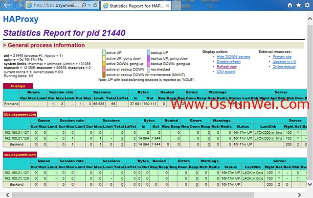
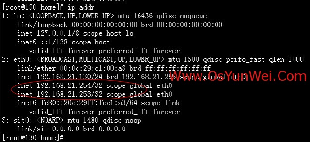
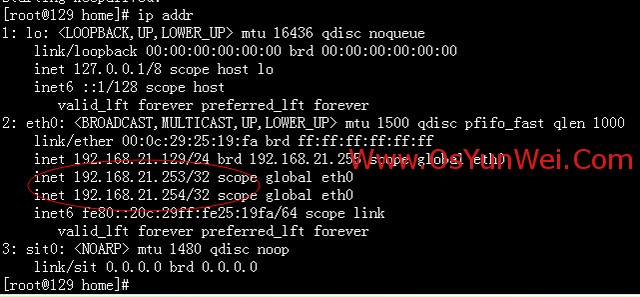

## 环境

**操作系统**：CentOS 6.X 64位

**Web服务器**：192.168.21.127、192.168.21.128

**站点**：bbs.osyunwei.com和sns.osyunwei.com部署在两台Web服务器上


## **实现目的**

增加两台服务器（主主模式），通过HAProxy+Keepalived实现Web服务器负载均衡


## **架构规划**

HAProxy服务器：192.168.21.129、192.168.21.130

虚拟服务器（VIP）：192.168.21.253、192.168.21.254


## **验证说明**

1. VIP：192.168.21.253指向192.168.21.129；VIP：192.168.21.254指向192.168.21.130；
2. 当192.168.21.129宕机时，VIP：192.168.21.253漂移到192.168.21.130上；
3. 当192.168.21.130宕机时，VIP：192.168.21.254漂移到192.168.21.129上；

这样的主主模式好处是，两台服务器在提供服务的同时，又互为对方的备份服务器。

<!--more-->

## **操作步骤**

**两台HAProxy服务器上分别操作**

#### 关闭SElinux

```bash
vim /etc/selinux/config

#SELINUX=enforcing #注释掉

#SELINUXTYPE=targeted #注释掉

SELINUX=disabled #增加

:wq!  #保存退出

setenforce 0 #使配置立即生效
```

#### 配置防火墙

```bash
vim /etc/sysconfig/iptables  #编辑

-A RH-Firewall-1-INPUT -d 224.0.0.18 -j ACCEPT  #允许组播地址通信

-A RH-Firewall-1-INPUT -p    vrrp    -j ACCEPT  #允许VRRP（虚拟路由器冗余协）通信

-A RH-Firewall-1-INPUT -m state --state NEW -m tcp -p tcp --dport 80 -j ACCEPT  #允许80端口通过防火墙

:wq! #保存退出

/etc/init.d/iptables restart #重启防火墙使配置生效
```

#### 安装HAProxy

###### 创建HAProxy运行账户和组

```
groupadd haproxy #添加haproxy组

useradd -g haproxy haproxy -s /bin/false #创建nginx运行账户haproxy并加入到haproxy组，不允许haproxy用户直接登录系统
```

###### 安装编译工具

```
yum install  gcc gcc-c++ make openssl-devel kernel-devel
```

###### 安装HAProxy

```bash
HAProxy下载地址：http://haproxy.1wt.eu/download/1.4/src/haproxy-1.4.24.tar.gz

上传haproxy-1.4.24.tar.gz到/usr/local/src目录中

cd /usr/local/src #进入软件包存放目录

tar zxvf haproxy-1.4.24.tar.gz #解压

cd  haproxy-1.4.24  #进入安装目录

make  TARGET=linux26 CPU=x86_64  PREFIX=/usr/local/haprpxy  #编译

make install PREFIX=/usr/local/haproxy  #安装

参数说明：

TARGET=linux26

\#使用uname -r查看内核，如：2.6.18-371.el5，此时该参数就为linux26

\#kernel 大于2.6.28的用：TARGET=linux2628

CPU=x86_64   #使用uname -r查看系统信息，如x86_64 x86_64 x86_64 GNU/Linux，此时该参数就为x86_64

PREFIX=/usr/local/haprpxy   #/usr/local/haprpxy为haprpxy安装路径
```

###### 设置HAProxy

```bash
mkdir -p  /usr/local/haproxy/conf  #创建配置文件目录

mkdir -p /etc/haproxy  #创建配置文件目录

cp /usr/local/src/haproxy-1.4.24/examples/haproxy.cfg  /usr/local/haproxy/conf/haproxy.cfg  #拷贝配置模板文件

ln -s  /usr/local/haproxy/conf/haproxy.cfg   /etc/haproxy/haproxy.cfg  #添加配置文件软连接

cp -r  /usr/local/src/haproxy-1.4.24/examples/errorfiles  /usr/local/haproxy/errorfiles  #拷贝错误页面

ln -s  /usr/local/haproxy/errorfiles  /etc/haproxy/errorfiles  #添加软连接

mkdir -p  /usr/local/haproxy/log  #创建日志文件目录

touch  /usr/local/haproxy/log/haproxy.log  #创建日志文件

ln -s  /usr/local/haproxy/log/haproxy.log  /var/log/haproxy.log  #添加软连接

cp /usr/local/src/haproxy-1.4.24/examples/haproxy.init  /etc/rc.d/init.d/haproxy  #拷贝开机启动文件

chmod +x  /etc/rc.d/init.d/haproxy  #添加脚本执行权限

chkconfig haproxy on  #设置开机启动

ln -s  /usr/local/haproxy/sbin/haproxy  /usr/sbin  #添加软连接
```

###### 配置haproxy.cfg参数

```bash
cp  /usr/local/haproxy/conf/haproxy.cfg   /usr/local/haproxy/conf/haproxy.cfg-bak  #备份

vim  /usr/local/haproxy/conf/haproxy.cfg  #编辑，修改

\#####################################################################

\# this config needs haproxy-1.1.28 or haproxy-1.2.1

global

log 127.0.0.1   local0 #在本机记录日志

log 127.0.0.1   local1 notice

\#log loghost    local0 info

maxconn 65535   #每个进程可用的最大连接数

nbproc  8  #进程数量，可以设置多个，提高处理效率

chroot /usr/local/haproxy  #haproxy安装目录

uid 500  #运行haproxy的用户uid（cat /etc/passwd查看）

gid 500  #运行haproxy的组uid（cat /etc/group查看）

daemon   #以后台守护进程运行

pidfile /usr/local/haproxy/haproxy.pid  #将所有进程写入pid文件

\#debug   #调试模式

\#quiet   #安装模式

defaults

\#log     global

log  127.0.0.1   local3  #日志文件设置

mode    http  #运行模式tcp、http、health

option  httplog

option  http-pretend-keepalive  #服务器端保持长连接

option  http-server-close   #每次请求完毕后主动关闭http通道

option  forceclose    #服务端响应后主动关闭请求连接，及早释放服务连接，不必等到客户端应答确认

option  httpclose       #每次请求完毕后主动关闭http通道

option  accept-invalid-http-request       #接受无效的http请求，一般建议不设置，但是可解决部分杂牌浏览器访问打不开页面问题

option  dontlognull     #不记录健康检查的日志信息

option  redispatch  #如果后端有服务器宕机，强制切换到正常服务器

option  abortonclose  #丢弃由于客户端等待时间过长而关闭连接但仍在haproxy等待队列中的请求

option  forwardfor  except 127.0.0.0/8  #不记录本机转发的日志

option  originalto  #记录客户端访问的目的IP

maxconn  65535  #每个进程可用的最大连接数

balance source  #同一IP地址的所有请求都发送到同一服务器

retries 3   #三次连接失败，则判断服务不可用

contimeout      5000  #连接超时

clitimeout      50000 #客户端超时

srvtimeout      50000 #服务器超时

timeout check 5s  #检测超时

timeout http-request 5s  #http请求超时时间

timeout queue 30s  #一个请求在队列里的超时时间

timeout http-keep-alive  5s  #设置http-keep-alive的超时时间

stats refresh 30s #统计页面自动刷新时间

stats uri  /haproxy-status  #统计页面URL路径

stats realm haproxy-status  #统计页面输入密码框提示信息

stats auth admin:123456     #统计页面用户名和密码

stats hide-version          #隐藏统计页面上HAProxy版本信息

frontend    web  #自定义描述信息

bind :80  #监听80端口

acl bbs.osyunwei.com  hdr(host) -i bbs.osyunwei.com  #规则设置，-i后面是要访问的域名，如果访问bbs.osyunwei.com这个域名，就负载均衡到bbs.osyunwei.com作用域

use_backend bbs.osyunwei.com if bbs.osyunwei.com   #acl和if后面的名称必须相同这里为bbs.osyunwei.com

acl sns.osyunwei.com  hdr(host) -i sns.osyunwei.com  #规则设置，-i后面是要访问的域名，如果访问sns.osyunwei.com这个域名，就负载均衡到sns.osyunwei.com作用域

use_backend sns.osyunwei.com if sns.osyunwei.com

backend     bbs.osyunwei.com

mode http

balance   source

\#option  httpchk /index.php  #检测服务器此文件是否存在，如果没有，则认为服务器连接异常，此参数可以不设置

server     192.168.21.127  192.168.21.127:80   check  inter  2000  rise 3  fall  3  weight 100   #inter  2000 心跳检测时间；rise 3 三次连接成功，表示服务器正常；fall  3 三次连接失败，表示服务器异常； weight 100 权重设置

server     192.168.21.128  192.168.21.128:80   check  inter  2000  rise 3  fall  3  weight 100

backend     sns.osyunwei.com

mode http

balance   source  #设置负载均衡模式，source保存session值，roundrobin轮询模式

\#option  httpchk /index.php  #检测服务器此文件是否存在，如果没有，则认为服务器连接异常，此参数可以不设置

server     192.168.21.127  192.168.21.127:80   check  inter  2000  rise 3  fall  3  weight 100

server     192.168.21.128  192.168.21.128:80   check  inter  2000  rise 3  fall  3  weight 100

\#errorloc  503  http://www.osyunwei.com/404.html

errorfile 403 /etc/haproxy/errorfiles/403.http

errorfile 500 /etc/haproxy/errorfiles/500.http

errorfile 502 /etc/haproxy/errorfiles/502.http

errorfile 503 /etc/haproxy/errorfiles/503.http

errorfile 504 /etc/haproxy/errorfiles/504.http

\#####################################################################

:wq! #保存退出

service haproxy start #启动

service haproxy stop  #关闭

service haproxy restart  #重启
```

###### 设置HAProxy日志

```bash
vim  /etc/syslog.conf  #编辑，在最下边增加

\# haproxy.log

local0.*          /var/log/haproxy.log

local3.*          /var/log/haproxy.log

:wq! #保存退出

vi  /etc/sysconfig/syslog   #编辑修改

SYSLOGD_OPTIONS="-r -m 0"   #接收远程服务器日志

:wq! #保存退出

service syslog restart  #重启syslog
```

#### 安装keepalived

```bash
下载keeplived：http://www.keepalived.org/software/keepalived-1.2.12.tar.gz

上传keepalived-1.2.12.tar.gz到/usr/local/src目录

cd /usr/local/src

tar zxvf keepalived-1.2.12.tar.gz

cd keepalived-1.2.12

./configure  #配置，必须看到以下提示，说明配置正确，才能继续安装

Use IPVS Framework : Yes

IPVS sync daemon support : Yes

Use VRRP Framework       : Yes

make #编辑

make install  #安装

cp /usr/local/etc/sysconfig/keepalived  /etc/sysconfig/

mkdir /etc/keepalived

cp /usr/local/etc/keepalived/keepalived.conf /etc/keepalived/

cp /usr/local/sbin/keepalived /usr/sbin/

cp /usr/local/etc/rc.d/init.d/keepalived  /etc/rc.d/init.d/

chmod +x /etc/rc.d/init.d/keepalived  #添加执行权限

chkconfig keepalived on  #设置开机启动

service keepalived start #启动

service keepalived stop  #关闭

service keepalived restart  #重启
```

###### 配置keepalived

```bash
cp /etc/keepalived/keepalived.conf  /etc/keepalived/keepalived.conf-bak

vi /etc/keepalived/keepalived.conf  #编辑，修改为以下代码

\#########################################################

\#以下为192.168.21.129服务器：

! Configuration File for keepalived

global_defs {

notification_email {

acassen@firewall.loc

failover@firewall.loc

sysadmin@firewall.loc

}

notification_email_from Alexandre.Cassen@firewall.loc

smtp_server 192.168.200.1

smtp_connect_timeout 30

router_id LVS_DEVEL

}

vrrp_script chk_haproxy {

script "/etc/keepalived/check_haproxy.sh"  #HAproxy服务监控脚本

interval 2

weight 2

}

vrrp_instance VI_1 {

state MASTER

interface eth0

virtual_router_id 51

priority 100

advert_int 1

authentication {

auth_type PASS

auth_pass 1111

}

track_script {

chk_haproxy #监测haproxy进程状态

}

virtual_ipaddress {

192.168.21.253

}

notify_master "/etc/keepalived/clean_arp.sh  192.168.21.253"  #更新虚拟服务器（VIP）地址的arp记录到网关

}

vrrp_instance VI_2 {

state BACKUP

interface eth0

virtual_router_id 52

priority 99

advert_int 1

authentication {

auth_type PASS

auth_pass 1111

}

virtual_ipaddress {

192.168.21.254

}

notify_master "/etc/keepalived/clean_arp.sh  192.168.21.254"  #更新虚拟服务器（VIP）地址的arp记录到网关

}

\#########################################################

:wq! #保存退出
```

```bash
#########################################################

\#以下为192.168.21.130服务器：

192.168.21.130

! Configuration File for keepalived

global_defs {

notification_email {

acassen@firewall.loc

failover@firewall.loc

sysadmin@firewall.loc

}

notification_email_from Alexandre.Cassen@firewall.loc

smtp_server 192.168.200.1

smtp_connect_timeout 30

router_id LVS_DEVEL

}

vrrp_script chk_haproxy {

script "/etc/keepalived/check_haproxy.sh"  #HAproxy服务监控脚本

interval 2

weight 2

}

vrrp_instance VI_1 {

state BACKUP

interface eth0

virtual_router_id 51

priority 99

advert_int 1

authentication {

auth_type PASS

auth_pass 1111

}

track_script {

chk_haproxy #监测haproxy进程状态

}

virtual_ipaddress {

192.168.21.253

}

notify_master "/etc/keepalived/clean_arp.sh  192.168.21.253"  #更新虚拟服务器（VIP）地址的arp记录到网关

}

vrrp_instance VI_2 {

state MASTER

interface eth0

virtual_router_id 52

priority 100

advert_int 1

authentication {

auth_type PASS

auth_pass 1111

}

virtual_ipaddress {

192.168.21.254

}

notify_master "/etc/keepalived/clean_arp.sh  192.168.21.254"  #更新虚拟服务器（VIP）地址的arp记录到网关

}

\#########################################################

:wq! #保存退出
```


#### 设置HAproxy服务监控脚本

```bash
vim  /etc/keepalived/check_haproxy.sh #编辑，添加以下代码

\#########################################################

\#!/bin/bash

A=`ps -C haproxy --no-header | wc -l`

if [ $A -eq 0 ]

then service haproxy start

sleep 3

if [ `ps -C haproxy --no-header | wc -l ` -eq 0 ]

then service keepalived stop

fi

fi

\#########################################################

:wq! #保存退出

chmod +x /etc/keepalived/check_haproxy.sh   #添加执行权限
```

#### 设置更新虚拟服务器（VIP）地址的arp记录到网关脚本

```bash
vim  /etc/keepalived/clean_arp.sh  #编辑，添加以下代码

\#!/bin/sh

VIP=$1

GATEWAY=192.168.21.2 #网关地址

/sbin/arping -I eth0 -c 5 -s $VIP $GATEWAY &>/dev/null

:wq!  #保存退出

chmod +x /etc/keepalived/clean_arp.sh  #添加脚本执行权限
```

#### 系统内核优化

在两台HAProxy服务器上分别操作

```
sed -i "s/net.ipv4.ip_forward = 0/net.ipv4.ip_forward = 1/g" '/etc/sysctl.conf'

echo -e "net.core.somaxconn = 262144" >> /etc/sysctl.conf

echo -e "net.core.netdev_max_backlog = 262144" >> /etc/sysctl.conf

echo -e "net.core.wmem_default = 8388608" >> /etc/sysctl.conf

echo -e "net.core.rmem_default = 8388608" >> /etc/sysctl.conf

echo -e "net.core.rmem_max = 16777216" >> /etc/sysctl.conf

echo -e "net.core.wmem_max = 16777216" >> /etc/sysctl.conf

echo -e "net.ipv4.route.gc_timeout = 20" >> /etc/sysctl.conf

echo -e "net.ipv4.ip_local_port_range = 1025 65535" >> /etc/sysctl.conf

echo -e "net.ipv4.tcp_retries2 = 5" >> /etc/sysctl.conf

echo -e "net.ipv4.tcp_fin_timeout = 30" >> /etc/sysctl.conf

echo -e "net.ipv4.tcp_syn_retries = 1" >> /etc/sysctl.conf

echo -e "net.ipv4.tcp_synack_retries = 1" >> /etc/sysctl.conf

echo -e "net.ipv4.tcp_timestamps = 0" >> /etc/sysctl.conf

echo -e "net.ipv4.tcp_tw_recycle = 1" >> /etc/sysctl.conf

echo -e "net.ipv4.tcp_tw_reuse = 1" >> /etc/sysctl.conf

echo -e "net.ipv4.tcp_keepalive_time = 120" >> /etc/sysctl.conf

echo -e "net.ipv4.tcp_keepalive_probes = 3" >> /etc/sysctl.conf

echo -e "net.ipv4.tcp_keepalive_intvl = 15" >> /etc/sysctl.conf

echo -e "net.ipv4.tcp_max_tw_buckets = 200000" >> /etc/sysctl.conf

echo -e "net.ipv4.tcp_max_orphans = 3276800" >> /etc/sysctl.conf

echo -e "net.ipv4.tcp_max_syn_backlog = 262144" >> /etc/sysctl.conf

echo -e "net.ipv4.tcp_wmem = 8192 131072 16777216" >> /etc/sysctl.conf

echo -e "net.ipv4.tcp_rmem = 32768 131072 16777216" >> /etc/sysctl.conf

echo -e "net.ipv4.tcp_mem = 94500000 915000000 927000000" >> /etc/sysctl.conf

echo -e "net.ipv4.ip_conntrack_max = 25000000" >> /etc/sysctl.conf

echo -e "net.ipv4.netfilter.ip_conntrack_max = 25000000" >> /etc/sysctl.conf

echo -e "net.ipv4.netfilter.ip_conntrack_tcp_timeout_established = 180" >> /etc/sysctl.conf

echo -e "net.ipv4.netfilter.ip_conntrack_tcp_timeout_time_wait = 1" >> /etc/sysctl.conf

echo -e "net.ipv4.netfilter.ip_conntrack_tcp_timeout_close_wait = 60" >> /etc/sysctl.conf

echo -e "net.ipv4.netfilter.ip_conntrack_tcp_timeout_fin_wait = 120" >> /etc/sysctl.conf
```

## 测试验证

#### **测试HAProxy+Keepalived是否正常运行**

###### 打开HAProxy监控页面

http://bbs.osyunwei.com/haproxy-status

输入用户名/密码： admin/123456

登录之后如下图所示




###### 解析

bbs.osyunwei.com 解析到192.168.21.253；

sns.osyunwei.com 解析到192.168.21.254；

在两台HAProxy服务器：192.168.21.129、192.168.21.130上执行命令：ip addr

如下图所示:


可以看出现在VIP：192.168.21.253指向192.168.21.129；VIP：192.168.21.254指向192.168.21.130；

在浏览器中打开

http://bbs.osyunwei.com/

http://sns.osyunwei.com/

如下图所示：


此时，bbs和sns域名都被均衡到192.168.21.127上面

###### 停止192.168.21.127上面的nginx服务

```
service nginx stop
```

继续打开上面的两个网址，如下图所示：


此时，bbs和sns域名都被均衡到192.168.21.128上面（由于192.168.21.127服务器nginx服务被关闭，实现了故障转移）

###### 关闭192.168.21.129上面的keepalived服务

```
service  keepalived  stop
```

此时，在两台HAProxy服务器：192.168.21.129、192.168.21.130上执行命令：ip addr

如下图所示：




可以看出VIP：192.168.21.253和192.168.21.254均指向到192.168.21.130；

此时，打开http://bbs.osyunwei.com/如下图所示：


可以正常访问

###### 恢复192.168.21.129上面的keepalived服务，恢复192.168.21.127上面的nginx服务

停止192.168.21.130上面的Keepalived服务

```
service keepalived stop
```

在两台HAProxy服务器：192.168.21.129、192.168.21.130上执行命令：ip addr

如下图所示：




可以看出VIP：192.168.21.253和192.168.21.254均指向到192.168.21.129；

此时，打开http://sns.osyunwei.com/如下图所示：


可以正常访问

备注：

查看HAProxy日志文件：

```
tail -f /var/log/haproxy.log
```

**至此，HAProxy+Keepalived实现Web服务器负载均衡配置完成。**