有很多next主题的网站都配置了很多特效，网站看起来很是炫酷。人都是视觉动物，让你的网站或博客酷炫、与众不同，是提高网站逼格和吸引人气的必备技能。那么这些特效都是是怎么配置的呢？接下来我会讲一讲如何配置next6.x或7.x最新版本实现一些炫酷的效果。先看下我博客网站的效果吧：wandouduoduo.github.io


## 参考

[Hexo官网](https://hexo.io/zh-cn/)

[Theme选择](https://hexo.io/themes/)

[NexT主题](https://github.com/theme-next/hexo-theme-next)

<!--more-->

## 在右上角或者左上角实现fork me on github

### 效果图如下图所示：

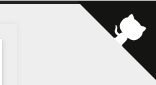

### 具体实现方法

在[GitHub Ribbons](https://links.jianshu.com/go?to=https%3A%2F%2Fgithub.com%2Fblog%2F273-github-ribbons)或[GitHub Corners](https://links.jianshu.com/go?to=http%3A%2F%2Ftholman.com%2Fgithub-corners%2F)选择一款你喜欢的挂饰，拷贝方框内的代码

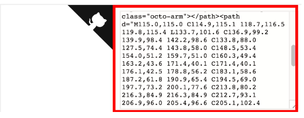

 将刚刚复制的挂饰代码，添加到`Blog/themes/next/layout/_layout.swig`文件中，添加位置如下图所示(放在`<div class="headband"></div>`下方)：

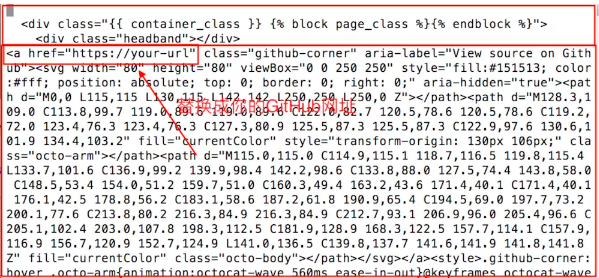

## 添加RSS

### 实现效果图

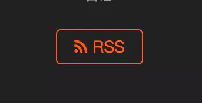

### 具体实现方法

切换到**Blog**文件夹（hexo init的文件夹）下,并安装插件

```
cd [Blog]
npm install --save hexo-generator-feed
```

安装成功之后，编辑`Blog/_config.yml`文件，在文件末尾添加

```
# Extensions
## Plugins: http://hexo.io/plugins/
plugins: hexo-generate-feed
```

配置主题`_config.yml`文件，`command+f`搜索`rss`，在后面加上`/atom.xml`

```
# Set rss to false to disable feed link.
# Leave rss as empty to use site's feed link.
# Set rss to specific value if you have burned your feed already.
rss: /atom.xml //注意：有一个空格
```

## 添加动态背景

### 实现效果图

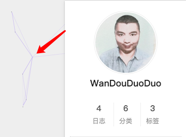

### 具体实现方法

主题配置文件中找到**canvas_nest**，设置成**ture**就OK啦。

```
# Canvas-nest
canvas_nest: ture
```

## 修改文章内链接文本样式

### 实现效果图

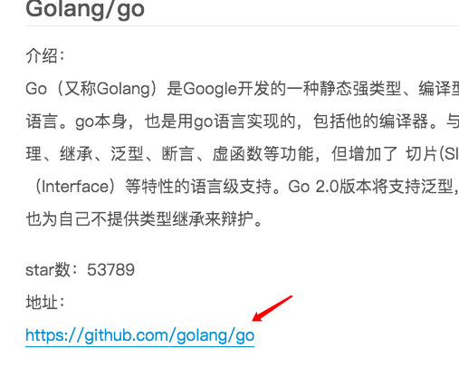

### 具体实现方法

修改文件 `themes\next\source\css\_common\components\post\post.styl`，在末尾添加如下css样式，：

```
// 文章内链接文本样式
.post-body p a{
  color: #0593d3; //原始链接颜色
  border-bottom: none;
  border-bottom: 1px solid #0593d3; //底部分割线颜色
  &:hover {
    color: #fc6423; //鼠标经过颜色
    border-bottom: none;
    border-bottom: 1px solid #fc6423; //底部分割线颜色
  }
}
```

其中选择`.post-body` 是为了不影响标题，选择 `p` 是为了不影响首页“阅读全文”的显示样式,颜色可以自己定义。

------

## 修改底部标签样式

### 实现效果图

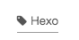

### 具体实现方法

修改`Blog\themes\next\layout\_macro\post.swig`中文件，`command+f`搜索`rel="tag">#`，将`#`替换成`<i class="fa fa-tag"></i>`。输入以下命令，查看效果：

```
hexo clean
hexo s
```

## 在文章末尾添加“文章结束”标记

### 实现效果图

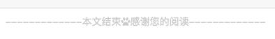

### 具体实现方法

在路径`Blog\themes\next\layout\_macro`文件夹中新建`passage-end-tag.swig`文件,并填写内容如下：

```
<div>
    
        <div style="text-align:center;color: #ccc;font-size:14px;">-------------本文结束<i class="fa fa-paw"></i>感谢您的阅读-------------</div>
    
</div>
```

打开`Blog\themes\next\layout\_macro\post.swig`，在`post-body`之后，`post-footer`之前（**post-footer之前两个DIV**），添加以下代码：

```
<div>
  
    
  
</div>
```

添加位置，如下图所示：

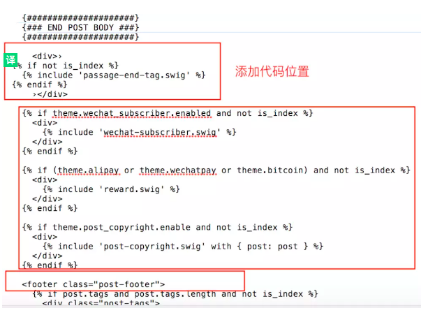


然后打开主题配置文件`_config.yml`,在末尾添加：

```
# 文章末尾添加“本文结束”标记
passage_end_tag:
  enabled: true
```

## 修改作者头像并旋转：

### 实现效果图：

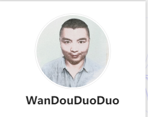

### 具体实现方法

在`Blog/_config.yml`中添加头像链接地址

```
//添加头像地址
avatar: [ http://....]
```

打开`\themes\next\source\css\_common\components\sidebar\sidebar-author.styl`，在里面添加如下代码：

```
.site-author-image {
  display: block;
  margin: 0 auto;
  padding: $site-author-image-padding;
  max-width: $site-author-image-width;
  height: $site-author-image-height;
  border: $site-author-image-border-width solid $site-author-image-border-color;

  /* 头像圆形 */
  border-radius: 80px;
  -webkit-border-radius: 80px;
  -moz-border-radius: 80px;
  box-shadow: inset 0 -1px 0 #333sf;

  /* 设置循环动画 [animation: (play)动画名称 (2s)动画播放时长单位秒或微秒 (ase-out)动画播放的速度曲线为以低速结束 
    (1s)等待1秒然后开始动画 (1)动画播放次数(infinite为循环播放) ]*/
 

  /* 鼠标经过头像旋转360度 */
  -webkit-transition: -webkit-transform 1.0s ease-out;
  -moz-transition: -moz-transform 1.0s ease-out;
  transition: transform 1.0s ease-out;
}

img:hover {
  /* 鼠标经过停止头像旋转 
  -webkit-animation-play-state:paused;
  animation-play-state:paused;*/

  /* 鼠标经过头像旋转360度 */
  -webkit-transform: rotateZ(360deg);
  -moz-transform: rotateZ(360deg);
  transform: rotateZ(360deg);
}

/* Z 轴旋转动画 */
@-webkit-keyframes play {
  0% {
    -webkit-transform: rotateZ(0deg);
  }
  100% {
    -webkit-transform: rotateZ(-360deg);
  }
}
@-moz-keyframes play {
  0% {
    -moz-transform: rotateZ(0deg);
  }
  100% {
    -moz-transform: rotateZ(-360deg);
  }
}
@keyframes play {
  0% {
    transform: rotateZ(0deg);
  }
  100% {
    transform: rotateZ(-360deg);
  }
}
```

## 修改``代码块自定义样式

### 具体实现方法

打开`Blog\themes\next\source\css\_custom\custom.styl`，添加以下代码：

```
// Custom styles.
code {
    color: #ff7600;
    background: #fbf7f8;
    margin: 2px;
}
// 大代码块的自定义样式
.highlight, pre {
    margin: 5px 0;
    padding: 5px;
    border-radius: 3px;
}
.highlight, code, pre {
    border: 1px solid #d6d6d6;
}
```

## 侧边栏社交小图标设置

### 实现效果图

图标可以去[Font Awesome Icon](https://fontawesome.com/icons?from=io)网站去找，找到后复制名字到相应的位置即可。

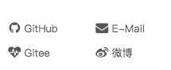

### 具体实现方法

打开主题配置文件`_config.yml`，`command+f`搜索`Social`，将你有的社交账号前面的`#`号去掉。

```
#social:
  GitHub: https://github.com/wandouduoduo || github
  E-mail: mailto:wandouduoduo@163.com || envelope
  Gitee: https://gitee.com/ || heartbeat
  微博: https://weibo.com/u/1989032071/home?wvr=5 || weibo
  #E-Mail: mailto:yourname@gmail.com || envelope
  #Google: https://plus.google.com/yourname || google
  #Twitter: https://twitter.com/yourname || twitter
  #FB Page: https://www.facebook.com/yourname || facebook
  #VK Group: https://vk.com/yourname || vk
  #StackOverflow: https://stackoverflow.com/yourname || stack-overflow
  #YouTube: https://youtube.com/yourname || youtube
  #Instagram: https://instagram.com/yourname || instagram
  #Skype: skype:yourname?call|chat || skype
```

## 主页文章添加阴影效果

### 实现效果图

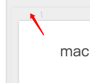

### 具体实现方法

打开`\themes\next\source\css\_custom\custom.styl`,向里面加入：

```
// 主页文章添加阴影效果
 .post {
   margin-top: 60px;
   margin-bottom: 60px;
   padding: 25px;
   -webkit-box-shadow: 0 0 5px rgba(202, 203, 203, .5);
   -moz-box-shadow: 0 0 5px rgba(202, 203, 204, .5);
  }
```

------

## 在网站底部加上访问量

### 实现效果图

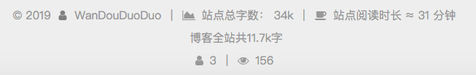

### 具体实现方法

6.x后集成了busuanzi模块统计，只需要打开`\themes\next\_config`文件编辑如下即可

```
busuanzi_count:
enable: true
total_visitors: true
total_visitors_icon: user
total_views: true
total_views_icon: eye
post_views: true
post_views_icon: eye
```

## 网站底部字数统计

### 具体方法实现

切换到根目录下，然后运行如下代码

```
$ npm install hexo-wordcount --save
```

然后在`/themes/next/layout/_partials/footer.swig`文件尾部添加加上：

```
<div class="theme-info">
  <div class="powered-by"></div>
  <span class="post-count">博客全站共{{ totalcount(site) }}字</span>
</div>
```

## 设置网站的图标Favicon

### 实现效果图

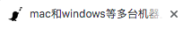

### 具体方法实现

在图标网站找一张你喜欢的图标（大：32x32 小：16x16），图标网站：[easyicon](https://links.jianshu.com/go?to=http%3A%2F%2Fwww.easyicon.net%2F)或者[阿里巴巴矢量图标库](https://links.jianshu.com/go?to=http%3A%2F%2Fwww.iconfont.cn%2F)。将下载下来的小图和中图放在`Blog/themes/next/source/images`，将默认的两张图片替换掉。修改主题配置文件，如果你自定义了图片名字，需要做修改：

```
favicon:
  small: /images/favicon-16x16-next.png  //16X16小图
  medium: /images/favicon-32x32-next.png  //32X32大图
  apple_touch_icon: /images/apple-touch-icon-next.png 
```

## 实现文章统计功能

### 具体实现方法

在根目录下安装 `hexo-wordcount`,运行：

```
$ npm install hexo-wordcount --save
```

然后在主题的配置文件中，配置如下：

```
symbols_count_time:
  separated_meta: true
  item_text_post: true
  item_text_total: true
  awl: 4
  wpm: 275
```

## 添加顶部加载条

### 具体实现方法

编辑主题配置文件，`command+F`搜索`pace`，将其值改为`ture`就可以了，选择一款你喜欢的样式。

```
# Progress bar in the top during page loading.
pace: ture
# Themes list:
#pace-theme-big-counter
#pace-theme-bounce
#pace-theme-barber-shop
#pace-theme-center-atom
#pace-theme-center-circle
#pace-theme-center-radar
#pace-theme-center-simple
#pace-theme-corner-indicator
#pace-theme-fill-left
#pace-theme-flash
#pace-theme-loading-bar
#pace-theme-mac-osx
#pace-theme-minimal
# For example
# pace_theme: pace-theme-center-simple
pace_theme: pace-theme-minimal
```

## 在文章底部增加版权信息

### 实现效果图

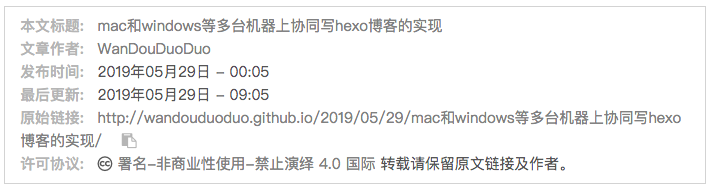

在目录`Blog/themes/next/layout/_macro/`，添加文件 `my-copyright.swig`，内容如下：

```

<div class="my_post_copyright">
  <script src="//cdn.bootcss.com/clipboard.js/1.5.10/clipboard.min.js"></script>
  
  <!-- JS库 sweetalert 可修改路径 -->
  <script src="https://cdn.bootcss.com/jquery/2.0.0/jquery.min.js"></script>
  <script src="https://unpkg.com/sweetalert/dist/sweetalert.min.js"></script>
  <p><span>本文标题:</span><a href="{{ url_for(page.path) }}">{{ page.title }}</a></p>
  <p><span>文章作者:</span><a href="/" title="访问 {{ theme.author }} 的个人博客">{{ theme.author }}</a></p>
  <p><span>发布时间:</span>{{ page.date.format("YYYY年MM月DD日 - HH:MM") }}</p>
  <p><span>最后更新:</span>{{ page.updated.format("YYYY年MM月DD日 - HH:MM") }}</p>
  <p><span>原始链接:</span><a href="{{ url_for(page.path) }}" title="{{ page.title }}">{{ page.permalink }}</a>
    <span class="copy-path"  title="点击复制文章链接"><i class="fa fa-clipboard" data-clipboard-text="{{ page.permalink }}"  aria-label="复制成功！"></i></span>
  </p>
  <p><span>许可协议:</span><i class="fa fa-creative-commons"></i> <a rel="license" href="https://creativecommons.org/licenses/by-nc-nd/4.0/" target="_blank" title="Attribution-NonCommercial-NoDerivatives 4.0 International (CC BY-NC-ND 4.0)">署名-非商业性使用-禁止演绎 4.0 国际</a> 转载请保留原文链接及作者。</p>  
</div>
<script> 
    var clipboard = new Clipboard('.fa-clipboard');
    $(".fa-clipboard").click(function(){
      clipboard.on('success', function(){
        swal({   
          title: "",   
          text: '复制成功',
          icon: "success", 
          showConfirmButton: true
          });
    });
    });  
</script>

```

在目录`Blog/themes/next/source/css/_common/components/post/`下添加文件`my-post-copyright.styl`，添加以下代码：

```
.my_post_copyright {
  width: 85%;
  max-width: 45em;
  margin: 2.8em auto 0;
  padding: 0.5em 1.0em;
  border: 1px solid #d3d3d3;
  font-size: 0.93rem;
  line-height: 1.6em;
  word-break: break-all;
  background: rgba(255,255,255,0.4);
}
.my_post_copyright p{margin:0;}
.my_post_copyright span {
  display: inline-block;
  width: 5.2em;
  color: #b5b5b5;
  font-weight: bold;
}
.my_post_copyright .raw {
  margin-left: 1em;
  width: 5em;
}
.my_post_copyright a {
  color: #808080;
  border-bottom:0;
}
.my_post_copyright a:hover {
  color: #a3d2a3;
  text-decoration: underline;
}
.my_post_copyright:hover .fa-clipboard {
  color: #000;
}
.my_post_copyright .post-url:hover {
  font-weight: normal;
}
.my_post_copyright .copy-path {
  margin-left: 1em;
  width: 1em;
  +mobile(){display:none;}
}
.my_post_copyright .copy-path:hover {
  color: #808080;
  cursor: pointer;
}
```

修改`next/layout/_macro/post.swig`，在代码

```
<div>
      
        
      
</div>
```

之前添加增加如下代码：

```
<div>
      
        
      
</div>
```

修改`next/source/css/_common/components/post/post.styl`文件，在最后一行增加代码：

```
@import "my-post-copyright"
```

保存重新生成即可。
 如果要在该博文下面增加版权信息的显示，需要在 Markdown 中增加copyright: true的设置，类似：

```
---
title: Hexo-NexT主题配置
date: 2018-01-20 20:41:08
categories: Hexo
tags:
- Hexo
- NexT
top: 100
copyright: ture
---
```

配置根目录下的`_config.yml`文件，配置为：

```
# URL
## If your site is put in a subdirectory, set url as 'http://yoursite.com/child' and root as '/child/'
url: https://wenmobo.github.io/  //你的网站地址
root: /
permalink: :year/:month/:day/:title/
permalink_defaults:
```

## 隐藏网页底部powered By Hexo / 强力驱动

打开`Blog/themes/next/layout/_partials/footer.swig`，注释掉相应代码。

```
//用下面的符号注释，注释代码用下面括号括起来
<!-- -->

<!--
<span class="post-meta-divider">|</span>


  <div class="powered-by">{#
  #}{{ __('footer.powered', '<a class="theme-link" target="_blank" href="https://hexo.io">Hexo</a>') }}{#
#}</div>



  <span class="post-meta-divider">|</span>



  <div class="theme-info">{#
  #}{{ __('footer.theme') }} &mdash; {#
  #}<a class="theme-link" target="_blank" href="https://github.com/iissnan/hexo-theme-next">{#
    #}NexT.{{ theme.scheme }}{#
  #}</a> v{{ theme.version }}{#
#}</div>



  <div class="footer-custom">{#
  #}{{ theme.footer.custom_text }}{#
#}</div>

-->
```

## 修改字体大小

打开`\themes\next\source\css\ _variables\base.styl`文件，将`$font-size-base`改成`16px`，如下所示：

```
$font-size-base            =16px
```

## 添加打赏

打开themes/next/_config.yml中配置如下

```
reward:
  enable: true
  comment: 原创技术分享，您的支持将鼓励我继续创作
  wechatpay: /images/wechatpay.png
  alipay: /images/alipay.jpg
  \#bitcoin: /images/bitcoin.jpg
```

修改文件`next/source/css/_common/components/post/post-reward.styl`，然后注释如下即可

```
/*
#QR > div:hover p {
  animation: roll 0.1s infinite linear;
  -webkit-animation: roll 0.1s infinite linear;
  -moz-animation: roll 0.1s infinite linear;
}*/
```

## 点击爆炸效果

### **效果图**

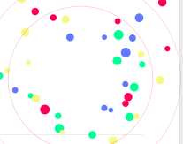

### **实现方法**

`themes/next/source/js/src`里面建一个叫fireworks.js的文件，代码如下：

```
"use strict";function updateCoords(e){pointerX=(e.clientX||e.touches[0].clientX)-canvasEl.getBoundingClientRect().left,pointerY=e.clientY||e.touches[0].clientY-canvasEl.getBoundingClientRect().top}function setParticuleDirection(e){var t=anime.random(0,360)*Math.PI/180,a=anime.random(50,180),n=[-1,1][anime.random(0,1)]*a;return{x:e.x+n*Math.cos(t),y:e.y+n*Math.sin(t)}}function createParticule(e,t){var a={};return a.x=e,a.y=t,a.color=colors[anime.random(0,colors.length-1)],a.radius=anime.random(16,32),a.endPos=setParticuleDirection(a),a.draw=function(){ctx.beginPath(),ctx.arc(a.x,a.y,a.radius,0,2*Math.PI,!0),ctx.fillStyle=a.color,ctx.fill()},a}function createCircle(e,t){var a={};return a.x=e,a.y=t,a.color="#F00",a.radius=0.1,a.alpha=0.5,a.lineWidth=6,a.draw=function(){ctx.globalAlpha=a.alpha,ctx.beginPath(),ctx.arc(a.x,a.y,a.radius,0,2*Math.PI,!0),ctx.lineWidth=a.lineWidth,ctx.strokeStyle=a.color,ctx.stroke(),ctx.globalAlpha=1},a}function renderParticule(e){for(var t=0;t<e.animatables.length;t++){e.animatables[t].target.draw()}}function animateParticules(e,t){for(var a=createCircle(e,t),n=[],i=0;i<numberOfParticules;i++){n.push(createParticule(e,t))}anime.timeline().add({targets:n,x:function(e){return e.endPos.x},y:function(e){return e.endPos.y},radius:0.1,duration:anime.random(1200,1800),easing:"easeOutExpo",update:renderParticule}).add({targets:a,radius:anime.random(80,160),lineWidth:0,alpha:{value:0,easing:"linear",duration:anime.random(600,800)},duration:anime.random(1200,1800),easing:"easeOutExpo",update:renderParticule,offset:0})}function debounce(e,t){var a;return function(){var n=this,i=arguments;clearTimeout(a),a=setTimeout(function(){e.apply(n,i)},t)}}var canvasEl=document.querySelector(".fireworks");if(canvasEl){var ctx=canvasEl.getContext("2d"),numberOfParticules=30,pointerX=0,pointerY=0,tap="mousedown",colors=["#FF1461","#18FF92","#5A87FF","#FBF38C"],setCanvasSize=debounce(function(){canvasEl.width=2*window.innerWidth,canvasEl.height=2*window.innerHeight,canvasEl.style.width=window.innerWidth+"px",canvasEl.style.height=window.innerHeight+"px",canvasEl.getContext("2d").scale(2,2)},500),render=anime({duration:1/0,update:function(){ctx.clearRect(0,0,canvasEl.width,canvasEl.height)}});document.addEventListener(tap,function(e){"sidebar"!==e.target.id&&"toggle-sidebar"!==e.target.id&&"A"!==e.target.nodeName&&"IMG"!==e.target.nodeName&&(render.play(),updateCoords(e),animateParticules(pointerX,pointerY))},!1),setCanvasSize(),window.addEventListener("resize",setCanvasSize,!1)}"use strict";function updateCoords(e){pointerX=(e.clientX||e.touches[0].clientX)-canvasEl.getBoundingClientRect().left,pointerY=e.clientY||e.touches[0].clientY-canvasEl.getBoundingClientRect().top}function setParticuleDirection(e){var t=anime.random(0,360)*Math.PI/180,a=anime.random(50,180),n=[-1,1][anime.random(0,1)]*a;return{x:e.x+n*Math.cos(t),y:e.y+n*Math.sin(t)}}function createParticule(e,t){var a={};return a.x=e,a.y=t,a.color=colors[anime.random(0,colors.length-1)],a.radius=anime.random(16,32),a.endPos=setParticuleDirection(a),a.draw=function(){ctx.beginPath(),ctx.arc(a.x,a.y,a.radius,0,2*Math.PI,!0),ctx.fillStyle=a.color,ctx.fill()},a}function createCircle(e,t){var a={};return a.x=e,a.y=t,a.color="#F00",a.radius=0.1,a.alpha=0.5,a.lineWidth=6,a.draw=function(){ctx.globalAlpha=a.alpha,ctx.beginPath(),ctx.arc(a.x,a.y,a.radius,0,2*Math.PI,!0),ctx.lineWidth=a.lineWidth,ctx.strokeStyle=a.color,ctx.stroke(),ctx.globalAlpha=1},a}function renderParticule(e){for(var t=0;t<e.animatables.length;t++){e.animatables[t].target.draw()}}function animateParticules(e,t){for(var a=createCircle(e,t),n=[],i=0;i<numberOfParticules;i++){n.push(createParticule(e,t))}anime.timeline().add({targets:n,x:function(e){return e.endPos.x},y:function(e){return e.endPos.y},radius:0.1,duration:anime.random(1200,1800),easing:"easeOutExpo",update:renderParticule}).add({targets:a,radius:anime.random(80,160),lineWidth:0,alpha:{value:0,easing:"linear",duration:anime.random(600,800)},duration:anime.random(1200,1800),easing:"easeOutExpo",update:renderParticule,offset:0})}function debounce(e,t){var a;return function(){var n=this,i=arguments;clearTimeout(a),a=setTimeout(function(){e.apply(n,i)},t)}}var canvasEl=document.querySelector(".fireworks");if(canvasEl){var ctx=canvasEl.getContext("2d"),numberOfParticules=30,pointerX=0,pointerY=0,tap="mousedown",colors=["#FF1461","#18FF92","#5A87FF","#FBF38C"],setCanvasSize=debounce(function(){canvasEl.width=2*window.innerWidth,canvasEl.height=2*window.innerHeight,canvasEl.style.width=window.innerWidth+"px",canvasEl.style.height=window.innerHeight+"px",canvasEl.getContext("2d").scale(2,2)},500),render=anime({duration:1/0,update:function(){ctx.clearRect(0,0,canvasEl.width,canvasEl.height)}});document.addEventListener(tap,function(e){"sidebar"!==e.target.id&&"toggle-sidebar"!==e.target.id&&"A"!==e.target.nodeName&&"IMG"!==e.target.nodeName&&(render.play(),updateCoords(e),animateParticules(pointerX,pointerY))},!1),setCanvasSize(),window.addEventListener("resize",setCanvasSize,!1)};
```

打开`themes/next/layout/_layout.swig`,在`</body>`上面写下如下代码：

```

   <canvas class="fireworks" style="position: fixed;left: 0;top: 0;z-index: 1; pointer-events: none;" ></canvas> 
   <script type="text/javascript" src="//cdn.bootcss.com/animejs/2.2.0/anime.min.js"></script> 
   <script type="text/javascript" src="/js/src/fireworks.js"></script>

```

打开主题配置文件，在里面最后写下：

```
# Fireworks
fireworks: true
```

## 添加侧栏推荐阅读

### 效果图

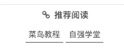

### 实现方式

编辑主题配置文件，如下配置即可：

```
# Blog rolls
links_icon: link
links_title: 推荐阅读
#links_layout: block
links_layout: inline
links:
  菜鸟教程: https://xxxxx
  自强学堂: https://xxxxx
```

## 添加站内搜索

安装 hexo-generator-search

```
npm install hexo-generator-search --save
```

安装 hexo-generator-searchdb

```
npm install hexo-generator-searchdb --save
```

编辑主题配置文件，设置`Local search`enable为`ture`

```
# Local search
# Dependencies: https://github.com/flashlab/hexo-generator-search
local_search:
  enable: ture
  # if auto, trigger search by changing input
  # if manual, trigger search by pressing enter key or search button
  trigger: auto
  # show top n results per article, show all results by setting to -1
  top_n_per_article: 1
```

## 添加评论系统gitalk

### 效果图

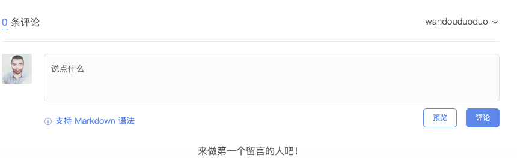

### 实现方式

在github中注册注册新应用，链接：https://github.com/settings/applications/new

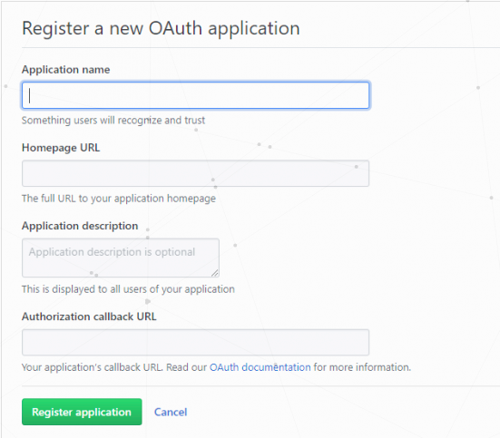

参数说明：
Application name： # 应用名称，随意
Homepage URL： # 网站URL，如`https://wandouduoduo.github.io`
Application description # 描述，随意
Authorization callback URL：# 网站URL，`https://wandouduoduo.github.io`

点击注册后，页面跳转如下，其中`Client ID`和`Client Secret`在后面的配置中需要用到，到时复制粘贴即可：

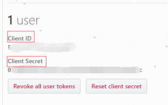

在主题配置文件`next/_config.yml`中添加如下内容

```shell
gitalk:
  enable: true
  githubID: github帐号  # 例：asdfv1929   
  repo: 仓库名称   # 例：asdfv1929.github.io
  ClientID: Client ID
  ClientSecret: Client Secret
  adminUser: github帐号 #指定可初始化评论账户
  distractionFreeMode: true
```


## 修改文章链接

Hexo 默认的文章链接形式为 `domain/year/month/day/postname` ，当我们把文章源文件名改掉之后，链接也会改变，很不友好，并且四级目录，不利于 SEO。

因此，使用 `hexo-abbrlink` 插件，生成文章的永久链接，后期无论怎么修改也不会改变该链接。

```shell
npm install hexo-abbrlink --save
```

在站点配置文件 `_config.yml` 中修改：

```shell
permalink: post/:abbrlink.html
abbrlink: 
  alg: crc32 # 算法：crc16(default) and crc32
  rep: hex   # 进制：dec(default) and hex
```

可选择模式有：

- crc16 & hex
- crc16 & dec
- crc32 & hex
- crc32 & dec

## 寻找图床

当向文章中添加图片时，如果图片来源于网络，那么还比较好办，直接引用那个链接即可，不过也有问题，那就是如果那个链接挂了那么你的图片也就无法显示。另外如果你的图片来源于本地，那么更麻烦了。一种做法是使用第三方服务器，比如七牛，当需要插入图片时，先把图片上传到七牛的服务器然后再使用，我觉得很麻烦。这里选择另外一种方法。

首先修改 `_config.yml` (在站点目录下) 中 `post_asset_folder` 字段：

```
# post_asset_folder: false
post_asset_folder: true
```

当设置该字段为 `true` 时，在建立文件时，Hexo 会自动建立一个与文章同名的文件夹，你就可以把与该文章相关的所有资源都放到那个文件夹，这么一来，你就可以很方便的使用资源。例如，文章 `post` 需要插入图片 `test.png` 时，就可以使用 `[图片上传失败...(image-773548-1546505826136)]` 。

问题是这样在本地显示没有问题，但是发布之后就无法显示，使用 `hexo-asset-image` 插件来解决。

在博客根目录右击打开 `git bash` ，执行以下命令：

```shell
npm install https://github.com/CodeFalling/hexo-asset-image --save
```

重新生成之后就可以在你自己的网页上正常显示了。

> 注意：对于因为 SEO 优化，使用 `abbrlink` 插件修改过文章链接的朋友而言，这种方法还需要进一步修改一下。由于原来的 `permalink: :year/:month/:day/:title/` 变成了 `permalink: post/:abbrlink.html` 。打开博客根目录下 `node_modules\hexo-asset-image\index.js` ，增加一行命令，如下所示：
>
> ```
>   var config = hexo.config;
>   if(config.post_asset_folder){
>     var link = data.permalink;
>     link = link.replace('.html', '/');    //新增加，针对修改后的 permalink
>   var beginPos = getPosition(link, '/', 3) + 1;
> ```
>
> 之后就可以正常显示了，仅供参考。对于修改成其他链接形式的朋友也有一定的参考意义。