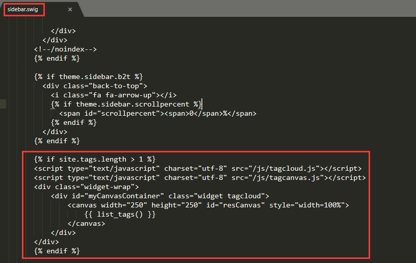

按照[`这篇教程`](https://wandouduoduo.github.io/articles/1071f0bc.html)一步步操作下来的话，相信你的博客已经有了不错的改观和多种炫酷的特效。这里再教大家配置几种特效。教程中用到的所有特效都可以在我的博客中找到，如果感兴趣可以到[博客首页](wandouduoduo.github.io)中看下动态效果。

<!--more-->


## 特效

### 增加标签云

先看效果


需要用到`hexo-tag-cloud`插件。`hexo-tag-cloud`插件是作者写的一个Hexo博客的标签云插件，旨在直观的展示标签的种类，美观大方且非常优雅。[官方插件地址](https://github.com/MikeCoder/hexo-tag-cloud)

#### **安装插件**

**直接安装**

```bash
npm install hexo-tag-cloud --save 
```

**git clone下载**

使用命令行安装插件包的过程中可能会出现问题，安装失败，安装不完全。可以直接克隆插件到博客的插件文件夹`blog/node_modules`里。

```bash
git clone https://github.com/MikeCoder/hexo-tag-cloud
```

#### 配置插件

这里以用户最多主题`next`为例，next用的是swig格式。

在主题文件夹找到文件 `theme/next/layout/_macro/sidebar.swig`, 然后添加如下代码：

```js

<script type="text/javascript" charset="utf-8" src="/js/tagcloud.js"></script>
<script type="text/javascript" charset="utf-8" src="/js/tagcanvas.js"></script>
<div class="widget-wrap">
    <h3 class="widget-title">Tag Cloud</h3>
    <div id="myCanvasContainer" class="widget tagcloud">
        <canvas width="250" height="250" id="resCanvas" style="width=100%">
            {{ list_tags() }}
        </canvas>
    </div>
</div>

```

代码添加到后面即可，添加示意图如下:



#### 主题配置

在博客根目录，找到 `_config.yml`配置文件。然后在最后添加如下的配置项，可以自定义标签云的字体和颜色，还有突出高亮:

```yaml
# hexo-tag-cloud
tag_cloud:
    textFont: Trebuchet MS, Helvetica
    textColor: '#333'
    textHeight: 25
    outlineColor: '#E2E1D1'
    maxSpeed: 0.1 
    pauseOnSelected: false
    
#textColor: ‘#333’ 字体颜色
#textHeight: 25 字体高度
#maxSpeed: 0.1 文字滚动速度
#pauseOnSelected 选择后暂停转动，默认打开
```

然后清理部署，查看效果吧

```bash
#本地预览
hexo clean && hexo g && hexo s 

#博客预览
hexo clean && hexo g && hexo d
```

### 大段内容折叠

#### 在main.js中添加折叠js

next主题的主要js位于`themes/next/source/js/src/post-details.js`在里面找合适的位置，添加如下代码：

```js
$(document).ready(function(){
    $(document).on('click', '.fold_hider', function(){
        $('>.fold', this.parentNode).slideToggle();
        $('>:first', this).toggleClass('open');
    });
    //默认情况下折叠
    $("div.fold").css("display","none");
});
```

#### 自定义内建标签

在主题`scripts`下添加一个`tags.js`, 位于`themes/next/scripts/tags.js`

```js
/*
  @haohuawu
  修复 Nunjucks 的 tag 里写 ```代码块```，最终都会渲染成 undefined 的问题
  https://github.com/hexojs/hexo/issues/2400
*/
const rEscapeContent = /<escape(?:[^>]*)>([\s\S]*?)<\/escape>/g;
const placeholder = '\uFFFD';
const rPlaceholder = /(?:<|&lt;)\!--\uFFFD(\d+)--(?:>|&gt;)/g;
const cache = [];
function escapeContent(str) {
  return '<!--' + placeholder + (cache.push(str) - 1) + '-->';
}
hexo.extend.filter.register('before_post_render', function(data) {
  data.content = data.content.replace(rEscapeContent, function(match, content) {
    return escapeContent(content);
  });
  return data;
});
hexo.extend.filter.register('after_post_render', function(data) {
  data.content = data.content.replace(rPlaceholder, function() {
    return cache[arguments[1]];
  });
  return data;
});
```

再继续添加一个`fold.js`

```js
/* global hexo */
// Usage:  Something 
function fold (args, content) {
    var text = args[0];
    if(!text) text = "点击显/隐";
    return '<div><div class="fold_hider"><div class="close hider_title">' + text + '</div></div><div class="fold">\n' + hexo.render.renderSync({text: content, engine: 'markdown'}) + '\n</div></div>';
}
hexo.extend.tag.register('fold', fold, {ends: true});
```

最后，添加几个自定义样式，位置`themes/next/source/css/_custom/custom.styl`

```css
.hider_title{
    font-family: "Microsoft Yahei";
    cursor: pointer;
}
.close:after{
    content: "▼";
}
.open:after{
    content: "▲";
}
.feed-link a {
  display: inline-block;
}
```

最后，在我们需要折叠的地方前后添加便签，示例用法：

```html

你要折叠起来的内容：wandouduoduo.github.io

```

### 增加外链nofollow

nofollow标签是由谷歌领头创新的一个“反垃圾链接”的标签，并被百度、yahoo等各大搜索引擎广泛支持，引用nofollow标签的目的是：用于指示搜索引擎不要追踪（即抓取）网页上的带有nofollow属性的任何出站链接，以减少垃圾链接的分散网站权重。

[hexo-filter-nofollow插件](https://github.com/hexojs/hexo-filter-nofollow)会为你博客中的外链自动添加`rel=external nofollow noreferrer`属性，从而改善你的网站安全和SEO.

#### 安装插件

```bash
npm install hexo-filter-nofollow --save
```

#### 主题配置

在博客根目录，找到 `_config.yml`配置文件。然后在最后添加如下的配置项

```yaml
nofollow:
  enable: true
  field: site
  exclude:
    - 'wandouduoduo.github.io'
    - 'wandouduoduo.gitee.io'
    - 'wandouduoduo.netlify.com'
#enable 是否启动插件，默认为true
#field  插件的处理范围，默认为site。可选post或site; post仅处理文章内容，site处理全站
#exclude 域名白名单
```

有些同学用`hexo-autonofollow`插件，该插件也可以自动添加nofollow属性，但该插件有三年没更新维护了。

### 鼠标选取自动提示版权

效果图：


#### 特效配置

首先在`Hexo\themes\next\layout_third-party`目录下新建`selectionCopyright.swig`文件

添加如下代码：

```js
<style>
#selectionCopyright {
    position: absolute;
    display: none;
    background: rgba(244,67,54,.7);
    color: #fff;
    border-radius: 6px;
    box-shadow: none;
    border: none;
    font-size: 14px;
}
#selectionCopyright a{
    color:#fff;
    border-color: #fff;
}
#selectionCopyright::before {
    content: "";
    width: 0;
    height: 0;
    border-style: solid;
    border-width: 6px 8px 6px 0;
    border-color: transparent rgba(244,67,54,.7) transparent transparent;
    position: absolute;
    left: -8px;
    top:50%;
    transform:translateY(-50%);
}
</style>

<button id="selectionCopyright" disabled="disabled">本文发表于[<a href="http://wandouduoduo.github.io/">豌豆多多</a>]分享请注明来源！</button>

<script>
window.onload = function() {
    function selectText() {
        if (document.selection) { //IE浏览器下
            return document.selection.createRange().text; //返回选中的文字
        } else { //非IE浏览器下
            return window.getSelection().toString(); //返回选中的文字
        }
    }
    var content = document.getElementsByTagName("body")[0];
    var scTip = document.getElementById('selectionCopyright');

    content.onmouseup = function(ev) { //设定一个onmouseup事件
        var ev = ev || window.event;
        var left = ev.clientX;//获取鼠标相对浏览器可视区域左上角水平距离距离
        var top = ev.clientY;//获取鼠标相对浏览器可视区域左上角垂直距离距离
        var xScroll = Math.max(document.body.scrollLeft, document.documentElement.scrollLeft);//获取文档水平滚动距离
        var yScroll = Math.max(document.body.scrollTop, document.documentElement.scrollTop);//获取文档垂直滚动距离
        if (selectText().length > 0) {
            setTimeout(function() { //设定一个定时器
                scTip.style.display = 'inline-block';
                scTip.style.left = left + xScroll + 15 + 'px';//鼠标当前x值
                scTip.style.top = top + yScroll - 15 + 'px';//鼠标当前y值
            }, 100);
        } else {
            scTip.style.display = 'none';
        }
    };

    content.onclick = function(ev) {
        var ev = ev || window.event;
        ev.cancelBubble = true;
    };
    document.onclick = function() {
        scTip.style.display = 'none';
    };
};
</script>
```

#### 引入配置

接着在`\Hexo\themes\next\layout_layout.swig`文件最后`body`标签之前添加如下语句：

```js

```


`注意:`如果前面tag_cloud特效做了，这里再做这个特效，会有个问题。默认hexo next在加载完成页面就会立即执行tag_cloud，如果这里按照上面操作结果就是标签云不会显示。原因是本特效配置文件中window.load就是加载完成立即执行，会冲掉tag_cloud特效执行步骤而只执行这个特效。那么怎么兼容呢？只需要删除window.onload = function() {}这行即可。