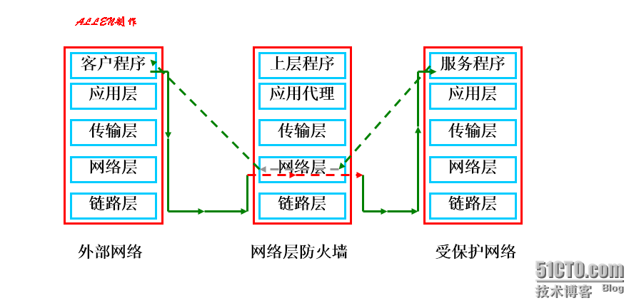
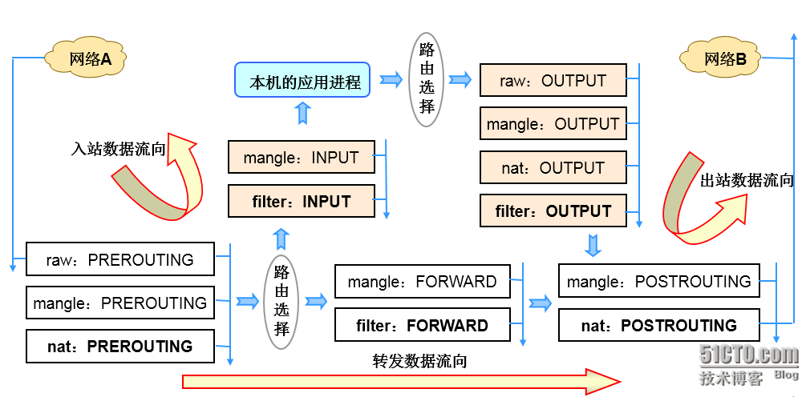
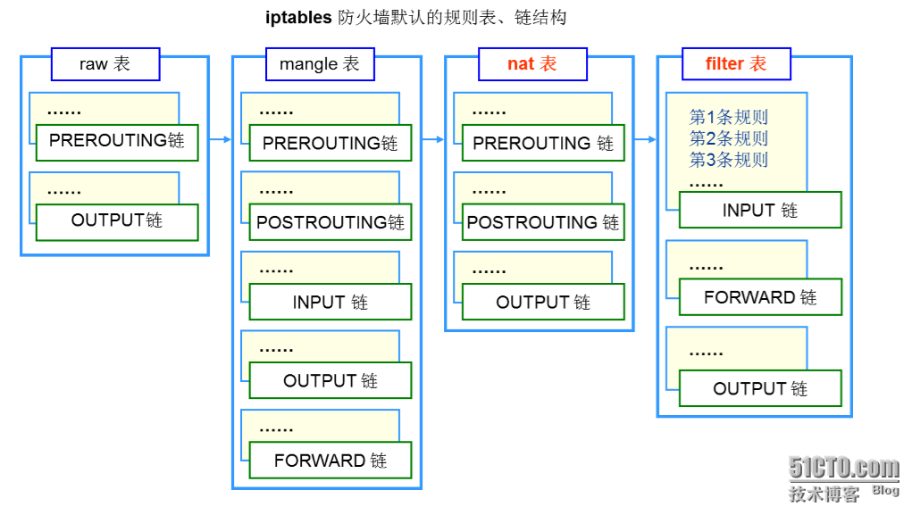
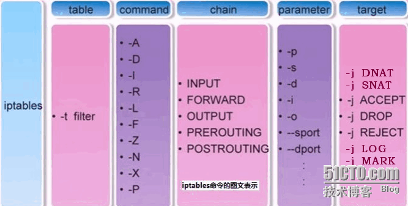
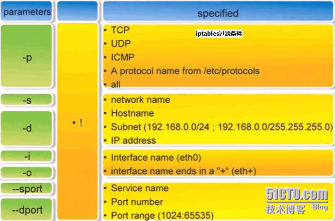

## **iptables简介**

netfilter/iptables（简称为iptables）组成Linux平台下的包过滤防火墙，与大多数的Linux软件一样，这个包过滤防火墙是免费的，它可以代替昂贵的商业防火墙解决方案。它工作在网络层，针对TCP/IP数据包实施过滤和限制，是典型的包过滤防火墙；它也可以实现网络地址转换（NAT）等功能。

<!--more-->

### **iptables的优点**

netfilter/iptables的最大优点是它可以配置有状态的防火墙。有状态的防火墙能够指定并记住为发送或接收数据包所建立的连接状态。防火墙可以从数据包的连接跟踪状态获得该信息。在决定新的数据包过滤时，防火墙所使用的这些状态信息可以增加其效率和速度。有四种有效状态，分别为：ESTABLISHED (已建立的连接)、INVALID(非法或无法识别) 、NEW(已经或将启动新的连接)和RELATED(正在启动新连接)。另一个优点：用户可以完全自己控制防火墙配置和数据包过滤，也可以定制自己的规则来满足特定的需求，从而允许想要的网络流量进入

### **iptables和netfilter关系**

netfilter和iptables通常都可以用来指的是Linux防火墙，但二者是有区别的，如：netfilter：是内核的一部分，指的是Linux内核中实现包过滤防火墙的内部结构，也称为"内核空间（kernelspace）",不以程序或文件的形式而存在；iptables:指的是管理Linux防火墙的命令工具，也被称为"用户空间（userspace）"，程序通常位于/sbin/iptables，由用户直接使用，而我们经常使用的也就是iptables管理工具，而真正实现防火墙功能的是netfilter.

### **iptables基础知识**

规则(rules)也是就管理员定义的条件，规则一般的定义为"如果数据包符合定义的条件，就按规则处理这个数据包"，如果规则中没有定义就匹配默认的策略。规则是存储在内核空间的信息包过滤表中，这些规则分别定义了源地址、目标地址、传输协议(如TCP、ICMP、UDP)和服务类型(如HTTP、FTP、SMTP)等。当数据包与定义的规则匹配时，iptables就根据规则所定义的方法来处理这些数据包，如：允许(ACCEPT)、拒绝(REJECT)、丢弃(DROP)、目标地址转换(DNAT)、源地址转换(SNAT)、日志(LOG)等

### **包过滤的工作层次**

   主要是工作在网络层，针对IP数据包，在对数据包内的IP地址、端口、内容等处理上，如下图：

### **iptables传输数据包的过程**

1、当一个数据包进入网卡时，它首先进入PREROUTING链，内核根据数据包目的IP判断是否需要转送出去。 
2、如果数据包就是进入本机的，它会经过路由选择到达INPUT链。数据包到了INPUT链后，任何进程都会收到它。本机上运行的程序可以发送数据包，这些数据包会经过OUTPUT链，然后到达POSTROUTING链输出。 
3、如果数据包是要转发出去的，且内核允许转发，数据包就会如图所示向右移动，经过FORWARD链，然后到达POSTROUTING链输出。

### **iptables的规则链和表**

**规则表（tables）：**

iptables内置了4个表， 规则表之间的优先顺序   RAW--MANGLE--NAT--FILTER

raw表：确定是否对数据包进行状态跟踪，些模块用的不是太多；内核模块：iptable_raw；包含两个链：OUTPUT、PREROUTING

mangle表:为数据包TOS(服务类型)、TTL(生命周期)值，或者为数据包设置标记，以实现流量整形等高级应用，内核模块：iptable_mangle；包含五个链：INPUT、OUTPUT、PREROUTING、POSTROUTING、FORWARD

nat表:实现网络地址转换(如：IP、端口)，修改数据包中的源、目标IP地址或端口；内核模块：iptable_nat；包含三个链：OUTPUT、POSTROUTING、PREROUTING

filter表:实现数据包过滤功能，内核模块：iptable_filter；包含三个链：INPUT、OUTPUT、FORWARD

**规则链（chains）：**

​     链是数据包传播的路径，每一条链其实就是众多规则中的一个检查列表，每一条链中可以有一条或多条规则。当一个数据包到达一个链时，iptables就会从链中第一条规则开始检查，检查该数据包是否满足规则所定义的条件。如果满足，系统就会根据该条规则所定义的方法处理该数据包；否则iptables将继续检查下一条规则，如果该数据包不符合链中任一条规则，iptables就会根据该链预先定义的默认策略来处理数据包。默认有五种规则链：

INPUT: 处理进入的数据包

OUTPUT:处理出站的数据包

FORWARD:处理转发数据包

POSTROUTING:路由选择后处理数据包，做源地址转换

PREROUTING:路由选择前处理数据包，做目标地址转换

规则链之间匹配顺序分三种情况：

**第一种情况：入站数据流向**

   从外界到达防火墙的数据包，先被PREROUTING规则链处理（是否修改数据包地址等），之后会进行路由选择（判断该数据包应该发往何处），如果数据包的目标主机是防火墙本机（比如说Internet用户访问防火墙主机中的web服务器的数据包），那么内核将其传给INPUT链进行处理（决定是否允许通过等），通过以后再交给系统上层的应用程序（比如HTTPD服务器）进行响应。

**第二冲情况：转发数据流向**
   来自外界的数据包到达防火墙后，首先被PREROUTING规则链处理，之后会进行路由选择，如果数据包的目标地址是其它外部地址（比如局域网用户通过网关访问QQ站点的数据包），则内核将其传递给FORWARD链进行处理（是否转发或拦截），然后再交给POSTROUTING规则链（是否修改数据包的地址等）进行处理。

**第三种情况：出站数据流向**
    防火墙本机向外部地址发送的数据包（比如在防火墙主机中测试公网DNS服务器时），首先被OUTPUT规则链处理，之后进行路由选择，然后传递给POSTROUTING规则链（是否修改数据包的地址等）进行处理。

   Iptables采用“表”和“链”的分层结构。下面罗列一下这四张表和五个链。注意一定要明白这些表和链的关系及作用。

### **管理和设置iptables**

iptables命令语法格式： iptables [-t 表名] 管理选项 [链名] [条件匹配] [-j 目标动作或跳转]

注释：如果不指定表名，默认表示filter表；如果不指定链名，默认表示该表的所有链；除非设置规则链的缺少策略，否则都要指定匹配条件

**目标：**

   DROP：丢弃

   REJECT：拒绝

   ACCEPT：允许

   RETURN：返回跳转

   REDIRECT：端口重定向

   DNAT：目标地址转换

   SNAT：源地址转换

   LOG：记录日志

   MARK：打标记

**iptables管理命令：**

| 选择表         | -t             | 指定表                           |
| -------------- | -------------- | -------------------------------- |
| 添加新规则     | -A             | 在链的最后追加一条规则           |
|                | -I             | 在链的开头或指定序号插入一条规则 |
|                | -x             | 显示精确值，不做单位换算         |
| 替换规则       | -R             | 替换一条指定的规则               |
| 查看规则       | -L             | 列出所有规则                     |
|                | -n             | 以数据形式显示地址与端口信息     |
|                | -v             | 以更加详细的方式显示             |
|                | --line-numbers | 查看规则时，显示规则序号         |
| 删除或清空规则 | -D             | 删除指定序号的一条规则           |
|                | -F             | 清空指定表中的所有规则           |
| 设置默认策略   | -P             | 为指定的链设置默认规则           |
| 新建规则链     | -N             | 新建自定义链                     |
| 重命名链       | -E             | 重命名自定义链                   |
| 删除链         | -X             | 删除自定义空链                   |
|                | -Z             | 计数器清零                       |

   **iptables的另外一机制:应用规则和删除规则，具体操作和实现方法将在下一篇再详细介绍，敬请关注...**

