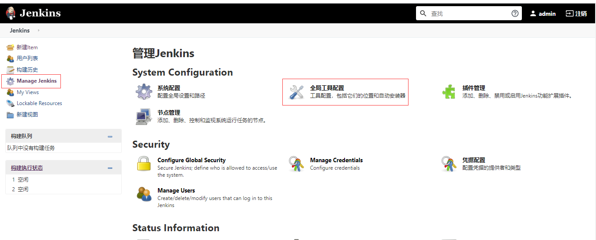
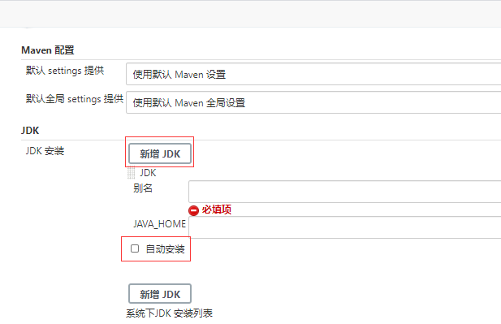
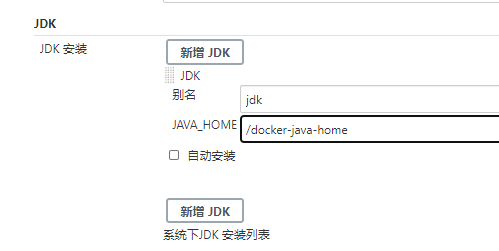
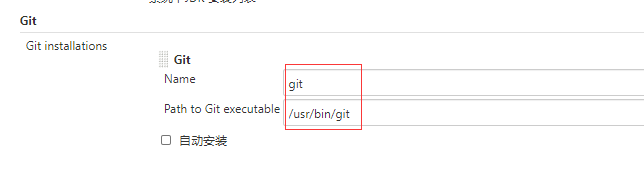
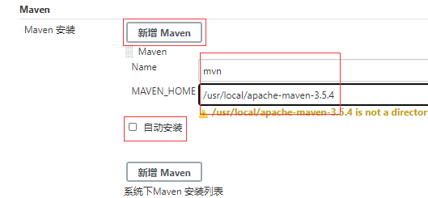

## 目的

本文详细介绍jenkins配置各种打包工具。


<!--more-->


## 配置

进入首页-》系统管理-》全局工具配置



#### 配置jdk

**查找jdk安装路径**

```bash
# 如果是容器版jenkins，就登进容器里面查看jdk路径

echo $JAVA_HOME

/docker-java-home
```

**配置路径**

新增JDK-》去掉自动安装对勾-》填写JAVA_HOME-》保存,如下图所示：





#### 配置git

**查找git安装路径**

```bash
# 如果是容器版jenkins，就登进容器里面查看

whereis git

git: /usr/bin/git /usr/share/man/man1/git.1.gz
```

**配置路径**



#### 配置maven

**查找maven安装路径**

```bash
#如果是容器版jenkins，就登进容器里面查看

echo $MAVEN_HOME

/usr/local/apache-maven-3.5.4
```

**配置路径**

新增Maven -》去掉自动安装对勾-》填写MAVEN_HOME-》保存  ，如下图所示：



配置完成，保存即可。