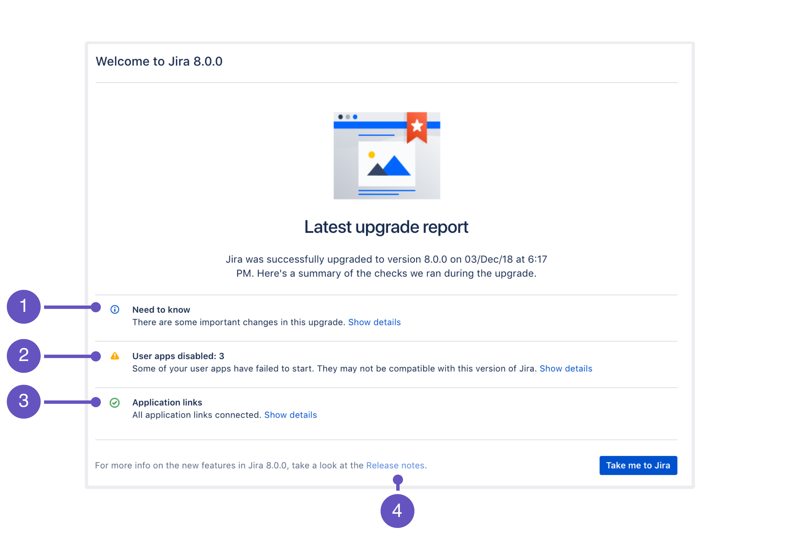

## 背景

早上到公司就接到总部信息安全组邮件。邮件内容是：Atlassian公开了一个Jira未授权SSRF漏洞。Jira的/plugins/servlet/gadgets/makeRequest资源存在SSRF漏洞，原因在于JiraWhitelist这个类的逻辑缺陷，成功利用此漏洞的远程攻击者可以以Jira服务端的身份访问内网资源。此漏洞无需任何凭据即可触发。

**影响范围**

版本小于8.4.0

漏洞详情链接： https://jira.atlassian.com/browse/JRASERVER-69793

基于以上情况，把在线上的jira 7.4.1版本升级为最新版本8.4.1，因为官方在8.4.0已经修复这个漏洞。

<!--more-->


## 程序目录

- JIRA7.4.1安装目录(以下简称**原目录**): /opt/atlassian/jira-7.4.1-bak
- JIRA7.4.1 HOME目录(以下简称**原HOME**): /var/atlassian/application-data/jira-7.4.1-bak
- JIRA8.4.1安装目录(以下简称**新目录**): /opt/atlassian/jira
- JIRA8.4.1 HOME目录(以下简称**新HOME**): /var/atlassian/application-data/jira


## 升级步骤

- 注：本次升级是在同一服务器升级
- JIRA7.4.1数据备份
- JIRA8.4.1安装
- 备份数据导入JIRA8.4.1
- 后续

## 停止原JIRA服务

停止服务可以保证后续备份的干净。所以建议升级前先把服务停止。

- 在**原目录**的bin文件夹下

- 执行 ./stop-jira.sh 停止JIRA服务

  

## 备份

### 备份数据库内容

有两种方法备份数据库内容：**本地数据库备份工具或JIRA的XML备份工具**

- **本地数据库备份工具**
  - 调用诸如mysqldump或pg_dump之类的命令行工具
- **JIRA的XML备份工具**
  - 选择系统-->导入和导出-->备份系统，在'文件名'字段中，输入备份文件的名称。
  - 点击'备份'按钮，JIRA会将您的XML备份保存为压缩的归档文件。备份完成后，将显示一条信息，确认JIRA已将其数据写入指定的文件。
  - 备份将存储在JIRA应用程序主目录的export(**HOME目录** 下的export)子目录中

### 备份data目录

该目录包含JIRA实例的应用数据，例如，问题附件存储在目录中。在Linux上，可以编写一个小的shell脚本，将其放到/etc/cron.daily一个目录中备份 /var/backup/jira。如果你将attachments目录放在自定义位置而不是data目录中，则需要attachments单独备份目录

```bash
cp -rf /var/atlassian/application-data/jira  /var/atlassian/application-data/jira-7.4.1-bak
```


### 程序目录备份

将**安装目录**和**HOME目录**也进行备份

```bash
cp -rf /opt/atlassian/jira  /opt/atlassian//jira-7.4.1-bak
```


## Jira新版本(8.4.1)安装

### 下载程序

[官网下载地址](https://www.atlassian.com/software/jira/download)

### 安装程序

##### 环境准备

- 安装JDK(JIRA8.4.1需要JVM1.8及以上环境)
- 由于本次为升级，因此默认以上环境已经安装

- 将下载的atlassian-jira-software-8.4.1.tar.gz压缩包解压到安装目录中(参考**新目录**)

- 解压后修改安装包名称为jira，即为**新目录**

  ```bash
  #下载
  wget https://product-downloads.atlassian.com/software/jira/downloads/atlassian-jira-software-8.4.1.tar.gz
  #解压
  tar -xzvf  atlassian-jira-software-8.4.1.tar.gz -C /opt/atlassian/
  mv /opt/atlassian/mv atlassian-jira-software-8.4.1-standalone /opt/atlassian/jira
  ```

##### 修改配置

配置文件列表

[Jira中重要文件](https://confluence.atlassian.com/adminjiraserver/important-directories-and-files-938847744.html)

```bash
server.xml
dbconfig.xml
jira-config.properties
setenv.sh /  setenv.bat （内存分配和其他JVM参数）有关更多信息，请参阅  Jira中的重要文件链接 
```

- JAVA配置有两个办法：直接复制原目录的jre目录至新目录或者直接配置本机java环境

  将**原目录**下的jre文件夹复制到**新目录**下

```bash
    cp -r /opt/atlassian/jira-7.4.1/jre /opt/atlassian/jira
```

- 修改**新目录**bin文件夹下的setenv.sh,在 **#!INSTALLER SET JAVA_HOME** 下一行加入

```bash
# 复制目录配置
JAVA_HOME="/opt/atlassian/jira/jre/"; export JAVA_HOME
# 配置本机配置
JAVA_HOME="/usr/java/jdk1.8.0_202/jre/"; export JAVA_HOME
```

- 设置Jira HOME，编辑文件，设置Jira HOME目录
  - 查找jira-application.properties文件，设置jira.home

```
#查找配置文件
find . -name jira-application.properties 
#编辑
vim /opt/atlassian/jira/atlassian-jira/WEB-INF/classes/jira-application.properties

jira.home = /var/atlassian/application-data/jira
#创建Jira home目录
mkdir -p /var/atlassian/application-data/jira
```

##### 旧配置复制

- 把破解包里面的atlassian-extras-3.2.jar和mysql-connector-java-5.1.39-bin.jar两个文件复制到/opt/atlassian/jira/atlassian-jira/WEB-INF/lib/目录下。

  其中atlassian-extras-3..2.jar是用来替换原来的atlassian-extras-3.2.jar文件，用作破解jira系统的。

  而mysql-connector-java-5.1.39-bin.jar是用来连接mysql数据库的驱动软件包。

  ```bash
  cp /opt/atlassian/jira-7.4.1-bak/atlassian-jira/WEB-INF/lib/mysql-connector-java-5.1.39-bin.jar /opt/atlassian/jira/atlassian-jira/WEB-INF/lib/
  cp /opt/atlassian/jira-7.4.1-bak/atlassian-jira/WEB-INF/lib/atlassian-extras-3.2.jar /opt/atlassian/jira/atlassian-jira/WEB-INF/lib/
  ```

- 数据库配置文件复制，因为安装数据库需要为空库，配置时需要创建配置文件。本教程为升级，所以直接复制原配置即可

  ```bash
  cp /var/atlassian/application-data/jira-7.4.1-bak/dbconfig.xml /var/atlassian/application-data/jira/dbconfig.xml
  ```

##### 禁用自动重新索引

官方文档中指出：建议从平台升级（即从7.x升级到8.x）进行此步骤。

由于我们在Jira 8.0中引入了对索引的更改，因此您的旧索引与新版本不兼容。要创建一个新文件，Jira将在您启动它后立即触发自动重新索引。为避免两次重新编制索引（在启动后和升级应用程序之后），您可以禁用自动重新编制索引，并在准备就绪后再运行第二次重新编制索引。

编辑或创建以下文件：

```bash
touch /var/atlassian/application-data/jira/jira-config.properties
```

添加以下行，并保存文件：

```bash
upgrade.reindex.allowed=false
```

- 完成基础配置后，就可以启动Jira服务了(在**新目录**的bin文件夹下，执行./start-jira.sh)

- 浏览器访问

- 重置索引：点击设置-系统-高级-重新索引，**重新索引操作** 选择 **后台重新索引**，点击**重新索引**

## 数据恢复

- 将备份的.zip文件放入**新HOME**的import文件夹下，管理员账号访问浏览器，点击系统-恢复，选择文件后等待系统完成恢复。恢复完成后将重新登录JIRA，账号密码为原JIRA管理员信息
- 将备份的data文件下的数据放入**新HOME**的data文件夹下

## 后续

#### （可选）更新Jira服务台

如果您使用的是Jira Service Desk，则可以直接在UI中进行更新，而无需下载单独的安装程序。

1. 转到  **>应用程序>版本和许可证**。
2. 更新Jira服务台。这将自动将Service Desk更新到兼容版本。

### 

#### 升级应用程序（附加组件）

现在，您可以升级同时具有**兼容**  状态的应用程序  。如果您一般需要有关状态和应用程序的更多信息，请参阅“  [准备升级”](https://confluence.atlassian.com/adminjiraserver/preparing-for-the-upgrade-966063325.html)。

1. 转到  **>管理应用>管理应用**。
2. 将您的应用升级到支持的版本。
3. 应用程序升级后，即可启用它们。

### 

#### 重建索引

由于您的旧索引不兼容，因此请重新索引Jira以重建它。此步骤可能需要一些时间，具体取决于您遇到的问题和应用程序的数量。

1. 转到  **>索引编制**，然后运行  **Lock Jira并重建reindex**。

## 做得好！

您已将Jira升级到新版本。

#### 升级后登录页面

成功升级后，您应该会看到升级后的登录页面。它具有有关新版本的一些有用信息，如下所示。



1. **需要知道：**  可能会影响您作为管理员工作的新功能列表。
2. **用户应用程序：**升级后**应用程序的** 状态。
3. **应用程序链接：**  您的应用程序链接的状态。
4. **发行说明：**  链接到发行说明，您可以在其中查看有关已升级到的版本的更多详细信息