## 简述

持续构建与发布是我们日常工作中必不可少的一个步骤，目前大多公司都采用 Jenkins 集群来搭建符合需求的 CI/CD 流程，然而传统的 Jenkins Slave 一主多从方式会存在一些痛点，比如：

- 主 Master 发生单点故障时，整个流程都不可用了
- 每个 Slave 的配置环境不一样，来完成不同语言的编译打包等操作，但是这些差异化的配置导致管理起来非常不方便，维护起来也是比较费劲
- 资源分配不均衡，有的 Slave 要运行的 job 出现排队等待，而有的 Slave 处于空闲状态
- 资源有浪费，每台 Slave 可能是物理机或者虚拟机，当 Slave 处于空闲状态时，也不会完全释放掉资源。

正因为上面的这些种种痛点，我们渴望一种更高效更可靠的方式来完成这个 CI/CD 流程，而 Docker 虚拟化容器技术能很好的解决这个痛点，又特别是在 Kubernetes 集群环境下面能够更好来解决上面的问题，下图是基于 Kubernetes 搭建 Jenkins 集群的简单示意图：
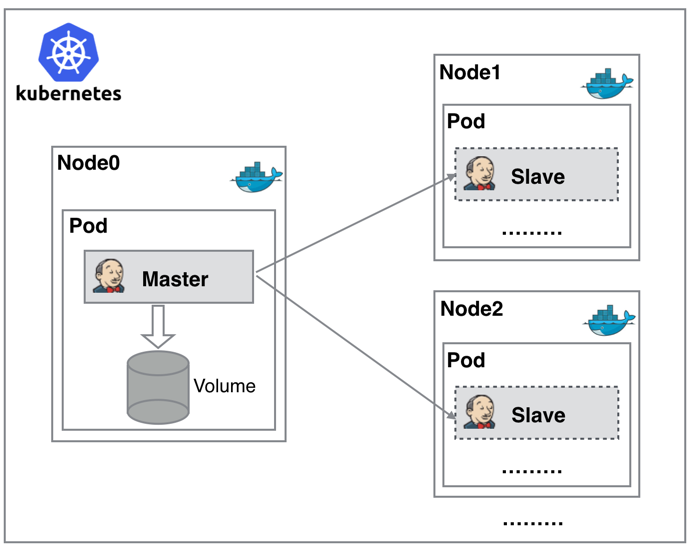

从图上可以看到 Jenkins Master 和 Jenkins Slave 以 Pod 形式运行在 Kubernetes 集群的 Node 上，Master 运行在其中一个节点，并且将其配置数据存储到一个 Volume 上去，Slave 运行在各个节点上，并且它不是一直处于运行状态，它会按照需求动态的创建并自动删除。

这种方式的工作流程大致为：当 Jenkins Master 接受到 Build 请求时，会根据配置的 Label 动态创建一个运行在 Pod 中的 Jenkins Slave 并注册到 Master 上，当运行完 Job 后，这个 Slave 会被注销并且这个 Pod 也会自动删除，恢复到最初状态。

使用jenkins动态slave的优势：

- **服务高可用**，当 Jenkins Master 出现故障时，Kubernetes 会自动创建一个新的 Jenkins Master 容器，并且将 Volume 分配给新创建的容器，保证数据不丢失，从而达到集群服务高可用。
-  **动态伸缩**，合理使用资源，每次运行 Job 时，会自动创建一个 Jenkins Slave，Job 完成后，Slave 自动注销并删除容器，资源自动释放，而且 Kubernetes 会根据每个资源的使用情况，动态分配 Slave 到空闲的节点上创建，降低出现因某节点资源利用率高，还排队等待在该节点的情况。
-  **扩展性好**，当 Kubernetes 集群的资源严重不足而导致 Job 排队等待时，可以很容易的添加一个 Kubernetes Node 到集群中，从而实现扩展。

<!--more-->

## 环境

[k8s 集群](https://wandouduoduo.github.io/articles/87f87b20.html) 

版本:  1.18.3


## 参考文档

[网友博客](https://www.cnblogs.com/effortsing/p/10486960.html)


## 安装

### 创建namespace

创建一个kube-ops的 namespace（为了方便管理）

```bash
$ kubectl create namespace kube-ops
```

### 创建pv和pvc

创建pv、pvc或使用storageclass都可以，本实验使用前者（pvc.yaml）

*注意：下面使用的是nfs的存储方式。*[详情参考](https://wandouduoduo.github.io/articles/3acab424.html#more)

```yaml
apiVersion: v1
kind: PersistentVolume
metadata:
  name: opspv
spec:
  capacity:
    storage: 3Gi
  accessModes:
  - ReadWriteMany
  persistentVolumeReclaimPolicy: Recycle
  storageClassName: nfs
  nfs:
    server: 10.220.169.231
    path: /data/k8s-volume
    
---
apiVersion: v1
kind: PersistentVolumeClaim
metadata:
  name: opspvc
  namespace: kube-ops
spec:
  accessModes:
    - ReadWriteMany
  storageClassName: nfs
  resources:
    requests:
      storage: 3Gi
```

创建需要用到的 PVC 对象：

```bash
$ kubectl create -f pvc.yaml
```

### 权限绑定

给jenkins绑定权限（rbac.yaml），如果对rbac不熟悉，可以先给定cluster-admin权限

```yaml
apiVersion: v1
kind: ServiceAccount
metadata:
  name: jenkins
  namespace: kube-ops

---
kind: ClusterRole
apiVersion: rbac.authorization.k8s.io/v1beta1
metadata:
  name: jenkins
rules:
  - apiGroups: ["extensions", "apps"]
    resources: ["deployments"]
    verbs: ["create", "delete", "get", "list", "watch", "patch", "update"]
  - apiGroups: [""]
    resources: ["services"]
    verbs: ["create", "delete", "get", "list", "watch", "patch", "update"]
  - apiGroups: [""]
    resources: ["pods"]
    verbs: ["create","delete","get","list","patch","update","watch"]
  - apiGroups: [""]
    resources: ["pods/exec"]
    verbs: ["create","delete","get","list","patch","update","watch"]
  - apiGroups: [""]
    resources: ["pods/log"]
    verbs: ["get","list","watch"]
  - apiGroups: [""]
    resources: ["secrets"]
    verbs: ["get"]

---
apiVersion: rbac.authorization.k8s.io/v1beta1
kind: ClusterRoleBinding
metadata:
  name: jenkins
  namespace: kube-ops
roleRef:
  apiGroup: rbac.authorization.k8s.io
  kind: ClusterRole
  name: jenkins
subjects:
  - kind: ServiceAccount
    name: jenkins
    namespace: kube-ops
```

创建 rbac 相关的资源对象：

```bash
$ kubectl create -f rbac.yaml
serviceaccount "jenkins" created
role.rbac.authorization.k8s.io "jenkins" created
rolebinding.rbac.authorization.k8s.io "jenkins" created
```

### 创建jenkins  master

新建一个 Deployment：(jenkins.yaml)

```yaml
---
apiVersion: apps/v1
kind: Deployment
metadata:
  name: jenkins
  namespace: kube-ops
spec:
  selector:
    matchLabels:
      app: jenkins
  template:
    metadata:
      labels:
        app: jenkins
    spec:
      terminationGracePeriodSeconds: 10
      serviceAccount: jenkins
      containers:
      - name: jenkins
        image: jenkins/jenkins:lts
        imagePullPolicy: IfNotPresent
        ports:
        - containerPort: 8080
          name: web
          protocol: TCP
        - containerPort: 50000
          name: agent
          protocol: TCP
        resources:
          limits:
            cpu: 1000m
            memory: 1Gi
          requests:
            cpu: 500m
            memory: 512Mi
        livenessProbe:
          httpGet:
            path: /login
            port: 8080
          initialDelaySeconds: 60
          timeoutSeconds: 5
          failureThreshold: 12
        readinessProbe:
          httpGet:
            path: /login
            port: 8080
          initialDelaySeconds: 60
          timeoutSeconds: 5
          failureThreshold: 12
        volumeMounts:
        - name: jenkinshome
          subPath: jenkins
          mountPath: /var/jenkins_home
        env:
        - name: LIMITS_MEMORY
          valueFrom:
            resourceFieldRef:
              resource: limits.memory
              divisor: 1Mi
        - name: JAVA_OPTS
          value: -Xmx$(LIMITS_MEMORY)m -XshowSettings:vm -Dhudson.slaves.NodeProvisioner.initialDelay=0 -Dhudson.slaves.NodeProvisioner.MARGIN=50 -Dhudson.slaves.NodeProvisioner.MARGIN0=0.85 -Duser.timezone=Asia/Shanghai
      securityContext:
        fsGroup: 1000
      volumes:
      - name: jenkinshome
        persistentVolumeClaim:
          claimName: opspvc

---
apiVersion: v1
kind: Service
metadata:
  name: jenkins
  namespace: kube-ops
  labels:
    app: jenkins
spec:
  selector:
    app: jenkins
  type: NodePort
  ports:
  - name: web
    port: 8080
    targetPort: web
    nodePort: 30002
  - name: agent
    port: 50000
    targetPort: agent
```

这里为了方便，通过 NodePort 的形式来暴露 Jenkins 的 web 服务，固定为30002端口，另外还需要暴露一个 agent 的端口，这个端口主要是用于 Jenkins 的 master 和 slave 之间通信使用的。
创建 Jenkins 服务：

```bash
$ kubectl create -f jenkins.yaml
deployment.extensions "jenkins" created
service "jenkins" created
```

### 排错

创建完成后，要去拉取镜像可能需要等待一会儿，查看下 Pod 的状态：

```bash
$ kubectl get pods -n kube-ops
NAME                        READY     STATUS    RESTARTS   AGE
jenkins-7f5494cd44-pqpzs   0/1       Running   0          2m
```

可以看到该 Pod 处于 Running 状态，但是 READY 值确为0，然后我们用 describe 命令去查看下该 Pod 的详细信息：

```bash
$ kubectl describe pod jenkins-7f5494cd44-pqpzs -n kube-ops
...
Normal   Created                3m                kubelet, node01    Created container
  Normal   Started                3m                kubelet, node01    Started container
  Warning  Unhealthy              1m (x10 over 2m)  kubelet, node01    Liveness probe failed: Get http://10.244.1.165:8080/login: dial tcp 10.244.1.165:8080: getsockopt: connection refused
  Warning  Unhealthy              1m (x10 over 2m)  kubelet, node01    Readiness probe failed: Get http://10.244.1.165:8080/login: dial tcp 10.244.1.165:8080: getsockopt: connection refused
```

可以看到上面的 Warning 信息，健康检查没有通过，具体原因是什么引起的呢？可以通过查看日志进一步了解：

```bash
$ kubectl logs -f jenkins-7f5494cd44-pqpzs -n kube-ops
touch: cannot touch '/var/jenkins_home/copy_reference_file.log': Permission denied
Can not write to /var/jenkins_home/copy_reference_file.log. Wrong volume permissions?
```

很明显可以看到上面的错误信息，意思就是我们没有权限在 jenkins 的 home 目录下面创建文件，这是因为默认的镜像使用的是 jenkins 这个用户，而我们通过 PVC 挂载到 nfs 服务器的共享数据目录下面却是 root 用户的，所以没有权限访问该目录，要解决该问题，也很简单，我只需要在 nfs 共享数据目录下面把我们的目录权限重新分配下即可：

```bash
mount -t nfs 10.220.169.231:/data/k8s-volume /data/k8s
chown -R 1000 /data/k8s
```

然后重新创建：

```bash
$ kubectl delete -f jenkins.yaml
deployment.extensions "jenkins" deleted
service "jenkins" deleted
$ kubectl create -f jenkins.yaml
deployment.extensions "jenkins" created
service "jenkins" created
```

现在再去查看新生成的 Pod 已经没有错误信息了：

```bash
$ kubectl get pods -n kube-ops
NAME                        READY     STATUS        RESTARTS   AGE
jenkins-7f5494cd44-smn2r   1/1       Running       0          25s
```

### 访问

等到服务启动成功后，可以根据Node节点的 IP:30002 端口就可以访问 jenkins 服务了，可以根据提示信息进行安装配置即可：

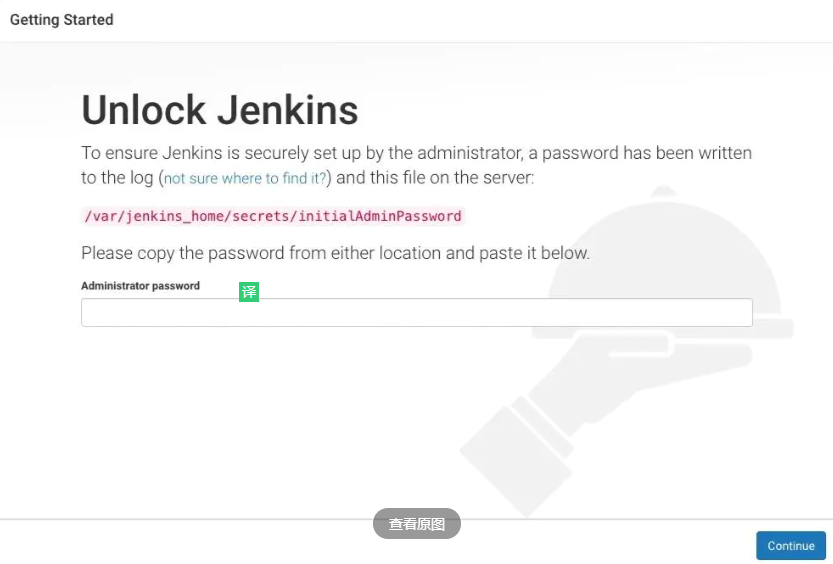

初始化的密码可以在 jenkins 的容器的日志中进行查看，也可以直接在 nfs 的共享数据目录中查看：

```bash
cat /data/k8s/jenkins/secrets/initialAdminPassword
1974d7a773574a9ca58a6611bc1bed7f
```

然后选择安装推荐的插件即可。

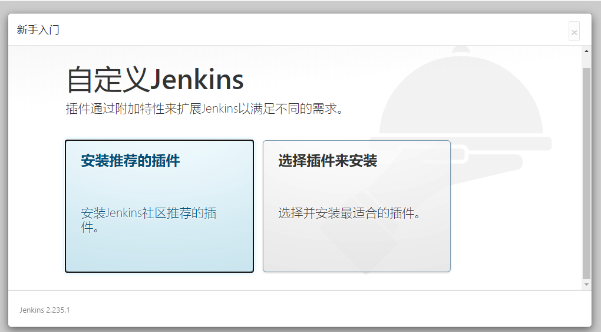

安装完成后添加管理员帐号即可进入到 jenkins 主界面：

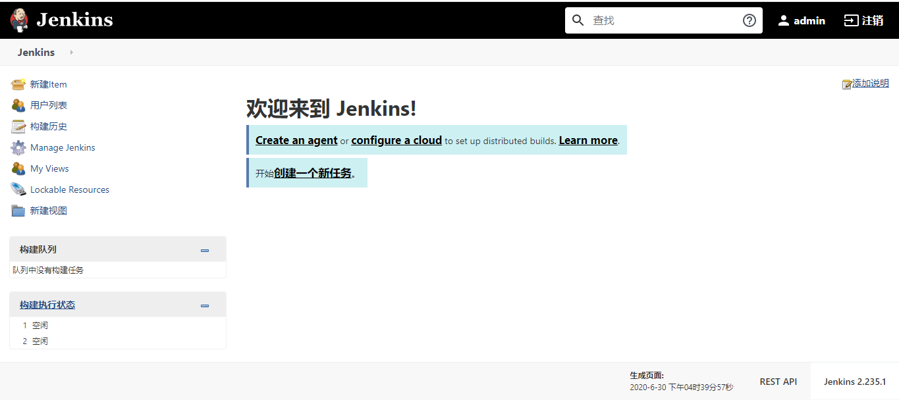

### 配置jenkins动态slave

**安装kubernetes 插件**

点击 Manage Jenkins -> 插件管理-> 可用 -> Kubernetes plugin 勾选安装即可。（如果搜索没有Kubernetes plugin，即选择Kubernetes），然后重启jenkins，使之生效。
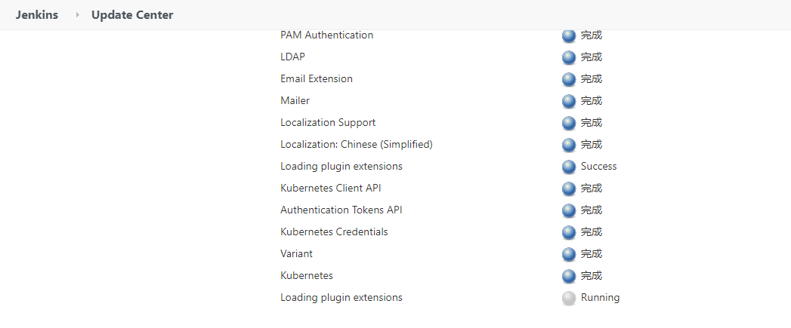

**插件配置**

点击 Manage Jenkins —> 系统配置 —> (拖到最下方)Add a new cloud —> 选择 Kubernetes，然后填写 Kubernetes 和 Jenkins 配置信息。
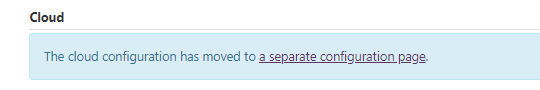

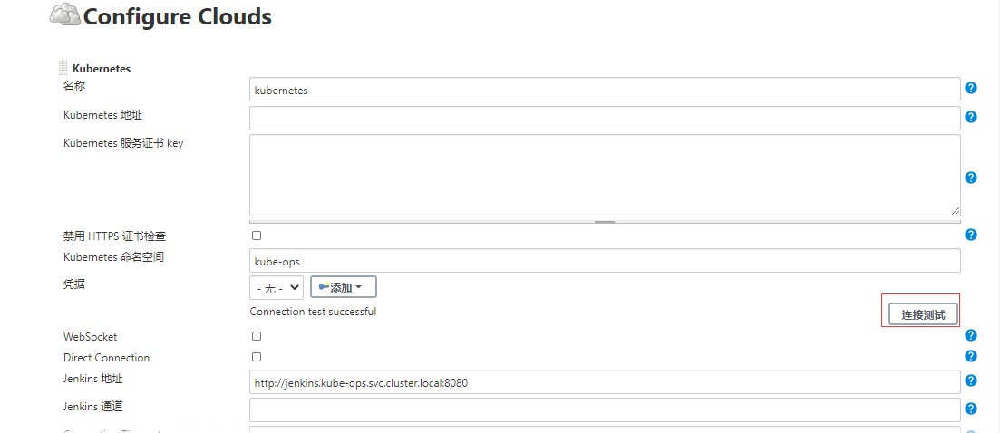

*另外需要注意，如果这里 Test Connection 失败的话，很有可能是权限问题，这里就需要把 jenkins 的 serviceAccount 对应的 secret 添加到这里的 Credentials 里面。*

**配置 Pod Template**

其实就是配置 Jenkins Slave 运行的 Pod 模板，命名空间同样使用 kube-ops，Labels 这里也非常重要，对于后面执行 Job 的时候需要用到该值，这里使用的是 cnych/jenkins:jnlp 这个镜像，这个镜像是在官方的 jnlp 镜像基础上定制的，加入了 kubectl 等一些实用的工具。

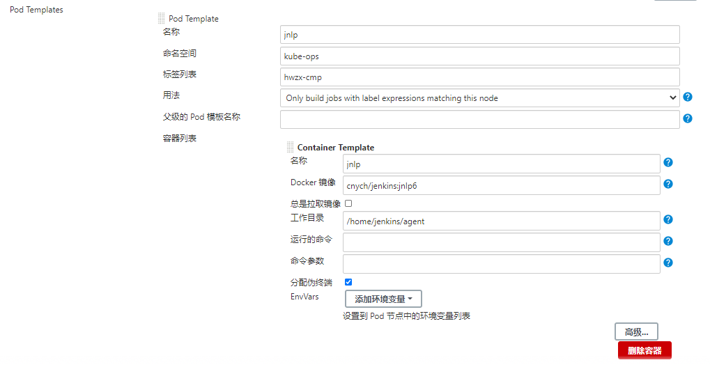

需要在下面挂载两个主机目录，一个是/var/run/docker.sock，该文件是用于 Pod 中的容器能够共享宿主机的 Docker，使用 docker in docker 的方式，Docker 二进制文件已经打包到上面的镜像中了，另外一个目录下/root/.kube目录，将这个目录挂载到容器的/root/.kube目录下面这是为了能够在 Pod 的容器中能够使用 kubectl 工具来访问 Kubernetes 集群，方便后面在 Slave Pod 部署 Kubernetes 应用。
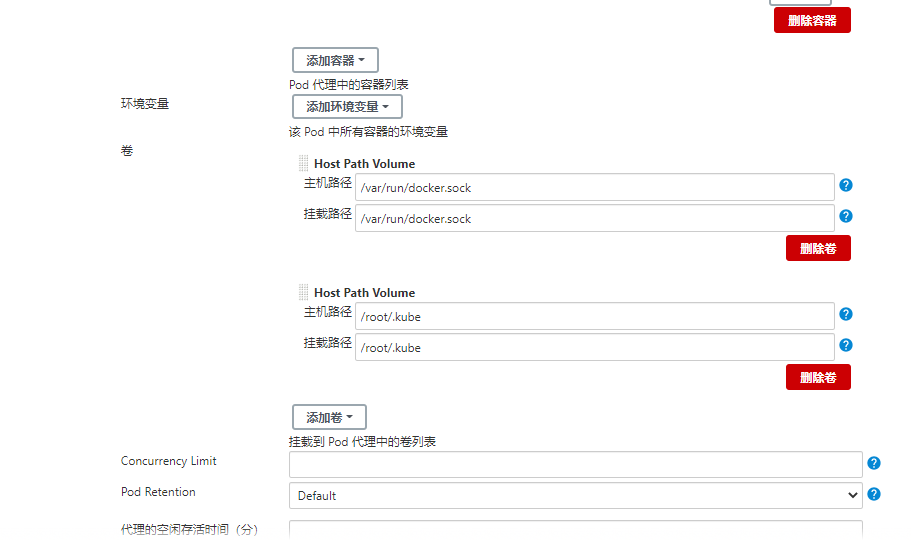

另外还有几个参数需要注意，如下图中的  **代理的空闲存活时间（分）(Time in minutes to retain slave when idle)**，这个参数表示的意思是当处于空闲状态的时候保留 Slave Pod 多长时间，这个参数最好保存默认就行了，如果你设置过大的话，Job 任务执行完成后，对应的 Slave Pod 就不会立即被销毁删除。（如没有，请忽略））
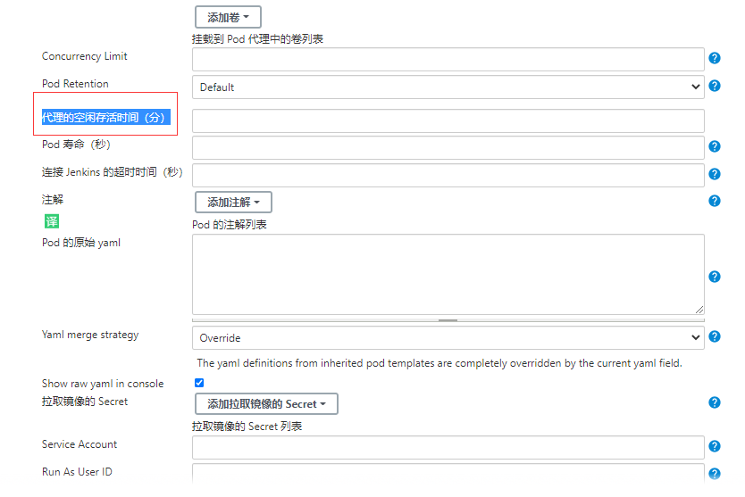

另外在配置了后运行 Slave Pod 的时候出现了权限问题，因为 Jenkins Slave Pod 中没有配置权限，所以需要配置上 ServiceAccount，在 Slave Pod 配置的地方点击下面的高级，添加上对应的 ServiceAccount 即可：

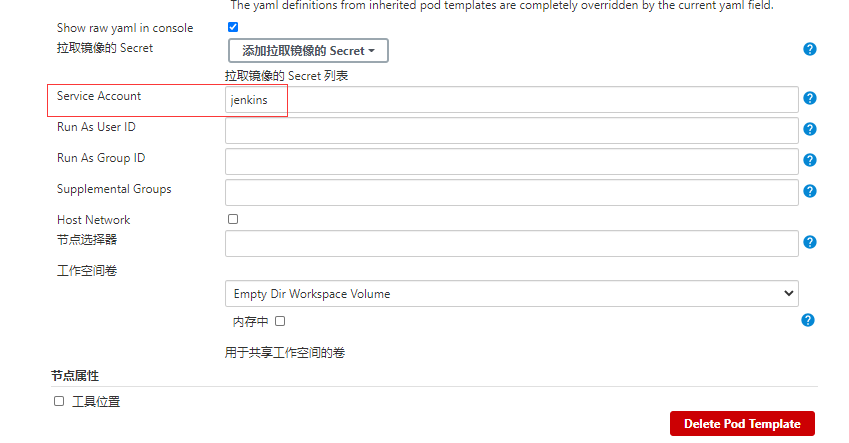

还有一个问题在配置完成后发现启动 Jenkins Slave Pod 的时候，出现 Slave Pod 连接不上，然后尝试100次连接之后销毁 Pod，然后会再创建一个 Slave Pod 继续尝试连接，无限循环，类似于下面的信息：（如没有，请忽略）
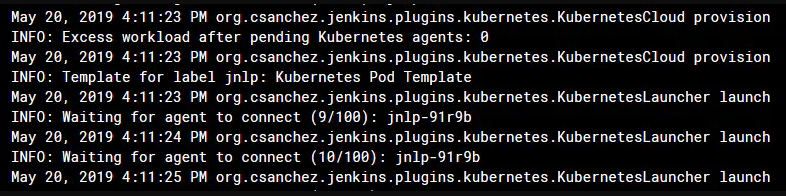

如果出现这种情况的话就需要将 Slave Pod 中的运行命令和参数两个值给清空掉

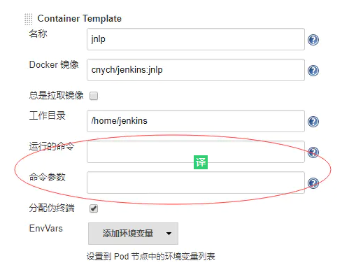

到这里 Kubernetes Plugin 插件就算配置完成了。

## 测试

Kubernetes 插件的配置工作完成了，接下来添加一个 Job 任务，看是否能够在 Slave Pod 中执行，任务执行完成后看 Pod 是否会被销毁。

在 Jenkins 首页点击create new jobs，创建一个测试的任务，输入任务名称，然后我们选择 Freestyle project 类型的任务：
 注意在下面的 Label Expression 这里要填入hwzx-cmp，就是前面我们配置的 Slave Pod 中的 Label，这两个地方必须保持一致

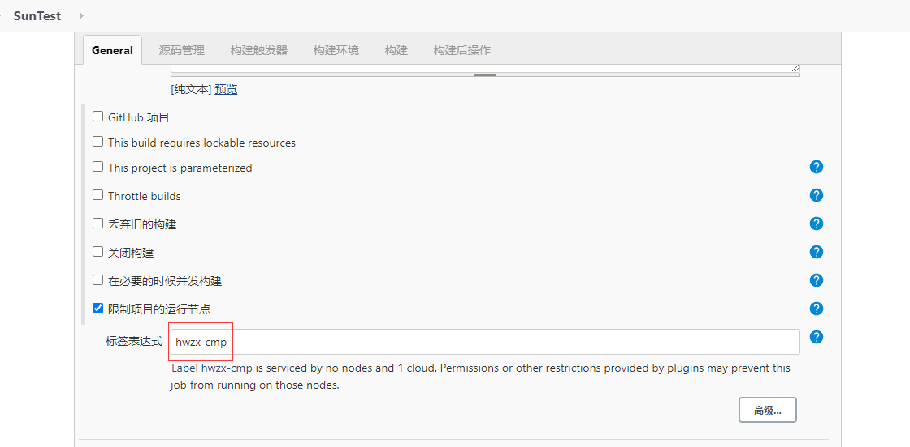

然后往下拉，在 Build 区域选择Execute shell

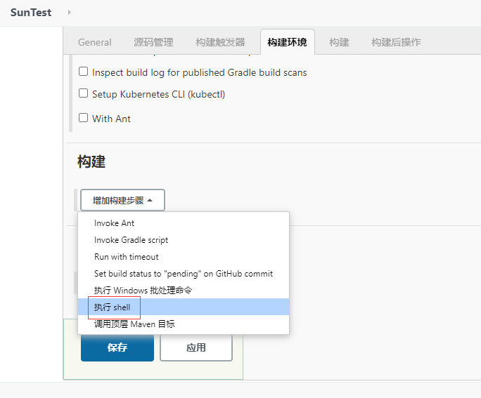

然后输入测试命令

```bash
echo "测试 Kubernetes 动态生成 jenkins slave"
echo "==============docker in docker==========="
docker info

echo "=============kubectl============="
kubectl get pods
```

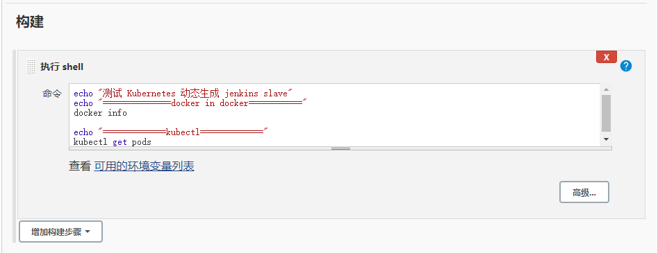

现在直接在页面点击做成的 Build now 触发构建即可，然后观察 Kubernetes 集群中 Pod 的变化

```
kubectl get pod -n kube-ops -o wide
```

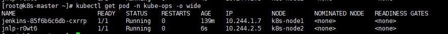

可以看到在击立刻构建的时候可以看到一个新的 Pod：jnlp-r0wt6   被创建了，这就是我们的 Jenkins Slave。

查看控制台信息

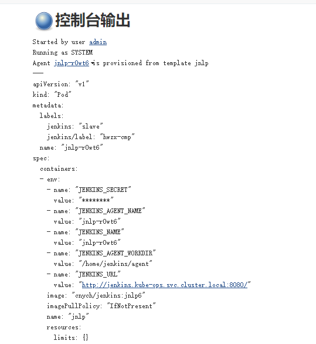

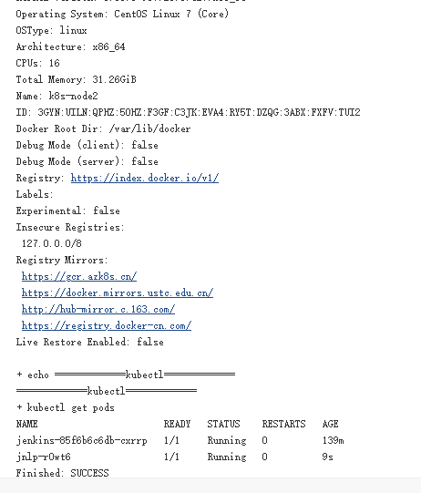

到这里证明任务已经构建完成，然后这个时候再去集群查看 Pod 列表，发现 kube-ops 这个 namespace 下面已经没有之前的 Slave 这个 Pod 了。

```
kubectl get pod -n kube-ops -o wide
```

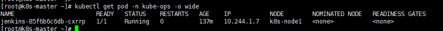

到这里就完成了使用 Kubernetes 动态生成 Jenkins Slave 的方法。

