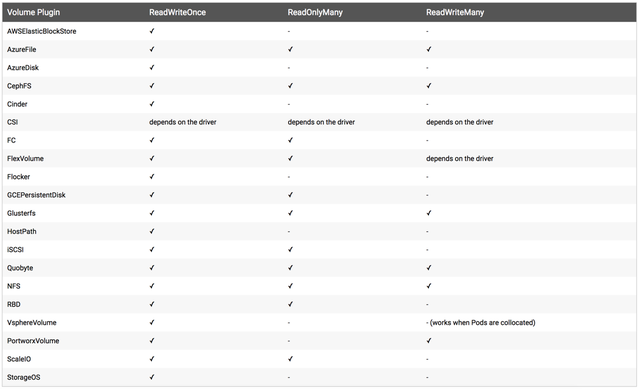
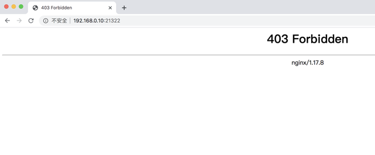
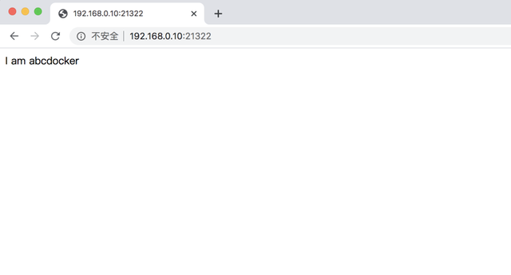
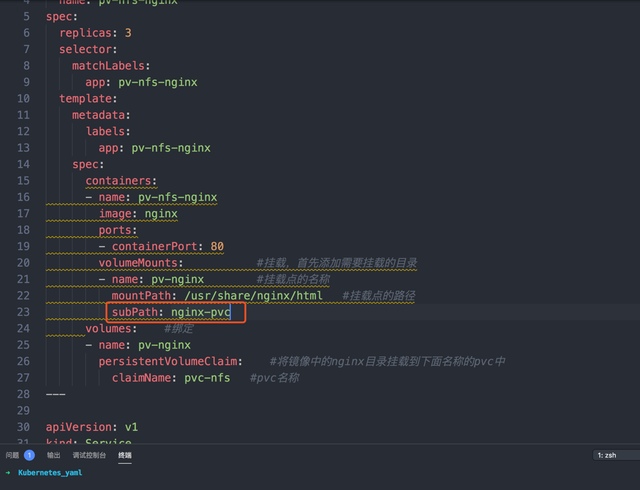

## 目的

本文详细介绍了kubernentes的存储，使用NFS进行演示，让你充分了解和使用pv和pvc，可以举一反三的使用持久化存储。


<!--more-->

## 概述

### Volume

Volume可以支持`local`、`nfs`、`cephfs`、`glusterfs`以及各种云计算平台。

官网Volume的配置都是在一个创建pod的yaml文件中，例如

```yaml
apiVersion: v1
kind: Pod
metadata:
  name: test-pd
spec:
  containers:
  - image: k8s.gcr.io/test-webserver
    name: test-container
    volumeMounts:
    - mountPath: /test-pd
      name: test-volume
  volumes:
  - name: test-volume
    hostPath:
      # directory location on host
      path: /data
      # this field is optional
      type: Directory
```

### **PV和PVC**

PV的全称是: PersistentVolume (持久化卷)，是对底层的共享存储的一种抽象，PV由管理员进行创建和配置，它和具体的底层的共享存储技术的实现方式有关，比如Ceph、GlusterFS、NFS等，都是通过插件机制完成与共享存储的对接.

PVC的全称是: PersistenVolumeClaim (持久化卷声明)，PVC是用户存储的一种声明，PVC和Pod比较类型，Pod是消耗节点，PVC消耗的是PV资源，Pod可以请求CPU的内存，而PVC可以请求特定的存储空间和访问模式。对于真正存储的用户不需要关心底层的存储实现细节，只需要直接使用PVC即可.

*但是通过PVC请求一定的存储空间也很有可能不足以满足对于存储设备的各种需求，而且不同的应用程序对于存储性能的要求也能也不尽相同，比如读写速度、并发性能等，为了解决这一问题，Kubernetes又为我们引入了一个新的资源对象: StorageClass,通过StorageClass的定义，管理员可以将存储资源定义为某种类型的资源，比如快速存储、慢速存储等，用户根据StorageClass的描述就可以非常直观的知道各种存储资源特性了，这样就可以根据应用的特性去申请合适的存储资源了*


## 演示

### 安装NFS服务

#这里我使用单独服务器进行演示，实际上随便一台服务器安装nfs都可以 (建议和kubernetes集群分开，找单独一台机器)

```bash
# 安装
yum install nfs-utils -y rpcbind

# 设置nfs存储目录
mkdir /data1/k8s-volume
chmod 755 /data1/k8s-volume/

#编辑nfs配置文件
cat /etc/exports
/data1/k8s-volume *(rw,no_root_squash,sync)
#存储目录，*允许所有人连接，rw读写权限，sync文件同时写入硬盘及内存，no_root_squash 使用者root用户自动修改为普通用户

#由于nfs需要向rpcbind进行注册，所以我们需要优先启动rpcbind
#启动rpcbind
systemctl start rpcbind
systemctl enable rpcbind
systemctl status rpcbind

#启动nfs
systemctl restart nfs
systemctl enable nfs
systemctl status nfs

#检查rpcbind及nfs是否正常
 rpcinfo |grep nfs
```

### NFS客户端

**我们nfs server端已经完毕，接下来在所有需要nfs挂载的集群节点安装以下**

```bash
 yum install -y nfs-utils rpcbind
 systemctl start rpcbind
 systemctl enable rpcbind
 systemctl start nfs
 ystemctl enable nfs
```

**客户端挂载测试**

```bash
#首先检查nfs服务端挂载目录是否正常
showmount -e localhost

Export list for localhost:
/data1/k8s-volume *

#现在进行节点挂载
#先在客户端创建数据目录（挂载点位置）
mkdir -p /data1/k8s/

#现在进行挂载 分别是ip:nfs目录 节点存储目录
mount -t nfs 10.4.82.118:/data1/k8s-volume /data1/k8s

#挂在完成后我们使用df -h 就可以看到挂载点
 df -h
#所有需要nfs节点这样挂载就可以
```

### 创建PV

有了我们NFS共享存储，下面就可以来使用PV和PVC。PV作为存储资源，主要包括存储能力、访问模式、存储类型、回收策略等关键信息。pv.yaml如下

```yaml
apiVersion: v1
kind:PersistentVolume
metadata:
	name: pv1 #pv名称
spec:
	capacity:             #存储能力，一个pv对象都要指定一个存储能力，目前仅支持存储空间的设置
		storage:3Gi                         #存储空间
	accessModes:
		-ReadWriteMany                      #访问模式
	persistentVolumeReclaimPolicy:Recycle   #回收策略
	nfs:                              #服务模式 (nfs、ceph、hostpath等)
		path:/data1/k8s-volume       #共享数据目录挂载点
		server:10.4.82.118           #nfs服务器地址
```

```bash
# 创建
kubectl apply -f pv.yaml
# 查看状态
kubectl get pv
```

**PV相关配置说明**

Capacity 存储能力 通过PV的capacity属性来设置存储空间，目前仅支持storage=数据大小，未来可能会加入IOPS、吞吐量等指标配置

**AccessModes 访问模式**

AccessModes 是用来对PV进行访问模式的设置，用于描述用户应用对存储资源的访问权限, 访问权限包括下面几种方式：

- ReadWriteOnce (RWO):  读写权限，但是只能被单个节点挂载 
- ReadOnlyMany (ROX):  只读权限，可能被多个节点挂载 
- ReadWriteMany (RWX):  读写权限，可以被多个节点挂载

*注意:一些PV可能支持多种访问模式，但是在挂载点时候只能使用一种访问模式，多种访问模式不生效*

下面是一些常用的Volume插件支持的访问模式（需要根据我们配置的类型进行选择对应的访问模式）



**persistentVolumeReclaimPolicy回收策略** 

- Retain (保留) 保留数据，需要管理员手动清理 
- Recycle (回收) 清除PV中的数据，效果相当于执行删除命令 
- Delete (删除) 与PV相连的后端存储完成volume的删除操作，常见于云服务商的存储服务

*不过需要注意的是，目前只有NFS和HostPath两类支持回收策略，一般设置Retain比较保险*

**状态**

- Available (可用): 表示可用状态，还未被任何PVC绑定

- Bound (已绑定)：已经绑定到某个PVC 

- Released (已释放)：对应的PVC已经删除,但资源还没有被集群收回 

- Failed：PV自动回收失败

  

### **创建PVC**

前面说过，PV实际上没有创建存储，相当于我们node一样，还需要创建Pod进行消费，接下来我们进行PVC的创建与配置

#前面我们已经在集群上都安装nfs客户端，并且进行挂载了。下面进行创建pvc

```yaml
# 新建pvc同样需要建立一个数据卷声明
apiVersion: v1
kind:PersistentVolumeClaim
metadata:
	name: pvc-nfs
	namespace: kube-ops                     #指定命名空间，如没指定为默认
spec:
	accessModes:
		-ReadWriteMany
	resources:
		requests:
			storage:3Gi
```

```bash 
#创建，pvc的yaml文件基本上和pv相同，这里不过多解释。
kubectl apply -f pvc-nfs.yaml

#查看pvc
kubectl get pvc -n kube-ops

#查看pv
kubectl get pv
#这里我们可以看到，当我们创建pvc之后，pv的状态变成了Bound绑定状态，并且和pvc的状态相同。并且可以看到pvc已经绑定到名称为pv1的volume上，同时在pv上可以看到绑定到名称为pvc-nfs的pvc中
#在Kubernetes中会自动帮我们查看pv状态为Available并且根据声明pvc容量storage的大小进行筛选匹配，同时还会根据AccessMode进行匹配。如果pvc匹配不到pv会一直处于pending状态
```

### **使用Labels匹配PV与PVC**

pv与pvc中间还可以通过label标签进行匹配，配置如下

```yaml
#记得我们需要修改一下名字，名字是不可以重复的
apiVersion: v1
kind:PersistentVolume
metadata:
	name: pv2
	labels:           #这里将pv设置一个labels
		app: nfs
spec:
	capacity:
		storage:10Gi
	accessModes:
    - ReadWriteOnce
	persistentVolumeReclaimPolicy:Recycle
	nfs:
		path:/data1/k8s-volume
		server:192.168.0.14

---
apiVersion: v1
kind:PersistentVolumeClaim
metadata:
	name: pvc2-nfs
spec:
	accessModes:
    - ReadWriteOnce
	resources:
		requests:
			storage:10Gi
	selector:             ##pvc匹配标签为app=nfs的pv
		matchLabels:
			app: nfs
```

```bash
kubectl apply -f test.yaml
kubectl get pv, pvc
#这里我们可以看到创建的名称为pv2何pv2-nfs已经进行绑定
#需要注意，当我们pvc申请的容量小于我们pv的容量是可以进行绑定的，当我们申请pvc的容量大于pv的容量是无法进行绑定的。 
```

### **Deployment引用pvc**

```yaml
apiVersion: extensions/v1beta1
kind:Deployment
metadata:
	name: pv-nfs-nginx
spec:
	replicas:3
	selector:
		matchLabels:
			app: pv-nfs-nginx
	template:
		metadata:
            labels:
                app: pv-nfs-nginx
        spec:
            containers:
            - name: pv-nfs-nginx
                image: nginx
                ports:
                - containerPort:80
                volumeMounts:            #挂载，首先添加需要挂载的目录
                - name: pv-nginx     #挂载点的名称
                mountPath:/usr/share/nginx/html #挂载点的路径
            volumes:		#绑定
            - name: pv-nginx
                persistentVolumeClaim:      #将镜像中的nginx目录挂载到下面名称的pvc中
                	claimName: pvc-nfs      #pvc名称

---
apiVersion: v1
kind:Service
metadata:
	name: nfs-pvc
	labels:
		app: pv-nfs-nginx
spec:
	type:NodePort
	ports:
		- port:80
		targetPort:80
    selector:
		app: pv-nfs-nginx
```

```bash
#创建nginx deployment
kubectl apply -f pv-nginx.yaml
#检查pod和svc状态
kubectl get pod,svc|grep pv
#这里我们可以看到pod已经正常启动，并且svc也已经暴露端口了。
```

接下来我们直接访问nginx是无法访问的，因为在我们nfs挂载点的目录下面没有文件，所以无法访问



接下来我们到nfs挂载点创建一个index.html

```bash
echo "I am abcdocker">>/data1/k8s/index.html
```

然后我们在进行访问查看



由于我们的index.html直接挂在到了/data1/k8s目录下面，如果有很多个pod都使用pvc进行挂载，会造成我们数据目录的文件比较乱

这里我们添加一个subpathsubPath的目的是为了在单一Pod中多次使用同一个volume而设计的。



```yaml
#deployment文件如下
apiVersion: extensions/v1beta1
kind:Deployment
metadata:
	name: pv-nfs-nginx
spec:
	replicas:3
	selector:
		matchLabels:
			app: pv-nfs-nginx
	template:
		metadata:
			labels:
				app: pv-nfs-nginx
		spec:
			containers:
			- name: pv-nfs-nginx
				image: nginx
				ports:
				- containerPort:80
				volumeMounts:       #挂载，首先添加需要挂载的目录
				- name: pv-nginx    #挂载点的名称
				mountPath:/usr/share/nginx/html  #挂载点的路径
				subPath: nginx-pvc

			volumes: #绑定
			- name: pv-nginx
			persistentVolumeClaim: #将镜像中的nginx目录挂载到下面名称的pvc中
			claimName: pvc-nfs  #pvc名称

---
apiVersion: v1
kind:Service
metadata:
	name: nfs-pvc
	labels:
		app: pv-nfs-nginx
spec:
	type:NodePort
	ports:
	- port:80
		targetPort:80
		selector:
			app: pv-nfs-nginx
```

当我们更新完pod之后，等pod正常启动。就可以看到在我们nfs存储目录下面单独创建了一个名称为nginx-pvc的目录，这个目录实际上就是我们subpath后面指定的名称

```
kubectl apply -f pv-nginx.yaml
ls /data1/k8s/
```

这个目录下面也是没有任何文件的，我们需要将原来index.html拷贝过去即可

现在我们删除deployment，下面的数据并不会删除。这样使用pv和pvc持久化就完成

**如果我们直接删除或者有pod在使用pv或者pvc是无法直接删除的,当我们使用Recycle模式时，删除所有pv和pvc后，数据也会进行删除。所以删除pv和pvc请谨慎操作**

## 问题

系统内有一个已经不再使用的 PV ，已经删除了与其关联的 Pod 及 PVC ，并对其执行了删除命令，但是无法正常删除，一直出于如下状态：

```bash
$ kubectl get pv
NAME          CAPACITY   ACCESS MODES   RECLAIM POLICY   STATUS        CLAIM                                    STORAGECLASS          REASON   AGE
pv-nfs-gysl   1Gi        RWO            Recycle          Terminating   default/www-vct-statefulset-pvc-gysl-0   managed-nfs-storage            22h
```

**解决方法**

```bash
$ kubectl patch pv pv-nfs-gysl -p '{"metadata":{"finalizers":null}}'
persistentvolume/pv-nfs-gysl patched

$ kubectl get pv
No resources found.
```

通过系统帮助信息，我们可以获取patch的简要使用说明：

patch： 使用 strategic merge patch 更新一个资源的 field(s)。