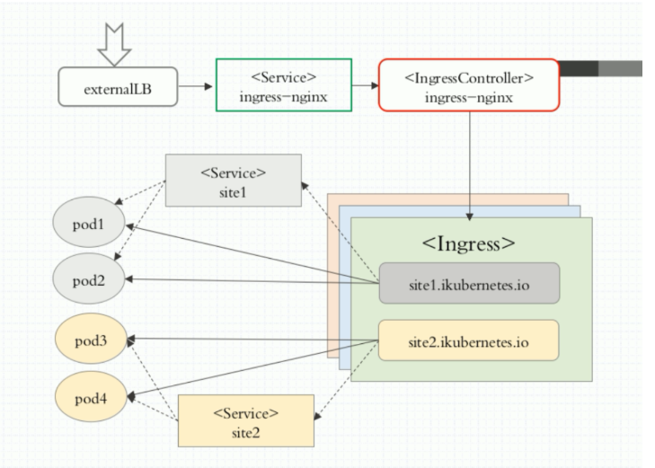

## 目的

本文对k8s中Ingress反向代理进行详细剖析，详细介绍了原理，并通过实际例子来详细说明。

<!--more-->

## 简介

Kubernetes 暴露服务的有三种方式：分别为 LoadBlancer Service、NodePort Service、Ingress。

官网对 Ingress 的定义为管理对外服务到集群内服务之间规则的集合。通俗点讲就是它定义规则来允许进入集群的请求被转发到集群中对应服务上，从来实现服务暴露。 Ingress 能把集群内 Service 配置成外网能够访问的 URL，流量负载均衡，终止SSL，提供基于域名访问的虚拟主机等等。

### LoadBlancer Service

LoadBlancer Service 是 Kubernetes 结合云平台的组件，如国外 GCE、AWS、国内阿里云等等，使用它向使用的底层云平台申请创建负载均衡器来实现，有局限性，对于使用云平台的集群比较方便，但有局限，费用高。

### NodePort Service

NodePort Service 是通过在节点上暴露端口，然后通过将端口映射到具体某个服务上来实现服务暴露，比较直观方便，但是对于集群来说，随着 Service 的不断增加，需要的端口越来越多，很容易出现端口冲突，而且不容易管理。当然对于小规模的集群服务，还是比较不错的。但是还是有安全风险，因为看过前面k8s教程，并动手操作搭建的同学都知道，在搭建前会把各个节点的防火墙等等都关闭。那么如果用这种方式又打开很多端口，那么安全会面临很大挑战。

***总结：以上两种服务从各方面看似都不太理想，所以通过情况下，我们会通过Ingress对象来实现安全，方便统一管理。***

## Ingress概述

在k8s集群中，我们知道service和pod的ip为内网ip，仅能在集群内部才可以访问。如果外部应用想要直接访问集群内的服务，就需要把外部请求通过负载均衡转发到service上，然后再由kube-proxy组件将其转发给相关的pod。

而Ingress的作用就是为进入集群的请求提供路由规则集合和转发。通俗点就是提供外部访问集群的入口，将外部的请求转发到集群内部service上。

## Ingress组成

Ingress 使用开源的反向代理负载均衡器来实现对外暴露服务目的，比如用Nginx、Apache、Haproxy等。用的最多的是使用nginx来做的。

Nginx Ingress 一般有三个组件组成：

- **ingress**    是kubernetes的一个资源对象，用于编写定义规则。将nginx的配置抽象成一个Ingress对象，当用户每添加一个新的服务，只需要编写一个新的ingress的yaml文件即可。
- **反向代理负载均衡器**  通常以Service的Port方式运行，接收并按照ingress定义的规则进行转发，通常为nginx，haproxy，traefik等，本文使用nginx。
- **ingress-controller**    监听apiserver，获取服务新增，删除等变化，并结合ingress规则动态更新到反向代理负载均衡器上，并重载配置使其生效。
  以上三者有机的协调配合起来，就可以完成 Kubernetes 集群服务的暴漏。

**组件说明**

externalLB :  外部的4层负载均衡器
<Service> ingress-nginx : nodePort 类型的 service 为 <IngressController> ingress-nginx 的 pod 接入外部流量
<IngressController> ingress-nginx : ingress-nginx pod, 负责创建负载均衡
<Ingress> : Ingress 根据后端 Service 实时识别分类及 IP 把结果生成配置文件注入到 ingress-nginx pod 中
<Service> site1 : Service 对后端的pod 进行分类(只起分类作用)

## Ingress工作原理

- ingress controller通过和kubernetes api交互，动态的去感知集群中ingress规则变化。
- 然后读取它，按照自定义的规则，规则就是写明了那个域名对应哪个service，生成一段nginx配置。
- 在写到nginx-ingress-controller的pod里，这个Ingress controller的pod里运行着一个Nginx服务，控制器会把生成的nginx配置写入/etc/nginx.conf文件中。
- 然后reload一下使配置生效，以此达到分配和动态更新问题。

## **Ingress解决痛点**

**动态配置服务**
如果按照传统方式，当新增加一个服务时，我们可能需要在流量入口加一个反向代理指向我们新的服务，而使用ingress，只需要配置好ingress，当服务启动时，会自动注册到ingress当中，不需要额外的操作。

**减少不必要的Port暴露（安全，端口容易管理）**
我们知道部署k8s时，是需要关闭防火墙的，主要原因是k8s的很多服务会以nodeport方式映射出去，这样对于宿主机来说是非常的不安全的，而ingress可以避免这个问题，只需要将ingress自身服务映射出去，就可代理后端所有的服务，则后端服务不需要映射出去。

## 部署Ingress-nginx

未完待续

