## 目的

本文在k8s集群中把各种工具（jdk，git, maven等）集成到jenkins，用master/slave模式实现CI/CD。


## 环境

k8s集群    [参考教程](https://wandouduoduo.github.io/articles/87f87b20.html)

Hubor镜像服务  [参考教程](https://wandouduoduo.github.io/articles/b9ccc582.html)

nfs/Ceph持久存储   [参考教程](https://wandouduoduo.github.io/articles/3acab424.html)

[K8s中Jenkins实践教程](https://wandouduoduo.github.io/articles/12aa61a7.html)

<!--more-->

## M/S模式实现

#### 创建Master镜像文件

```bash
#编写Dockerfile：

cat>/home/jenkins-dockerfile/Dockerfile <<EOF
FROM jenkinsci/jenkins
USER root
RUN apt-get update && apt-get install -y libltdl7.*
RUN apt-get install vim -y
RUN apt-get install maven -y
RUN apt-get install git -y
ARG dockerGid=999
RUN echo "docker:x:${dockerGid}:jenkins" >> /etc/group
RUN echo "jenkins ALL=NOPASSWD: ALL" >> /etc/sudoers
RUN mkdir -p /opt/maven/repository
RUN mkdir -p /ceph/maven/repository
EOF

#该Dockerfile所做的工作为：
#安装Maven，git,vim
#配置Maven仓库位置，以便启动时挂载宿主机仓库为容器中Maven仓库
#设置启动用户为root把jenkins加入docker组，否则无法使用宿主机的docker
#安装libltdl7.* 库，否则无法使用宿主机的docker
```

#### 构建Master镜像

```bash
docker build -t jenkinsci/jenkins:v1 /home/jenkins-dockerfile/
```


#### 启动YAML配置文件

```bash
#jenkins命令空间创建

cat >namespace-jenkins.yaml<<EOF
apiVersion: v1
kind: Namespace
metadata:
   name: jenkins
   labels:
     name: jenkins
EOF

#Jenkins 权限配置
#此处直接将jenkins-admin集成了cluster-admin权限，可根据自己具体需要进行权限的设置

cat>jenkins-account.yaml<<EOF
apiVersion: v1
kind: ServiceAccount
metadata:
  labels:
    k8s-app: jenkins
  name: jenkins-admin
  namespace: jenkins

---
kind: ClusterRoleBinding
apiVersion: rbac.authorization.k8s.io/v1beta1
metadata:
  name: jenkins-admin
  labels:
    k8s-app: jenkins
subjects:
  - kind: ServiceAccount
    name: jenkins-admin
    namespace: jenkins
roleRef:
  kind: ClusterRole
  name: cluster-admin
  apiGroup: rbac.authorization.k8s.io
EOF


#Jenkins Deployment配置
#此处配置简单明了，需要说明的地方是挂在卷，此处挂载了四个目录，下面分别做出挂载原因：

#/var/jenkins_home（容器） –> /ceph/jenkins_home（宿主机） 
#我们需要将容器中的Jenkins源目录挂载导本地宿主机，因为该目录下保存了Jenkins产生的所有配置、我们的自定义配置、任务配置及详情等等信息，所以需要持久化导宿主机，以便重新启动Jenkins容器的时候能够找到相应数据，防止数据丢失。此处我们使用的ceph，保证整个kubernetes集群所有机器能够共享同一个目录。

#/opt/maven/repository（容器） –> /ceph/maven/repository（宿主机） 
#这一对挂载目录是Maven仓库的挂载目录，不管是Jenkins master容器或者是Jenkins slave目录都需要挂载该目录，以便容器中maven能够在下载编译代码时能够从该仓库中找到相应Jar包，同时也保证了数据的持久化。

#/usr/bin/docker（容器） –> /usr/bin/docker（宿主机）
#/var/run/docker.sock（容器） –> /var/run/docker.sock（宿主机） 
#这两对挂载目录作用是能够在容器中操作宿主机docker，具体的用途是在slave容器中编辑maven代码并生成jar之后，需要生成该代码服务的docker镜像,并上传至本地私有仓库。因此需要操作宿主机docker以便完成这一系列操作

cat>jenkins-deployment.yaml<<EOF
apiVersion: apps/v1beta2
kind: Deployment
metadata:
  name: jenkins
  namespace: jenkins
  labels:
    k8s-app: jenkins
spec:
  replicas: 1
  selector:
    matchLabels:
      k8s-app: jenkins
  template:
    metadata:
      labels:
        k8s-app: jenkins
    spec:
      containers:
      - name: jenkins
        image: jenkinsci/jenkins:v1
        imagePullPolicy: IfNotPresent
        volumeMounts:
        - name: jenkins-home
          mountPath: /var/jenkins_home
        - name: maven-repository
          mountPath: /opt/maven/repository
        - name: docker
          mountPath: /usr/bin/docker
        - name: docker-sock
          mountPath: /var/run/docker.sock
        ports:
        - containerPort: 8080
        - containerPort: 50000
      volumes:
        - name: jenkins-home
          hostPath:
            path: /ceph/jenkins_home
        - name: maven-repository
          hostPath:
            path: /ceph/maven/repository
        - name: docker
          hostPath:
            path: /usr/bin/docker
        - name: docker-sock
          hostPath:
            path: /var/run/docker.sock
      serviceAccountName: jenkins-admin
EOF


#Jenkins Service配置
#该Service配置作用是能够让用户访问到Jenkins。此处开放并配置了8080、32000端口，这两个端口在Deployment 中也应该开放。此处配置的宿主机开放端口分别为：31888、32000

cat>jenkins-service.yaml<<EOF
kind: Service
apiVersion: v1
metadata:
  labels:
    k8s-app: jenkins
  name: jenkins
  namespace: jenkins
  annotations:
    prometheus.io/scrape: 'true'
spec:
  ports:
    - name: jenkins
      port: 8080
      nodePort: 31888
      targetPort: 8080
    - name: jenkins-agent
      port: 50000
      nodePort: 50000
      targetPort: 50000
  type: NodePort
  selector:
    k8s-app: jenkins
EOF
```


#### 启动Jenkins Master容器

```bash
kubectl create -f namespace-jenkins.yaml
kubectl apply -f jenkins-account.yaml
kubectl apply -f jenkins-deployment.yaml
kubectl apply -f jenkins-service.yaml
```


#### 创建Jenkins slave镜像文件

```bash
#需要使用官方镜像cnych-jenkins，其他的镜像里面都没有kubectl工具，都试过。
#编写Dockerfile： 

cat>/home/jenkins-dockerfile/Dockerfile <<EOF
FROM cnych/jenkins:jnlp
USER root
RUN apt-get update && apt-get install -y libltdl7.*
RUN apt-get install maven -y
RUN apt-get install vim -y
RUN apt-get install git -y
ARG dockerGid=999
RUN echo "docker:x:${dockerGid}:jenkins" >> /etc/group
RUN echo "jenkins ALL=NOPASSWD: ALL" >> /etc/sudoers
RUN mkdir -p /opt/maven/repository
RUN mkdir -p /ceph/maven/repository
EOF

#该Dockerfile所做的工作为：
#安装Maven,git,vim
#配置Maven仓库位置，以便启动时挂载宿主机仓库为容器中Maven仓库
#设置启动用户为root
```

#### 构建Slave镜像

```bash
docker build -t cnych/jenkins:v1 /home/jenkins-dockerfile/
```

#### 查看镜像列表

```
docker images
```


#### 浏览器访问

```bash
#访问jenkins
http://192.168.0.92:31888

#查看密码
[root@test2 ~]# docker ps -l
CONTAINER ID        IMAGE               COMMAND                  CREATED             STATUS              PORTS               NAMES
6f8a62f8a0f7        2114cb298e17        "/sbin/tini -- /us..."   About an hour ago   Up About an hour                        k8s_jenkins_jenkins-7b46757695-4hx6f_jenkins_e8cb1035-3fe6-11e9-a258-000c2980fc47_0

[root@test2 ~]# docker exec 6f8a62f8a0f7 cat /var/jenkins_home/secrets/initialAdminPassword
471234cd0eb44ec3bfc4015fbacd599b
```

#### 页面配置master

###### 升级和重置密码

```bash
#然后会要求安装一些插件，这里选择默认安装即可，否则下一步打开是空白页
#设置登录用户名密码：
admin/jenkins@123

#这时候会跳转到首页， 此时Jenkins就可以真正使用了： 
#对jenkins进行升级
#重启jenkins（有点慢，等5分钟）
#刷新网页重新登录
admin/471234cd0eb44ec3bfc4015fbacd599b
#查看更新后的版本

#重置admin密码方法：
#进入首页-》系统管理-》全局安全配置
#把“启用安全”勾上和把Jenkins专有用户数据库勾上、允许用户注册勾上-》保存
#点击右上角的admin-》设置-》修改里面的密码为（jenkins@123）-》保存-》重新登录-》输入账号密码
```

###### 安装插件

```bash
#Kubernetes Cli Plugin：该插件可直接在Jenkins中使用kubernetes命令行进行操作。
#Kubernetes plugin： 使用kubernetes则需要安装该插件
#Kubernetes Continuous Deploy Plugin：kubernetes部署deploymrnt.yaml 时候需要使用

#安装步骤：
#进入首页-》系统管理-》插件管理-》可选插件-》输入kubernetes-》选中所有带kubernetes的插件进行安装-》安装完返回首页

#查看所有带kubernetes的插件是否安装上
#进入首页-》系统管理-》插件管理-》已安装-》输入kubernetes查看
#也可登录该网站：https://plugins.jenkins.io/，查找需要的插件
```


###### 增加一个kubernetes云

```bash
#系统管理->系统设置，往下拉可看到云，点击新增一个云来新增一个kubernetes云
```

[配置jenkins连接kubernetes教程](https://wandouduoduo.github.io/articles/3cfe518.html)


###### 配置K8s Pod Template

其实就是配置Jenkins的jnlp-slave

在该kubernetes云下，新增Kubernetes Pod Template，配置一个模板容器配置，如下图所示：

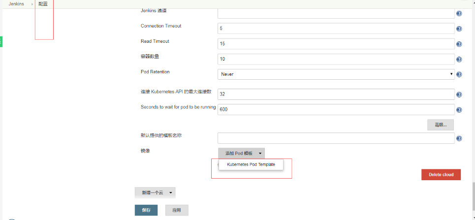

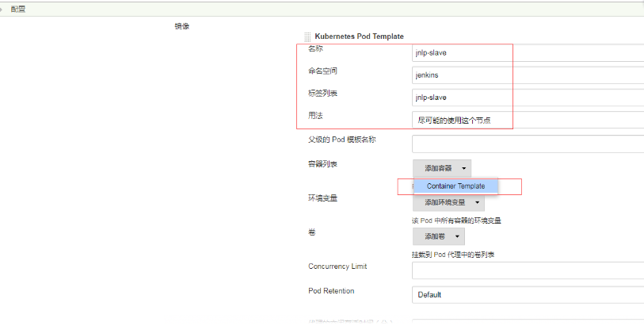

配置镜像，下面里面的镜像一定要写对，否则写成别的镜像，到最后编译时候就一直报错没有mvn

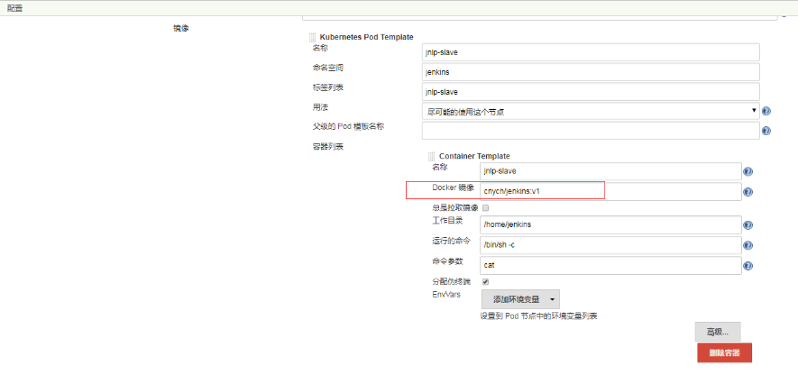


配置卷：就是deployment.yaml 里面的挂载路径

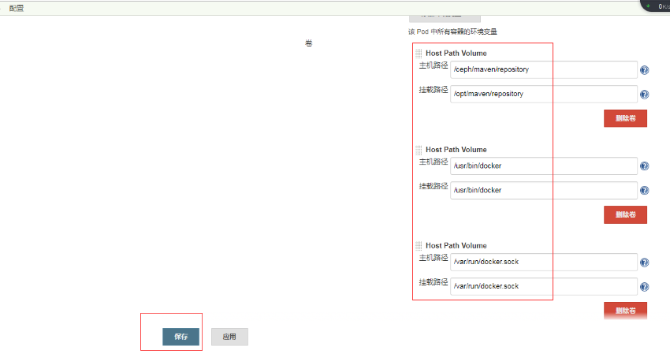

###### 全局配置

点击 系统管理->全局工具配置，此处可配置配置一些常用的工具配置，比如java、ant、maven、docker

[参照教程](https://wandouduoduo.github.io/articles/6f80621c.html)


#### 创建流水线任务项目

###### 新建任务项目

点击新建Item --> 进入任务配置界面-->选择Pipeline（中文版为：流水线）-->确定。则可编写Pipeline，进行任务配置

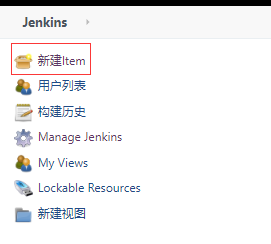

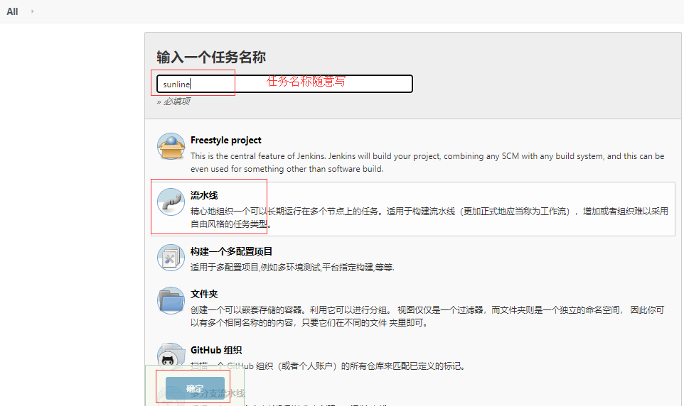

```bash
#Pipeline任务采用流式的处理方法，步骤清晰，非常适合进行任务配置。
#下面pipline里面的简单任务：查看slave镜像里面是否有java的家目录、查看maven的版本等操作，

def label = "jnlp-slave"
podTemplate(label: label, cloud: 'kubernetes',containers: [
    containerTemplate(name: 'jnlp-slave', image: 'cnych/jenkins:v1')
  ],
  volumes: [hostPathVolume(mounntPath:'/opt/maven/repository',hostPath:'/ceph/maven/repository'),
            hostPathVolume(mounntPath:'/usr/bin/docker',hostPath:'/usr/bin/docker'),
            hostPathVolume(mounntPath:'/var/run/docker.sock',hostPath:'/var/run/docker.sock')]) {
    node(label) {
        stage('Get a Maven project') {
            container(label) {
                stage('wait for exec check'){
                    sh 'sleep 1'
                    sh 'echo $JAVA_HOME'
                    sh 'mvn -v'
                }
 
                stage('get maven env') {
                    sh 'cat /etc/resolv.conf'
                    sh 'cat /etc/issue'
                    sh 'uname -a'
                    sh 'env'
                }
              
            }
        }
    }
}
```

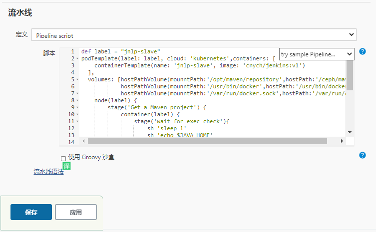

###### 构建

```bash
#查看构建前的pod个数
kubectl get pod -n [namespace]
```

页面点击立即构建

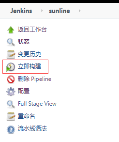

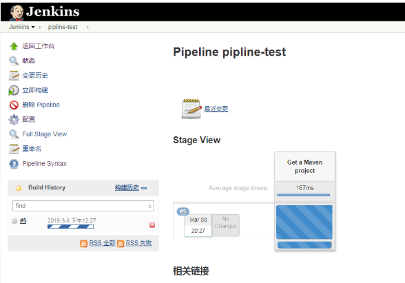

```bash
#查看构建时的pod数量
kubectl get pod -n [NAMEspace]  

#再次查看pod个数：发现消失从上边的pod个数变化中，我们可以清晰的看到 Jenkins Slave 自动创建到注销删除的过程，整个过程是自动完成的，不需要人工干预。
```


## 使用宿主机的kubectl命令

#### 镜像选择

slave镜像需要使用cnych/jenkins:jnlp，这个官方镜像里面有kubectl工具，其他的没有，都试过，上面就是用的这个镜像，所以直接下一步

#### 挂载kubectl工具

/root/.kube 目录，我们将这个目录挂载到容器的 /home/jenkins/.kube 目录下面这是为了让我们能够在 Pod 的容器中能够使用 kubectl 工具来访问我们的 Kubernetes 集群，方便我们后面在 Slave Pod 部署 Kubernetes 应用。添加一个挂在路径，如下图所示：

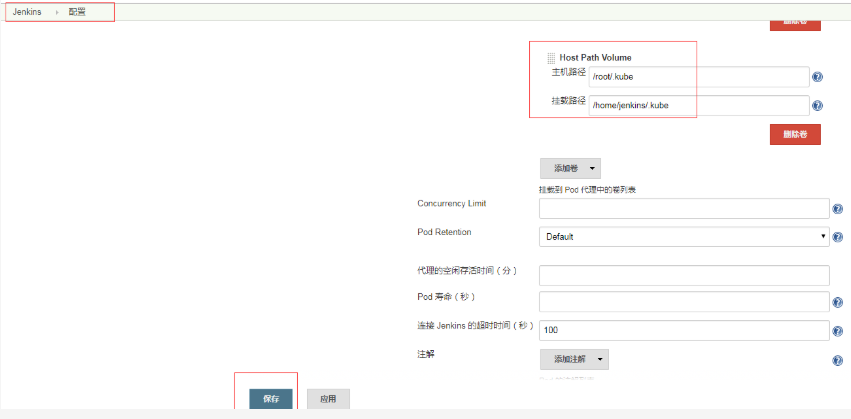

#### pipline脚本

先试试是否能使用宿主机的kubectl命令，只查看一个pod情况：

```bash
def label = "jnlp-slave"
podTemplate(label: label, cloud: 'kubernetes',containers: [
    containerTemplate(name: 'jnlp-slave', image: 'cnych/jenkins:v1')
  ],
  volumes: [hostPathVolume(mounntPath:'/opt/maven/repository',hostPath:'/ceph/maven/repository'),
            hostPathVolume(mounntPath:'/usr/bin/docker',hostPath:'/usr/bin/docker'),
            hostPathVolume(mounntPath:'/var/run/docker.sock',hostPath:'/var/run/docker.sock'),
            hostPathVolume(mounntPath:' /home/jenkins/.kube',hostPath:'/root/.kube')]) {
    node(label) {
        stage('Get a Maven project') {
            container(label) {
                stage('wait for exec check'){
                    sh 'kubectl get pod -n jenkins'
                }
 
            }
        }
    }
}
```


#### 构建，查看控制台输出

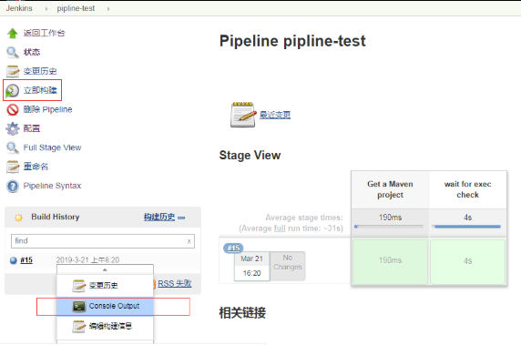


#### 使用jenkins-salve创建nignx项目


###### pipline脚本

```bash
def label = "jnlp-slave"
podTemplate(label: label, cloud: 'kubernetes',containers: [
    containerTemplate(name: 'jnlp-slave', image: 'cnych/jenkins:v1')
  ],
  volumes: [hostPathVolume(mounntPath:'/opt/maven/repository',hostPath:'/ceph/maven/repository'),
            hostPathVolume(mounntPath:'/usr/bin/docker',hostPath:'/usr/bin/docker'),
            hostPathVolume(mounntPath:'/usr/bin/docker',hostPath:'/usr/bin/docker'),
            hostPathVolume(mounntPath:' /home/jenkins/.kube',hostPath:'/root/.kube')]) {
    node(label) {
        stage('create a pod') {
            container(label) {
                stage('cat the pod'){
                    sh 'kubectl get pod -n jenkins'
                }
 
        stage('create the deploy-nginx.yaml'){
echo 'create the deploy-nginx.yaml'
sh '''
cat >deploy-nginx.yaml<<EOF
apiVersion: extensions/v1beta1
kind: Deployment
metadata:
  name: http-test-dm2
spec:
  replicas: 1
  template:
    metadata:
      labels:
        name: http-test-dm2
    spec:
      containers:
      - name: http-test-con
        image: nginx
        imagePullPolicy: Never      
        ports:
        - containerPort: 80
---
apiVersion: v1
kind: Service
metadata:
  name: http-nginx-ser
spec:
  type: NodePort
  ports: 
  - port: 80
    nodePort: 31000
    targetPort: 80
  selector:
    name: http-test-dm2
---
apiVersion: extensions/v1beta1
kind: Ingress
metadata:
  name: nginx
spec:
  rules:
  - host: www.nginx2.com      
    http:
      paths:
      - path: /
        backend:
          serviceName: http-nginx-ser
          servicePort: 80
EOF

'''
            }
                stage('deploy to k8s'){
                    sh 'kubectl create -f deploy-nginx.yaml'
                    
                }
              
            }
        }
    }
}
```

###### 开始构建

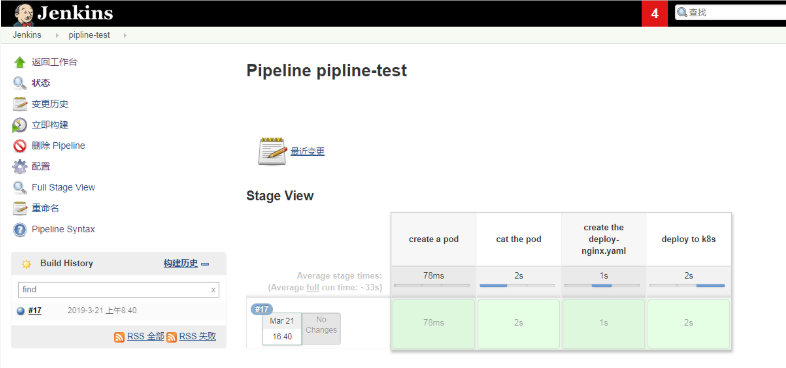

###### 查看命名空间下的pod验证

```bash
#多次执行下面命令，对比输出结果
kubectl get pod -n jenkins
```


###### 测试访问nginx

浏览器访问http://x.x.x.x:31000

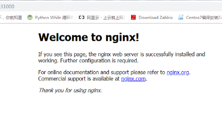

 


###### 编写pipline脚本


```bash
#注意下面pipline脚本里面的 maven build步骤，里面的JAVA_HOME和mvn工具 都是jenkins-slave里面的，而不是jenkins-master里面的工具，

#如何查看jenkins-slave里面JAVA_HOME位置：只有通过构建的时候，在pipline里面写shell命令进行查看，因为制作jenkins-slave镜像的基础

#镜像是从官方镜像拉取的，而这个官方jenkins-slave镜像是不能独立启动的，试过，用docker无法启动，只能当slave使用。但是为什么还要用这个镜像，就是因为这个基础镜像里面包含kubectl工具， 自己之前尝试往jenkins-master镜像里面添加kubectl工具，但是失败，

#注意：下面piplene里面的第三个stage步骤里面的JAVA_HOME路径是第一个stage步骤mvn -v 得到的结果有java路径，要填写这个，不要填写echo $JAVA_HOME得到的结果

#先编译构建一下，然后得到mvn -v 结果后，及时暂停，然后把java路径填写到第三个stage步骤里面，从新编译打包

def label = "jnlp-slave"
podTemplate(label: label, cloud: 'kubernetes',containers: [
    containerTemplate(name: 'jnlp-slave', image: 'cnych/jenkins:v1')
  ],
  volumes: [hostPathVolume(mounntPath:'/opt/maven/repository',hostPath:'/ceph/maven/repository'),
            hostPathVolume(mounntPath:'/usr/bin/docker',hostPath:'/usr/bin/docker'),
            hostPathVolume(mounntPath:'/usr/bin/docker',hostPath:'/usr/bin/docker'),
            hostPathVolume(mounntPath:' /home/jenkins/.kube',hostPath:'/root/.kube')]) {
    node(label) {
        stage('create a pod') {
            container(label) {
                stage('cat the pod'){
                    sh 'kubectl get pod -n jenkins'
                    sh 'echo $JAVA_HOME'
                    sh 'mvn -v'
                }
                stage('git checkout'){
            
                echo 'git clone'
                checkout([$class: 'GitSCM', branches: [[name: '*/master']], doGenerateSubmoduleConfigurations: false, extensions: [], submoduleCfg: [], userRemoteConfigs: [[credentialsId: 'c2ca4523-96d0-4fdc-a427-bfefc36a3aa5', url: 'http://192.168.0.96:8081/root/hello.git']]])
           
                }


                stage('maven build'){

                echo 'maven build'
                    sh '''
                export JAVA_HOME=/usr/local/newhope/java1.8
                /usr/bin/mvn clean package -Dmaven.test.skip=true
                '''

                }

        stage('docker build and push images'){

echo 'docker build and push images'
sh '''
REPOSITORY=192.168.0.98:5000/library/solo/solo:${Tag}
cat >Dockerfile<<EOF
FROM 192.168.0.98:5000/library/tomcat-85:latest
RUN rm -rf /usr/local/tomcat/webapps/ROOT/
COPY target/*.war /usr/local/tomcat/webapps/ROOT.war
WORKDIR /usr/local/tomcat
EXPOSE 8080
CMD ["./bin/catalina.sh", "run"]
EOF
docker build -t $REPOSITORY .
docker login -u admin -p Harbor12345 192.168.0.98:5000
docker push $REPOSITORY
'''
            }

 
        stage('create the deploy-solo.yaml'){
echo 'create the deploy-solo.yaml'
sh '''
REPOSITORY=192.168.0.98:5000/library/solo/solo:${Tag}
cat >deploy-solo.yaml<<EOF
apiVersion: extensions/v1beta1
kind: Deployment
metadata:
  name: http-solo-dm2
spec:
  replicas: 1
  template:
    metadata:
      labels:
        name: http-solo-dm2
    spec:
      containers:
      - name: http-solo-con
        image: $REPOSITORY
        imagePullPolicy: Never      
        ports:
        - containerPort: 80
---
apiVersion: v1
kind: Service
metadata:
  name: http-solo-ser
spec:
  type: NodePort
  ports: 
  - port: 8080
    nodePort: 33580
    targetPort: 8080
  selector:
    name: http-solo-dm2
---
apiVersion: extensions/v1beta1
kind: Ingress
metadata:
  name: solo
spec:
  rules:
  - host: www.solo.com      
    http:
      paths:
      - path: /
        backend:
          serviceName: http-solo-ser
          servicePort: 8080
EOF

'''
            }
                stage('deploy to k8s'){
                    sh 'kubectl create -f deploy-solo.yaml'
                    
                }
              
            }
        }
    }
}

#上面pipline脚本做的事情如下：
#查看JAVA_HOME
#查看maven版本
#拉取代码：git checkout
#编译打包：maven build
#构建并推送镜像：docker build and push images
#创建yaml文件：create the deploy-solo.yaml
#部署到k8s集群里面：deploy to k8s
```


###### 查看harbor仓库

http://192.168.0.98:5000


## 补充

#### 生成自定义Jenkins master镜像

Dockerfile：

```dockerfile
FROM 192.168.1.184:5000/jenkins/jenkins:2.89.3
ENV MAVEN_VERSION 3.0.5
ENV JAVA_HOME /usr/java/jdk1.8.0_121
ENV MAVEN_HOME /opt/maven/apache-maven-${MAVEN_VERSION}
ENV CLASSPATH=.:$JAVA_HOME/lib/dt.jar:$JAVA_HOME/lib/tools.jar

# build java
COPY ./jdk1.8.0_121 ${JAVA_HOME}
COPY ./libltdl.so.7 /usr/lib/libltdl.so.7

# build maven
COPY apache-maven-${MAVEN_VERSION}-bin.tar.gz /tmp/maven/apache-maven-${MAVEN_VERSION}-bin.tar.gz
COPY settings.xml /tmp/maven/settings.xml
USER root:root
RUN mkdir -p /opt/maven/repository \
&& cd /opt/maven \
&& tar -zxvf /tmp/maven/apache-maven-${MAVEN_VERSION}-bin.tar.gz \
&& cp /tmp/maven/settings.xml ${MAVEN_HOME}/conf/settings.xml \
&& rm -rf /tmp/maven

ENV PATH ${JAVA_HOME}/bin:${MAVEN_HOME}/bin:${PATH}
```

该Dockerfile所做的工作为：
1. 重新安装Java环境并配置环境变量；
2. 安装Maven并配置环境变量；
3. 配置Maven仓库位置，以便启动时挂载宿主机仓库为容器中Maven仓库;
4. 设置启动用户为root。

#### 生成自定义Jenkins slave镜像

Dockerfile：

```dockerfile
FROM jenkinsci/jnlp-slave:latest
ENV MAVEN_VERSION 3.0.5
ENV JAVA_HOME /usr/java/jdk1.8.0_121
ENV MAVEN_HOME /opt/maven/apache-maven-${MAVEN_VERSION}
ENV CLASSPATH .:$JAVA_HOME/lib/dt.jar:$JAVA_HOME/lib/tools.jar

# build java
COPY ./jdk1.8.0_121 ${JAVA_HOME}
COPY ./libltdl.so.7 /usr/lib/libltdl.so.7

# build maven
COPY apache-maven-${MAVEN_VERSION}-bin.tar.gz /tmp/maven/apache-maven-${MAVEN_VERSION}-bin.tar.gz
COPY settings.xml /tmp/maven/settings.xml
USER root:root
RUN mkdir -p /opt/maven/repository \
&& cd /opt/maven \
&& tar -zxvf /tmp/maven/apache-maven-${MAVEN_VERSION}-bin.tar.gz \
&& cp /tmp/maven/settings.xml ${MAVEN_HOME}/conf/settings.xml \
&& rm -rf /tmp/maven \
&& apt-get -yq update \
&& apt-get -yq --no-install-recommends --no-install-suggests install sshpass \
&& apt-get clean -y

ENV PATH ${MAVEN_HOME}/bin:${PATH}
```

该Dockerfile操作与Jenkins master的Dockerfile基本一致。不过该镜像中缺少libltdl.so.7文件，需要从宿主机中拷贝进去，该文件在slave节点容器中使用docker时会用到，因此十分重要