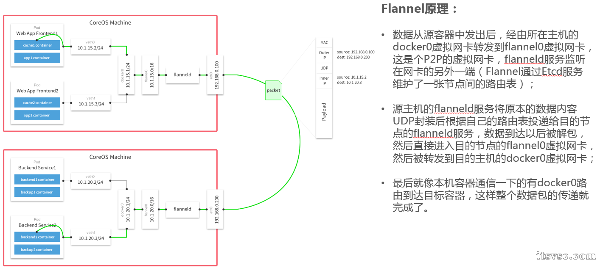

Kubernetes跨主机容器之间的通信组件，目前主流的是flannel和calico，本文对两个组件进行简单介绍和对比。

<!--more-->

## Flannel 架构

### **原理**

由CoreOS开发的项目Flannel，可能是最直接和最受欢迎的CNI插件。它是容器编排系统中最成熟的网络结构示例之一，旨在实现更好的容器间和主机间网络。随着CNI概念的兴起，Flannel CNI插件算是早期的入门。

与其他方案相比，Flannel相对容易安装和配置。它被打包为单个二进制文件FlannelD，许多常见的Kubernetes集群部署工具和许多Kubernetes发行版都可以默认安装Flannel。Flannel可以使用Kubernetes集群的现有etcd集群来使用API存储其状态信息，因此不需要专用的数据存储。

Flannel配置第3层IPv4 Overlay网络。它会创建一个大型内部网络，跨越集群中每个节点。在此Overlay网络中，每个节点都有一个子网，用于在内部分配IP地址。在配置Pod时，每个节点上的Docker桥接口都会为每个新容器分配一个地址。同一主机中的Pod可以使用Docker桥接进行通信，而不同主机上的pod会使用flanneld将其流量封装在UDP数据包中，以便路由到适当的目标。

Flannel有几种不同类型的后端可用于封装和路由。默认和推荐的方法是使用VXLAN，因为VXLAN性能更良好并且需要的手动干预更少。

## **Calico 架构**

### 组件

calico包括如下重要组件：Felix，etcd，BGP Client，BGP Route Reflector。下面分别说明一下这些组件。

Felix：主要负责路由配置以及ACLS规则的配置以及下发，它存在在每个node节点上。

etcd：分布式键值存储，主要负责网络元数据一致性，确保Calico网络状态的准确性，可以与kubernetes共用；

BGPClient(BIRD), 主要负责把 Felix写入 kernel的路由信息分发到当前 Calico网络，确保 workload间的通信的有效性；

BGPRoute Reflector(BIRD), 大规模部署时使用，摒弃所有节点互联的mesh模式，通过一个或者多个 BGPRoute Reflector 来完成集中式的路由分发；

### 架构

### 原理

如下图所示，描述了从源容器经过源宿主机，经过数据中心的路由，然后到达目的宿主机最后分配到目的容器的过程。

### 跨主机通信

## 总结

从上述的原理可以看出，flannel在进行路由转发的基础上进行了封包解包的操作，这样浪费了CPU的计算资源。下图是从网上找到的各个开源网络组件的性能对比。可以看出无论是带宽还是网络延迟，calico和主机的性能是差不多的。
  