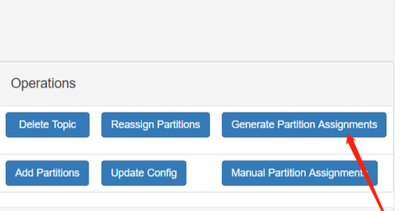
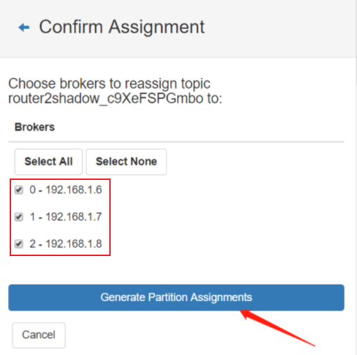
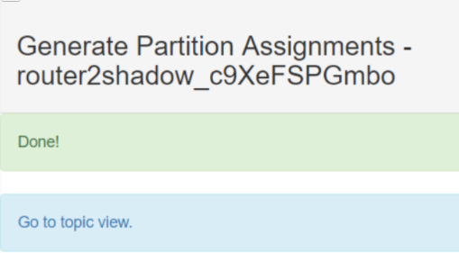
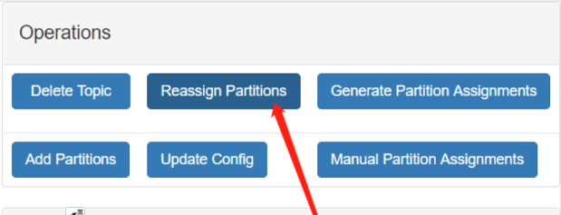
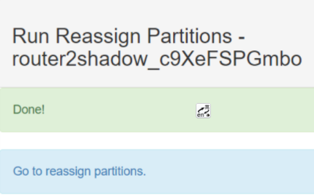
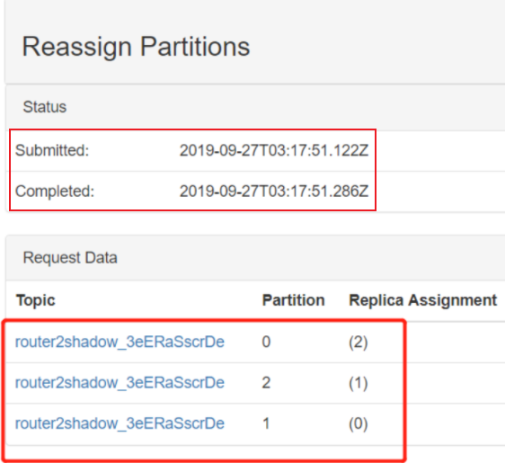

本文讨论Kafka的扩缩容以及故障后如何“补齐”分区。实质上先扩容再缩容也是迁移的操作。


<!--more-->

## 环境

Kafka 版本2.6。


## 扩容

扩容也就是新增节点，扩容后老的数据不会自动迁移，只有新创建的topic才可能会分配到新增的节点上面。如果我们不需要迁移旧数据，那直接把新的节点启动起来就行了，不需要做额外的操作。但有的时候，新增节点后，我们会将一些老数据迁移到新的节点上，以达到负载均衡的目的，这个时候就需要手动操作了。Kafka提供了一个脚本（在bin目录下）：**kafka-reassign-partitions.sh**，通过这个脚本可以重新分配分区的分布。脚本的使用比较简单，提供一个JSON格式的分配方案，然后传给脚本，脚本根据我们的分配方案重新进行平衡。

举个例子，假如现在集群有181、182两个broker，上面有4个topic：test-1，test-2，test-3，test-4，这些topic都有4个分区，2个副本，如下：

```shell
# 两个broker
[zk: localhost:2181(CONNECTED) 0] ls /kafka_26/brokers/ids
[181, 182]

# 4个topic
➜ bin/kafka-topics.sh --list --zookeeper localhost:2181/kafka_26
__consumer_offsets
test-1
test-1
test-3
test-4
# test-1
➜  bin/kafka-topics.sh --describe --topic test-1  --zookeeper localhost:2181/kafka_26
Topic: test-1   PartitionCount: 4       ReplicationFactor: 2    Configs: 
        Topic: test-1   Partition: 0    Leader: 181     Replicas: 181,182       Isr: 181,182
        Topic: test-1   Partition: 1    Leader: 182     Replicas: 182,181       Isr: 182,181
        Topic: test-1   Partition: 2    Leader: 181     Replicas: 181,182       Isr: 181,182
        Topic: test-1   Partition: 3    Leader: 182     Replicas: 182,181       Isr: 182,181
# test-2
➜  bin/kafka-topics.sh --describe --topic test-2  --zookeeper localhost:2181/kafka_26
Topic: test-2   PartitionCount: 4       ReplicationFactor: 2    Configs: 
        Topic: test-2   Partition: 0    Leader: 181     Replicas: 181,182       Isr: 181,182
        Topic: test-2   Partition: 1    Leader: 182     Replicas: 182,181       Isr: 182,181
        Topic: test-2   Partition: 2    Leader: 181     Replicas: 181,182       Isr: 181,182
        Topic: test-2   Partition: 3    Leader: 182     Replicas: 182,181       Isr: 182,181
# test-3
➜  bin/kafka-topics.sh --describe --topic test-3  --zookeeper localhost:2181/kafka_26
Topic: test-3   PartitionCount: 4       ReplicationFactor: 2    Configs: 
        Topic: test-3   Partition: 0    Leader: 181     Replicas: 181,182       Isr: 181,182
        Topic: test-3   Partition: 1    Leader: 182     Replicas: 182,181       Isr: 182,181
        Topic: test-3   Partition: 2    Leader: 181     Replicas: 181,182       Isr: 181,182
        Topic: test-3   Partition: 3    Leader: 182     Replicas: 182,181       Isr: 182,181
# test-4
➜ bin/kafka-topics.sh --describe --topic test-4  --zookeeper localhost:2181/kafka_26
Topic: test-4   PartitionCount: 4       ReplicationFactor: 2    Configs: 
        Topic: test-4   Partition: 0    Leader: 182     Replicas: 182,181       Isr: 182,181
        Topic: test-4   Partition: 1    Leader: 181     Replicas: 181,182       Isr: 181,182
        Topic: test-4   Partition: 2    Leader: 182     Replicas: 182,181       Isr: 182,181
        Topic: test-4   Partition: 3    Leader: 181     Replicas: 181,182       Isr: 181,182
```

现在扩容了，新增了两个节点：183和184。扩容后，我们想要把test-3，test-4迁移到183，184上面去。

首先我们可以准备如下JSON格式的文件（假设文件名为`topics-to-move.json`）：

```json
{
    "topics": [
        {
            "topic": "test-3"
        },
        {
            "topic": "test-4"
        }
    ],
    "version": 1
}
```

里面写明想要重新分配的topic。然后执行如下命令：

```shell
➜ bin/kafka-reassign-partitions.sh --bootstrap-server localhost:9092 --topics-to-move-json-file topics-to-move.json --broker-list "183,184" --generate
# 当前分区的分布情况
Current partition replica assignment
{"version":1,"partitions":[{"topic":"test-3","partition":0,"replicas":[181,182],"log_dirs":["any","any"]},{"topic":"test-3","partition":1,"replicas":[182,181],"log_dirs":["any","any"]},{"topic":"test-3","partition":2,"replicas":[181,182],"log_dirs":["any","any"]},{"topic":"test-3","partition":3,"replicas":[182,181],"log_dirs":["any","any"]},{"topic":"test-4","partition":0,"replicas":[182,181],"log_dirs":["any","any"]},{"topic":"test-4","partition":1,"replicas":[181,182],"log_dirs":["any","any"]},{"topic":"test-4","partition":2,"replicas":[182,181],"log_dirs":["any","any"]},{"topic":"test-4","partition":3,"replicas":[181,182],"log_dirs":["any","any"]}]}
# 建议的分区分布情况
Proposed partition reassignment configuration
{"version":1,"partitions":[{"topic":"test-3","partition":0,"replicas":[183,184],"log_dirs":["any","any"]},{"topic":"test-3","partition":1,"replicas":[184,183],"log_dirs":["any","any"]},{"topic":"test-3","partition":2,"replicas":[183,184],"log_dirs":["any","any"]},{"topic":"test-3","partition":3,"replicas":[184,183],"log_dirs":["any","any"]},{"topic":"test-4","partition":0,"replicas":[184,183],"log_dirs":["any","any"]},{"topic":"test-4","partition":1,"replicas":[183,184],"log_dirs":["any","any"]},{"topic":"test-4","partition":2,"replicas":[184,183],"log_dirs":["any","any"]},{"topic":"test-4","partition":3,"replicas":[183,184],"log_dirs":["any","any"]}]}
```

可以看到上面的命令会列出当前分区的分布情况，并且会给出一个建议的新分区分配方案，都是JSON格式的，内容也很简单。然后我们将建议的分配方案保存为一个文件（假设文件名为`expand-cluster-reassignment.json`），当然我们也可以手动修改这个方案，只要格式正确即可。然后执行下面命令使用新的方案进行分区重分配：

```shell
➜ bin/kafka-reassign-partitions.sh --bootstrap-server localhost:9092 --reassignment-json-file expand-cluster-reassignment.json --execute
Current partition replica assignment

{"version":1,"partitions":[{"topic":"test-3","partition":0,"replicas":[181,182],"log_dirs":["any","any"]},{"topic":"test-3","partition":1,"replicas":[182,181],"log_dirs":["any","any"]},{"topic":"test-3","partition":2,"replicas":[181,182],"log_dirs":["any","any"]},{"topic":"test-3","partition":3,"replicas":[182,181],"log_dirs":["any","any"]},{"topic":"test-4","partition":0,"replicas":[182,181],"log_dirs":["any","any"]},{"topic":"test-4","partition":1,"replicas":[181,182],"log_dirs":["any","any"]},{"topic":"test-4","partition":2,"replicas":[182,181],"log_dirs":["any","any"]},{"topic":"test-4","partition":3,"replicas":[181,182],"log_dirs":["any","any"]}]}

Save this to use as the --reassignment-json-file option during rollback
Successfully started partition reassignments for test-3-0,test-3-1,test-3-2,test-3-3,test-4-0,test-4-1,test-4-2,test-4-3
```

这样就**提交**了重分配的任务，可以使用下面的命令查看任务的执行状态：

```shell
➜ bin/kafka-reassign-partitions.sh --bootstrap-server localhost:9092 --reassignment-json-file expand-cluster-reassignment.json --verify
Status of partition reassignment:
Reassignment of partition test-3-0 is complete.
Reassignment of partition test-3-1 is complete.
Reassignment of partition test-3-2 is complete.
Reassignment of partition test-3-3 is complete.
Reassignment of partition test-4-0 is complete.
Reassignment of partition test-4-1 is complete.
Reassignment of partition test-4-2 is complete.
Reassignment of partition test-4-3 is complete.

Clearing broker-level throttles on brokers 181,182,183,184
Clearing topic-level throttles on topics test-3,test-4
```

完成后，我们检查一下新的test-3和test-4的分区分配情况：

```shell
➜ bin/kafka-topics.sh --describe --topic test-3  --zookeeper localhost:2181/kafka_26
Topic: test-3   PartitionCount: 4       ReplicationFactor: 2    Configs: 
        Topic: test-3   Partition: 0    Leader: 183     Replicas: 183,184       Isr: 183,184
        Topic: test-3   Partition: 1    Leader: 184     Replicas: 184,183       Isr: 183,184
        Topic: test-3   Partition: 2    Leader: 183     Replicas: 183,184       Isr: 183,184
        Topic: test-3   Partition: 3    Leader: 184     Replicas: 184,183       Isr: 183,184
        
➜ bin/kafka-topics.sh --describe --topic test-4  --zookeeper localhost:2181/kafka_26
Topic: test-4   PartitionCount: 4       ReplicationFactor: 2    Configs: 
        Topic: test-4   Partition: 0    Leader: 184     Replicas: 184,183       Isr: 183,184
        Topic: test-4   Partition: 1    Leader: 183     Replicas: 183,184       Isr: 183,184
        Topic: test-4   Partition: 2    Leader: 184     Replicas: 184,183       Isr: 183,184
        Topic: test-4   Partition: 3    Leader: 183     Replicas: 183,184       Isr: 184,183
```

可以看到，这两个topic的数据已经全部分配到183和184节点上了。


## 缩容

从上面可以看到，其实数据分配完全是由我们自己把控的，缩容也只是数据迁移而已，只需要提供正确的迁移方案即可。一般生产环境很少有缩容的，但有一个场景比较常见，就是某个节点故障了，且无法恢复。以前的文章提到过，节点故障后，这个节点上的分区就丢了，Kafka不会自动在其它可用节点上重新创建一个副本，这个时候就需要我们自己手动在其他可用节点创建副本，原理和扩容是一样的。接着上面的例子，比如现在184节点故障了，且无法恢复了，而test-3和test-4有部分分区是在该节点上面的，自然也就丢了：

```shell
# 节点挂了，zk中的节点已经没了
[zk: localhost:2181(CONNECTED) 15] ls /kafka_26/brokers/ids
[181, 182, 183]

# 可以看到ISR中已经没有184了
➜ bin/kafka-topics.sh --describe --topic test-3  --zookeeper localhost:2181/kafka_26
Topic: test-3   PartitionCount: 4       ReplicationFactor: 2    Configs: 
        Topic: test-3   Partition: 0    Leader: 183     Replicas: 183,184       Isr: 183
        Topic: test-3   Partition: 1    Leader: 183     Replicas: 184,183       Isr: 183
        Topic: test-3   Partition: 2    Leader: 183     Replicas: 183,184       Isr: 183
        Topic: test-3   Partition: 3    Leader: 183     Replicas: 184,183       Isr: 183
➜ bin/kafka-topics.sh --describe --topic test-4  --zookeeper localhost:2181/kafka_26
Topic: test-4   PartitionCount: 4       ReplicationFactor: 2    Configs: 
        Topic: test-4   Partition: 0    Leader: 183     Replicas: 184,183       Isr: 183
        Topic: test-4   Partition: 1    Leader: 183     Replicas: 183,184       Isr: 183
        Topic: test-4   Partition: 2    Leader: 183     Replicas: 184,183       Isr: 183
        Topic: test-4   Partition: 3    Leader: 183     Replicas: 183,184       Isr: 183
```

这个时候，我们准备把test-3原来在184上的分区分配到181上面去，把test-4在184上的分区分配到182上去，那分配方案就是下面这样的：

```shell
➜ cat expand-cluster-reassignment.json
{
  "version": 1,
  "partitions": [
    {
      "topic": "test-3",
      "partition": 0,
      "replicas": [183, 181],
      "log_dirs": ["any", "any"]
    },
    {
      "topic": "test-3",
      "partition": 1,
      "replicas": [181, 183],
      "log_dirs": ["any", "any"]
    },
    {
      "topic": "test-3",
      "partition": 2,
      "replicas": [183, 181],
      "log_dirs": ["any", "any"]
    },
    {
      "topic": "test-3",
      "partition": 3,
      "replicas": [181, 183],
      "log_dirs": ["any", "any"]
    },
    {
      "topic": "test-4",
      "partition": 0,
      "replicas": [182, 183],
      "log_dirs": ["any", "any"]
    },
    {
      "topic": "test-4",
      "partition": 1,
      "replicas": [183, 182],
      "log_dirs": ["any", "any"]
    },
    {
      "topic": "test-4",
      "partition": 2,
      "replicas": [182, 183],
      "log_dirs": ["any", "any"]
    },
    {
      "topic": "test-4",
      "partition": 3,
      "replicas": [183, 182],
      "log_dirs": ["any", "any"]
    }
  ]
}
```

然后执行分配方案即可：

```shell
# 执行分配方案
➜ bin/kafka-reassign-partitions.sh --bootstrap-server localhost:9092 --reassignment-json-file expand-cluster-reassignment.json --execute
# 输出略

# 查看进度
➜ bin/kafka-reassign-partitions.sh --bootstrap-server localhost:9092 --reassignment-json-file expand-cluster-reassignment.json --verify 
# 输出略

# 完成后查看test-3和test-4
➜ bin/kafka-topics.sh --describe --topic test-3  --zookeeper localhost:2181/kafka_26Topic: test-3   PartitionCount: 4       ReplicationFactor: 2    Configs: 
        Topic: test-3   Partition: 0    Leader: 183     Replicas: 183,181       Isr: 183,181
        Topic: test-3   Partition: 1    Leader: 183     Replicas: 181,183       Isr: 183,181
        Topic: test-3   Partition: 2    Leader: 183     Replicas: 183,181       Isr: 183,181
        Topic: test-3   Partition: 3    Leader: 183     Replicas: 181,183       Isr: 183,181
➜ bin/kafka-topics.sh --describe --topic test-4  --zookeeper localhost:2181/kafka_26Topic: test-4   PartitionCount: 4       ReplicationFactor: 2    Configs: 
        Topic: test-4   Partition: 0    Leader: 183     Replicas: 182,183       Isr: 183,182
        Topic: test-4   Partition: 1    Leader: 183     Replicas: 183,182       Isr: 183,182
        Topic: test-4   Partition: 2    Leader: 183     Replicas: 182,183       Isr: 183,182
        Topic: test-4   Partition: 3    Leader: 183     Replicas: 183,182       Isr: 183,182
```

## kafka manager页面操作

页面操作不支持批量操作topic，需要逐个topic进行操作。

1，进入topic视图，点击 Generate Partition Assignments 生成分区分配。进入分区分配界面，



2，对该topic需要占用的节点进行勾选，再次点击 Generate Partition Assignments



3，分区完成 ， go to topic view



4,  重新分配。 **Reassign Partitions**



5，go to reassign partitions 转到重新分配分区



6，验证查看



## 总结

不管扩容还是缩容，或者是故障后手动补齐分区，实质都是分区重分配，使用`kafka-reassign-partitions.sh`脚本即可。该脚本使用也非常简单：

1. 先提供一个JSON格式的需要重分配的topic列表，然后执行`--generate`生成迁移方案文件；
2. 然后使用`--execute`执行新的分配方案；
3. 最后使用`--verify`查看分配方案执行进度。

如果对于分配方案文件格式很熟悉，可以跳过1.


