## 目的

**在本文中，我们将讨论渗透测试中第二个阶段——信息收集。我们会介绍Kali中一系列的信息收集工具。在阅读本文之后，我们希望你能对信息收集有更好的理解。**

在这个阶段我们需要尽可能多的收集目标的信息，例如：域名的信息，DNS，IP，使用的技术和配置，文件，联系方式等等。在信息收集中，每一个信息都是重要的。

<!--more-->

## 方式

**信息收集的方式可以分为两种：主动和被动。主动的信息收集方式：通过直接访问、扫描网站，这种将流量流经网站的行为。被动的信息收集方式：利用第三方的服务对目标进行访问了解，比例：Google搜索。**

**注意：**

没有一种方式是最完美的，每个方式都有自己的优势，主动方式，你能获取更多的信息，但是目标主机可能会记录你的操作记录。被动方式，你收集的信息会先对少，但是你的行动并不会被目标主机发现。一般在一个渗透项目下，你需要有多次的信息收集，同时也要运用不同的收集方式，才能保证信息收集的完整性。

在这章，我们将介绍主动和被动的信息收集方式，来收集一个目标的信息。


## 信息收集

#### **使用公共资源**

在互联网中，有几个公开的资源网站可以用来对目标信息进行收集，使用这些网站，流量并不会流经目标主机，所以目标主机也不会记录你的行为。

#### **域名注册信息**

当你知道目标的域名，你首先要做的就是通过Whoist数据库查询域名的注册信息，Whois数据库是提供域名的注册人信息，包括联系方式，管理员名字，管理员邮箱等等，其中也包括DNS服务器的信息。

关于Whois的介绍请访问：[https://www.ietf.org/rfc/rfc3912.txt‍](https://www.ietf.org/rfc/rfc3912.txt)

默认情况下，Kali已经安装了Whois。你只需要输入要查询的域名即可：

```html
#whois baidu.com
```

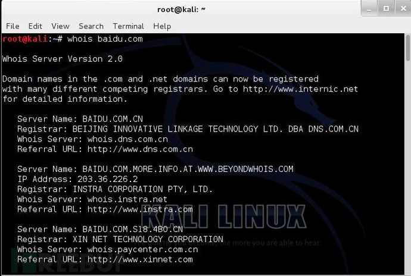

(部分)

我们可以获取关于百度的DNS服务器信息，域名注册基本信息。这些信息在以后的测试阶段中有可能会发挥重大的作用。

除了使用whois命令，也有一些网站提供在线whois信息查询：

**whois**.chinaz.com/

[www.internic.net/whois.html](http://www.internic.net/whois.html)

收集完域名信息之后，我们将开始收集关于DNS服务器的详细信息。

#### **DNS分析**

使用DNS分析工具的目的在于收集有关DNS服务器和测试目标的相应记录信息。

以下是几种常见的DNS记录类型：

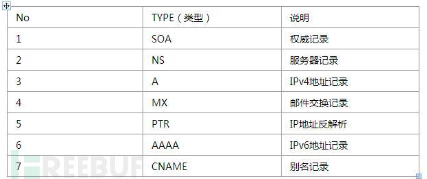


例如，在一个测试项目中，客户只给了一个域名，需要你用着域名，来查找所有目标主机的IP和可用的域。接下来我们将带你实现这样的功能。

#### **host**

在获取DNS服务器信息之后，下一步就是借助DNS服务器找出目标主机IP地址。我们可以使用下面的命令行工具来借助一个DNS服务器查找目标主机的IP地址：

```html
# host www.baidu.com
```


我们可以看到 有两个IP地址？？

一般情况下，host查找的是A，AAAA，和MX的记录。

查询详细的记录只需要添加 -a

```html
#host -a baidu.com 8.8.8.8
```

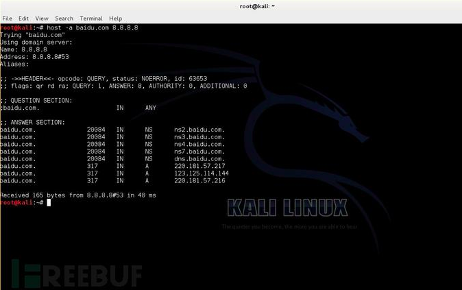

这里8.8.8.8是指定一个DNS服务器。

因为 host命令查找记录是通过Kali的DNS服务器系统文件，该文件位于/etc/resolv.conf.你可以往里面添加DNS任意服务器。当然也可以像我一样直接在命令行中指定DNS服务器。

#### **dig**

除了host命令，你也可以使用dig命令对DNS服务器进行挖掘。相对于host命令，dig命令更具有灵活和清晰的显示信息。

```html
#dig baidu.com
```


不使用选项的dig命令，只返回一个记录。如果要返回全部的记录，只需要在命令添加给出的类型：

```html
#dig baidu.com any
```

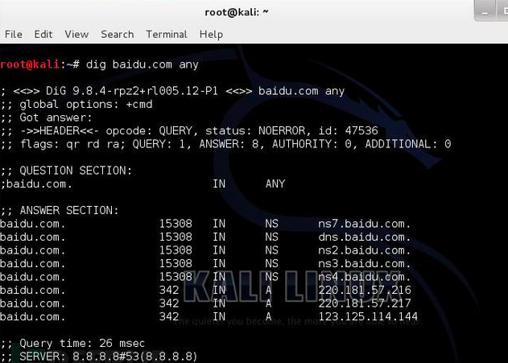

#### **dnsenum**

我们可以利用dnsenum从DNS服务器上获取以下信息：

```html
1. 主机IP地址
2. 该域名的DNS服务器
3. 该域名的MX记录
```

除了被用来获取DNS信息，dnsenum还具有以下特点：

```html
1. 使用谷歌浏览器获取子域名
2. 暴力破解
3. C级网络扫描
4. 反向查找网络
```

启动dnsenum，使用如下命令

```html
#dnsenum
```


通过一个例子来演示：

```html
# dnsnum baidu.com
```

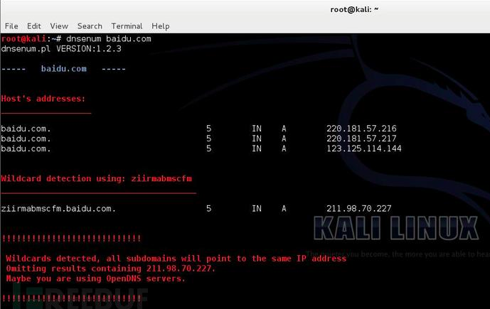

前面我们获取的是IPv4的信息，接下来我们使用**dnsdict6****。**该工具可以获取IPv6地址信息

#### **dnsdict6**

```html
#dnsdict6
```


默认情况下，dnsdict6将使用自带的字典和八个线程

```html
#dnsdict6 baidu.com
```

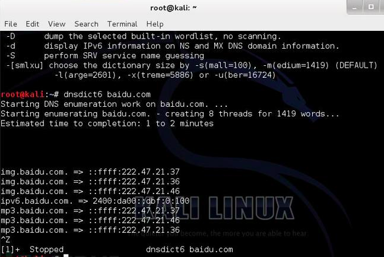

由此可见，是有默认的状态对百度进行IPv6扫描。

同时，我们也可以使用dnsdict6查找域名上的IPv4，使用选项 -4.并且使用-d还可以收集DNS和NS的信息：

```html
#dnsdict6 -4 -d baidu.com
```

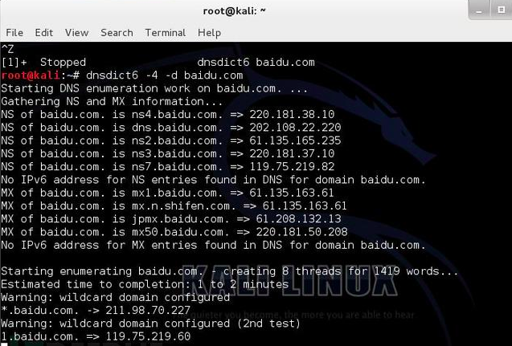

#### **fierce**

fierce 是使用多种技术来扫描目标主机IP地址和主机名的一个DNS服务器枚举工具。运用递归的方式来工作。它的工作原理是先通过查询本地DNS服务器来查找目标DNS服务器，然后使用目标DNS服务器来查找子域名。fierce的主要特点就是可以用来地位独立IP空间对应域名和主机名。

启动fierce使用的命令：

```html
#fierce -h
```

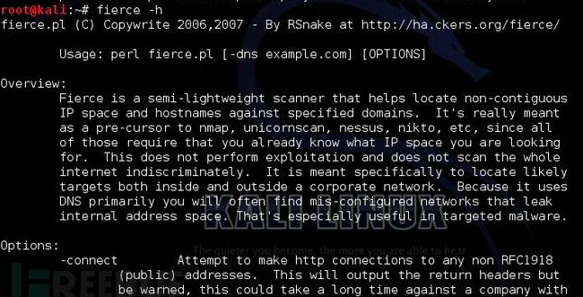

通过一个例子来演示：

```html
#fierce  -dns baidu.com -threads 3
```

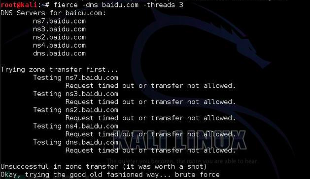

#### **DMitry**

DMitry（Deepmagic Information Gathering Tool）是一个一体化的信息收集工具。它可以用来收集以下信息：

```html
1. 端口扫描
2. whois主机IP和域名信息
3. 从Netcraft.com获取主机信息
4. 子域名
5. 域名中包含的邮件地址
```

尽管这些信息可以在Kali中通过多种工具获取，但是使用DMitry可以将收集的信息保存在一个文件中，方便查看。

使用DMitry可以使用如下命令：

```html
#dmitry
```

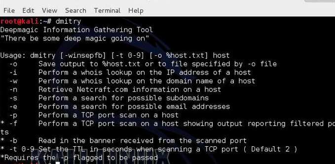

通过一个例子来演示：

这个演示是要获取 whois ，ip，主机信息，子域名，电子邮件。

```html
#dmitry -winse baidu.com
```

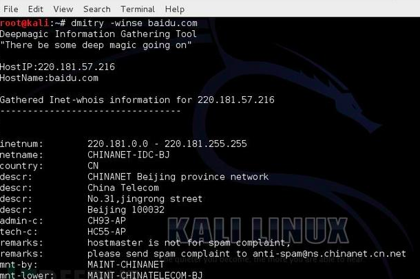

再一个例子，通过dmitry 来扫描网站端口

```html
#dmitry -p baidu.com -f -b
```

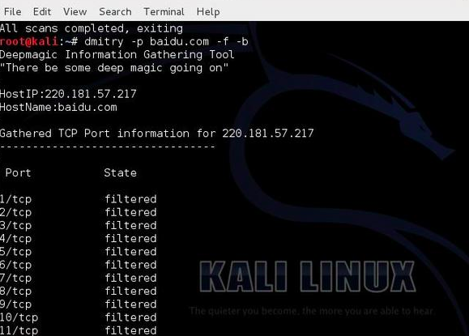

扫描之后我们会发现百度只开放了80端口。（截图只有部分。。。）

#### **Maltego**

Maltego是一个开源的取证工具。它可以挖掘和收集信息。

Maltego是一个图形界面。

Maltego的基础网络特点：

```html
1. 域名
2. DNS
3. Whois
4. IP地址
5. 网络块
```

也可以被用于收集相关人员的信息：

```html
1. 公司、组织
2. 电子邮件
3. 社交网络关系
4. 电话号码
```

使用Maltego的命令行如下：

```html
#maltego
```

第一次运行会出现启动向导：


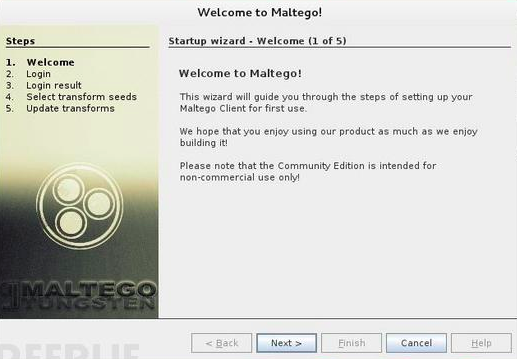

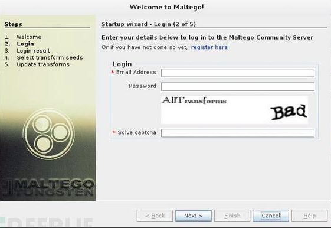

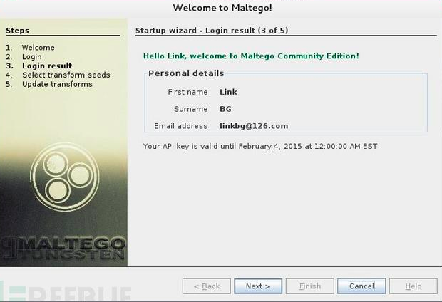

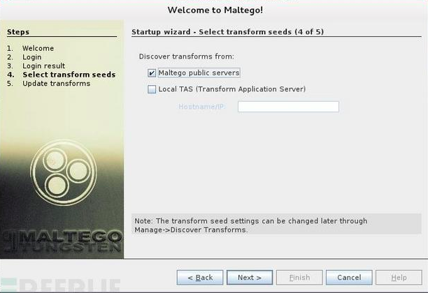

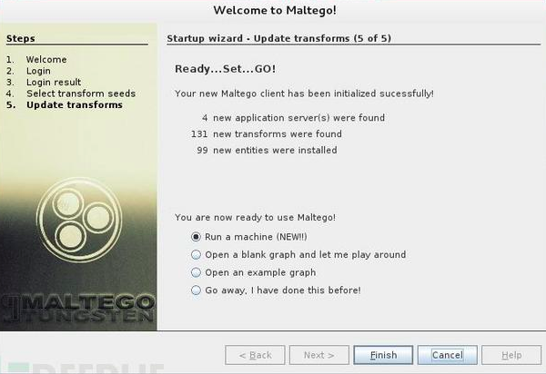


通过一个例子演示：

使用快捷键ctrl+T来创建新的项目。然后到Palette选项卡，选择基础设施（Infrastructure），选择域（Domain），如果成功建立会出现paterva.com。可以通过双击paterva.com这个图标进行更改


如果你右键单击域名，你会看到所有的功能（变换？？）：

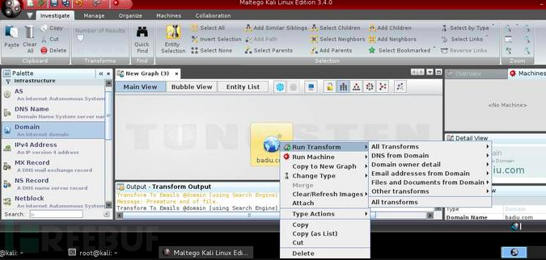

我们使用Other transforms->DomainToDNSNameSchema 结果如图：

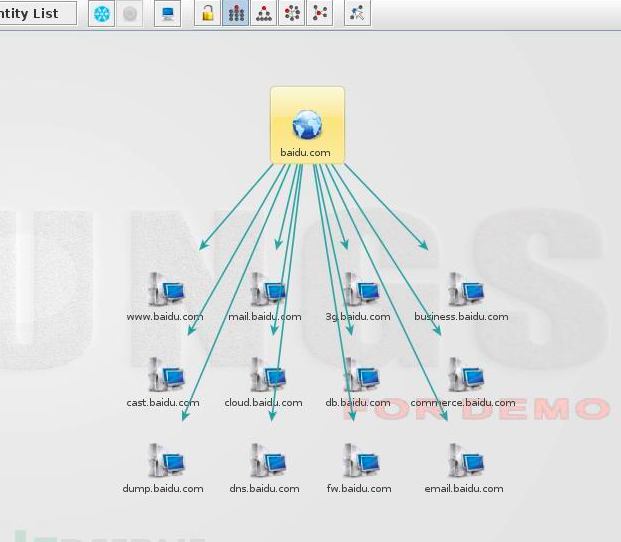

在对域名的DNS变换后，我们得到了百度的相关信息。你还可以试试其他（变换）功能。

#### **利用搜索引擎**

Kali 工具集中用可以用来收集域，电子邮件等信息的工具，这些工具使用第三方搜索引擎进行信息收集，这样的好处在于我们不用直接访问目标，目标并不知道你的行动。

#### **theharvester**

theharvester是一个电子邮件，用户名和主机名/子域名信息收集工具。它收集来自各种公开的信息来源。最新版本支持的信息来源包括：

```html
1. Google
2. Google profiles
3. Bing
4. PGP
5. LinkedIn
6. Yandex
7. People123
8. Jigsaw
```

使用theharvester 命令行：

```html
# theharvester
```

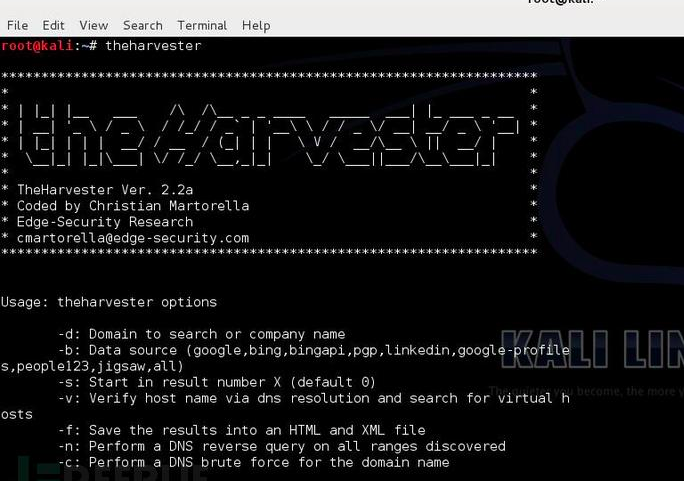

通过一个例子来演示：

通过bing来收集

```html
#theharvester -d baidu.com -l 100 -b bing
```

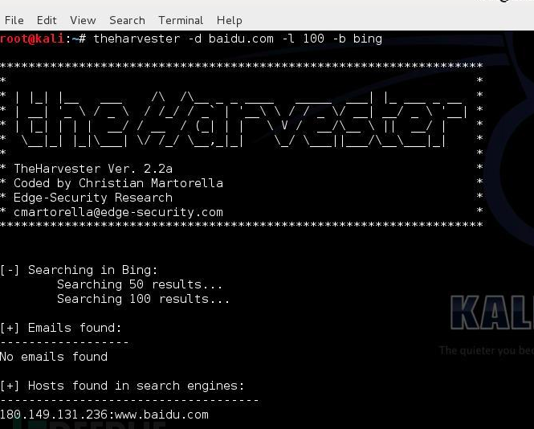

如果我们想收集目标用户名，我们可以通过LinkedIn.com查找。命令如下：

```html
#theharvester -d baidu.com -l 100 -b  linkedin
```

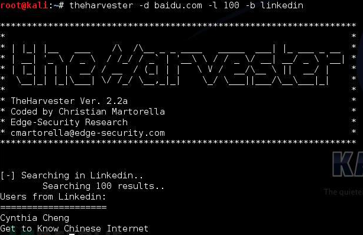

从LinkedIn收集的用户名在后续的测试中将会有很大的用处。例如：社会工程学攻击。

#### **Metagoofil**

Metagoofil是一款利用Google收集信息的工具，目前支持的类型如下：

```html
1. word
2. ppt
3. Excel
4. PDF
```

使用Metagoofil的命令：

```html
#Metagoofil
```

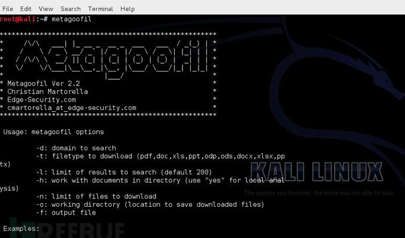

通过一个例子来演示：

```html
#metagoofil -d baidu.com -l 20 -t doc,pdf -n 5  -f test.html -o test
```


通过这个工具我们可以看到收集到的资料非常多，如，用户名，路径信息。我们可以通过这些用户名进行暴力破解。

通过生成的HTML版的报告，我们可以非常清晰的看到我们收集的信息种类：

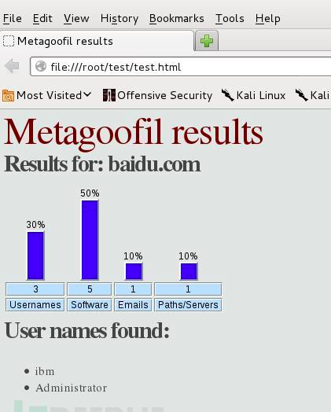

至此，我们的信息收集工具介绍已经完成。每个渗透目标，想要通过不同的途径获取目标大量信息。