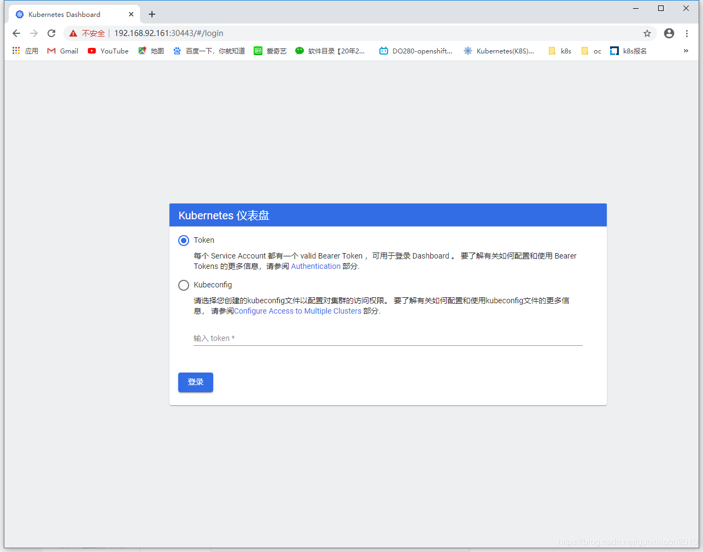
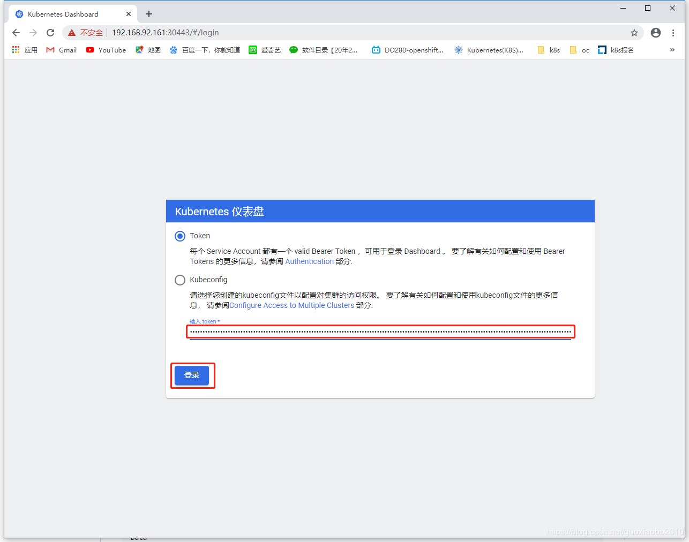
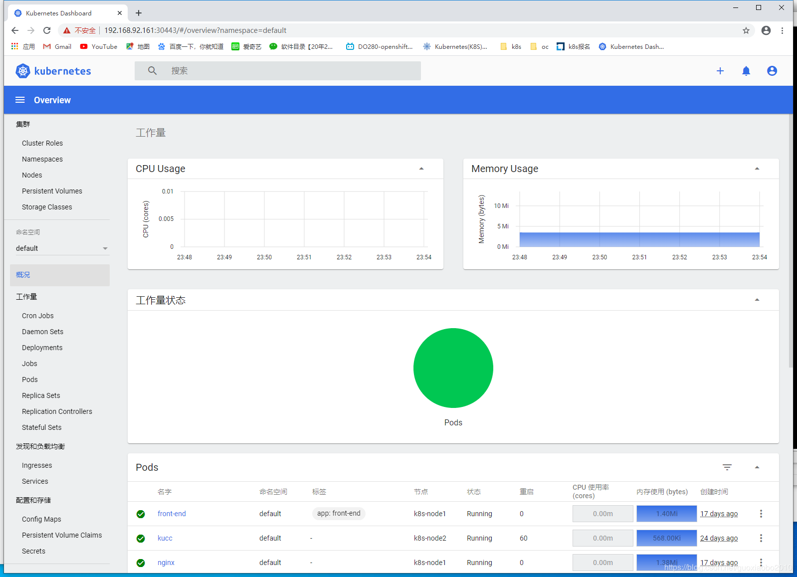

## 目的

k8s的集群搭建已经完成，那么页面怎么管理呢？本文详细介绍k8s-dashboard页面管理。


<!--more-->

## 安装

### 下载yaml文件

```bash
wget https://raw.githubusercontent.com/kubernetes/dashboard/v2.0.0/aio/deploy/recommended.yaml
```

### 修改配置

修改kubernetes-dashboard的service类型为NodePort类型，使用nodeport方式访问Dashboard 。

```yaml
[root@k8s-master dashboard]# vim recommended.yaml 
...
kind: Service
apiVersion: v1
metadata:
  labels:
    k8s-app: kubernetes-dashboard
  name: kubernetes-dashboard
  namespace: kubernetes-dashboard
spec:
  type: NodePort # 新增
  ports:
    - port: 443
      targetPort: 8443
      nodePort: 30443 # 新增
  selector:
    k8s-app: kubernetes-dashboard
```

### 安装Dashboard

```
[root@k8s-master dashboard]# kubectl create -f recommended.yaml 
namespace/kubernetes-dashboard created
serviceaccount/kubernetes-dashboard created
service/kubernetes-dashboard created
secret/kubernetes-dashboard-certs created
secret/kubernetes-dashboard-csrf created
secret/kubernetes-dashboard-key-holder created
configmap/kubernetes-dashboard-settings created
role.rbac.authorization.k8s.io/kubernetes-dashboard created
clusterrole.rbac.authorization.k8s.io/kubernetes-dashboard created
rolebinding.rbac.authorization.k8s.io/kubernetes-dashboard created
clusterrolebinding.rbac.authorization.k8s.io/kubernetes-dashboard created
deployment.apps/kubernetes-dashboard created
service/dashboard-metrics-scraper created
deployment.apps/dashboard-metrics-scraper created
```

### 确认状态

```
[root@k8s-master dashboard]# kubectl get pod,svc -n kubernetes-dashboard
NAME                                            READY   STATUS    RESTARTS   AGE
pod/dashboard-metrics-scraper-c79c65bb7-bpnbq   1/1     Running   0          2m52s
pod/kubernetes-dashboard-56484d4c5-cthdm        1/1     Running   0          2m52s
 
NAME                                TYPE        CLUSTER-IP     EXTERNAL-IP   PORT(S)         AGE
service/dashboard-metrics-scraper   ClusterIP   10.105.74.63   <none>        8000/TCP        2m52s
service/kubernetes-dashboard        NodePort    10.98.84.244   <none>        443:30444/TCP   2m52s
```

### 创建管理员用户yaml

默认Dashboard为最小RBAC权限，添加集群管理员权限以便从Dashboard操作集群资源

```yaml
[root@k8s-master dashboard]# vim adminuser.yaml
---
apiVersion: v1
kind: ServiceAccount
metadata:
  name: admin-user
  namespace: kubernetes-dashboard
---
apiVersion: rbac.authorization.k8s.io/v1
kind: ClusterRoleBinding
metadata:
  name: admin-user
roleRef:
  apiGroup: rbac.authorization.k8s.io
  kind: ClusterRole
  name: cluster-admin
subjects:
- kind: ServiceAccount
  name: admin-user
  namespace: kubernetes-dashboard
```

### 创建管理员权限

```bash
[root@k8s-master dashboard]# kubectl create -f adminuser.yaml
serviceaccount/admin-user created
clusterrolebinding.rbac.authorization.k8s.io/admin-user created

# 补充
# 如有报错，可以先删掉再重新创建
kubectl delete -f ***.yaml
```

## 访问

### 浏览器访问[https://IP:304](https://ip:30001/)43



### 查看token

获取token，用于登录Dashboard UI

```bash
[root@k8s-master dashboard]# kubectl -n kubernetes-dashboard describe secret $(kubectl -n kubernetes-dashboard get secret | grep admin-user | awk '{print $1}')
Name:         admin-user-token-k4gdg
Namespace:    kubernetes-dashboard
Labels:       <none>
Annotations:  kubernetes.io/service-account.name: admin-user
              kubernetes.io/service-account.uid: d116f560-15a2-45ca-930f-40f4fc12ce44
 
Type:  kubernetes.io/service-account-token
 
Data
====
ca.crt:     1025 bytes
namespace:  20 bytes
token:      eyJhbGciOiJSUzI1NiIsImtpZCI6IlNEa2dTVGZhM09xd0MyNWtqaGFoZEc5R0NuYnVsZ0FfVlJQODNaQUFhZjgifQ.eyJpc3MiOiJrdWJlcm5ldGVzL3NlcnZpY2VhY2NvdW50Iiwia3ViZXJuZXRlcy5pby9zZXJ2aWNlYWNjb3VudC9uYW1lc3BhY2UiOiJrdWJlcm5ldGVzLWRhc2hib2FyZCIsImt1YmVybmV0ZXMuaW8vc2VydmljZWFjY291bnQvc2VjcmV0Lm5hbWUiOiJhZG1pbi11c2VyLXRva2VuLWs0Z2RnIiwia3ViZXJuZXRlcy5pby9zZXJ2aWNlYWNjb3VudC9zZXJ2aWNlLWFjY291bnQubmFtZSI6ImFkbWluLXVzZXIiLCJrdWJlcm5ldGVzLmlvL3NlcnZpY2VhY2NvdW50L3NlcnZpY2UtYWNjb3VudC51aWQiOiJkMTE2ZjU2MC0xNWEyLTQ1Y2EtOTMwZi00MGY0ZmMxMmNlNDQiLCJzdWIiOiJzeXN0ZW06c2VydmljZWFjY291bnQ6a3ViZXJuZXRlcy1kYXNoYm9hcmQ6YWRtaW4tdXNlciJ9.qn98x11n4rPUGkDBU6ceImElgeVbM-b2SeXeeiUEm0rj41_vWXzlpd-r1Z1leuRHuveYnLpquR3QhMlFdjxLAIVAQ83KnDNhHyXYY08ZFeoGqGqlOWIAI-OCS9_IhClIskmmqYwA0kQ5AkHWbEsCKEMiYL-dZH7ECPziV0icFfBIYa6zK8-RLUBHR56rvzgjcap1WeTPdu84vr1jl8a4ZLMrzdwW_WmC4rsesA67DH6cQLgoKZRejGf6Sp4h7izO3DEwcGCUrNbg8biDRoqJwzusKoM7IJbC_C14Omg1kGrozFrMufHs8n7ujjpyuLeUyGjseX9eazlnyNkAwY0XIw
```

### 登录

输入第二部获取到的token值，点击登录按钮



Dashboard 概况画面如下

