通过本文掌握什么是负载均衡及负载均衡的作用和意义；了解lvs负载均衡的三种模式；了解lvs-DR负载均衡部署方法；掌握nginx实现负载均衡的方法；掌握lvs+nginx负载均衡拓扑结构。

 <!--more-->

## 负载均衡方案

### 什么是负载均衡

 一台普通服务器的处理能力是有限的，假如能达到每秒几万个到几十万个请求，但却无法在一秒钟内处理上百万个甚至更多的请求。但若能将多台这样的服务器组成一个系统，并通过软件技术将所有请求平均分配给所有服务器，那么这个系统就完全拥有每秒钟处理几百万个甚至更多请求的能力。这就是负载均衡最初的基本设计思想。

负载均衡是由多台服务器以对称的方式组成一个服务器集合，每台服务器都具有等价的地位，都可以单独对外提供服务而无须其他服务器的辅助。通过某种负载分担技术，将外部发送来的请求按照某种策略分配到服务器集合的某一台服务器上，而接收到请求的服务器独立地回应客户的请求。负载均衡解决了大量并发访问服务问题，其目的就是用最少的投资获得接近于大型主机的性能。 

 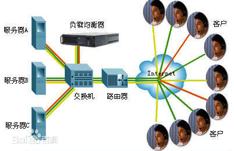

 

 

 

### 相关技术

#### 基于DNS的负载均衡

DNS（Domain Name System，域名系统），因特网上作为域名和IP地址相互映射的一个分布式数据库，能够使用户更方便的访问互联网，而不用去记住能够被机器直接读取的IP数串。通过主机名，最终得到该主机名对应的IP地址的过程叫做域名解析（或主机名解析）。DNS协议运行在UDP协议之上，使用端口号53。

DNS负载均衡技术是最早的负载均衡解决方案，它是通过DNS服务中的随机名字解析来实现的，在DNS服务器中，可以为多个不同的地址配置同一个名字，而最终查询这个名字的客户机将在解析这个名字时得到其中的一个地址。因此，对于同一个名字，不同的客户机会得到不同的地址，它们也就访问不同地址上的Web服务器，从而达到负载均衡的目的。

如下图：

 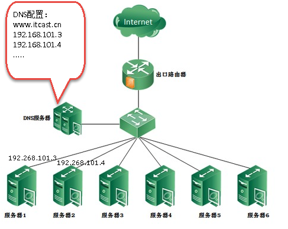

**优点**

实现简单、实施容易、成本低、适用于大多数TCP/IP应用；

**缺点**

1、 负载分配不均匀，DNS服务器将Http请求平均地分配到后台的Web服务器上，而不考虑每个Web服务器当前的负载情况；如果后台的Web服务器的配置和处理能力不同，最慢的Web服务器将成为系统的瓶颈，处理能力强的服务器不能充分发挥作用；

2、可靠性低，如果后台的某台Web服务器出现故障，DNS服务器仍然会把DNS请求分配到这台故障服务器上，导致不能响应客户端。

3、变更生效时间长，如果更改NDS有可能造成相当一部分客户不能享受Web服务，并且由于DNS缓存的原因，所造成的后果要持续相当长一段时间(一般DNS的刷新周期约为24小时)。

 

#### 基于四层交换技术的负载均衡

基于四层交换技术的负载均衡是通过报文中的目标地址和端口，再加上负载均衡设备设置的服务器选择方式，决定最终选择的内部服务器与请求客户端建立TCP连接，然后发送Client请求的数据。

如下图：

​        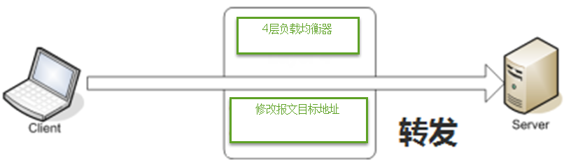

 

client发送请求至4层负载均衡器，4层负载均衡器根据负载策略把client发送的报文目标地址(原来是负载均衡设备的IP地址)修改为后端服务器（可以是web服务器、邮件服务等）IP地址，这样client就可以直接跟后端服务器建立TCP连接并发送数据。

 

具有代表意义的产品：LVS（开源软件），F5（硬件）

 

**优点**

性能高、支持各种网络协议

 

**缺点**

对网络依赖较大，负载智能化方面没有7层负载好（比如不支持对url个性化负载），F5硬件性能很高但成本也高需要人民币几十万，对于小公司就望而却步了。

 

#### 基于七层交换技术的负载均衡

基于七层交换技术的负载均衡也称内容交换，也就是主要通过报文中的真正有意义的应用层内容，再加上负载均衡设备设置的服务器选择方式，决定最终选择的服务器。

如下图：

 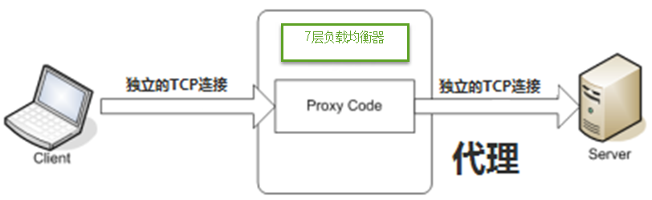

 

七层负载均衡服务器起了一个代理服务器的作用，client要访问webserver要先与七层负载设备进行三次握手后建立TCP连接，把要访问的报文信息发送给七层负载均衡；然后七层负载均衡再根据设置的均衡规则选择特定的webserver，然后通过三次握手与此台webserver建立TCP连接，然后webserver把需要的数据发送给七层负载均衡设备，负载均衡设备再把数据发送给client。

 

具有代表意义的产品：nginx（软件）、apache（软件）

 

**优点**

对网络依赖少，负载智能方案多（比如可根据不同的url进行负载）

 

**缺点**

网络协议有限，nginx和apache支持http负载，性能没有4层负载高

 

### 确定使用四层+七层负载结合方案

四层负载使用lvs软件或F5硬件实现。

七层负载使用nginx实现。

如下图是lvs+nginx的拓扑结构：

 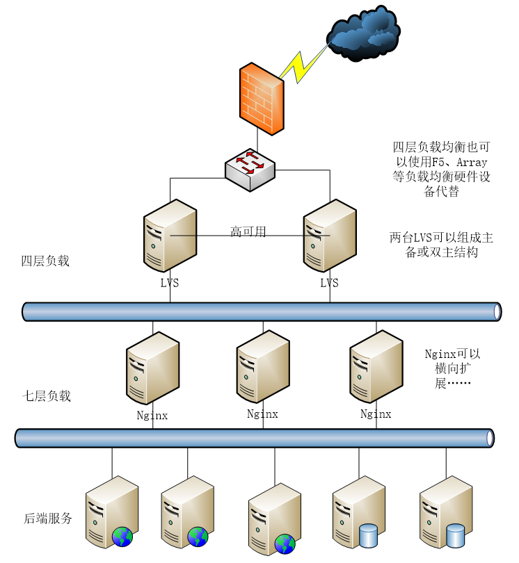

 

### nginx集群背景

在keepalived+nginx的主备容灾高可用的架构中，nginx是作为外部访问系统的唯一入口，理论上一台nginx的最大并发量可以高达50000，但是当并发量更大的时候，keepalived+nginx的高可用机制是没办法满足需求的，因为keepalived+nginx的架构中确确实实是一台nginx在工作，只有当master宕机或异常时候，备份机才会上位。那么如何解决更大的高并发问题呢，也许会问能不能搭建nginx集群，直接对外提供访问？

很显然这是欠妥当的，因为当nginx作为外部的唯一访问入口，没办法直接以集群的形式对外提供服务，没有那么多的公网ip资源可用，既太浪费也不友好。但是在内网环境下，是可以用nginx集群（nginx横向扩展服务集合）的，当然总得有一个对外入口，所以需要在nginx集群之上，在加一层负载均衡器，作为系统的唯一入口。


## lvs实现四层负载DR模式

### 什么是lvs

LVS是Linux Virtual Server的简写，意即Linux虚拟服务器，是一个虚拟的服务器集群系统。本项目在1998年5月由章文嵩博士成立，是中国国内最早出现的自由软件项目之一。

### lvs实现负载的三种方式

运行 lPVS软件的服务器，在整个负载均衡集群中承担一调度角色 软件的服务器，（即 向真实服务器分配从客户端过来的请求。LVS中的调度方法有三种 ：NAT（Network Address Translation网络地址转换）、TUN（tunnel 隧道）、DR（direct route 直接路由）

### LVS-DR 模式

 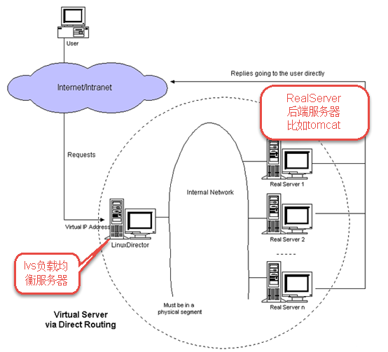

请求由LVS接受，由真实提供服务的服务器(RealServer, RS)直接返回给用户，返回的时候不经过LVS。

DR模式下需要LVS服务器和RS绑定同一个VIP， 一个请求过来时，LVS只需要将网络帧的MAC地址修改为某一台RS的MAC，该包就会被转发到相应的RS处理，注意此时的源IP和目标IP都没变，RS收到LVS转发来的包，发现MAC是自己的，发现IP也是自己的，于是这个包被合法地接受，而当RS返回响应时，只要直接向源IP(即用户的IP)返回即可，不再经过LVS。

DR模式下，lvs接收请求输入，将请求转发给RS，由RS输出响应给用户，性能非常高。

它的不足之处是要求负载均衡器与RS在一个物理段上。

### LVS-NAT模式

 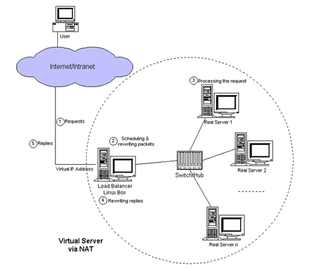

NAT(Network Address Translation)是一种外网和内网地址映射的技术。NAT模式下，LVS需要作为RS的网关，当网络包到达LVS时，LVS做目标地址转换(DNAT)，将目标IP改为RS的IP。RS接收到包以后，处理完，返回响应时，源IP是RS IP，目标IP是客户端的IP，这时RS的包通过网关(LVS)中转，LVS会做源地址转换(SNAT)，将包的源地址改为VIP，对于客户端只知道是LVS直接返回给它的。

NAT模式请求和响应都需要经过lvs，性能没有DR模式好。

### LVS-TUN模式

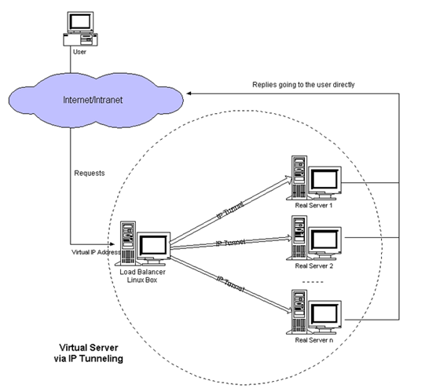

 

TUN模式是通过ip隧道技术减轻lvs调度服务器的压力，许多Internet服务（例如WEB服务器）的请求包很短小，而应答包通常很大，负载均衡器只负责将请求包分发给物理服务器，而物理服务器将应答包直接发给用户。所以，负载均衡器能处理很巨大的请求量。相比NAT性能要高的多，比DR模式的优点是不限制负载均衡器与RS在一个物理段上。但是它的不足需要所有的服务器（lvs、RS）支持"IP Tunneling"(IP Encapsulation)协议。

## lvs-DR实战

vip：192.168.101.100

lvs-director：192.168.101.8

 

nginx1：192.168.101.3

nginx2：192.168.101.4

### lvs调度服务器Director安装

#### 安装lvs

在192.168.101.8上安装lvs

centos6.5自带lvs，检查linux内核是否集成lvs模块：

```bash
modprobe -l | grep ipvs
```

 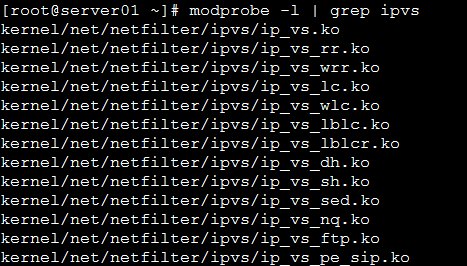 

#### 安装lvs的管理工具ipvsadm

- 安装依赖

```bash
yum install -y gcc gcc-c++ makepcre pcre-devel kernel-devel openssl-devel libnl-devel popt*
```


- 安装ipvsadm

将ipvsadm-1.26.tar.gz拷贝至/usr/local/下

```bash
cd /usr/local
tar -zxvf ipvsadm-1.26.tar.gz
cd ipvsadm-1.26
make
make install
或者
yum install ipvsadm -y
```

校验是否安装成功：

 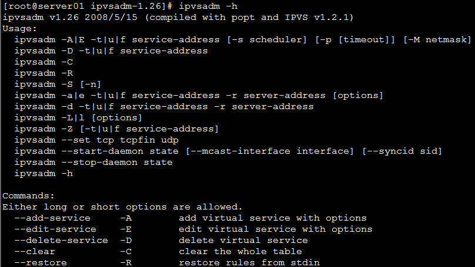

#### 真实服务器Real Server安装

在192.168.101.3和192.168.101.4上安装nginx。

**nginx配置文件**

创建nginx-lvs.conf，http内容如下：

```
http {

    include       mime.types;

    default_type  application/octet-stream;

    sendfile        on;

    server {

        listen       80;

        server_name  localhost;

        location / {

            root   html;

            index  index.html index.htm;

        }

    }
```

### Director Server配置

#### 在eth0上绑定虚拟ip

```
ifconfig eth0:0 192.168.101.100 broadcast 192.168.101.100 netmask 255.255.255.255 up 
```

此处在eth0设备上绑定了一个虚拟设备eth0:0，同时设置了一个虚拟IP是*192.168.101.100*，然后指定广播地址也为*192.168.101.100*，需要特别注意的是，虚拟ip地址的广播地址是它本身，子网掩码是255.255.255.255。

 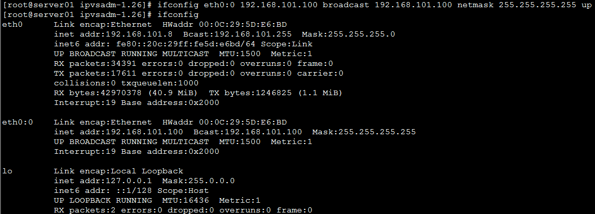

#### 添加路由规则

```bash
route add -host 192.168.101.100 dev eth0:0
```

#### 启用系统的包转发功能

```bash
echo "1" >/proc/sys/net/ipv4/ip_forward 
```

参数值为1时启用ip转发，为0时禁止ip转发。

#### 清除原有转发规则

```bash
ipvsadm --clear
```

#### 添加虚拟IP规则

```bash
ipvsadm -A -t 192.168.101.100:80 -s rr
```

 -s rr表示采用轮询策略。

:80表示负载转发的端口是80

#### 在虚拟IP中添加服务规则

```bash
ipvsadm -a -t 192.168.101.100:80 -r 192.168.101.3:80 -g
ipvsadm -a -t 192.168.101.100:80 -r 192.168.101.4:80 -g 
```

在新加虚拟IP记录中添加两条新的Real Server记录，-g表示指定LVS 的工作模式为直接路由模式。

lvs进行负载转发需要保证lvs负载的端口要和nginx服务的端口的一致，这里都为80。

#### 重启lvs

```bash
ipvsadm
```

 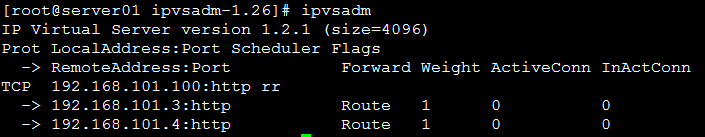

### Real Server配置

在lvs的DR和TUn模式下，用户的访问请求到达真实服务器后，是直接返回给用户的，而不再经过前端的Director Server，因此，就需要在每个Real server节点上增加虚拟的VIP地址，这样数据才能直接返回给用户。

#### 在回环设备上绑定了一个虚拟IP地址

```bash
ifconfig lo:0 192.168.101.100 broadcast 192.168.101.100 netmask 255.255.255.255 up
/sbin/route add -host 192.168.101.100 dev lo:0
```

 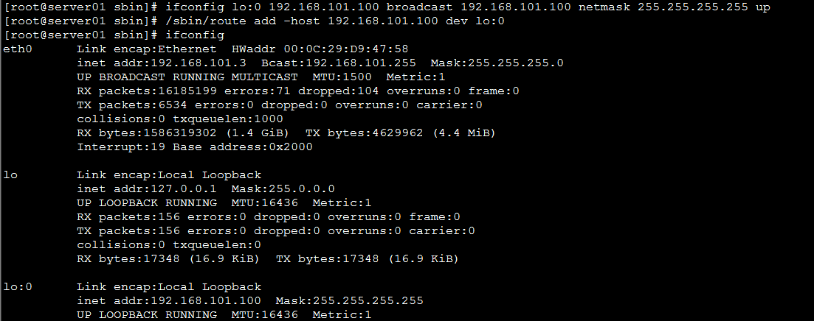

 

#### 关闭arp解析

arp_announce ：定义不同级别：当ARP请求通过某个端口进来是否利用这个接口来回应。

​         0 -利用本地的任何地址，不管配置在哪个接口上去响应ARP请求；

​         1 - 避免使用另外一个接口上的mac地址去响应ARP请求；

​         2 - 尽可能使用能够匹配到ARP请求的最佳地址。

 

arp_ignore：当ARP请求发过来后发现自己正是请求的地址是否响应；

​            0 - 利用本地的任何地址，不管配置在哪个接口上去响应ARP请求；

​            1 - 哪个接口上接受ARP请求，就从哪个端口上回应。

```bash
echo "1" >/proc/sys/net/ipv4/conf/lo/arp_ignore
echo "2" >/proc/sys/net/ipv4/conf/lo/arp_announce 
echo "1" >/proc/sys/net/ipv4/conf/all/arp_ignore
echo "2" >/proc/sys/net/ipv4/conf/all/arp_announce 

sysctl -p #使用修改生效
```

 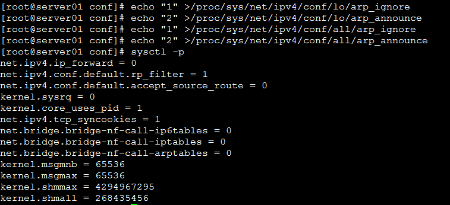

### 测试

#### 预期目标

由于lvs设置为rr轮询策略，当访问虚IP http://192.168.101.100，每次刷新请求通过lvs负载到不同的服务器。

#### 注意事项

1、测试时需要在nginx的http中设置keepalive_timeout  0; 取消使用http持久连接模式，保证每次客户端发起请求都需要向服务端建立连接，这样做是为了每次刷新页面都要经过lvs负载转发。

2、lvs进行负载转发需要保证lvs负载的端口要和nginx服务的端口的一致，这里都为80。

 

keepalive_timeout说明：

在nginx中keepalive_timeout的默认值是75秒，默认使用http持久连接模式，可使客户端到服务器端的连接持续有效，当出现对服务器的后继请求时，可避免建立或重新建立连接。生产环境建议keepalive_timeout不要设置为0。

#### 测试过程

修改192.168.101.3和192.168.101.4下html目录中index.html的内容使之个性化。

第一次请求：http://192.168.101.100

 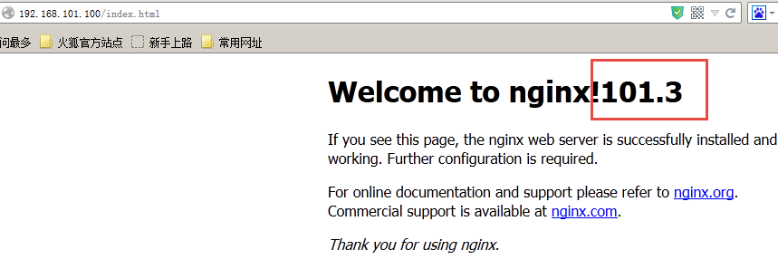

刷新，相当于第二次请求：

 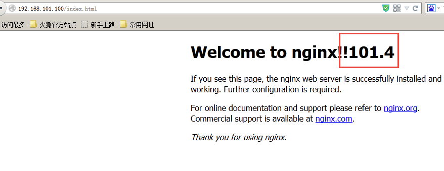

依次交替测试，发现每次请求被负载到不同的nginx上。

 

任意停止掉一个nginx，请求http://192.168.101.100继续可以浏览，由于lvs采用轮询策略如果其中一个nginx请求不可到达则去请求另外的nginx。

### 脚本封装

为了方便配置启动lvs将上边Director Server和Real Server的配置过程封装在shell脚本中。

#### Director Server配置

在/etc/init.d下创建lvsdr，内容如下：

```bash
#!/bin/sh
# 定义虚拟ip
VIP=192.168.101.100 #虚拟 ip根据需求修改
# 定义realserver,并已空格分开，根据需求修改
RIPS="192.168.101.3 192.168.101.4"

# 定义提供服务的端口
SERVICE=80

# 调用init.d脚本的标准库
. /etc/rc.d/init.d/functions
case $1 in
        start)
        echo "Start LVS of DR Mode"
        # 开启ip转发
        echo "1" > /proc/sys/net/ipv4/ip_forward
        # 绑定虚拟ip
        ifconfig eth0:0 $VIP broadcast $VIP netmask 255.255.255.255 up
        route add -host $VIP dev eth0:0
        # 清除lvs规则
        ipvsadm -C
        # 添加一条虚拟服务器记录
    # -p指定一定的时间内将相同的客户端分配到同一台后端服务器
    # 用于解决session的问题,测试时或有别的解决方案时建议去掉
        ipvsadm -A -t $VIP:$SERVICE -s rr

        # 添加真实服务器记录
        for RIP in $RIPS
    do
        echo $RIP:$SERVICE;
                ipvsadm -a -t $VIP:$SERVICE -r $RIP:$SERVICE -g
        done
        # 设置tcp tcpfin  udp的超时连接值
        ipvsadm --set 30 120 300
        ipvsadm
        ;;

        stop)
        echo "Stop LVS DR"
        ifconfig eth0:0 down
        ipvsadm -C
        ;;
        *)
        echo "Usage:$0 {start ¦ stop}"
        exit 1
esac
```

 

```bash
#修改脚本权限：
chmod +x /etc/init.d/lvsdr
#启动Director server：
service lvsdr start
#停止Director server：
service lvsdr stop
```


#### Real Server配置

在/etc/init.d下创建lvsdr，内容如下：

```bash
#!/bin/sh
VIP=192.168.101.100 #虚拟ip，根据需求修改
. /etc/rc.d/init.d/functions
case $1 in
        start)
        echo "lo:0 port starting"
        # 为了相应lvs调度器转发过来的包,需在本地lo接口上绑定vip
        ifconfig lo:0 $VIP broadcast $VIP netmask 255.255.255.255 up
        # 限制arp请求
        echo "1" > /proc/sys/net/ipv4/conf/lo/arp_ignore
        echo "2" > /proc/sys/net/ipv4/conf/lo/arp_announce
        echo "1" > /proc/sys/net/ipv4/conf/all/arp_ignore
        echo "2" > /proc/sys/net/ipv4/conf/all/arp_announce
        ;;
        stop)
        echo "lo:0 port closing"
        ifconfig lo:0 down
        echo "0" > /proc/sys/net/ipv4/conf/lo/arp_ignore
    echo "0" > /proc/sys/net/ipv4/conf/lo/arp_announce
    echo "0" > /proc/sys/net/ipv4/conf/all/arp_ignore
    echo "0" > /proc/sys/net/ipv4/conf/all/arp_announce
        ;;
        *)
        echo "Usage: $0 {start ¦ stop}"
        exit 1
esac

```

```bash
#修改脚本权限：
chmod +x /etc/init.d/lvsdr
#启动real server：
service lvsdr start
#停止real server：
service lvsdr stop
```


## lvs四层+nginx七层负载均衡

### 需求

lvs采用DR模式基本上没有性能瓶颈，用户请求输入至lvs经过负载转发到后台服务上，通过后台服务输出响应给用户。nginx的负载性能远没有lvs好，lvs四层+nginx七层负载的好处是最前端是lvs接收请求进行负载转发，由多个nginx共同完成七层负载，这样nginx的负载性能就可以线性扩展。

### 准备环境

vip：192.168.101.100

lvs-director：192.168.101.8

 

nginx1：192.168.101.3                              安装nginx

nginx2：192.168.101.4                              安装nginx

 

tomcat1：192.168.101.5                           安装tomcat

tomcat2：192.168.101.6                           安装tomcat

 

### 配置

#### Director Server配置

vip：192.168.101.100

lvs-director：192.168.101.8

参考lvs四层负载DR模式进行配置

 

#### Real Server配置

nginx1：192.168.101.3                              安装nginx

nginx2：192.168.101.4                              安装nginx

 

参考lvs四层负载DR模式进行配置，需要修改nginx的配置文件使每个nginx对两个tomcat进行负载，如下：

```conf
http {
    include       mime.types;
    default_type  application/octet-stream;
    sendfile        on;

   upstream tomcat_server_pool{
        server 192.168.101.5:8080 weight=10;
        server 192.168.101.6:8080 weight=10;
        }

    server {
        listen 80;
        server_name localhost;
        location / {
                 proxy_pass http://tomcat_server_pool;
                 index index.jsp index.html index.htm;
        }
    }
} 
```

### 测试

请求http://192.168.101.100，lvs负载到不同的nginx上，如果停止任意一台nginx或停止任意一台tomcat不影响访问。

 

## lvs高可用(了解)

### 什么是高可用

lvs作为负载均衡器，所有请求都先到达lvs，可见lvs处于非常重要的位置，如果lvs服务器宕机后端web服务将无法提供服务，影响严重。

为了屏蔽负载均衡服务器的宕机，需要建立一个备份机。主服务器和备份机上都运行高可用（High Availability）监控程序，通过传送诸如“I am alive”这样的信息来监控对方的运行状况。当备份机不能在一定的时间内收到这样的信息时，它就接管主服务器的服务IP并继续提供负载均衡服务；当备份管理器又从主管理器收到“I am alive”这样的信息时，它就释放服务IP地址，这样的主服务器就开始再次提供负载均衡服务。

### keepalived+lvs实现主备

#### 什么是keepalived

keepalived是集群管理中保证集群高可用的一个服务软件，用来防止单点故障。

Keepalived的作用是检测web服务器的状态，如果有一台web服务器死机，或工作出现故障，Keepalived将检测到，并将有故障的web服务器从系统中剔除，当web服务器工作正常后Keepalived自动将web服务器加入到服务器群中，这些工作全部自动完成，不需要人工干涉，需要人工做的只是修复故障的web服务器。

#### keepalived工作原理

keepalived是以VRRP协议为实现基础的，VRRP全称Virtual Router Redundancy Protocol，即虚拟路由冗余协议。

虚拟路由冗余协议，可以认为是实现路由器高可用的协议，即将N台提供相同功能的路由器组成一个路由器组，这个组里面有一个master和多个backup，master上面有一个对外提供服务的vip（该路由器所在局域网内其他机器的默认路由为该vip），master会发组播，当backup收不到VRRP包时就认为master宕掉了，这时就需要根据VRRP的优先级来选举一个backup当master。这样的话就可以保证路由器的高可用了。

keepalived主要有三个模块，分别是core、check和VRRP。core模块为keepalived的核心，负责主进程的启动、维护以及全局配置文件的加载和解析。check负责健康检查，包括常见的各种检查方式。VRRP模块是来实现VRRP协议的。


#### keepalived+lvs实现主备过程

**初始状态**

 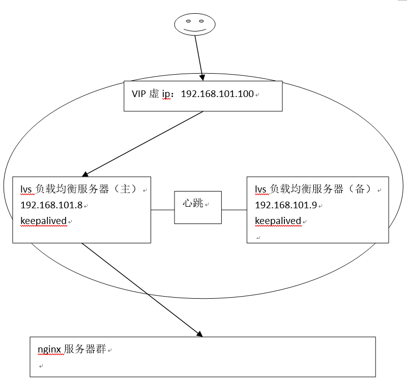

**主机宕机**

 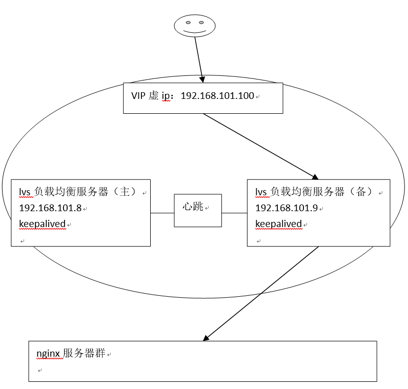

**主机恢复**

 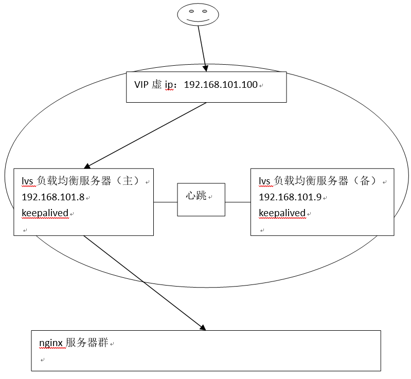 

### 准备环境

 

vip：192.168.101.100

lvs-director：192.168.101.8   主lvs

lvs-director：192.168.101.9   备lvs

 

nginx1：192.168.101.3                              安装nginx

nginx2：192.168.101.4                              安装nginx

 

tomcat1：192.168.101.5                           安装tomcat

tomcat2：192.168.101.6                           安装tomcat

 

### 安装keepalived

分别在主备lvs上安装keepalived，参考“[安装手册](https://www.cnblogs.com/arjenlee/p/9256068.html)”进行安装：

```bash
yum install keepalived -y
```


### 配置keepalived

#### 主lvs

修改主lvs下/etc/keepalived/keepalived.conf文件

```
! Configuration File for keepalived

global_defs {
   notification_email {
    #xxxx@itcast.com                                   # 发生故障时发送的邮箱
   }
   #notification_email_from xxxx@itcast.com             # 使用哪个邮箱发送
   #smtp_server xxx.com                                  # 发件服务器
   smtp_connect_timeout 30
   router_id LVS_DEVEL
}

vrrp_instance VI_1 {
    state MASTER             # 标示为主lvs
    interface eth0           # HA检测端口
    virtual_router_id 51     # 主备的virtual_router_id 必须相同
    priority 100             # 优先级,备lvs要比主lvs稍小
    advert_int 1             # VRRP Multicast 广播周期秒数
    authentication {         # 定义认证
        auth_type PASS       # 认证方式为口令认证
        auth_pass 1111       # 定义口令
    }
    virtual_ipaddress {      # 定义vip
        192.168.101.100        # 多个vip可换行添加
    }
}

virtual_server 192.168.101.100 80 {
    delay_loop 6       # 每隔6秒查看realserver状态
    lb_algo wlc        # 调度算法为加权最小连接数
    lb_kind DR         # lvs工作模式为DR(直接路由)模式
    nat_mask 255.255.255.0
    persistence_timeout 50  # 同一IP 的连接50秒内被分配到同一台realserver(测试时建议改为0)
    protocol TCP            # 用TCP监测realserver的状态

    real_server 192.168.101.3 80 {       # 定义realserver
        weight 3                       # 定义权重
        TCP_CHECK {  # 注意TCP_CHECK和{之间的空格,如果没有的话只会添加第一个realserver
            connect_timeout 3          # 三秒无响应超时
            nb_get_retry 3
            delay_before_retry 3
            connect_port 80
        }
    }
    real_server 192.168.101.4 80 {
        weight 3
        TCP_CHECK {
            connect_timeout 3
            nb_get_retry 3
            delay_before_retry 3
            connect_port 80
        }
    }
}
```

#### 备lvs

修改备lvs下/etc/keepalived/keepalived.conf文件

**配置备**lvs**时需要注意：需要修改state****为BACKUP , priority****比MASTER****低，virtual_router_id****和master****的值一致**

```
! Configuration File for keepalived

global_defs {
   notification_email {
    #xxxx@itcast.com                                   # 发生故障时发送的邮箱
   }
   #notification_email_from xxxx@itcast.com             # 使用哪个邮箱发送
   #smtp_server xxx.com                                  # 发件服务器
   smtp_connect_timeout 30
   router_id LVS_DEVEL
}

vrrp_instance VI_1 {
    state BACKUP             # 标示为备lvs
    interface eth0           # HA检测端口
    virtual_router_id 51     # 主备的virtual_router_id 必须相同
    priority 99              # 优先级,备lvs要比主lvs稍小
    advert_int 1             # VRRP Multicast 广播周期秒数
    authentication {         # 定义认证
        auth_type PASS       # 认证方式为口令认证
        auth_pass 1111       # 定义口令
    }
    virtual_ipaddress {      # 定义vip
        192.168.101.100        # 多个vip可换行添加
    }
}

virtual_server 192.168.101.100 80 {
    delay_loop 6       # 每隔6秒查看realserver状态
    lb_algo wlc        # 调度算法为加权最小连接数
    lb_kind DR         # lvs工作模式为DR(直接路由)模式
    nat_mask 255.255.255.0
    persistence_timeout 50  # 同一IP 的连接50秒内被分配到同一台realserver(测试时建议改为0)
    protocol TCP            # 用TCP监测realserver的状态

    real_server 192.168.101.3 80 {       # 定义realserver
        weight 3                       # 定义权重
        TCP_CHECK {  # 注意TCP_CHECK和{之间的空格,如果没有的话只会添加第一个realserver
            connect_timeout 3          # 三秒无响应超时
            nb_get_retry 3
            delay_before_retry 3
            connect_port 80
        }
    }
    real_server 192.168.101.4 80 {
        weight 3
        TCP_CHECK {
            connect_timeout 3
            nb_get_retry 3
            delay_before_retry 3
            connect_port 80
        }
    }
} 
```

### 测试

#### 启动

- director Server启动：

**注意：使用keepalived就不用手动配置启动lvs，在主、备lvs上启动keepalived即可。**

主备lvs（192.168.101.8、192.168.101.9）都启动keepalived。

```bash
service keepalived start 
```

- real server启动：

192.168.101.3、192.168.101.4启动nginx和lvs的realserver配置

```bash
cd /usr/local/nginx/sbin
./nginx -c /usr/local/nginx/conf/nginx-lvs.conf
```

 启动lvs的realserver配置：

```bash
service lvsdr start
```

 **注意：real server的lvs配置需要使用lvsdr脚本。**

- tomcat 启动

略

 

#### 初始状态

查看主lvs的eth0设置：

vip绑定在主lvs的eth0上。

 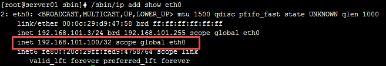

查询lvs状态：

 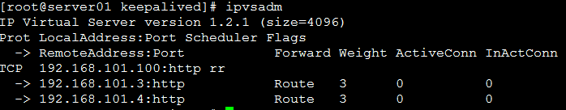

查看备lvs的eth0设置：

vip没有绑定在备lvs的eth0上。

 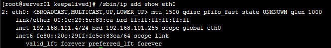

访问http://192.168.101.100，可以正常负载。

#### 主机宕机

将主lvs的keepalived停止或将主lvs关机(相当于模拟宕机)，查看主lvs的eth0：

eth0没有绑定vip

 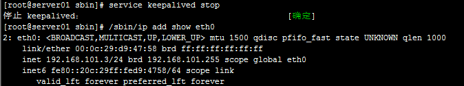 

查看备lvs的eth0：

vip已经漂移到备lvs。

 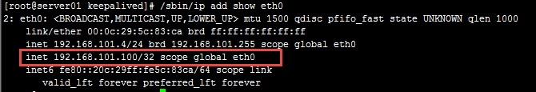

访问http://192.168.101.100，可以正常负载。

#### 主机恢复

将主lvs的keepalived启动。

查看主lvs的eth0：

 

查看备lvs的eth0：

vip漂移到主lvs。

 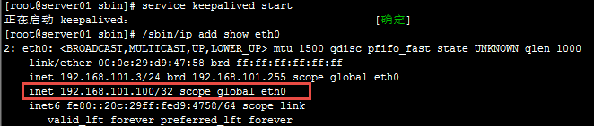

查看备lvs的eth0：

eth0没有绑定vip

 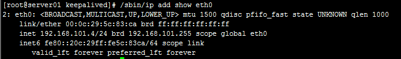

访问http://192.168.101.100，可以正常负载。

 

### keepalived+lvs实现双主

上边主备方案是当前只有一台lvs工作，这造成资源浪费，可以采用双主结构，让两台lvs当前都进行工作，采用dns轮询方式，当用户访问域名通过dns轮询每台lvs，双主结构需要两个vip，这两个vip要绑定域名。

 同样，在每台lvs上安装keepalived软件，当keepalived检测到其中一个lvs宕机则将宕机的vip漂移到活动lvs上，当lvs恢复则vip又重新漂移回来。

 

#### 初始状态

每台lvs绑定一个vip，共两个vip，DNS设置域名对应这两个vip，通过DNS轮询每次解析到不同的vip上即解析到不同的lvs上。

 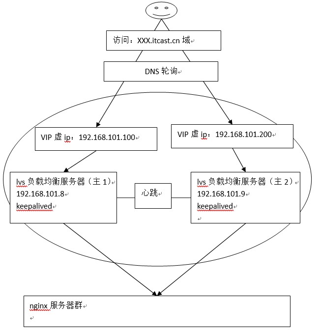

#### 其中一个主机宕机

其中一个主机宕机，每台lvs上安装的keepalived程序会检测到对方宕机，将宕机一方的vip漂移至活动的lvs服务器上，这样DNS轮询全部到一台lvs继续对外提供服务。

 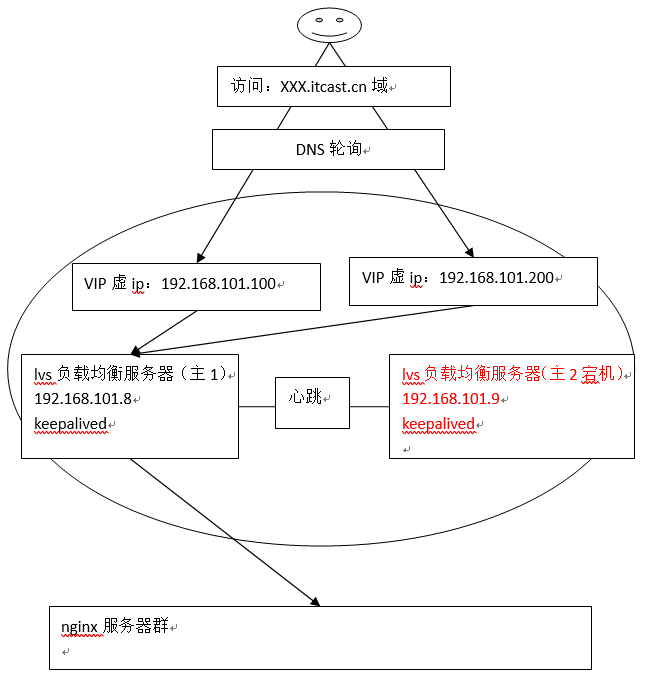

#### 主机恢复

当主机恢复又回到初始状态，每个vip绑定在不同的lvs上。

 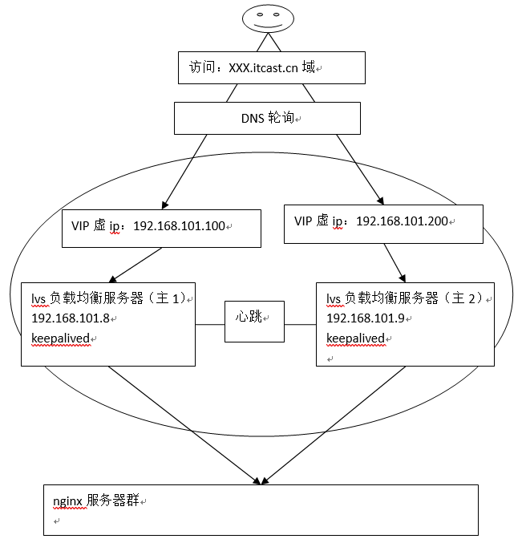

## lvs扩展的思考

前端使用1到2台lvs作为负载基本可以满足中小型网站的并发要求，当lvs的负载成为瓶颈此时就需要对lvs进行优化、扩展。

- **方案1：LVS-ospf集群**

​         OSPF(Open Shortest Path First开放式最短路径优先）是一个内部网关协议(Interior Gateway Protocol，简称IGP），用于在单一自治系统（autonomous system,AS）内决策路由。

LVS（DR）通过ospfd，做lvs集群，实现一个VIP，多台LVS同时工作提供服务，这种方案需要依赖三层交换机设备实现。

 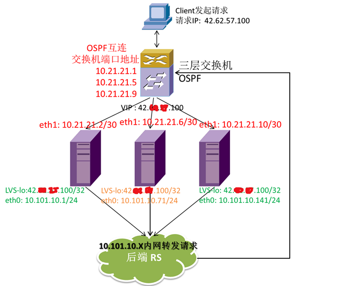 

 

用户请求（VIP：42.xx.xx.100）到达三层交换机之后，通过对原地址、端口和目的地址、端口的hash，将链接分配到集群中的某一台LVS上，LVS通过内网（10.101.10.x）向后端转发请求，后端再将数据返回给用户。

LVS-ospf集群模式的最大优势就在于：

1.LVS调度机自由伸缩，横向线性扩展（最大8台，受限于三层设备允许的等价路由数目maximum load-balancing）；

2.LVS机器同时工作，不存在备机，提高利用率；

3.做到了真正的高可用，某台LVS机器宕机后，不会影响服务

 

- **方案2：DNS轮询**

上面讲的是一组双主结构，可以采用多组双主结构达到横向扩展lvs的目的，此方案需要每台lvs都绑定一个vip（公网ip），DNS设置域名轮询多个vip，如下图：

 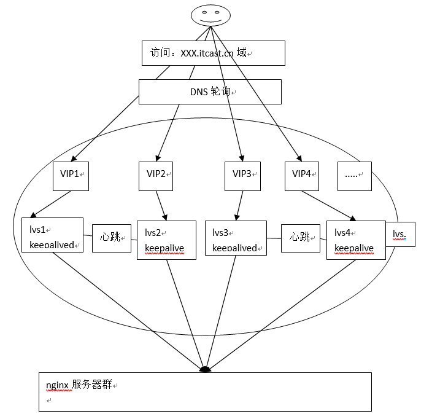

 

- **方案3：使用硬件负载均衡设置** 

​         如果资金允许可以购买硬件设置来完成负载均衡，性能不错的有F5、Array等都可以满足超高并发的要求。