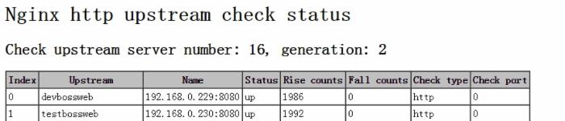
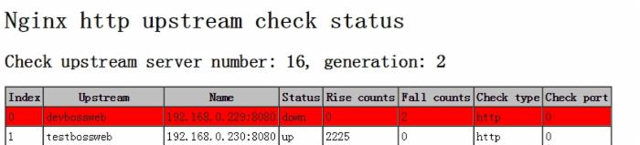

## 背景

公司前一段对业务线上的nginx做了整理，重点就是对nginx上负载均衡器的后端节点做健康检查。目前，nginx对后端节点健康检查的方式主要有3种，这里列出：

```shell
1、ngx_http_proxy_module 模块和ngx_http_upstream_module模块（自带）
    官网地址：http://nginx.org/cn/docs/http/ngx_http_proxy_module.html#proxy_next_upstream

2、nginx_upstream_check_module模块
    官网网址：https://github.com/yaoweibin/nginx_upstream_check_module

3、ngx_http_healthcheck_module模块
    官网网址：http://wiki.nginx.org/NginxHttpHealthcheckModule
```

公司业务线上对后端节点的健康检查是通过nginx_upstream_check_module模块做的，这里我将分别介绍这三种实现方式以及之间的差异性。  

<!--more-->

## 模块详解

### ngx_http_proxy_module 模块 和ngx_http_upstream_module模块 （自带）

严格来说，nginx自带是没有针对负载均衡后端节点的健康检查的，但是可以通过默认自带的 ngx_http_proxy_module 模块 和ngx_http_upstream_module模块中的相关指令来完成当后端节点出现故障时，自动切换到健康节点来提供访问。

这里列出这两个模块中相关的指令：

**ngx_http_proxy_module 模块中的** **proxy_connect_timeout 指令、 proxy_read_timeout指令和proxy_next_upstream指令**

```shell
语法:	proxy_connect_timeout time;
默认值:	proxy_connect_timeout 60s;
上下文:	http, server, location
```

设置与后端服务器建立连接的超时时间。应该注意这个超时一般不可能大于75秒。

```shell
语法:	proxy_read_timeout time;
默认值:	proxy_read_timeout 60s;
上下文:	http, server, location
```

定义从后端服务器读取响应的超时。此超时是指相邻两次读操作之间的最长时间间隔，而不是整个响应传输完成的最长时间。如果后端服务器在超时时间段内没有传输任何数据，连接将被关闭。

```shell
语法:	proxy_next_upstream error | timeout | invalid_header | http_500 | http_502 | http_503 | http_504 |http_404 | off ...;
默认值:	proxy_next_upstream error timeout;
上下文:	http, server, location
```

指定在何种情况下一个失败的请求应该被发送到下一台后端服务器：

```shell
error      # 和后端服务器建立连接时，或者向后端服务器发送请求时，或者从后端服务器接收响应头时，出现错误
timeout    # 和后端服务器建立连接时，或者向后端服务器发送请求时，或者从后端服务器接收响应头时，出现超时
invalid_header  # 后端服务器返回空响应或者非法响应头
http_500   # 后端服务器返回的响应状态码为500
http_502   # 后端服务器返回的响应状态码为502
http_503   # 后端服务器返回的响应状态码为503
http_504   # 后端服务器返回的响应状态码为504
http_404   # 后端服务器返回的响应状态码为404
off        # 停止将请求发送给下一台后端服务器
```

需要理解一点的是，只有在没有向客户端发送任何数据以前，将请求转给下一台后端服务器才是可行的。也就是说，如果在传输响应到客户端时出现错误或者超时，这类错误是不可能恢复的。

**范例如下**：

```
http {
proxy_next_upstream http_502 http_504 http_404 error timeout invalid_header;
}
```

**ngx_http_upstream_module模块中的server指令**

```shell
语法:	server address [parameters];

默认值:	―

上下文:	upstream
```

范例如下：

```shell
upstream name {
    server 10.1.1.110:8080 max_fails=1 fail_timeout=10s;
    server 10.1.1.122:8080 max_fails=1 fail_timeout=10s;
}
```

下面是每个指令的介绍：

```
max_fails=number      # 设定Nginx与服务器通信的尝试失败的次数。在fail_timeout参数定义的时间段内，如果失败的次数达到此值，Nginx就认为服务器不可用。在下一个fail_timeout时间段，服务器不会再被尝试。 失败的尝试次数默认是1。设为0就会停止统计尝试次数，认为服务器是一直可用的。 你可以通过指令proxy_next_upstream、fastcgi_next_upstream和 memcached_next_upstream来配置什么是失败的尝试。 默认配置时，http_404状态不被认为是失败的尝试。
fail_timeout=time       # 设定服务器被认为不可用的时间段以及统计失败尝试次数的时间段。在这段时间中，服务器失败次数达到指定的尝试次数，服务器就被认为不可用。默认情况下，该超时时间是10秒。
       在实际应用当中，如果你后端应用是能够快速重启的应用，比如nginx的话，自带的模块是可以满足需求的。但是需要注意。如果后端有不健康节点，负载均衡器依然会先把该请求转发给该不健康节点，然后再转发给别的节点，这样就会浪费一次转发。
       可是，如果当后端应用重启时，重启操作需要很久才能完成的时候就会有可能拖死整个负载均衡器。此时，由于无法准确判断节点健康状态，导致请求handle住，出现假死状态，最终整个负载均衡器上的所有节点都无法正常响应请求。由于公司的业务程序都是java开发的，因此后端主要是nginx集群和tomcat集群。由于tomcat重启应部署上面的业务不同，有些业务启动初始化时间过长，就会导致上述现象的发生，因此不是很建议使用该模式。
       并且ngx_http_upstream_module模块中的server指令中的max_fails参数设置值，也会和ngx_http_proxy_module 模块中的的proxy_next_upstream指令设置起冲突。比如如果将max_fails设置为0，则代表不对后端服务器进行健康检查，这样还会使fail_timeout参数失效（即不起作用）。此时，其实我们可以通过调节ngx_http_proxy_module 模块中的 proxy_connect_timeout 指令、proxy_read_timeout指令，通过将他们的值调低来发现不健康节点，进而将请求往健康节点转移。
       以上就是nginx自带的两个和后端健康检查相关的模块。
```

### nginx_upstream_check_module模块

除了自带的上述模块，还有一个更专业的模块，来专门提供负载均衡器内节点的健康检查的。这个就是淘宝技术团队开发的 nginx 模块 nginx_upstream_check_module，通过它可以用来检测后端 realserver 的健康状态。如果后端 realserver 不可用，则所以的请求就不会转发到该节点上。

在淘宝自己的 tengine 上是自带了该模块的，大家可以访问淘宝tengine的官网来获取该版本的nginx，官方地址：[http://tengine.taobao.org/ ](http://tengine.taobao.org/)。

如果我们没有使用淘宝的 tengine 的话，可以通过补丁的方式来添加该模块到我们自己的 nginx 中。我们业务线上就是采用该方式进行添加的。

下面是部署流程！

#### 下载nginx_upstream_check_module模块

```shell
[root@localhost ~]# cd /usr/local/src
wget https://codeload.github.com/yaoweibin/nginx_upstream_check_module/zip/master
unzip master
[root@localhost /usr/local/src]# ll -d nginx_upstream_check_module-master
drwxr-xr-x. 6 root root 4096 Dec  1 02:28 nginx_upstream_check_module-master
```

#### 为nginx打补丁

```shell
[root@localhost /usr/local/src]# cd nginx-1.6.0 # 进入nginx的源码目录
[root@localhost nginx-1.6.0]# patch -p1 < ../nginx_upstream_check_module-master/check_1.5.12+.patch
[root@localhost nginx-1.6.0]# ./configure --user=nginx --group=nginx --prefix=/usr/local/nginx-1.6.0 --with-http_ssl_module --with-openssl=/usr/local/src/openssl-0.9.8q --with-pcre=/usr/local/src/pcre-8.32 --add-module=/usr/local/src/nginx_concat_module/ --add-module=../nginx_upstream_check_module-master/
make (注意：此处只make，编译参数需要和之前的一样)
[root@localhost nginx-1.6.0]# mv /usr/local/nginx/sbin/nginx /usr/local/nginx/sbin/nginx-1.6.0.bak
[root@localhost nginx-1.6.0]# cp ./objs/nginx /usr/local/nginx/sbin/
[root@localhost nginx-1.6.0]# /usr/local/nginx/sbin/nginx -t  # 检查下是否有问题
[root@localhost nginx-1.6.0]# kill -USR2 `cat /usr/local/nginx/logs/nginx.pid`
```

#### 在nginx.conf配置文件里面的upstream加入健康检查

```shell
upstream name {
       server 192.168.0.21:80;
       server 192.168.0.22:80;
       check interval=3000 rise=2 fall=5 timeout=1000 type=http;      
}
```

上面 配置的意思是，对name这个负载均衡条目中的所有节点，每个3秒检测一次，请求2次正常则标记 realserver状态为up，如果检测 5 次都失败，则标记 realserver的状态为down，超时时间为1秒。

这里列出 nginx_upstream_check_module 模块所支持的指令意思：

```shell
Syntax: check interval=milliseconds [fall=count] [rise=count] [timeout=milliseconds] [default_down=true|false] [type=tcp|http|ssl_hello|mysql|ajp] [port=check_port]
Default: 如果没有配置参数，默认值是：interval=30000 fall=5 rise=2 timeout=1000 default_down=true type=tcp
Context: upstream
```

该指令可以打开后端服务器的健康检查功能。

指令后面的参数意义是：

```shell
  - interval：向后端发送的健康检查包的间隔。
  - fall(fall_count): 如果连续失败次数达到fall_count，服务器就被认为是down。
  - rise(rise_count): 如果连续成功次数达到rise_count，服务器就被认为是up。
  - timeout: 后端健康请求的超时时间。
  - default_down: 设定初始时服务器的状态，如果是true，就说明默认是down的，如果是false，就是up的。默认值是true，也就是一开始服务器认为是不可用，要等健康检查包达到一定成功次数以后才会被认为是健康的。
  - type：健康检查包的类型，现在支持以下多种类型
  - tcp：简单的tcp连接，如果连接成功，就说明后端正常。
  - ssl_hello：发送一个初始的SSL hello包并接受服务器的SSL hello包。
  - http：发送HTTP请求，通过后端的回复包的状态来判断后端是否存活。
  - mysql: 向mysql服务器连接，通过接收服务器的greeting包来判断后端是否存活。
  - ajp：向后端发送AJP协议的Cping包，通过接收Cpong包来判断后端是否存活。
  - port: 指定后端服务器的检查端口。你可以指定不同于真实服务的后端服务器的端口，比如后端提供的是443端口的应用，你可以去检查80端口的状态来判断后端健康状况。默认是0，表示跟后端server提供真实服务的端口一样。该选项出现于Tengine-1.4.0。
Syntax: check_keepalive_requests request_num
Default: 1
Context: upstream
```

该指令可以配置一个连接发送的请求数，其默认值为1，表示Tengine完成1次请求后即关闭连接。

```shell
Syntax: check_http_send http_packet
Default: "GET / HTTP/1.0\r\n\r\n"
Context: upstream
```

该指令可以配置http健康检查包发送的请求内容。为了减少传输数据量，推荐采用"HEAD"方法。

当采用长连接进行健康检查时，需在该指令中添加keep-alive请求头，如："HEAD / HTTP/1.1\r\nConnection: keep-alive\r\n\r\n"。 同时，在采用"GET"方法的情况下，请求uri的size不宜过大，确保可以在1个interval内传输完成，否则会被健康检查模块视为后端服务器或网络异常。

```shell
Syntax: check_http_expect_alive [ http_2xx | http_3xx | http_4xx | http_5xx ]
Default: http_2xx | http_3xx
Context: upstream
```

该指令指定HTTP回复的成功状态，默认认为2XX和3XX的状态是健康的。

```shell
Syntax: check_shm_size size
Default: 1M
Context: http
```

所有的后端服务器健康检查状态都存于共享内存中，该指令可以设置共享内存的大小。默认是1M，如果你有1千台以上的服务器并在配置的时候出现了错误，就可能需要扩大该内存的大小。

```shell
Syntax: check_status [html|csv|json]
Default: check_status html
Context: location
```

显示服务器的健康状态页面。该指令需要在http块中配置。

在Tengine-1.4.0以后，你可以配置显示页面的格式。支持的格式有: html、csv、 json。默认类型是html。

你也可以通过请求的参数来指定格式，假设‘/status’是你状态页面的URL， format参数改变页面的格式，比如：

```ruby
/status?format=html

/status?format=csv

/status?format=json
```

同时你也可以通过status参数来获取相同服务器状态的列表，比如：

```ruby
/status?format=html&status=down

/status?format=csv&status=up
```

下面是一个状态也配置的范例：

```
http {
      server {
       location /nstatus {
         check_status;
         access_log off;
         #allow IP;
         #deny all;
       }
      }
}
```

配置完毕后，重启nginx。此时通过访问定义好的路径，就可以看到当前 realserver 实时的健康状态啦。效果如下图： 
realserver 都正常的状态：



一台 realserver 故障的状态：



 OK，以上nginx_upstream_check_module模块的相关信息，更多的信息大家可以去该模块的淘宝tengine页面和github上该项目页面去查看，下面是访问地址：

[http://tengine.taobao.org/document_cn/http_upstream_check_cn.html](http://tengine.taobao.org/document_cn/http_upstream_check_cn.html)

https://github.com/yaoweibin/nginx_upstream_check_module

### ngx_http_healthcheck_module模块

除了上面两个模块，nginx官方在早期的时候还提供了一个 ngx_http_healthcheck_module 模块用来进行nginx后端节点的健康检查。nginx_upstream_check_module模块就是参照该模块的设计理念进行开发的，因此在使用和效果上都大同小异。但是需要注意的是，ngx_http_healthcheck_module 模块仅仅支持nginx的1.0.0版本，1.1.0版本以后都不支持了！因此，对于目前常见的生产环境上都不会去用了，这里仅仅留个纪念，给大家介绍下这个模块！

   具体的使用方法，这里可以贴出几篇靠谱的博文地址以及官方地址：

​      [http://wiki.nginx.org/HttpHealthcheckModule](http://wiki.nginx.org/HttpHealthcheckModule)

​      https://github.com/cep21/healthcheck_nginx_upstreams/blob/master/README


## 生产环境的实施中需要注意点：

### 主要定义好type。

由于默认的type是tcp类型，因此假设你服务启动，不管是否初始化完毕，它的端口都会起来，所以此时前段负载均衡器为认为该服务已经可用，其实是不可用状态。

### 注意check_http_send值的设定。

由于它的默认值是"GET / HTTP/1.0\r\n\r\n"。假设你的应用是通过http://ip/name访问的，那么这里你的 check_http_send值就需要更改为 "GET /name HTTP/1.0\r\n\r\n"才可以。针对采用长连接进行检查的， 这里增加 keep-alive请求 头，即"HEAD /name HTTP/1.1\r\nConnection: keep-alive\r\n\r\n"。如果你后端的tomcat是基于域名的多虚拟机，此时你需要通过check_http_send定义host，不然每次访问都是失败，范例：check_http_send "GET /mobileapi HTTP/1.0\r\n HOST [www.redhat.sx\r\n\r\n";](http://www.tuicool.com/articles/vuiQry#)

