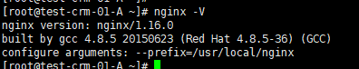
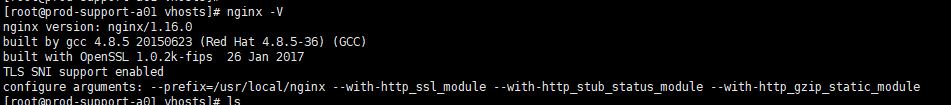

## 目的

在日常运维工作中，有几个场景：

1，nginx  web服务升级 。

2，https证书配置后，发现nginx编译没有加入ssl模块。

3，nginx配置后，有`nginx: [emerg] the "xxx" parameter requires `等等报错。

这些都需要重新编译nginx程序，并把需要的模块加载进去，但是对于不熟悉nginx的人，又头疼和担心，需要重新编译，会不会对原来有啥影响等等。本文就是针对这些场景给出解决方案。

<!--more-->

## 环境

centos7


## 解决方案

首先，需要说明的是nginx因为其开放性而广受欢迎，其中开放性就是：松耦合，需要啥模块，重新加载编译后替换就可以了，所以完全不需要担心。

#### 安装依赖包

```bash
yum install -y gcc gcc-c++ pcre pcre-devel zlib zlib-devel openssl openssl-devel
```

#### 查看nginx原有模块

```
nginx -V
```



可以看到没有加载模块

#### 重新编译

```bash
# 进入到源码包
cd /opt/packages/sunscripts/install/packages/nginx-1.16.0
# 配置
./configure --prefix=/usr/local/nginx  --with-http_ssl_module  --with-http_stub_status_module  --with-http_gzip_static_module
# 编译
make
注意：这里不要进行make install，否则就是覆盖安装
```

#### 替换

```bash
# 备份
cp /usr/local/nginx/sbin/nginx /usr/local/nginx/sbin/nginx.bak
# 停nginx
systemctl stop nginx.service
# 替换
cp ./objs/nginx /usr/local/nginx/sbin/
# 启动
systemctl start nginx.service
# 检查验证
/usr/local/nginx/sbin/nginx -V　
```



## 总结

按照上面的方案，按照自己需求加载模块，定制自己的nginx。


## 一键安装nginx脚本