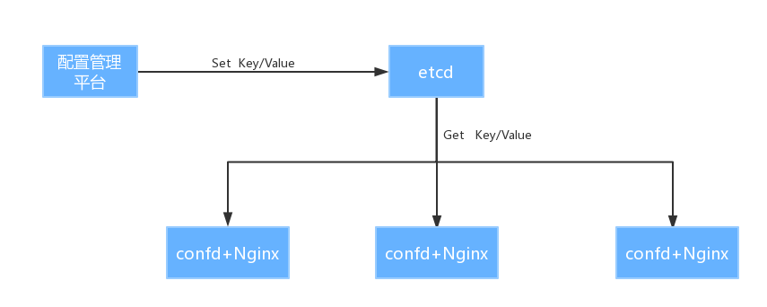
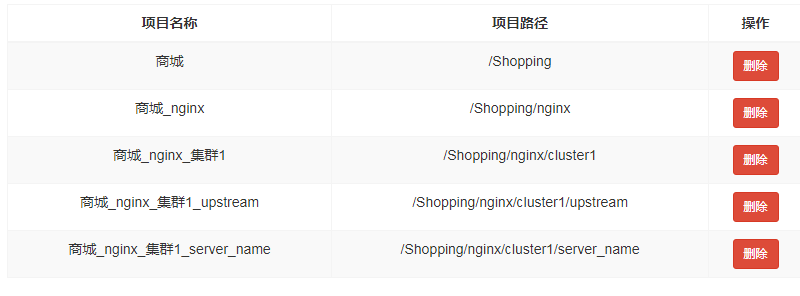
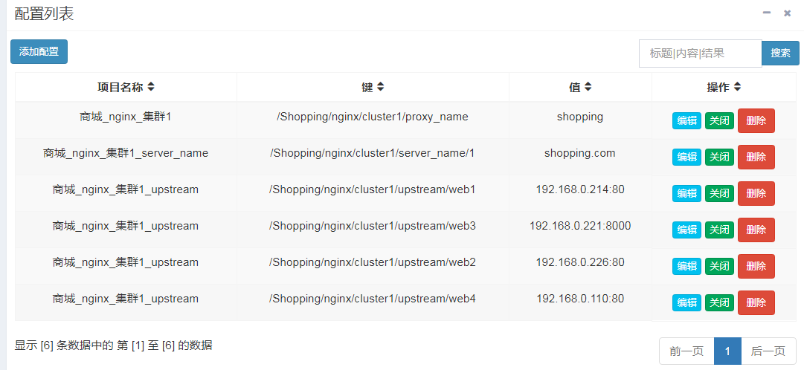

## 目的

熟悉nginx的配置不难发现，nginx是一个典型的key value类型的，而且与文件系统的非常类似，一个目录下面可以包含其他配置，目录下还可以有目录，嵌套多层。如今key value类型的数据库非常多，redis、leveldb等，最近新秀etcd也是key-value分布式数据库，提供类似文件系统操作，使用raft协议保持数据一致性，非常适合云计算分布式部署场景，将confd与etcd搭配，非常适合nginx这样的配置格式。本文就详细讲解了nginx配置管理平台的实现。

<!--more-->

## 环境

```shell
CentOS 7.x x64
Python:  2.7.6
Etcd： 3.2.18
Confd:  0.16.0
Nginx: 1.12.1
```

## 拓扑图

**简易拓扑**



**配置平台详情拓扑**


## 涉及软件

```shell
etcd：分布式KV存储系统，一般用于共享配置和服务注册与发现。是CoreOS公司发起的一个开源项目。 ETCD存储格式类似于文件系统，以根"/"开始下面一级级目录，最后一个是Key，一个key对应一个Value。
etcd集群：使用Raft协议保证每个节点数据一致，由多个节点对外提供服务。这里只用单台。

confd：管理本地应用配置文件，使用etcd或consul存储的数据渲染模板，还支持redis、zookeeper等。
confd有一个watch功能，通过HTTP API定期监测对应的etcd中目录变化，获取最新的Value，然后渲染模板
Nginx:  Nginx是一款轻量级的Web服务器/反向代理服务器以及电子邮件代理服务器，并在一个BSD-like协议下发行。由俄罗斯的程序设计师lgor Sysoev所开发，供俄国大型的入口网站及搜索引擎Rambler使用。其特点是占有内存少，并发能力强，事实上nginx的并发能力确实在同类型的网页服务器中表现较好。
```

## 软件部署

### 安装etcd

注意：这里安装的单机,集群环境根据自己的需求选取

```shell
yum install etcd -y
sed -i  's/localhost/0.0.0.0/g'  /etc/etcd/etcd.conf  #配置监听地址
systemctl   start  etcd  &&  systemctl  enable  etcd  #启动服务设置开机动
```

### 安装nginx

```shell
# 安装依赖包
yum install  python-devel gcc gcc-c++ pcre  pcre-devel   patch   unzip   zlib  zlib-devel  openssl openssl-devel  git  -y  #依赖包
# 下载nginx包
cd  /usr/local/src
wget  http://nginx.org/download/nginx-1.12.1.tar.gz
git clone https://github.com/yaoweibin/nginx_upstream_check_module.git  
# 安装
tar  -zxvf  nginx-1.12.1.tar.gz 
cd nginx-1.12.1
patch  -p1 </usr/local/src/nginx_upstream_check_module/check_1.12.1+.patch

./configure   --prefix=/usr/local/nginx --add-module=/usr/local/src/nginx_upstream_check_module/

make -j4 && make install
# 修改配置
mkdir  /usr/local/nginx/conf/vhost/
# Nginx http的配置文件修改为这个样子,增加include目录配置
vim  /usr/local/nginx/conf/nginx.conf

  http {
    include       mime.types;
    default_type  application/octet-stream;

    #log_format  main  '$remote_addr - $remote_user [$time_local] "$request" '
    #                  '$status $body_bytes_sent "$http_referer" '
    #                  '"$http_user_agent" "$http_x_forwarded_for"';

    #access_log  logs/access.log  main;

    sendfile        on;
    #tcp_nopush     on;

    #keepalive_timeout  0;
    keepalive_timeout  65;

    #gzip  on;

    include   vhost/*.conf;
  }

```

### 安装confd

```shell
下载地址https://github.com/kelseyhightower/confd/releases
下载完毕丢到系统里面
cp confd  /usr/bin/confd 
which  confd
#/usr/bin/confd
```
### 创建配置文件目录

```shell
mkdir -p /etc/confd/{conf.d,templates}
# conf.d          # 资源模板，下面文件必须以toml后缀
# templates       # 配置文件模板，下面文件必须以tmpl后缀
```
### 创建confd配置文件

```shell
vim /etc/confd/conf.d/test.conf.toml

[template]
src = "test.conf.tmpl"                              #默认在/etc/confd/templates目录下
dest = "/usr/local/nginx/conf/vhost/test.conf"      #要更新的配置文件
keys = [
"/Shopping",                                      #监测的key
]
check_cmd = "/usr/local/nginx/sbin/nginx -t"   #配置文件测试
reload_cmd ="/usr/local/nginx/sbin/nginx -s reload"   #加载配置文件
```
### 创建confd模板

```shell
vi  /etc/confd/templates/app01.conf.tmpl 
	
	upstream {{getv "/Shopping/nginx/cluster1/proxy_name"}} {
		{{range getvs "/Shopping/nginx/cluster1/upstream/*"}}
			server {{.}};
		{{end}}

	  check interval=5000 rise=1 fall=5 timeout=4000 type=http;
	  check_http_send "HEAD / HTTP/1.0\r\n\r\n";
	  check_http_expect_alive http_2xx http_3xx;
	}
	  
	server {
	   server_name {{range getvs "/Shopping/nginx/cluster1/server_name/*"}} {{.}} {{end}};
	   location / {
		   proxy_pass        http://{{getv  "/Shopping/nginx/cluster1/proxy_name"}};
		   proxy_redirect off;
		   proxy_set_header Host $host;
		   proxy_set_header X-Real-IP $remote_addr;
		   proxy_set_header X-Forwarded-For $proxy_add_x_forwarded_for;
		}
		  location /status {
					check_status;
					access_log   off;
			   }
	}
```
### 在Ectd中写入变量

```shell
etcdctl set /Shopping/nginx/cluster1/proxy_name test.com
etcdctl set /Shopping/nginx/cluster1/server_name/servername shopping.com
etcdctl set /Shopping/nginx/cluster1/upstream/serverA 192.168.1.2:8080
etcdctl set /Shopping/nginx/cluster1/upstream/serverB 192.168.1.3:8080
```

### 启动confd并设置开机启动

```shell
# 需要更改etcd 的连接地址即可
nohup confd -watch -backend etcd -node http://localhost:2379 &
```
### 验证

confd启动后会自动生成配置文件，如图：


## 配置平台部署

配置Python环境

```shell
yum install python-pip -y         #安装pip
mkdir /root/.pip/               #创建pip源配置文件目录
vim  /root/.pip/pip.conf          #修改为阿里云的pip源
	[global]
	trusted-host=mirrors.aliyun.com
	index-url=http://mirrors.aliyun.com/pypi/simple/
	[list]
	format=columns
```
### 创建虚拟环境

```shell
pip install   virtualenv         #安装沙盒工具
virtualenv   env                 #建议创建一个沙盒环境跑该平台
source  env/bin/activate         #使用沙盒环境

git  clone  https://github.com/1032231418/Conf_Web.git
cd  Conf_Web/ospweb/
pip install -r requirement.txt   #安装相关软件
```

### 创建数据库并将表刷入数据库

```shell
mysql  -p          #登录数据库为平台创建一个数据库
CREATE DATABASE  opsweb  CHARACTER SET utf8 COLLATE utf8_general_ci;      #创建数据库

vi opsweb/settings.py   #这里数据库信息改为自己的数据库信息
  DATABASES = {
    'default': {
    'ENGINE': 'django.db.backends.mysql',
    'NAME': 'opsweb',
    'HOST': 'localhost',
    'USER': 'root',
    'PASSWORD': '123456',
    'PORT': 3306,
    }
  }
  ETCD_Server = "192.168.0.221"        #这里改为自己etcd 的ip地址
  ETCD_Port = 2379
		
python manage.py   migrate          #提交迁移文件至数据库,将表刷入数据库
```
### 创建超级管理员账号

```shell
python manage.py  createsuperuser
```

### 运行平台

```shell
python manage.py  runserver 0:8000
# 访问地址就是 http://ip:8000   账号密码就是上一步创建的超级管理员账号密码
```
### 登录平台为nginx创建key/value  

	以Shopping 平台为例
	
	项目创建:
	1.创建商城项目  /Shopping
	2.创建商城项目里面的 /Shopping/nginx   nginx 服务
	3.创建nginx 集群目录  /Shopping/nginx/cluster1
	4.给我们的商城nginx集群1项目创建配置文件
	5.域名 和 节点名称可能是多个，这里我们需要创建目录 /Shopping/nginx/cluster1/server_name 和 /Shopping/nginx/cluster1/upstream



```shell
配置创建:
1.反向代理        /Shopping/nginx/cluster1/proxy_name  
2.绑定一个域名     /Shopping/nginx/cluster1/server_name/1	
3.创建一个集群节点 /Shopping/nginx/cluster1/upstream/web1	
```



```
etcd 里面存储的值
```


```
生成的配置文件
```


```
通过hosts 文件我们可以查看节点状态(虽然这个节点不是up 状态但是由此可见,我们可以动态添加节点)
```


## nginx + uwsgi + django项目部署

### uwsgi 部署

```shell
source  env/bin/activate      #使用沙盒
pip install uwsgi             #安装 uwsgi

vim   uwsgi.ini 
[uwsgi]
# 配置服务器的监听ip和端口，让uWSGI作为nginx的支持服务器的话，设置socke就行；如果要让uWSGI作为单独的web-server，用http
http = 127.0.0.1:8000
#socket = 127.0.0.1:3309
# 配置项目目录（此处设置为项目的根目录）
chdir =  /home/web/opsweb
# 配置入口模块 (django的入口函数的模块，即setting同级目录下的wsgi.py)
wsgi-file =  opsweb/wsgi.py
# 开启master, 将会多开一个管理进程, 管理其他服务进程
master = True
# 服务器开启的进程数量
processes = 8
# 以守护进程方式提供服, 输出信息将会打印到log中
daemonize = wsgi.log
# 服务器进程开启的线程数量
threads = 4
# 退出的时候清空环境变量
vacuum = true
# 进程pid
pidfile = uwsgi.pid
# 配uWSGI搜索静态文件目录（及django项目下我们存放static文件的目录，用uWSGI作为单独服务器时才需要设置，此时我们是用nginx处理静态文件）
# check-static =  /home/web/opsweb/static/

/home/env/bin/uwsgi --ini uwsgi.ini   #启动服务
```

### nginx 配置

```shell
vim  /usr/local/nginx/conf/vhost/ops.conf

  upstream  ops_web {
      server  127.0.0.1:8000;
  }

  server {
     server_name    ops.xxx.com;       #改为你平台的域名
     location / {
       proxy_pass        http://ops_web;
       proxy_redirect off;
       proxy_set_header Host $host;
       proxy_set_header X-Real-IP $remote_addr;
       proxy_set_header X-Forwarded-For $proxy_add_x_forwarded_for;
    }

    location /static {
          alias  /home/web/opsweb/static/;
      }
  }
  
/usr/local/nginx/sbin/nginx  -s  reload  #重新加载配置文件
```
