## 目的

本篇文章介绍下openfalcon的基本原理和使用，粒度相对较粗，主要目的是使大家迅速掌握open-falcon的数据模型、功能模块、运作流程和使用方法。

<!--more-->

## **基本介绍**

Open-Falcon 是小米研发的一款开源的互联网企业级监控系统解决方案，目前小米、金山云、美团、京东金融、滴滴等公司有在使用。

下面我们遵循着问题来展开整篇文章。**首先，open-falcon能做什么？**

主要特点有

  ①数据采集免配置：agent自发现、支持Plugin、主动推送模式

  ②容量水平扩展：生产环境每秒50万次数据收集、告警、存储、绘图，可持续水平扩展。

  ③告警策略自发现：Web界面、支持策略模板、模板继承和覆盖、多种告警方式、支持回调动作。

  ④告警设置人性化：支持最大告警次数、告警级别设置、告警恢复通知、告警暂停、不同时段不同阈

​      值、支持维护周期，支持告警合并。

  ⑤历史数据高效查询：秒级返回上百个指标一年的历史数据。

  ⑥Dashboard人性化：多维度的数据展示，用户自定义Dashboard等功能。

  ⑦架构设计高可用：整个系统无核心单点，易运维，易部署。

**其次，openfalcon能对哪些项目做监控 ？**

 1）基础监控。

   比如CPU、Load、内存、磁盘、IO、网络相关、内核参数、ss 统计输出、端口存活状态、进程存活状态、核心服务的进程存活信息采集、关键业务进程资源消耗、NTP offset采集、DNS解析采集，这些指标，都是open-falcon的agent组件直接支持的。

  2）业务应用监控。

   比如我的应用服务部署上线后，需要统计某个接口的平均耗时、调用次数、成功率等信息，这些属于业务应用的监控。这里需要研发人员编写脚本等方式来收集数据，然后发送到open-falcon的transfer组件。

  3）第三方开源软件监控。

  比如mysql、lvs、nginx、redis、mq等，需单独编写采集脚本或插件，这些常见的软件，一般开源社区都有提供相应的脚本。

  这里有个openfalcon与其他一些监控软件的对比，

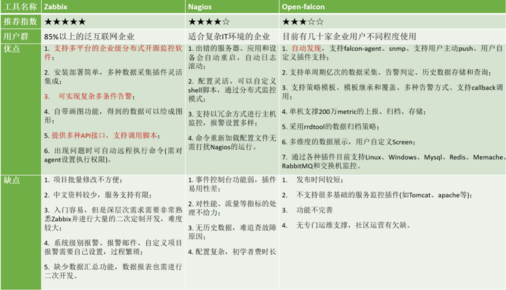

**个人觉得，falcon比较大的优势在于扩展性和灵活性方面。**

## **技术架构**

涉及架构或结构时，图是比较好的展示方式，下图摘自官网，可以看出组件及组件间协作。

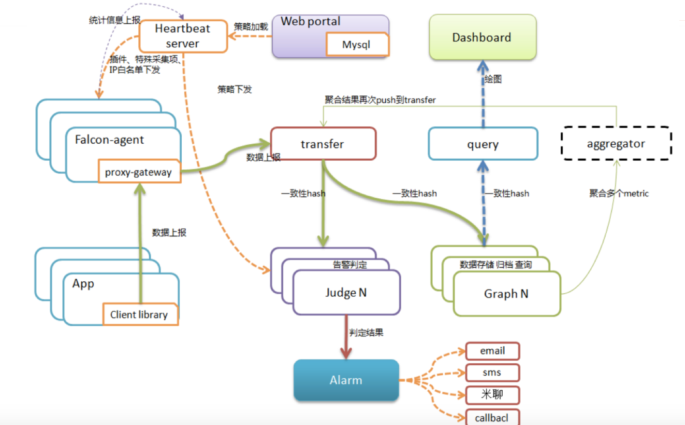

绿色的粗线表示数据传输流程，橙黄色虚线表示控制流（策略，告警），浅蓝色虚线标识查询流程；

下图是一个相对规整的数据流图，更有助于理解：

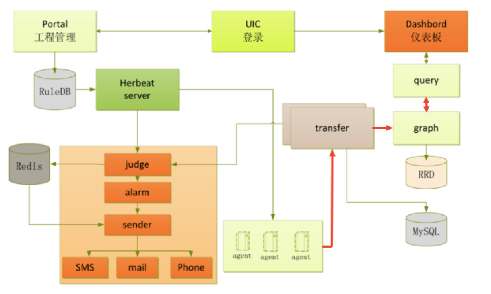

具体而言，整体的运作流程如下：

1、目标服务器运行agent 

2、agent采集各类监控项数值，传给transfer

3、transfer校验和整理监控项数值，做一致性hash分片，传给对应的judge模块以验证是否触发告警 

4、transfer整理监控项数值，做一致性hash分片，传输给graph以进行数据的存储 

5、judge根据具体报警策略或阈值进行告警判断，如触发告警则组装告警event事件，写入缓存队列。 

6、alarm和sender根据event事件中的判定结果，执行event，像用户组发送短信或邮件。 

7、graph收到监控项数据后，将数据存储成RRD文件格式，进行归档，并提供查询接口。 

8、query将调用graph的查询接口，将监控数据传送到dashboard以进行页面展示。 

9、dashboard则渲染页面，展示曲线报表图等。 

10、portal提供页面供用户配置机器分组、报警策略、表达式、nodata等配置。

## **数据模型**

灵活强大的数据模型能提高监控系统的使用效率和灵活性（这小节提到的数据模型应该叫监控项数据模型），**open-falcon的数据模型长什么样？设计初衷又是什么？**

```json
open-falcon的"监控项"模型如下，
{
       metric: cpu.busy,               // 监控项名称

       endpoint: open-falcon-host,     // 目标服务器的主机名

       tags: srv=falcon,group=az1,     // tag标签，作用是聚合和归类，在配报警策略时会比较方便。

       value: 10,                      // 监控项数值

       timestamp: `date +%s`,          // 采集时间

       counterType: GAUGE,             //  监控项类型。 

       step: 60                        // 采集间隔。 秒。
}
```
这种模型的主要好处：一是方便从多个维度来配置告警，二是可以灵活的进行自主数据采集。

    第一点，比如tag的使用起到了给机器进行归类的作用，比如有3台机器：host1、host2和host3，如果tags依次配置为"group=java", "group=java"和"group=erlang"，那么配置报警策略"metric=cpu/group=java“时就只会对java标签的机器（即host1，host2)生效。
    
    第二点，由于agent会自发现的采集很多基本的系统指标，但是对业务应用等需要研发人员自己写脚本收集和上报。这里openfalcon定义了监控项模型，相当于定义了一个规范，当研发人员需要监控某个对象（比如mysql、redis等），只需采集数据，并遵守规范包装成监控项模型，再上报即可。
**open-falcon使用的监控项有哪些类型 ？**

主要有三种：

(1) GAUGE：实测值，直接使用采集的原始数值，比如气温；

(2) COUNTER：记录连续增长的数据，只增不减。比如汽车行驶里程，网卡流出流量，cpu_idle等；

(3) DERIVE：变化率，类似COUNTER ，但是可增可减。

## **主要模块**

### **agent** 

- **首先，什么是Agent？**

agent是go开发的daemon程序，用于自发现的采集机器的各种数据和指标。部署在目标机器上，无需在server端进行任何配置，安装后启动即工作，是open-falcon的”数据采集者”。

- **主要功能？**

​       1）自发现的采集各类数据和指标，上报transfer；

​       2）与hbs进行心跳连接通信，上报主机状态，同步插件和监控进程、监控端口；

-  **可采集的数据有哪些？**

​        基础监控项(硬件,负载)、业务应用监控数据、各种开源软件监控数据等。

- **falcon是如何采集的？**

     1）基础监控

  ​    一般是读系统文件或执行基本命令，然后对原始值进行处理。比如cpu和内存信息是通过读取/proc/stat和/proc/meminfo获得；端口监控，是通过ss –ln 来判断指定端口是否处于listen状态；

     2）业务应用监控

     一般由”插件”或”采集脚本”实现，需自己编写。比如接口的调用次数、耗时、失败次数、成功次数都属于这类。(日志、基础统计工具)

     3）开源软件监控

     一般开源社区都有提供采集脚本

- **如何扩展agent -- 插件？**

  除了基础监控项，有时用户想扩展agent的功能以采集更多指标，openfalcon提供了插件机制。插件的使用可以参考官方git文档，下面摘抄了作者们的一段话，其实就是一些采集脚本及同步执行的方式。

    “插件设计思路：

    a) 写一个采集数据的脚本

    b) 把脚本分发到需要采集数据的机器上

    c) 写一个cron每隔一段时间去跑这个脚本

    d) 收集脚本的输出，调用server的接口去push数据

    e) 根据需求相应的对脚本做上线、下线、升级”

- **agent的工作流程：**

  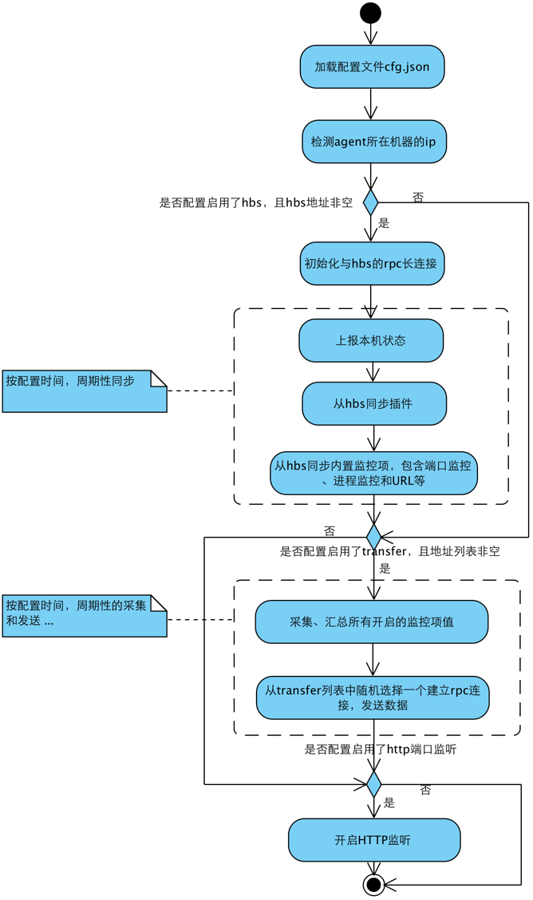

### **Transfer组件**

- **什么是transfer？**

  open-falcon的后端门户，监控数据的中转接点。

- **transfer的职责角色？**

  提供数据接收接口和自定义脚本push数据；

​        根据一致性hash算法将内存队列中的数据发送给graph和judge模块；(重点)

​        为每个后端实例创建一个 定长Queue；

​        为每个后端实例维护一个rpc连接池；

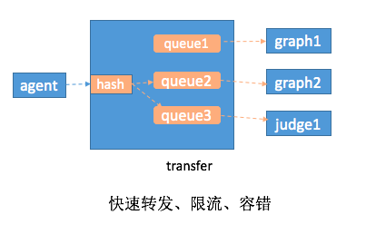

这里每个后端的graph或judge实例都建立了一个rpc连接池和一个定长Queue队列。

有两个小点这里提下：

1，定长Queue队列目的是应对高峰流量，丢失一部分高峰时段的数据保证了后端的graph和judge组件不受影响；

 2. v1.0版本的openfalcon中，每个graph实例可以有多个ip而且transfer会给每个ip发送相同的一份数据，但是judge中每个实例只能有1个ip。

- **transfer的工作流程？**

  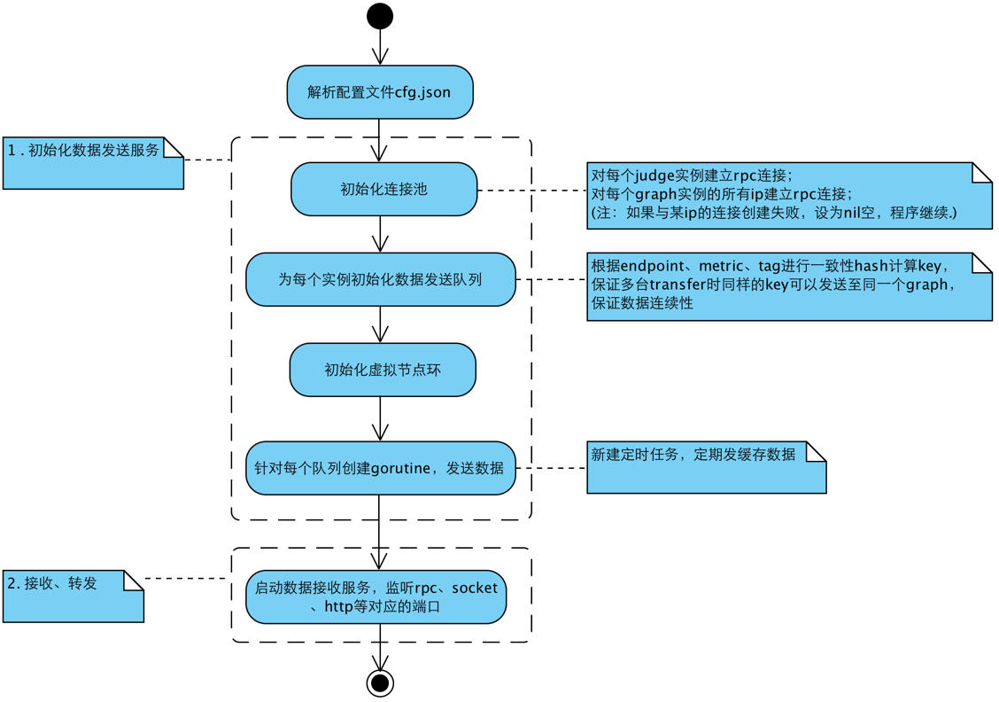

### **graph组件**

- **什么是graph？graph的职责？**

​      存储监控数据、提供监控数据的高效查询接口。

- **graph的架构图(摘自项目git)：**

  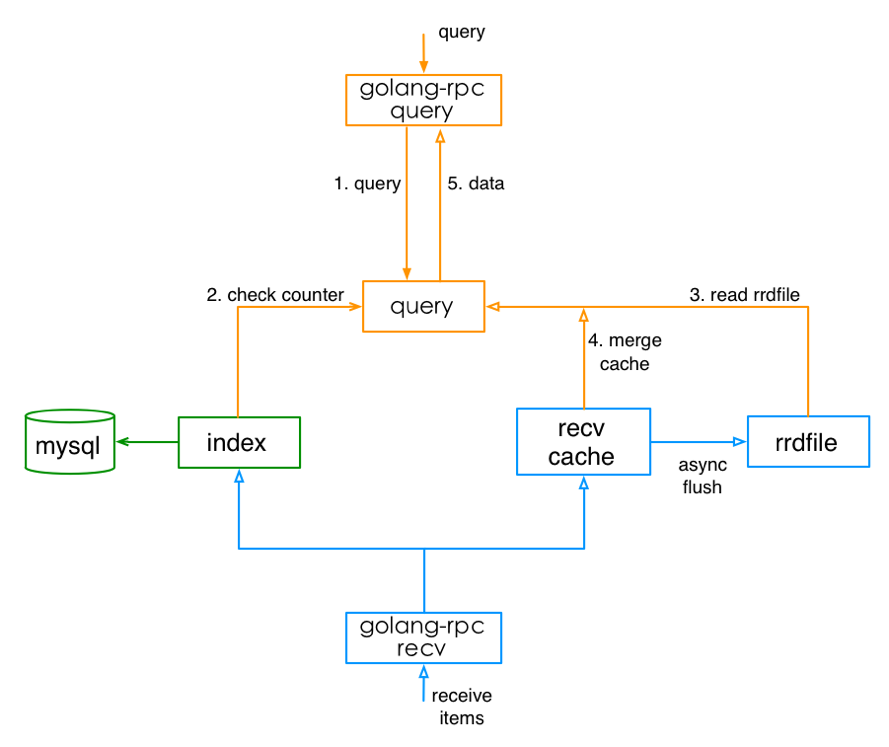

### **judge&alarm&sender组件**

这三个组件是报警的链路，负责判断是否触发报警，理论上可以进化成一个模块。感兴趣的可以看代码，很多匹配逻辑。

judge: 记载策略到缓存，判断监控项是否触发告警策略，发告警事件；

alarm&sender: 读取告警事件；发邮件、短信等；

### **hbs组件**

- **什么是hbs，hbs的职责？**

​      heart beat server，心跳服务器，更多承担”配置中心”的角色。

​      1）Agent可以从hbs同步”报警策略”、”进程存活监控”、”端口存活监控”等信息。

​      2）agent定期发送心跳信息，hbs负责维护host表；

- **hbs的工作流程：**

  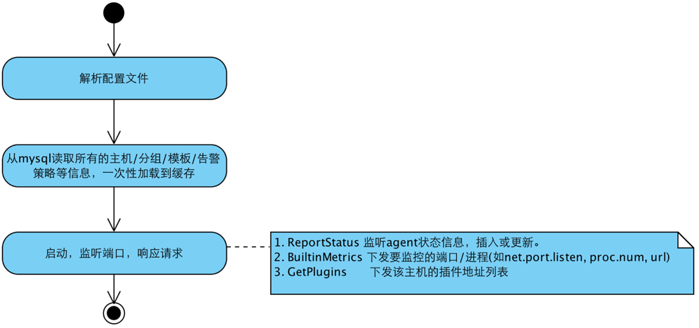

## **如何使用？**

### 目标 

  (1)、如何监控基本监控项？

  (2)、如何使用插件，监控“第三方应用”？如何监控“端口/进程”？

  (3)、如何配置“告警规则”?

  (4)、如何使用hostGroup、template、expression、nodata、uic？

  (5)、如何更好管理机器？如hostName、hostGroup的命名约定；

### **先要理解的一些概念** 

  (1)、机器分组

  (2)、用户组

  (3)、模板

  (4)、表达式

  (5)、报警策略

  (6)、回调动作

### **如何采集基本监控项 ？**

 在目标机器上部署agent，正确配置，启动即可；

### **如何监控“第三方应用”，如mysql/lvs/nginx？**

自己写脚本，上报到open-falcon；或者使用开源的插件或脚本；

 https://book.open-falcon.org/zh/philosophy/data-collect.html

### **如何监控“端口存活”、“进程存活” ？**

在port页面，新增expression或template，给指定进程或端口配置报警策略；

### **使用机器分组和报警策略模板？**

这里刚开始接触时觉得特别麻烦，后来拉出代码，分析其关联关系，梳理出了模型及关系图，一切变得清晰。下图依次是：hostgroup机器组管理、Tempalte报警策略模板、模型关系UML图。重点理解UML图，然后去页面上操作和比较下。

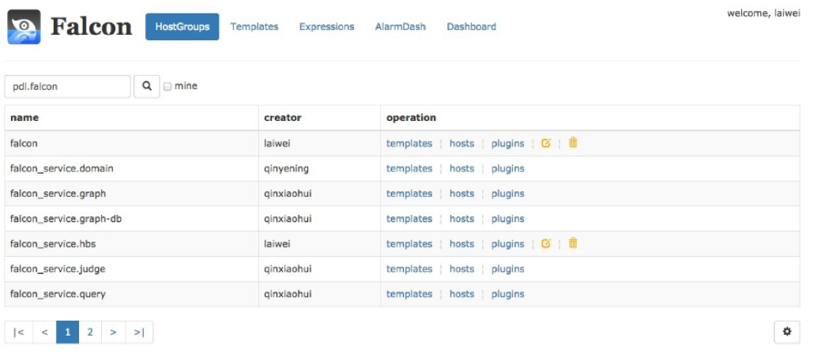

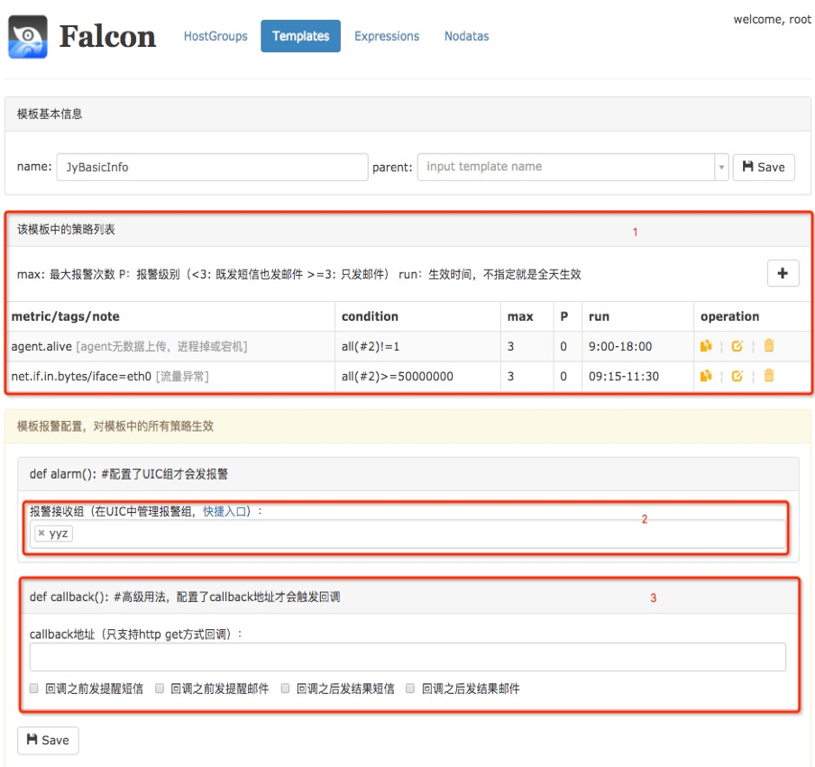

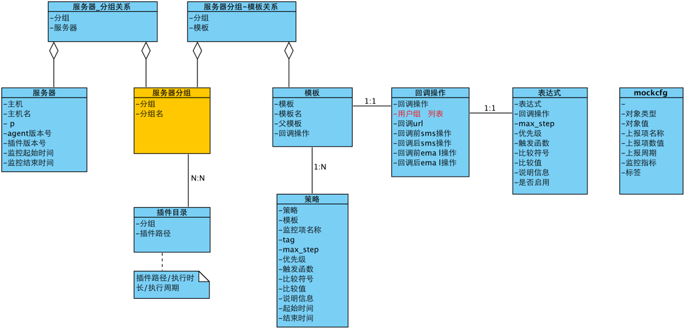

### **如何使用表达式 ？“策略表达式”与”策略模板”的区别？**

表达式比较简洁，在结合tag时可以使用策略表达式。

当无法区分类别时，比如所有监控项都没有加tag，只有进行人工分类，即使用”机器分组”，然后将”策略模板”绑定到”机器分组”。

## **其他**

其他需要自己翻文档或代码了，比如nodata，aggravation等等。通过这篇文章，希望能掌握open-falcon的运作机制，数据模型，如何使用它。