## 介绍

Selenium 是自动化测试工具。它支持各种浏览器，包括 Chrome，Safari，Firefox 等主流界面式浏览器，如果你在这些浏览器里面安装一个 Selenium 的插件，那么便可以方便地实现Web界面的测试。
Selenium 2，又名 WebDriver，它的主要新功能是集成了 Selenium 1.0 以及 WebDriver（WebDriver 曾经是 Selenium 的竞争对手）。也就是说 Selenium 2 是 Selenium 和 WebDriver 两个项目的合并，即 Selenium 2 兼容 Selenium，它既支持 Selenium API 也支持 WebDriver API。


## 参考文档

[中文参考文档](http://selenium-python-zh.readthedocs.io/en/latest/index.html)
[英文参考文档](http://selenium-python.readthedocs.io/index.html)

<!--more-->


## 环境

python安装这里省略，可以参考[python官网](www.python.org)

实战测试是在windows10系统中执行。


## 安装

#### 安装模块

```bash
pip install selenium
```

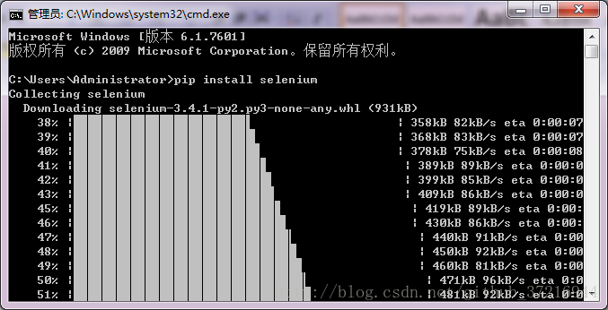

友情提示：如果无法访问，可以使用这个工具代理上网。https://github.com/getlantern/lantern

#### 安装Chrome WebDriver

通过在Chrome地址栏中输入chrome://version/来查看浏览器版本

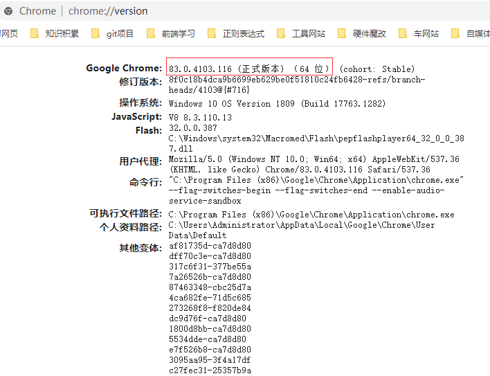

根据查询的版本，在[官方下载地址](https://chromedriver.storage.googleapis.com/index.html)下载对应版本和系统的webdriver

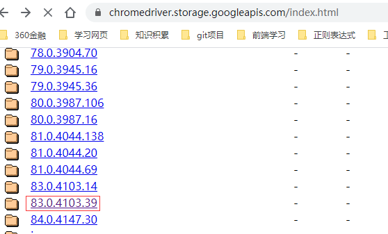

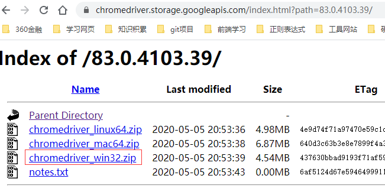

将解压后chromedriver.exe文件复制到浏览器的安装目录下，默认路径为C:\Program Files (x86)\Google\Chrome\Application；将解压后chromedriver.exe文件复制到python的安装目录下。同时把chrome的安装目录加入到path环境变量中。

到此，已经安装完成了。

## 自动化实战

12306自动化订票


#### 知识点

- 运用了Selenium定位web元素的方法
- 浏览器调试工具使用

#### 流程

1） 人工走一遍流程，对自动化的流程心中有数
2） 按步骤拆分，然后对每一个小步骤编写自动化脚本
3） 将所有步骤合起来，多次运行，测试脚本


#### 打开12306官网

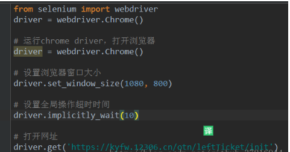

脚本运行

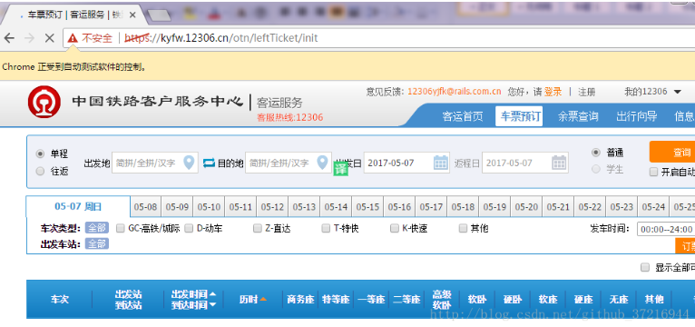

#### 登录12306

1）在chrome界面，按F12快捷键，弹出chrome的调试工具
2）找出登录按钮的id和username、password的id

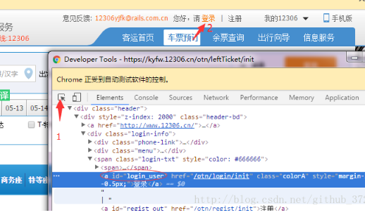

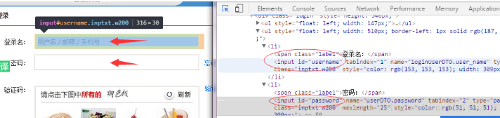

脚本定位元素

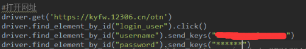

运行脚本，登录成功

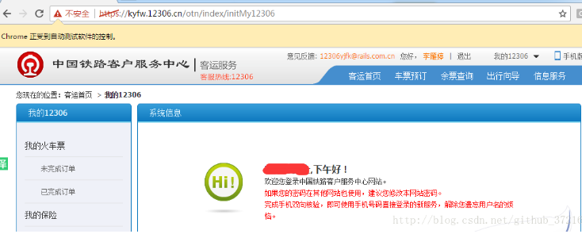

根据链接的文本来定位车票预订元素

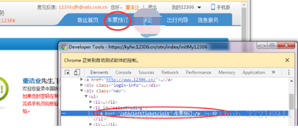

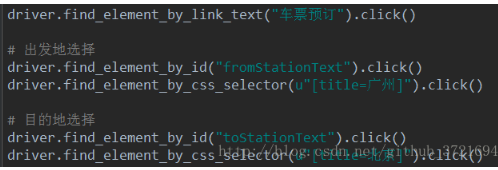

#### 选择出发地

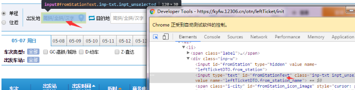

***利用js代码冻结浏览器界面***。

```
setTimeout(function(){debugger;}, 5000)
```

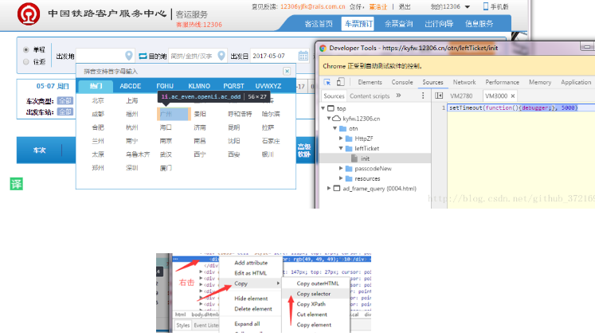

右击代码位置，选择copy selector

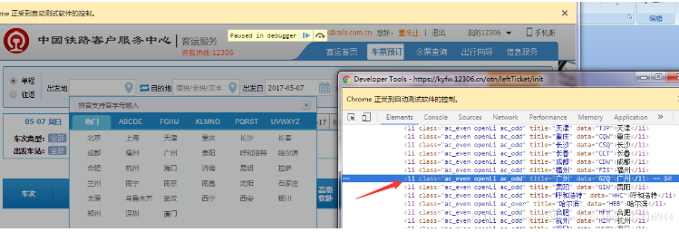

#### 选择出发日

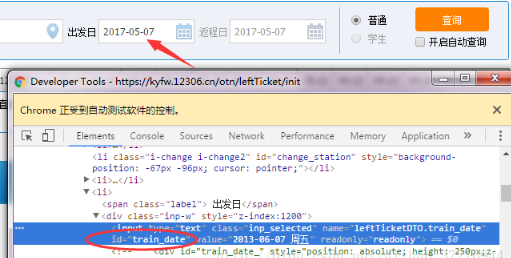

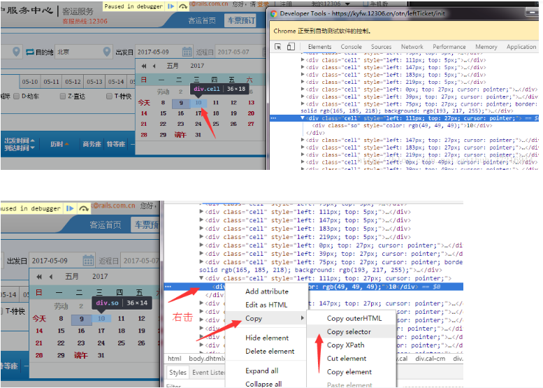

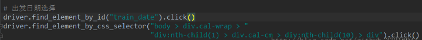

#### 选择车次类型

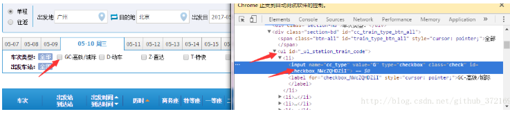

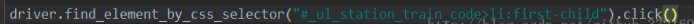

#### 查询

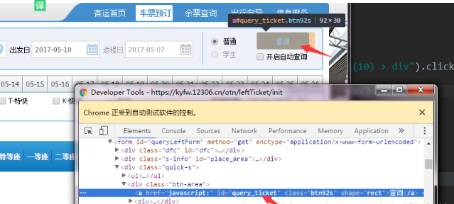

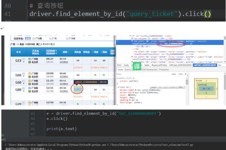

#### 循环刷票

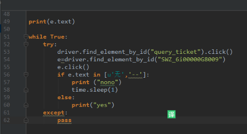

## 实战问题

1、不能破解12306的变态验证码。没有自动破解验证码，所以留五秒钟自己手动选验证码。
2、因为是学生认证所以多一步需要确认(不是学生可去掉)
3、订票成功


## 优劣势

优点：能够很快、很广泛地查找缺陷，同时可以做很多重复性的工作，在回归测试阶段，我们可以利用自动化功能测试工具进行，而无须大量的软件测试人员手动的再次执行测试用例，极大的提高了工作效率。
缺点：它们只能检查一些比较主要的问题，如崩溃、死机，但是却无法发现一些一般的日常错误，这些错误通过人眼很容易找到，但机器却往往找不到。另外，在自动测试中编写测试脚本工作量也很大，有时候该工作量甚至超过了手动测试的时间。
Selenium脚本的执行速度受多方面因素的影响，如网速，操作步骤的繁琐程度，页面加载的速度，以及我们在脚本中设置的等待时间，运行脚本的线程数等。所以不能单方面追求运行速度的，要确保稳定性，能稳定地实现回归测试才是关键。
Selenium保证元素成功率是通过元素的定位，当然它的定位方法很多，一定能有合适的。但是在自动化工程的实施过程中，高质量的自动化测试不是只有测试人员保证的。需要开发人员规范开发习惯，如给页面元素加上唯一的name,id等，这样就能大大地提高元素定位的准确性。

## 实战代码

```python
#-*-coding:utf8-*-
import time
from selenium import webdriver

#运行chrome，打开浏览器
driver =webdriver.Chrome()
#设置浏览器窗口
driver.set_window_size(1080,800)

#设置全局操作时间
driver.implicitly_wait(10)

#打开网址
driver.get('https://kyfw.12306.cn/otn')
#睡五秒自动选择验证码
time.sleep(5)

driver.find_element_by_id("username").click()
driver.find_element_by_id("username").send_keys("用户名")      #填写12306的账号
driver.find_element_by_id("password").send_keys("***")        #填写12306的密码
print("continue")
time.sleep(15)

driver.find_element_by_link_text("车票预订").click()
time.sleep(5)
#出发地选择
driver.find_element_by_id("fromStationText").click()
# setTimeout(function(){debugger;}, 5000)
driver.find_element_by_css_selector(u"[title=广州]").click()

time.sleep(5)
#目的地选择
driver.find_element_by_id("toStationText").click()
driver.find_element_by_css_selector(u"[title=北京]").click()
time.sleep(5)

#出发日期选择
driver.find_element_by_id("train_date").click()
driver.find_element_by_css_selector("body > div.cal-wrap > div:nth-child(1) > div.cal-cm > div:nth-child(24) > div").click()
time.sleep(5)

#车型选择
driver.find_element_by_css_selector("#_ul_station_train_code > li:nth-child(1) > label").click()
time.sleep(5)

while True:
    try:
        driver.find_element_by_id("query_ticket").click()
        e=driver.find_element_by_id("SWZ_6i00000G720F")
        e.click()
        if e.text in [u'无','--']:
            print ("nono")
            time.sleep(1)
        else:
            print("yes")
            # 购票
            driver.find_element_by_link_text("预订").click()
            # 乘车人选择
            driver.find_element_by_css_selector("#normal_passenger_id > li:nth-child(1) > label").click()
            # 学生票确认（不是学生可去掉）
            driver.find_element_by_link_text("确认").click()
            # 提交订单
            driver.find_element_by_link_text("提交订单").click()
            driver.find_element_by_link_text("确认").click()
    except:
        pass
```

