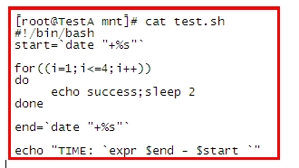
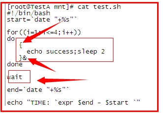
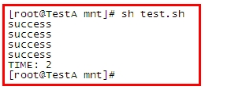
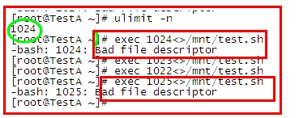
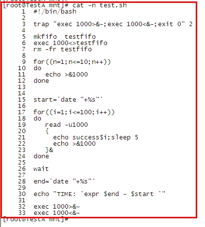
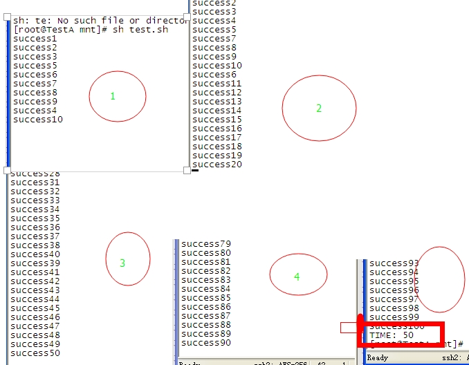

## 背景

日常工作中编写shell脚本处理事务，很多时候需要一次性处理很多，需要用到循环，但是循环体内还是线性的，还是要一个个处理，这样并不会节省很多时间，只是节省了人工一次次输入的繁琐。但是对于提高处理能力，没有实质性的提高。这就需要考虑并发。但Shell中并没有真正意义的多线程，要实现多线程可以启动多个后端进程，最大程度利用cpu性能。即：多进程并发，本篇教程由浅入深详细介绍了shell中的多进程并发。


<!--more-->

## 实验

所谓的多进程只不过是将多个任务放到后台执行而已，很多人都用到过，所以现在讲的主要是控制，而不是实现。

#### 实验一

先看一个小shell：



看执行结果：


很明显是8s，这种不占处理器却有很耗时的进程，我们可以通过一种后台运行的方式
来达到节约时间的目的。

#### 实验二

如下为改进：



 

用“{}”将主执行程序变为一个块，用&放入后台，四次执行全部放入后台后，我们需要用一个wait指令，等待所有后台进程执行结束，不然 系统是不会等待的，直接继续执行后续指令，知道整个程序结束。
看结果：

 

可以看到，时间已经大大缩短了！

#### 实验三

以上实验虽然达到了多线程并发的目的，但有一个缺陷，不能控制运行在后台的进程数。为了控制进程，我们引入了管道 和文件操作符。

无名管道： 就是我们经常使用的 例如： cat text | grep "abc"   那个“|”就是管道，只不过是无名的，可以直接作为两个进程的数据通道
有名管道： mkfilo  可以创建一个管道文件 ，例如： mkfifo　fifo_file

管道有一个特点，如果管道中没有数据，那么取管道数据的操作就会停滞，直到管道内进入数据，然后读出后才会终止这一操作，同理，写入管道的操作，如果没有读取操作，这一个动作也会停滞。

 

当我们试图用echo想管道文件中写入数据时，由于没有任何进程在对它做读取操作，所以它会一直停留在那里等待读取操作，此时我们在另一终端上用cat指令做读取操作

 

你会发现读取操作一旦执行，写入操作就可以顺利完成了，同理，先做读取操作也是一样的：
 


由于没有管道内没有数据，所以读取操作一直滞留在那里等待写入的数据


一旦有了写入的数据，读取操作立刻顺利完成

以上实验，看以看到，仅仅一个管道文件似乎很难实现 我们的目的（控制后台线程数),  所以 接下来介绍 文件操作符，这里只做简单的介绍，如果不熟悉的可以自行查阅资料。
系统运行起始，就相应设备自动绑定到了 三个文件操作符   分别为 0  1  2 对应 stdin ，stdout， stderr 。
在 /proc/self/fd 中 可以看到 这三个三个对应文件

 

输出到这三个文件的内容都会显示出来。只是因为显示器作为最常用的输出设备而被绑定。

我们可以exec 指令自行定义、绑定文件操作符，文件操作符一般从3--（n-1）都可以随便使用
此处的n 为 ulimit -n 的定义值得
 

可以看到 我的 n值为1024 ，所以文件操作符只能使用 0-1023，可自行定义的 就只能是 3-1023 了。

直接上代码，然后根据代码分析每行代码的含义：
 

**代码解释**

第3行：  接受信号 2 （ctrl +C）做的操作。exec 1000>&-和exec 1000<&- 是关闭fd1000的意思，我们生成做绑				定时 可以用 exec 1000<>testfifo 来实现，但关闭时必须分开来写，> 读的绑定，< 标识写的绑定  <> 则				标识 对文件描述符 1000的所有操作等同于对管道文件testfifo的操作。

第5-7行：分别为 创建管道文件，文件操作符绑定，删除管道文件
　　　　  可能会有疑问，为什么不能直接使用管道文件呢？　
　　　　  事实上，这并非多此一举，刚才已经说明了管道文件的一个重要特性了，那就是读写必须同时存在
　　　　  缺少某一种操作，另一种操作就是滞留，而绑定文件操作符　正好解决了这个问题。

第9-12 行： 对文件操作符进行写入操作。通过一个for循环写入10个空行，这个10就是我们要定义的后台线程数					 量。
                     为什么写入空行而不是10个字符呢 ？
                     这是因为，管道文件的读取 是以行为单位的。
 
  					当我们试图用 read 读取管道中的一个字符时，结果是不成功的，而刚才我们已经证实使用cat是可以					  读取的。

第17-24行：这里假定我们有100个任务，我们要实现的时 ，保证后台只有10个进程在同步运行 。read -u1000 的					 作用是：读取一次管道中的一行，在这儿就是读取一个空行。减少操作附中的一个空行之后，执行一					 次任务（当然是放到后台执行），需要注意的是，这个任务在后台执行结束以后会向文件操作符中写					入一个空行，这就是重点所在，如果我们不在某种情况某种时刻向操作符中写入空行，那么结果就					是：在后台放入10个任务之后，由于操作符中没有可读取的空行，导致  read -u1000 这儿 始终停顿。

后边的 就不用解释了。

贴下执行结果：
 

每次的停顿中都能看到  只有10个进程在运行
一共耗时50s  一共100个任务，每次10个 ，每个5s 正好50s。上边的结果图之所以这么有规律，这是因为我们所执行的100个任务耗时都是相同的。

比如，系统将第一批10个任务放入后台的过程所消耗的时间 几乎可以忽略不计，也就是说这10个任务几乎可以任务是同时运行，当然也就可以认为是同时结束了，而按照刚才的分析，一个任务结束时就会向文件描述符写入空行，既然是同时结束的，那么肯定是同时写入的空行，所以下一批任务又几乎同时运行，如此循环下去的。实际应用时，肯定不是这个样子的，比如，第一个放到后台执行的任务，是最耗时间的，那他肯定就会是最后一个执行完毕。所以，实际上来说，只要有一个任务完成，那么下一个任务就可以被放到后台并发执行了。  

## 范例

```bash
#!/bin/bash

trap "exec 1000>&-;exec 1000<&-;exit 0" 2

mkfifo testfifo
exec 1000<>testfifo
rm -fr testfifo

for((n=1;n<=10;n++))
do
    echo >&1000
done

start=`date "+%s"`

for((i=1;i<=100;i++))
do
    read -u1000
    {
        echo "success $i";
        sleep 5

        echo >&1000
    }&
done

wait

end=`date "+%s"`

echo "Time: `expr $end - $start`"

exec 1000>&-
exec 1000<&-
```

