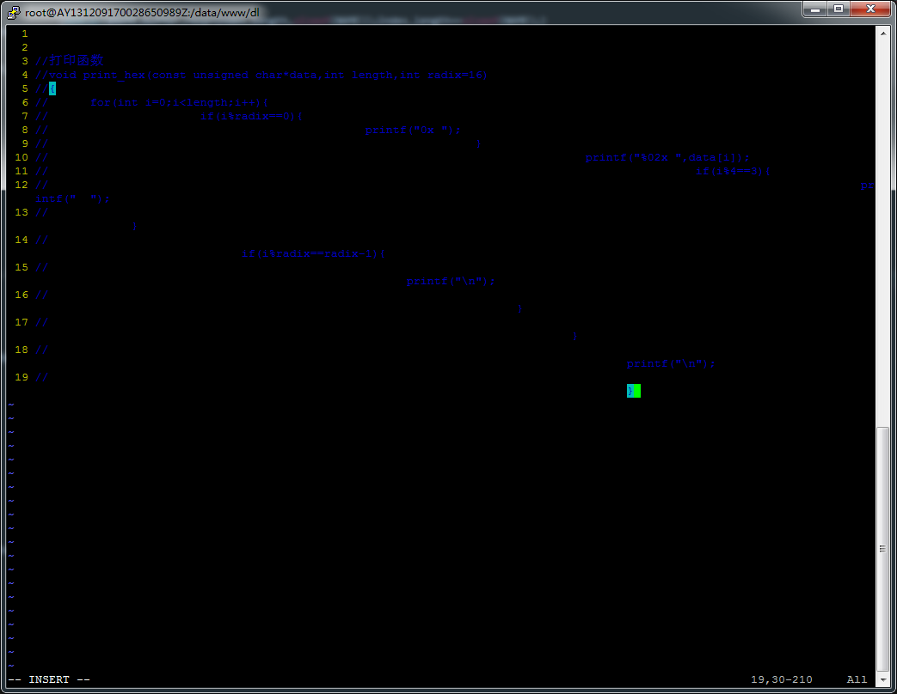
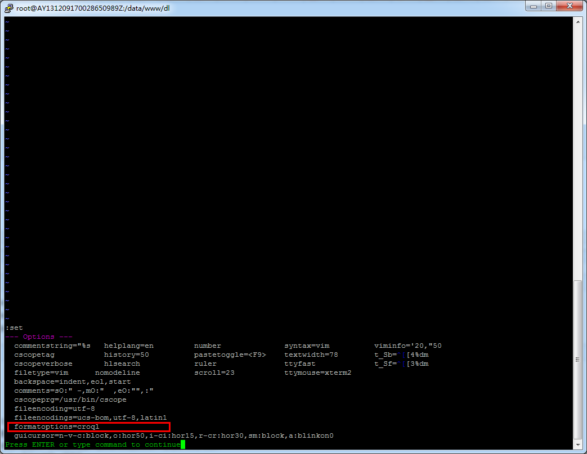
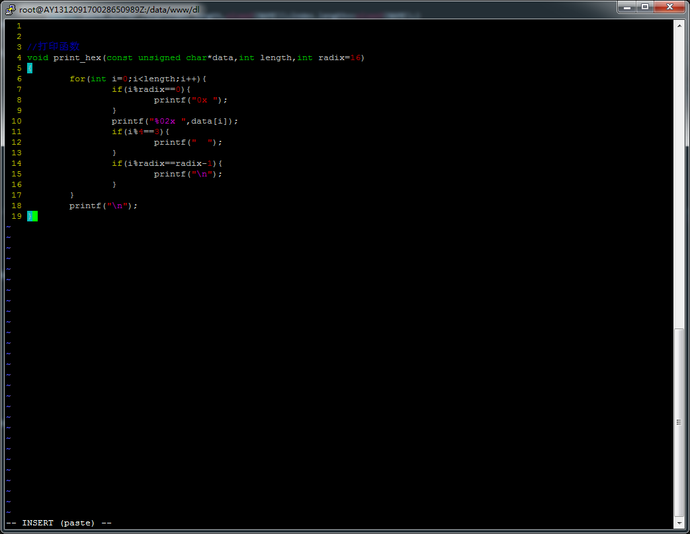

## 问题

vi(vim)作为所有linux发行版本中默认的文本编辑工具，因其功能强大和适用而广受欢迎。用法这里就不再赘述，本文是介绍了vim粘贴代码时的一个技巧。


<!--more-->

## 详情

### 问题显现

当我们用终端登录服务器，在用vim粘贴代码时，如果代码中有注释，那么粘贴后就惨不忍睹，如下图:



粘贴代码内容如下：

```c
//打印函数
void print_hex(const unsigned char*data,int length,int radix=16)
{
    for(int i=0;i<length;i++){
        if(i%radix==0){
            printf("0x ");
        }
        printf("%02x ",data[i]);
        if(i%4==3){
            printf("  ");
        }
        if(i%radix==radix-1){
            printf("\n");
        }
    }
    printf("\n");
}
```

上述代码也是很正常的c语言代码，那么出现这种情况的原因是什么呢?  大家是否想过呢？

### 刨根问底

我们在vim中，输入 :set，就可以得到选项列表如下图：



```
formatoptions=croql
```

看到上面这个选项，这个选项就是罪魁祸首，选项意思为：vim注释自动格式化

所以希望在~/.vimrc中设置环境变量，比如设置为 

```
set formatoptions=tcpmM
```

但是vim不识别此行有报错，又无法禁止这个选项，那要怎么解决呢？

### 解决方案

经过大量搜索，我们可以在粘贴前vim先进入粘贴插入模式，即不会自动缩进和连续注释。

```
set paste
```

然后再进入插入模式粘贴，如图：



如上图，在插入模式后多了一个paste。这样就可以按照完整粘贴了。

### **提示和建议**

完整粘贴解决了，但是在粘贴插入模式下代码是不会自动按格式缩进的，这是就需要使用nopaste设置回来

```
set nopaste
```

也可以在.vimrc中设置切换的快捷键，比如设置F9，则可以在.vimrc中加入：

```
set pastetoggle=<F9>
```

这样直接在插入模式按F9就会在“插入”模式和“插入（粘贴）”模式自由切换

## 探秘

我们也可以这样设置

```
:set noai nosi 
```


含义是**取消了自动缩进和智能缩进**。这样粘贴就不会错行了，但不是所有的都适用，有的vim这样设置后还是排版错乱。

更好用的设置

```
:set paste 
```

进入paste模式以后，可以在插入模式下粘贴内容，不会有任何变形，非常好用。

那么set  paste做了哪些事呢？

经过探究，做了如下这么多事

```bash
textwidth设置为0
wrapmargin设置为0
set noai
set nosi
softtabstop设置为0
revins重置
ruler重置
showmatch重置
formatoptions使用空值

#下面的选项值不变，但却被禁用：
lisp
indentexpr
cindent
#怪不得之前只设置noai和nosi不行，原来与这么多因素有关！
```

但要做上述所有动作比较麻烦的，就用set  paste来一次操作了。但每次要粘贴的话，先set paste，然后粘贴，然后再set nopaste。有没有更方便的呢？对的，强烈建议设置快捷键。


GUI操作系统的粘贴板，粘贴到命令行的vim中,有快捷键吗???

事实证明,不太好用，这是最方便的吗？Vimer们对高效的追求永无止境，还有其他更好地方法吗？

你可能想到了：vim寄存器。

对，使用vim寄存器 “+p 粘贴即可。这样就不用考虑是否自动缩进，是否paste模式，直接原文传递！

## vim寄存器

要从vim文件间的复制粘贴说起。Vim 中，若要复制当前行，普通模式下按 yy 即可，在要粘贴的地方按 p 。这时vim将复制内容保存到了自己的寄存器中的缘故。如果在其他地方执行yy，新的内容将覆盖掉原寄存器中内容。如果想保存原寄存器中内容而同时增加新的内容呢？这时就要在yy前增加标签了。标签以双引号开始，跟着的是标签名称，可以是数字0-9，也可以是26个字母，然后就是复制操作，这样就把复制内容保存到该标签寄存器里。通过下面命令显示所有寄存器内容：

```
:reg 
```


其中注意两个特殊的寄存器：**”* 和 “+**。这两个寄存器是和系统相通的，前者关联系统选择缓冲区，后者关联系统剪切板。通过它们可以和其他程序进行数据交换。

**备注**
若寄存器列表里无”* 或 “+ 寄存器，则可能是由于没有安装vim的图形界面所致。

Debian/Ubuntu下可以通过安装vim-gnome解决。

```bash
sudo apt-get install vim-gnome 
```


