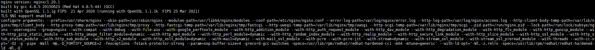
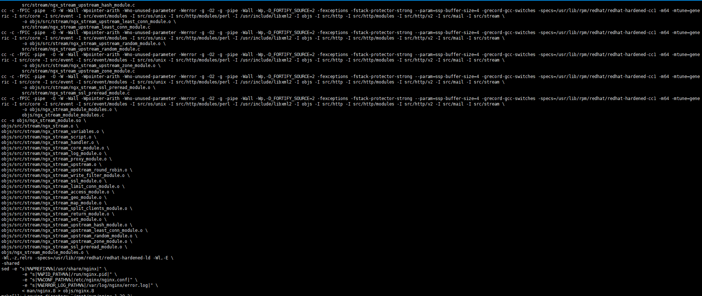
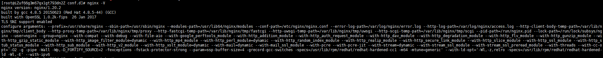

## 背景

nginx作为世界上使用最广的web服务，因其可以自由添加不同功能模块来对业务的支持，几乎所有的互联网大厂都在使用。现在有个业务场景需要nginx支持ipv6，但是nginx是用yum直接安装的，那要怎样去增添对第三方模块的支持，而且对原有yum安装的nginx平滑过渡几乎无感呢？本文以nginx增添ipv6模块为例，详细给大家介绍一下yum安装nginx后增添第三方模块的过程步骤，按步操作，其他模块大同小异。

<!--more-->


## 方法

这里Centos7下yum已经安装的nginx，先来简单介绍下方法：我们无论原始nginx怎么安装的，为了平滑无感影响最小，增添第三方模块就需要源码重新再次编译nginx，只是再次编译时要添加所需的模块参数。例如：添加支持tcp 4层转发，要添加--with-stream参数。本文以支持ipv6，添加参数：**--with-ipv6**为例。编译通过后，只需把编译生成的二进制文件nginx进行替换即可。


## 教程

###  查看nginx版本

```bash
nginx -V
```




### 下载Nginx源码

在[官网](https://nginx.org)下载合适的版本，建议选择稳定版本。根据当前版本，选择合适版本。这里选择的版本是nginx-1.20.2。

```bash
wget https://nginx.org/download/nginx-1.20.2.tar.gz 
tar zxf nginx-1.20.2.tar.gz 
cd nginx-1.20.2
```


### 备份原Nginx文件

```bash
mv /usr/sbin/nginx /usr/sbin/nginx.bak
```


### 重新编译Nginx

根据第1步查到已有的模块，加上本次需新增的模块参数: **--with-ipv6**

```bash
./configure --prefix=/usr/share/nginx --sbin-path=/usr/sbin/nginx --modules-path=/usr/lib64/nginx/modules --conf-path=/etc/nginx/nginx.conf --error-log-path=/var/log/nginx/error.log --http-log-path=/var/log/nginx/access.log --http-client-body-temp-path=/var/lib/nginx/tmp/client_body --http-proxy-temp-path=/var/lib/nginx/tmp/proxy --http-fastcgi-temp-path=/var/lib/nginx/tmp/fastcgi --http-uwsgi-temp-path=/var/lib/nginx/tmp/uwsgi --http-scgi-temp-path=/var/lib/nginx/tmp/scgi --pid-path=/run/nginx.pid --lock-path=/run/lock/subsys/nginx --user=nginx --group=nginx --with-compat --with-debug --with-file-aio --with-google_perftools_module --with-http_addition_module --with-http_auth_request_module --with-http_dav_module --with-http_degradation_module --with-http_flv_module --with-http_gunzip_module --with-http_gzip_static_module --with-http_image_filter_module=dynamic --with-http_mp4_module --with-http_perl_module=dynamic --with-http_random_index_module --with-http_realip_module --with-http_secure_link_module --with-http_slice_module --with-http_ssl_module --with-http_stub_status_module --with-http_sub_module --with-http_v2_module --with-http_xslt_module=dynamic --with-mail=dynamic --with-mail_ssl_module --with-pcre --with-pcre-jit --with-stream=dynamic --with-stream_ssl_module --with-stream_ssl_preread_module --with-threads --with-cc-opt='-O2 -g -pipe -Wall -Wp,-D_FORTIFY_SOURCE=2 -fexceptions -fstack-protector-strong --param=ssp-buffer-size=4 -grecord-gcc-switches -specs=/usr/lib/rpm/redhat/redhat-hardened-cc1 -m64 -mtune=generic' --with-ld-opt='-Wl,-z,relro -specs=/usr/lib/rpm/redhat/redhat-hardened-ld -Wl,-E' --with-ipv6
```

编译过程可能报错，报错是因为缺少依赖，一般需要安装以下模块，安装完再次编译即可。

```bash
yum -y install libxml2 libxml2-dev libxslt-devel 
yum -y install gd-devel 
yum -y install perl-devel perl-ExtUtils-Embed 
yum -y install GeoIP GeoIP-devel GeoIP-data
yum -y install pcre-devel
yum -y install openssl openssl-devel gperftools
```


### 编译通过

```bash
make 
```

 

**注意：**make完成后不要继续输入“make install”，以免现在的nginx出现问题 
以上完成后，会在objs目录下生成一个nginx文件，先验证： 

```bash
nginx-1.20.2/objs/nginx -V
```


### 替换Nginx文件并重启

验证生成的二进制nginx文件没有问题，进行文件替换。

```bash
cp nginx-1.20.2/objs/nginx /usr/sbin/ 
nginx -s reload
```


### 校验

```bash
nginx -V
```




## 总结

根据以上教程的操作步骤逐步操作，添加模块就成功了。如果以后还需添加模块，和上面操作大同小异。只需添加模块参数重新编译通过后，替换编译后的二进制nginx文件即可。


