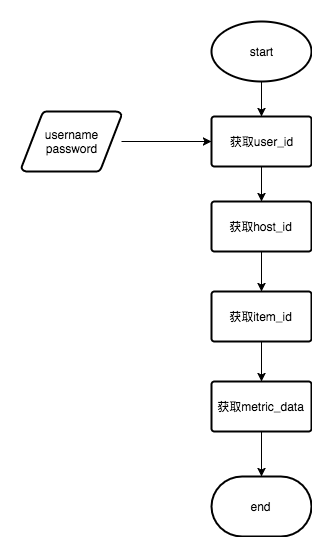

## 目的

明确调用zabbix api的步骤，便于利用zabbix进行二次开发。


## 步骤

简单来说，zabbix api调用分4步：获取userid–>获取hostid–>获取itemid–>根据时间节点获取数据，流程如下:



<!--more-->

## 操作

### 获取userid:

```shell
curl -i -X POST -H 'Content-Type: application/json' -d '{"jsonrpc":"2.0","method":"user.login","params":{"user":"xxxx","password":"xxxx"},"auth":null,"id":0}' http://x.x.x.x/api_jsonrpc.php
```

 

### 获取hostid:

```shell
curl -i -X POST -H 'Content-Type: application/json' -d '{"jsonrpc": "2.0","method":"host.get","params":{"output":["hostid"],"filter": {"host":"192.168.211.60"}},"auth": "a826fca79a0795ccc1224dc76329972f","id": 0}' http://x.x.x.x/api_jsonrpc.php
```

 

### 获取itemid:

```shell
curl -i -X POST -H 'Content-Type: application/json' -d '{"jsonrpc": "2.0","method":"item.get","params":{"output":"itemids","hostids":"10243","search":{"key_":"system.cpu.util[,idle,avg1]"}},"auth": "a826fca79a0795ccc1224dc76329972f","id": 0}'  http://x.x.x.x/api_jsonrpc.php
```

 

### 获取数据：

```shell
curl -i -X POST -H 'Content-Type: application/json' -d '{"jsonrpc": "2.0","method":"history.get","params":{"history":0,"itemids":["24526"],"time_from":"1392789600","time_till":"1392790200","output":"extend"},"auth": "a826fca79a0795ccc1224dc76329972f","id": 0}'  http://x.x.x.x/api_jsonrpc.php
```

c