## 目的

随着互联网公司的不断发展和业务的不断拓展，只用zabbix-server单节点作为数据收集已越来越吃力，不能满足需求，这是扩展zabbix监控系统势在必行，zabbix-proxy代理就可以帮到你，能够有效的分担server压力。本文详细介绍了zabbix-proxy的安装部署过程，因互联网公司线上业务稳定性是最重要的，监控系统更是如此，所有监控系统搭建时版本建议用长期支持版。

<!--more-->

## 环境配置

#### **查看selinux状态**

```shell
[root@localhost ~]# sestatus  

SELinux status:                 enabled  

SELinuxfs mount:                /sys/fs/selinux  

SELinux root directory:         /etc/selinux  

Loaded policy name:             targeted  

Current mode:                   enforcing  

Mode from config file:          enforcing  

Policy MLS status:              enabled  

Policy deny_unknown status:     allowed  

Max kernel policy version:      28
```

####  **临时关闭 sellinux**

```shell
[root@localhost ~]# setenforce 0
```

####  永久关闭

```shell
#可以修改配置文件/etc/selinux/config,将其中SELINUX设置为disabled。
[root@localhost ~]# cat /etc/selinux/config   

   

# This file controls the state of SELinux on the system.  

# SELINUX= can take one of these three values:  

#     enforcing - SELinux security policy is enforced.  

#     permissive - SELinux prints warnings instead of enforcing.  

#     disabled - No SELinux policy is loaded.  

#SELINUX=enforcing  

SELINUX=disabled  

# SELINUXTYPE= can take one of three two values:  

#     targeted - Targeted processes are protected,  

#     minimum - Modification of targeted policy. Only selected processes are protected.   

#     mls - Multi Level Security protection.  

SELINUXTYPE=targeted

 

[root@rdo ~]# sestatus  

SELinux status:                 disabled
```

####  **关闭防火墙**

直接关闭防火墙

```shell
systemctlstop firewalld.service #停止firewall
systemctldisable firewalld.service #禁止firewall开机启动
```

## 安装数据库

我们现在来配置mysql数据库。

#### 开机自启动mysql，并启动mysql

```shell
systemctlenable mariadb

systemctlstart mariadb
```

 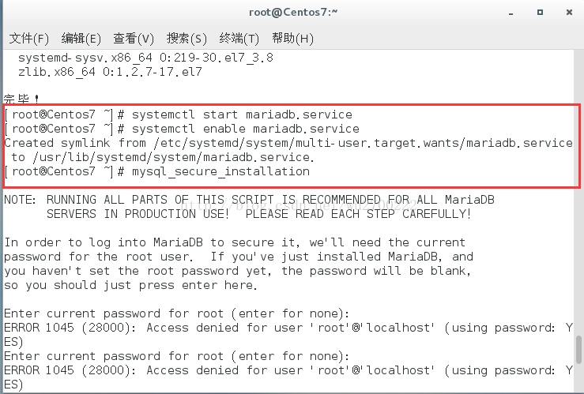

 

#### 初始化mysql数据库，并配置root用户密码

```shell
mysql_secure_installation
```

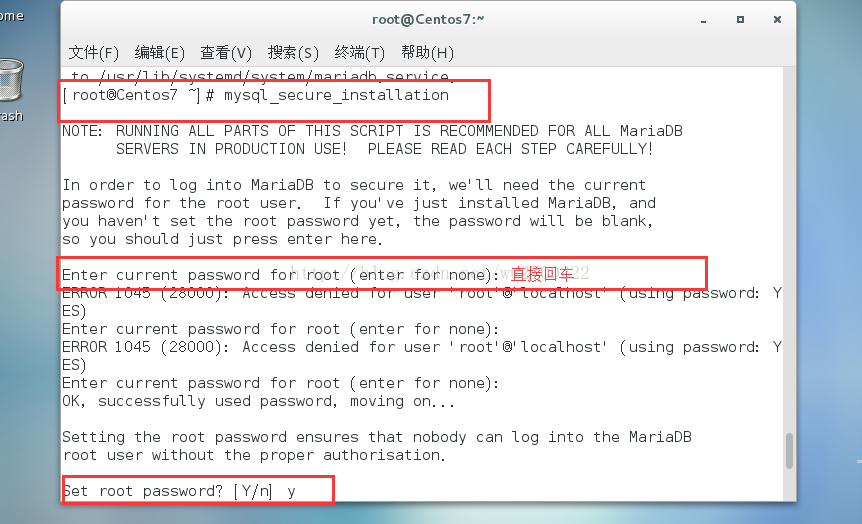

注意：在上图中的Enter current passwdord for root处，我们直接敲回车键即可。因为centos7上mysql的默认root用户密码为空。

下图中主要是为root用户配置密码，并刷新相关权限。

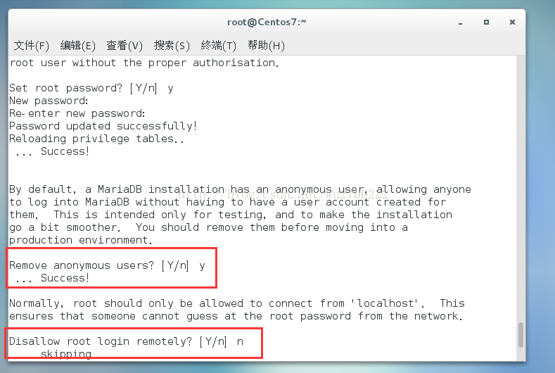

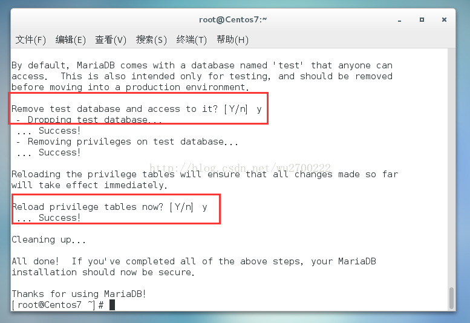


上图中主要是配置匿名用户、test用户以及root用户远程连接等相关配置。

#### 创建zabbix数据库及其用户

```shell
mysql -u root –p
```

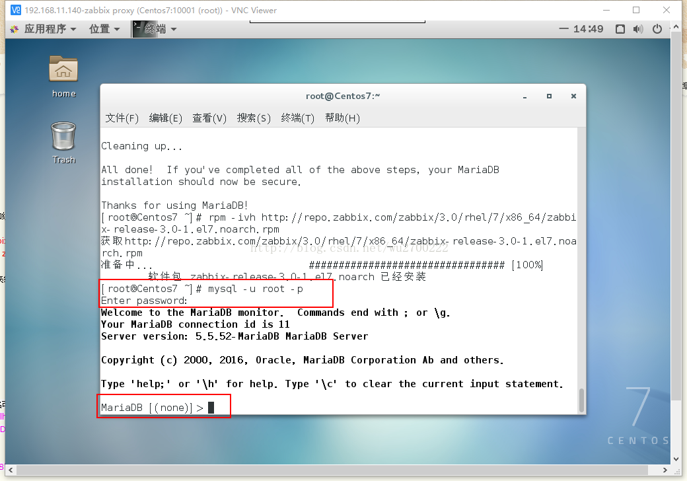

```sql
> create database zabbix_proxycharacter set utf8;      #数据名可以跟server端名称不同

> GRANT ALL PRIVILEGES ON zabbix_proxy.* TO 'zabbix'@'localhost'  IDENTIFIED BY 'zabbix-proxy';

> GRANT ALL PRIVILEGES ON zabbix_proxy.* TO'zabbix'@'%'  IDENTIFIED BY 'zabbix-proxy';

> flush PRIVILEGES;

> set GLOBAL max_connections=10000;

> grant all privileges on *.* to root@'%'identified by 'tdr123';    #也可以放行root访问权限

> flush privileges;

> exit;
```

 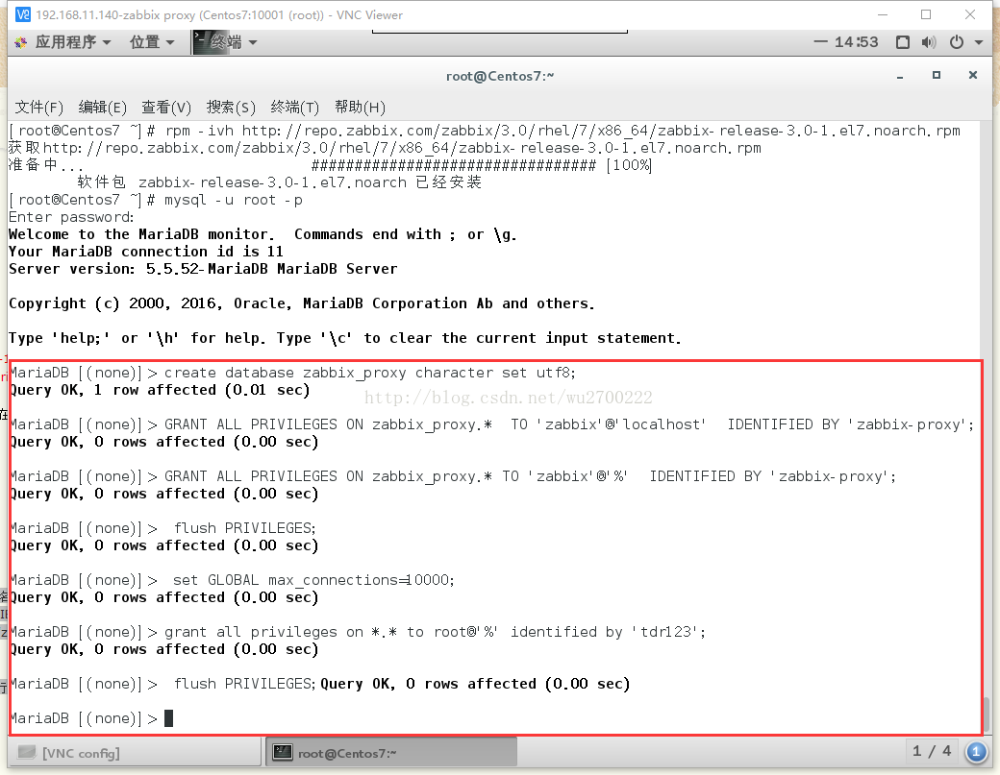

## 安装zabbix proxy

```shell
rpm -ivh http://repo.zabbix.com/zabbix/3.0/rhel/7/x86_64/zabbix-release-3.0-1.el7.noarch.rpm
yum install -y  zabbix-proxy zabbix-java-gateway zabbix-agent zabbix-get mariadb*
```

 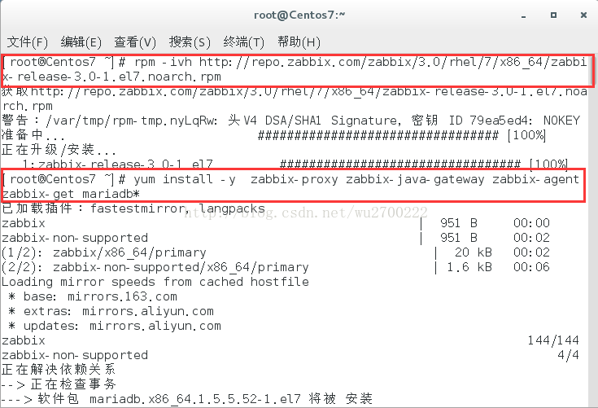**

以上安装完毕后，我们现在开始进行zabbix的相关配置。

#### 导入zabbix数据库结构：

```shell
cd /usr/share/doc/zabbix-proxy-mysql-3.0.9/
zcat schema.sql.gz| mysql -uroot -p zabbix_proxy
```

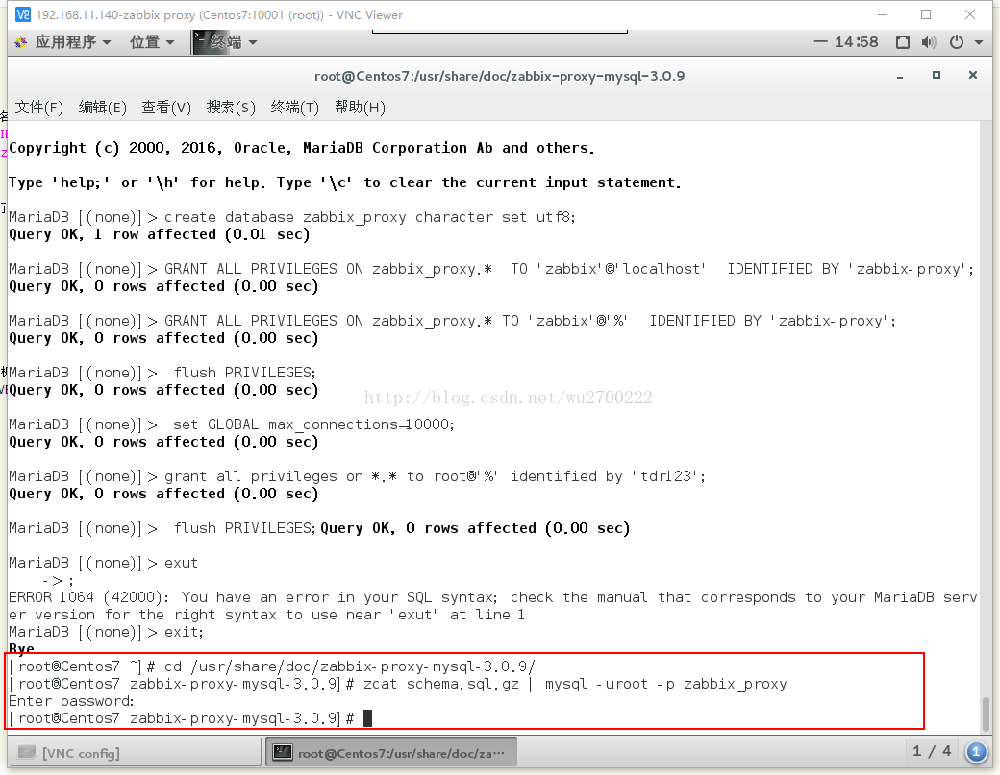

#### 修改zabbix proxy的配置文件

```shell
vim  /etc/zabbix/zabbix-proxy.conf

Server=192.168.11.139    #同步指向的server端的IP，非本地IP。可以是server端的主机域名，但要确保proxy端解析server的域名，并且网络可达

Hostname=zabbix-proxy-sh140  #proxy本地的名称，此名称需要与将来在server端的WEB页面上的代理程序名称一致，名称自定义

DBHost=localhost           #与上面配置对应

DBName=zabbix_proxy   #与上面配置对应

DBUser=zabbix               #与上面配置对应

DBPassword=zabbix-proxy   #与上面配置对应

DBPort=3306                      #与上面配置对应

StartDiscoverers=4              #与server端配置的功能说明一致。

JavaGateway=127.0.0.1       #与server端配置的功能说明一致。

JavaGatewayPort=10052     #与server端配置的功能说明一致。

StartJavaPollers=4              #与server端配置的功能说明一致。

StartSNMPTrapper=1
```

Hostname=zabbix-proxy-sh140  #proxy本地的名称，此名称需要与将来在server端的WEB页面上的代理程序名称一致，名称自定义

DBHost=localhost           #与上面配置对应

DBName=zabbix_proxy   #与上面配置对应

DBUser=zabbix               #与上面配置对应

DBPassword=zabbix-proxy   #与上面配置对应

DBPort=3306                      #与上面配置对应

StartDiscoverers=4              #与server端配置的功能说明一致。

JavaGateway=127.0.0.1       #与server端配置的功能说明一致。

JavaGatewayPort=10052     #与server端配置的功能说明一致。

StartJavaPollers=4              #与server端配置的功能说明一致。

StartSNMPTrapper=1

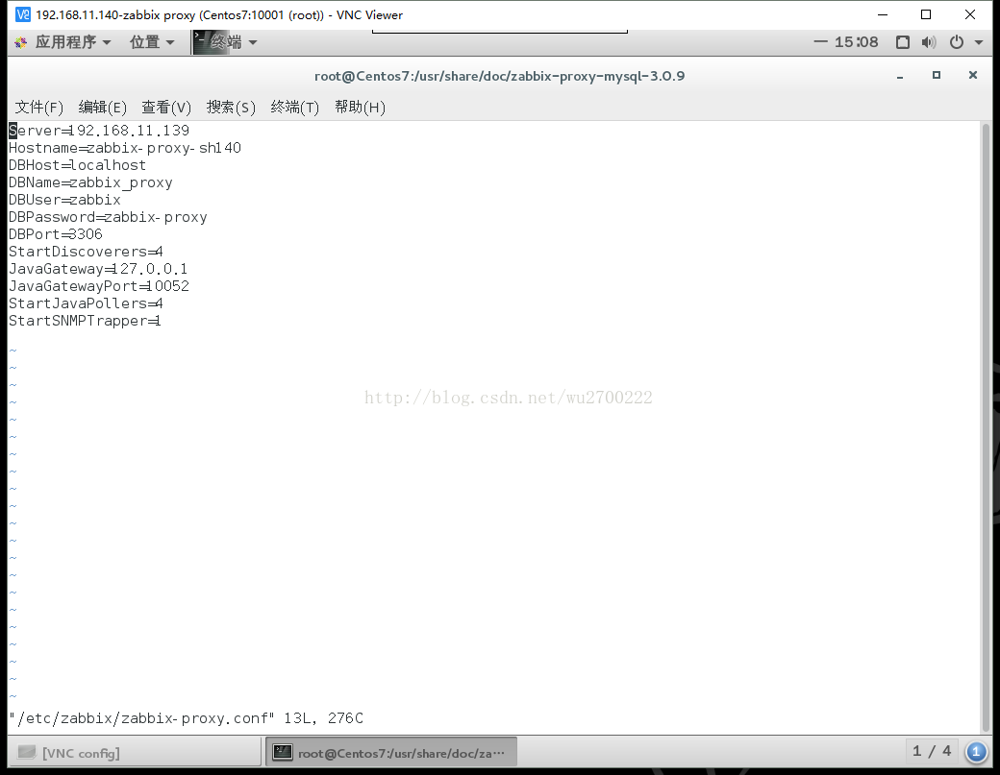

####  启动服务

```shell
# service  zabbix-java-gateway start
# service  zabbix-proxy start
# chkconfig zabbix-java-gateway on
# chkconfig zabbix-proxy on
```

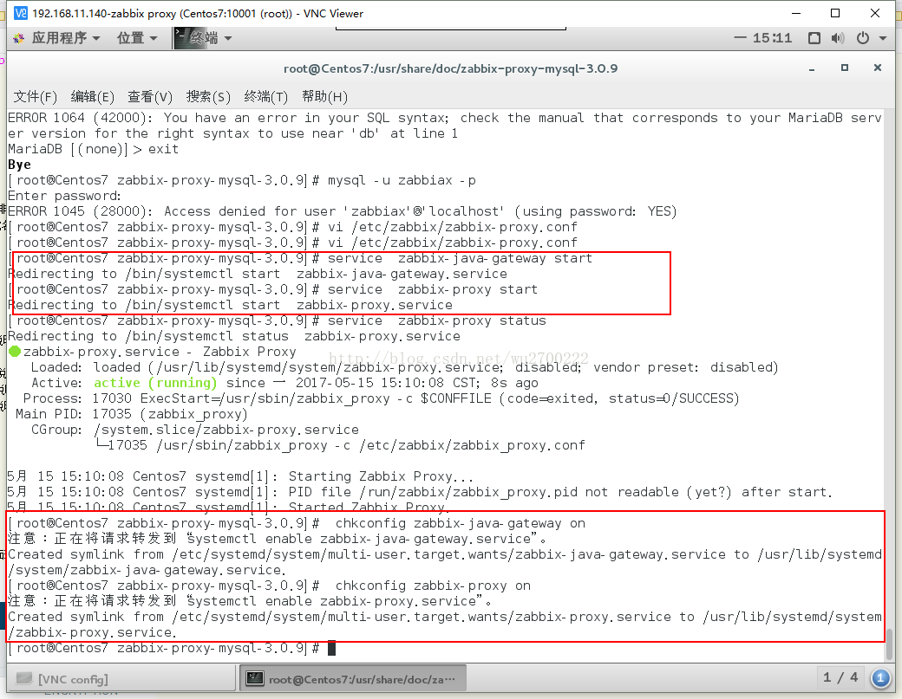

 

#### 更新备监控的主机zabbix_agentd.win.conf

```shell
Server=192.168.11.140
ServerActive=192.168.11.140
```

修改完后重启zabbix_agent服务

```shell
service zabbix-agent restart
```

## 新增代理配置

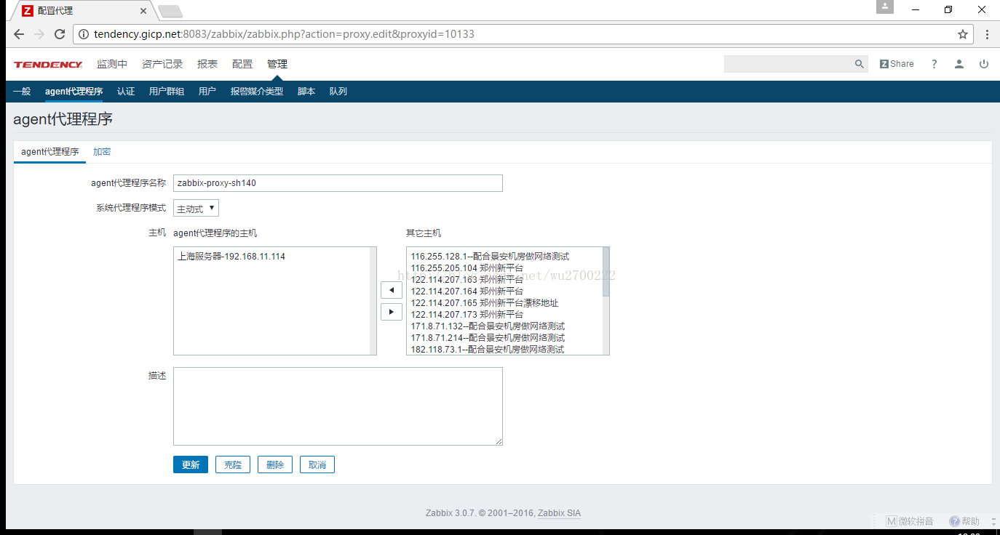

最终效果：

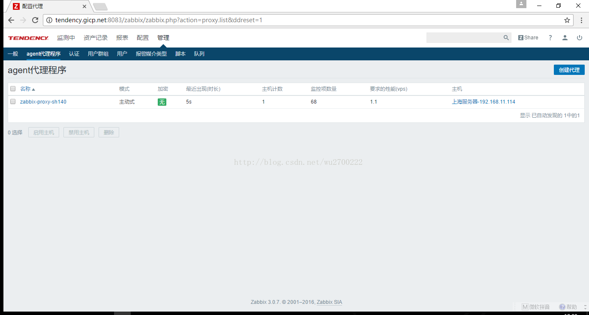