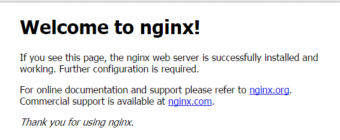
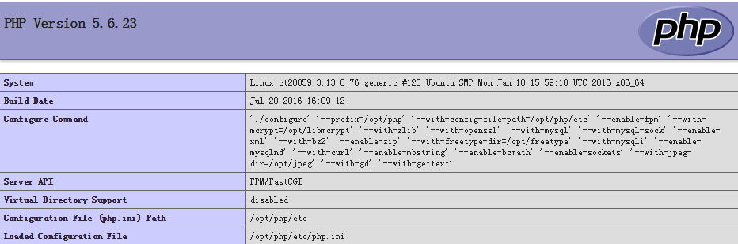

## 目的

zabbix是一个基于WEB界面的提供分布式系统监视以及网络监视功能的企业级的开源解决方案。因其监控方式多样，上手容易在互联网行业备受欢迎。那么本文就详细介绍编译安装zabbix长期支持版本(LST).

<!--more-->

## 环境版本：

### lnmp系统：

​	ubuntu 14.04

​	nginx 1.10.1

​	mysql 5.7.13

​	php 5.6.23

### 监控系统：

​	zabbix 3.0.3

​	zatree 3.0.x

​	grafana 3.1.0

### 安装路径：

程序安装路径：/opt/zabbix

数据路径：/data/zabbix


## 安装

### 安装nginx + php

### 安装依赖包

```shell
sudo apt-get update
sudo apt-get -y install make gcc g++ libpcre3-dev libssl-dev libpng-dev libxml2-dev libcurl4-openssl-dev
```

### 编译安装nginx

创建运行账户及组

```shell
sudo groupadd www
sudo useradd www -s /sbin/nologin -g www
```

开始编译nginx

```shell
cd /opt
sudo wget http://nginx.org/download/nginx-1.10.1.tar.gz
sudo tar zxvf nginx-1.10.1.tar.gz 
cd nginx-1.10.1/
sudo ./configure --user=www --group=www --prefix=/opt/nginx --with-http_stub_status_module --with-http_ssl_module
sudo make
sudo make install
cd /opt
sudo chown -R www.www nginx
```

创建nginx启动脚本

```shell
sudo vim /etc/init.d/nginx

#!/bin/sh  
  
### BEGIN INIT INFO  
# Provides:     nginx  
# Required-Start:  
# Required-Stop:  
# Default-Start:        2 3 4 5  
# Default-Stop:         0 1 6  
# Short-Description: nginx  
# Description: nginx server  
### END INIT INFO  
  
. /lib/lsb/init-functions  
  
PROGRAM=/opt/nginx/sbin/nginx  
  
  
test -x $PROGRAM || exit 0  
  
case "$1" in  
  start)  
     log_begin_msg "Starting Nginx server"  
     /opt/nginx/sbin/nginx  
     log_end_msg 0  
          ;;  
  stop)  
     PID=`cat /opt/nginx/logs/nginx.pid`  
     log_begin_msg "Stopping Nginx server"  
     if [ ! -z "$PID" ]; then  
        kill -15 $PID  
     fi  
     log_end_msg 0  
     ;;  
  restart)  
     $0 stop  
     $0 start  
     ;;  
  *)  
     log_success_msg "Usage: service nginx {start|stop|restart}"  
     exit 1  
esac  
  
exit 0 
```

添加启动权限并启动nginx

```shell
sudo chmod +x /etc/init.d/nginx
sudo /etc/init.d/nginx start
sudo update-rc.d nginx defaults
```

验证是否安装成功。在浏览器地址栏输入ip,出现下图为ok.



### 安装php

### 安装bzip2

```shell
cd /opt
sudo wget http://www.bzip.org/1.0.6/bzip2-1.0.6.tar.gz
sudo tar zxvf bzip2-1.0.6.tar.gz
cd bzip2-1.0.6/
###64位系统需要修改Makefile文件后再make，修改内容如下
CC=gcc -fPIC
sudo make
sudo make install PREFIX=/opt/bzip2
```

### 安装zlib

```shell
cd /opt
sudo wget http://heanet.dl.sourceforge.net/project/libpng/zlib/1.2.8/zlib-1.2.8.tar.gz
sudo tar zxvf zlib-1.2.8.tar.gz
cd zlib-1.2.8/
sudo ./configure --prefix=/opt/zlib
sudo make
sudo make install
```

### 安装libmcrypt

```shell
cd /opt
sudo wget http://jaist.dl.sourceforge.net/project/mcrypt/Libmcrypt/2.5.8/libmcrypt-2.5.8.tar.gz
sudo tar zxvf libmcrypt-2.5.8.tar.gz
cd libmcrypt-2.5.8/
sudo ./configure --prefix=/opt/libmcrypt
sudo make
sudo make install
```

### 安装freetype

```shell
cd /opt
sudo wget http://ftp.yzu.edu.tw/nongnu//freetype/freetype-2.6.tar.gz
sudo tar zxvf freetype-2.6.tar.gz 
cd freetype-2.6/
sudo ./configure --prefix=/opt/freetype
sudo make
sudo make install
```

### 安装jpegsrc（zabbix需要）

```shell
cd /opt
sudo wget http://www.ijg.org/files/jpegsrc.v9b.tar.gz 
sudo tar zxvf jpegsrc.v9b.tar.gz
cd jpeg-9b/
sudo ./configure --prefix=/opt/jpeg
sudo make
sudo make install
```

### 编译安装php

```shell
cd /opt
sudo wget http://ar2.php.net/distributions/php-5.6.23.tar.gz
sudo tar zxvf php-5.6.23.tar.gz 
cd php-5.6.23/
sudo  ./configure --prefix=/opt/php --with-config-file-path=/opt/php/etc --enable-fpm --with-mcrypt=/opt/libmcrypt --with-zlib=/opt/zlib --with-openssl --with-mysql --with-mysql-sock --with-gd --enable-xml --with-bz2=/usr/local/lib --enable-zip --with-freetype-dir=/opt/freetype --with-mysqli --enable-mysqlnd  --with-curl --enable-mbstring --enable-bcmath --enable-sockets --with-jpeg-dir=/opt/jpeg --with-gd --with-gettext
sudo make
sudo make install
cd /opt
sudo chown -R www.www php 
```

### 整合nginx + php

### 创建php、php-fpm配置文件

```shell
sudo cp /opt/php-5.6.23/php.ini-production /opt/php/etc/php.ini
sudo vim /opt/php/etc/php.ini 
修改如下行
    date.timezone = Asia/Shanghai
sudo cp /opt/php/etc/php-fpm.conf.default /opt/php/etc/php-fpm.conf
sudo vim /opt/php/etc/php-fpm.conf
修改如下行
user = www
group = www
pid = run/php-fpm.pid
```

### 创建php-fpm启动脚本、启动php-fpm

```shell
sudo vim /etc/init.d/php-fpm
贴入如下内容
#!/bin/sh  
### BEGIN INIT INFO  
# Provides:     nginx  
# Required-Start:  
# Required-Stop:  
# Default-Start:        2 3 4 5  
# Default-Stop:         0 1 6  
# Short-Description: nginx  
# Description: nginx server  
### END INIT INFO  
. /lib/lsb/init-functions
PROGRAM=/opt/php/sbin/php-fpm
test -x $PROGRAM || exit 0
case "$1" in
  start)
     log_begin_msg "Starting php-fpm server"
     /opt/php/sbin/php-fpm -y /opt/php/etc/php-fpm.conf -c /opt/php/etc/php.ini 
     log_end_msg 0
     ;;
   stop)
     PID=`cat /opt/php/var/run/php-fpm.pid`
     log_begin_msg "Stopping php-fpm server"
     if [ ! -z "$PID" ]; then
        kill -15 $PID
     fi
     log_end_msg 0
     ;;
  restart)
     $0 stop
     $0 start
     ;;
  *)
     log_success_msg "Usage: service php-fpm {start|stop|restart}"
     exit 1
esac
exit 0
```

```shell
sudo chmod +x /etc/init.d/php-fpm
sudo /etc/init.d/php-fpm start
sudo update-rc.d php-fpm defaults
```

### 修改nginx配置文件，创建index.php，测试整合成功

```
sudo vim /opt/nginx/conf/nginx.conf
修改如下内容
user  www;
pid        logs/nginx.pid;
#默认首页index.php
location / {
            root   html;
            index  index.html index.htm index.php;
        }
#php文件交给fastcgi处理
location ~ \.php$ {
        #    root           html;
            fastcgi_pass   127.0.0.1:9000;
            fastcgi_index  index.php;
            fastcgi_param  SCRIPT_FILENAME  $document_root$fastcgi_script_name;
            include        fastcgi_params;
        }
```

### 创建测试页面index.php

```
sudo vim /opt/nginx/html/index.php
<?php
phpinfo();
?>
```

### 重启nginx

```shell
sudo /etc/init.d/nginx restart
```

验证是否整合成功，地址栏：ip/index.php,如出现下图，整合成功。




### 编译安装mysql

### 安装依赖包 

```shell
sudo apt-get -y install g++ cmake ncurses-dev
cd /opt
sudo wget http://heanet.dl.sourceforge.net/project/boost/boost/1.59.0/boost_1_59_0.tar.gz
sudo tar zxvf boost_1_59_0.tar.gz
```

### 创建用户和用户组

```shell
#创建mysql用户及用户组，创建mysql-data目录
sudo groupadd mysql
sudo useradd mysql -s /sbin/nologin -g mysql
sudo mkdir -p /data/postmall/mysql/data
cd /data/postmall/
sudo chown -R mysql.mysql mysql
```

### 编译安装mysql

```shell
sudo wget http://cdn.mysql.com//Downloads/MySQL-5.7/mysql-5.7.13.tar.gz
sudo tar zxvf mysql-5.7.13.tar.gz 
cd mysql-5.7.13/
sudo cmake -DCMAKE_INSTALL_PREFIX=/opt/mysql -DMYSQL_DATADIR=/data/postmall/mysql/data -DDEFAULT_CHARSET=utf8 -DDEFAULT_COLLATION=utf8_general_ci -DENABLED_LOCAL_INFILE=1 -DDOWNLOAD_BOOST=1 -DWITH_BOOST=/opt/boost_1_59_0
sudo make
sudo make install
cd /opt
chown -R mysql.mysql mysql 
```

### 初始化mysql

```shell
cd /opt/mysql/bin
sudo ./mysqld --initialize --user=mysql --datadir=/data/postmall/mysql/data --basedir=/opt/mysql --socket=/var/mysql.sock
#创建mysql配置文件和启动脚本
sudo cp support-files/my-default.cnf /etc/my.cnf
sudo cp support-files/mysql.server /etc/init.d/mysqld
sudo chmod +x /etc/init.d/mysqld
#将mysql加入系统搜索路径（环境变量）
cd /opt/mysql/bin
sudo cp mysql /usr/bin/
```

### 启动并登陆mysql

```shell
 sudo /etc/init.d/mysqld start
```

### mysql主备配置:

   修改主服务器master:  

```shell
#vi  my.cnf
[mysqld]
log-bin=mysql-bin   
server-id=1  
#bind-address            = 127.0.0.1
```

   修改从服务器slave:    

```shell
#vi /etc/my.cnf
[mysqld]
log-bin=mysql-bin  
server-id=2  
```

在主服务器上建立帐户并授权slave:

```shell
mysql>GRANT REPLICATION SLAVE ON *.* to 'zabbix'@'%' identified by 'zabbix';
```

 登录主服务器的mysql，查询master的状态

```shell
mysql>show master status;
   +------------------+----------+--------------+------------------+
   | File             | Position | Binlog_Do_DB | Binlog_Ignore_DB |
   +------------------+----------+--------------+------------------+
   | mysql-bin.000004 |      308 |              |                  |
   +------------------+----------+--------------+------------------+
   1 row in set (0.00 sec)
   注：执行完此步骤后不要再操作主服务器MYSQL，防止主服务器状态值变化
```

配置从服务器Slave：

```shell
 mysql>change master to master_host='172.25.200.55',master_user='zabbix',master_password='zabbix',
         master_log_file='mysql-bin.000004',master_log_pos=308;   //注意不要断开，308数字前后无单引号。

 Mysql>start slave; 
```

检查从服务器复制功能状态：

```shell
mysql> show slave status\G

   *************************** 1. row ***************************

              Slave_IO_State: Waiting for master to send event
              Master_Host: 172.25.200.55  //主服务器地址
              Master_User: mysync   //授权帐户名，尽量避免使用root
              Master_Port: 3306    //数据库端口，部分版本没有此行
              Connect_Retry: 60
              Master_Log_File: mysql-bin.000004
              Read_Master_Log_Pos: 600     //#同步读取二进制日志的位置，大于等于Exec_Master_Log_Pos
              Relay_Log_File: ddte-relay-bin.000003
              Relay_Log_Pos: 251
              Relay_Master_Log_File: mysql-bin.000004
              Slave_IO_Running: Yes    //此状态必须YES
              Slave_SQL_Running: Yes     //此状态必须YES
                    ......

注：Slave_IO及Slave_SQL进程必须正常运行，即YES状态，否则都是错误的状态(如：其中一个NO均属错误)。

以上操作过程，主从服务器配置完成。
```

### 编译安装zabbix 

```shell
wget  http://jaist.dl.sourceforge.net/project/zabbix/ZABBIX%20Latest%20Stable/3.0.3/zabbix-3.0.3.tar.gz

tar -zxvf zabbix-3.0.3.tar.gz
cd  zabbix-3.0.3/
mkdir -p  /opt/zabbix

[ 各种库文件安装 ]
方法：sudo apt-get install make libmysqld-dev  libmysqlclient-dev   libxml2-dev   snmp  snmpd  libsnmp-dev   libcurl4-openssl-dev  openjdk-6-jdk

[ 编译 ]

./configure  --prefix=/opt/zabbix  --enable-java   --enable-server --enable-agent --with-mysql --enable-ipv6 --with-net-snmp --with-libcurl --with-libxml2

[ 安装]
make && make install 
```

### 配置zabbix

创建zabbix数据库，并导入zabbix数据库文件

```shell
#创建数据库
mysql -u root -p
create database zabbix character set utf8;
grant all on zabbix.* to 'zabbix'@'172.25.200.54' identified by 'zabbix';
grant all on zabbix.* to 'zabbix'@'172.25.200.56' identified by 'zabbix';
grant all on zabbix.* to 'zabbix'@'localhost' identified by 'zabbix';
flush privileges;
exit;
#导入数据库文件
cd /opt
sudo wget http://repo.zabbix.com/zabbix/3.0/ubuntu/pool/main/z/zabbix/zabbix_3.0.3.orig.tar.gz 
sudo tar zxvf zabbix_3.0.3.orig.tar.gz
cd zabbix-3.0.3/database/mysql
mysql -uzabbix -pzabbix zabbix < schema.sql
mysql -uzabbix -pzabbix zabbix < images.sql
mysql -uzabbix -pzabbix zabbix < data.sql
```

### 配置zabbix_server.conf

```shell
vim /opt/zabbix/etc/zabbix_server.conf
LogFile=/var/log/zabbix/zabbix_server.log  #如没有/var/log/zabbix目录，请创建
DBHost=172.25.200.55
DBName=zabbix
DBUser=zabbix
DBPassword=zabbix
```

### 配置php.ini

```shell
sudo vim /opt/php/etc/php.ini
post_max_size = 16M
max_execution_time = 300
max_input_time = 300
```

### 配置zabbix页面 

```shell
cd /opt/zabbix-3.0.3/frontends/php/
sudo cp -a . /data/zabbix/
cd /data/
sudo chown -R www.www zabbix 
mv /zabbix/conf/zabbix.conf.php.example  /zabbix/conf/zabbix.conf.php
sudo vim /var/www/html/zabbix/conf/zabbix.conf.php
修改项

$DB['DATABASE'] = 'zabbix';
$DB['USER'] = 'zabbix';
$DB['PASSWORD'] = 'zabbix'
```

### 配置nginx.conf

```shell
sudo vim /opt/nginx/conf/nginx.conf
 location / {
            root   /data/postmall;
            index  index.html index.htm index.php;
        }
 location ~ \.php$ {
            root           /data/postmall;
            fastcgi_pass   127.0.0.1:9000;
            fastcgi_index  index.php;
            fastcgi_param  SCRIPT_FILENAME  $document_root$fastcgi_script_name;
            include        fastcgi_params;
        }
```

### 重启zabbix、php-fpm 、nginx

```shell
sudo /etc/init.d/zabbix_server restart
sudo /etc/init.d/php-fpm restart
sudo /etc/init.d/nginx restart
```

### 安装grafana

```shell
$ wget https://grafanarel.s3.amazonaws.com/builds/grafana_3.1.0-1468321182_amd64.deb
$ sudo apt-get install -y adduser libfontconfig
$ sudo dpkg -i grafana_3.1.0-1468321182_amd64.deb
grafana-cli plugins list-remote
grafana-cli plugins install alexanderzobnin-zabbix-app
service grafana-server restart
```

### 安装zatree

```shell
git clone https://github.com/BillWang139967/zatree.git
cd zatree/zabbix-3.0.x/
bash start.sh
执行过程中需要输入zabbix admin的账号和密码
调整php页面文件（header.php，echart.php，peckvalue.php，zabbix_zatree.php）详情请参考wiki上《Zatree for zabbix 3.0.x》及其附件。
```