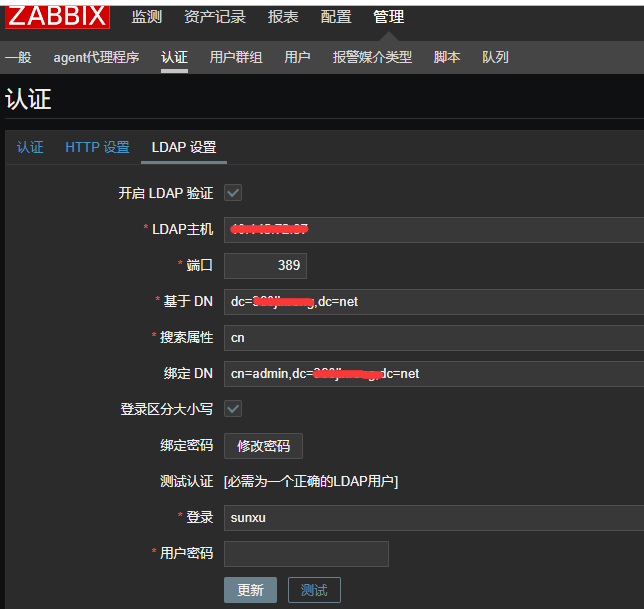
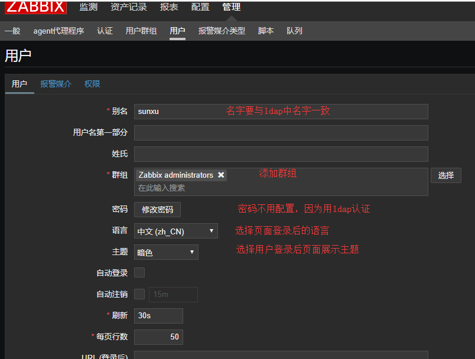
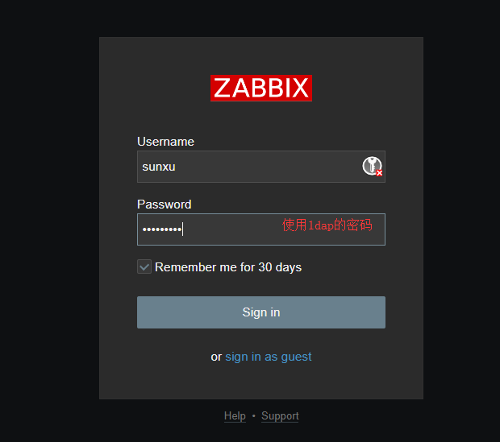
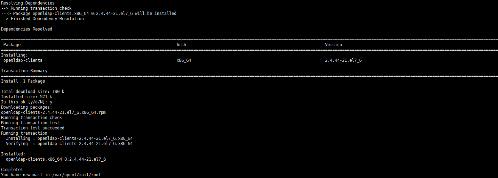
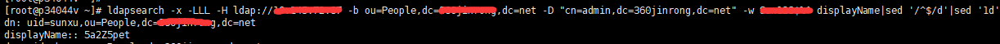
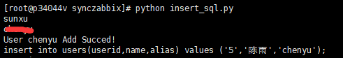
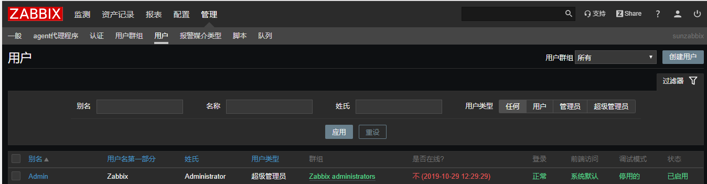

## 前言

公司用openldap搭了一套ldap认证系统，用于统一内部各个系统的账户，避免每次添加或删除用户还得一个个登陆上去操作，使账户密码统一，能减轻很多工作和保证安全性，今天是想把ldap与zabbix进行结合。


## 环境

centos7.x

zabbix4.0.x

<!--more-->


## 配置zabbix

#### **安装php-ldap模块**

php需要这个模块来进行ldap认证，安装方法网上都有这里只列举一种；

```bash
#安装
yum install php-ldap
#验证
》/usr/local/php/bin/php -m|grep ldap
ldap
```

#### **zabbix页面配置**



```bash
LDAP host：访问ldap的地址。格式：ldap://ip地址
Port：默认389
Base DN: dc=tencent,dc=com,也就是域名(tencent.com)
Search attribute: uid，属性值，网上有填sAMAccountName。

Bind DN： cn=Admin, ou=People, dc=tencent, dc=com。 cn就是在DC中创建的LDAPuser用户， ou就是LDAPuser属于哪个ou，dc=tencent和dc=com不在解释。

Bind password：xxxx ，改密码为LDAPuser用户的密码
Login：Admin
User password：在DC中创建Admin用户的密码
```

点击"Test"。如果没有报什么错误，就可以点击"Save"。现在ZABBIX的LDAP认证方式就已经配置完成了。

#### **用户配置**

上述配置完成后已经把ldap和zabbix打通了，用户登录zabbix时，会先到ldap认证，判断用户是否有效；但是zabbix不会把ldap的用户同步过了，你要登录，得先在zabbix上创建和ldap内同名的用户才行。



验证登录



#### 同步用户

上面显得很被动了，于是写个脚本，定时往zabbix数据库插入用户，这样就免去手工创建的用户的烦恼。

先需要安装ldap客户端工具

```bash
yum install openldap-clients
```



先查询测试

```bash
ldapsearch -x -LLL -H ldap://xxxxx -b ou=People,dc=xxxxx,dc=net -D "cn=admin,dc=xxxxxx,dc=net" -w 密码 displayName|sed '/^$/d'|sed '1d'
```



uid是zabbix的alias字段，displayName需要base64解码成中文名

同步脚本如下：

```python
#!/usr/bin/env python
# -*- coding:utf-8 -*-

import pymysql
import commands
import re
import base64
import sys

# 避免中文乱码
reload(sys)
sys.setdefaultencoding('utf-8')

ldap_list='/usr/local/zabbix/sh/ldap.list'

# 先从ldap服务器把用户数据导入文件
ldap_users=commands.getoutput("ldapsearch -x -LLL -H ldap://xxxxxx -b ou=People,dc=xxxxx,dc=net -D "cn=admin,dc=xxxxx,dc=net" -w xxxxx displayName|sed '/^$/d'|sed '1d' > %s" % ldap_list)

# 因为zabbix的表没有自增id，所以每次操作都会记录下id，并递增
idfile = '/usr/local/zabbix/sh/userid'

# 处理元数据，把文件里的每行数据转化成方便使用的格式
def get_item(fobj):
    item = ['', '', '']
    for no,line in enumerate(fobj):
        #print no,line
        slot = no % 2
        item[slot] = line.rstrip()
        if slot == 1:
            yield item

def insert_user():
    conn = pymysql.connect(host='2.2.2.2', port=3306, user='zabbix', passwd='zabbix', db='zabbix', charset='utf8')
    cur = conn.cursor()
    fs = open(idfile,'r')
    n = int(fs.read())
    fs.close()
    with open(ldap_list) as fobj:
        for item in get_item(fobj):
            n += 1
            try:
                s='{0}{1}{2}'.format(*item)
                l = re.search('uid=(.*),ou.*:: (.*)',s)
                name = base64.b64decode(l.group(2))
                alias = l.group(1)
                search = cur.execute("""select * from users where alias = %s""", (alias, ))
                if not search:
                    sql = "insert into users(userid,name,alias) values ('%s','%s','%s');" % (n,name,alias)
                    insert = cur.execute(sql)
                    if sql:
                        print "User %s Add Succed!" % alias
                        print sql
            except AttributeError as e:
                print e
    conn.commit()   #这步很必要，不然插入的数据不生效
    cur.close()
    conn.close()
    fe = open(idfile,'w')
    fe.write(str(n))
    fe.close()

if __name__ == '__main__':
    insert_user()
```

执行脚本

```bash
python insert_sql.py
```



到页面用户中就可看到



登录下，认证是成功的，接下来，你可以对用户进行分组和授权了

## LDAP挂掉后该怎么办

更改认证类型为Internal，然后使用Admin登陆，如果忘记密码，也可以重置Admin密码为admin。

```bash
#登录mysql，

use zabbix;

select userid,alias,passwd from zabbix.users;

update zabbix.users set passwd=md5("admin") where userid='1';

update zabbix.config set authentication_type=0;

flush privileges;
```

至此，zabbix  ldap认证教程已经全面完成。