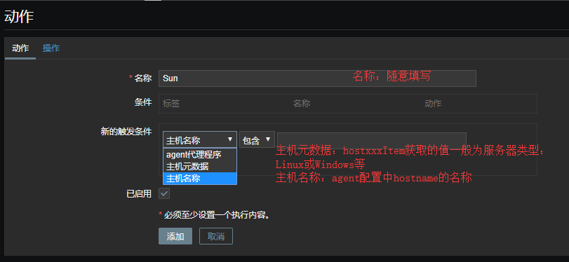

## 目的

对于监控服务器越来越多的情况，如果还单独一个一个添加，那效率也太低，因此就要实现批量添加监控服务器的操作，Zabbix提供两种批量自动监控的方式：

**自动发现：由服务端主动发起，Zabbix Server开启发现进程，定时扫描局域网中IP服务器、设备。**

**自动注册：由客户端主动发起，客户端必须安装并启动Agentd，否则无法被自动注册添加至主机列表。对于使用SNMP的就要采用自动发现了。**

本篇教程就是自动注册，让客户端自动向Server去注册。

<!--more-->

## 教程

#### zabbix-agent批量安装脚本

```bash
#!/bin/bash
# -*- coding: utf-8 -*-
# 功能：centos6.x或7.x都可以自动安装最新稳定版4.0.x agent

vernum=`cat /etc/redhat-release|sed -r 's/.* ([0-9]+)\..*/\1/'`
# vernum也可以这样获取： rpm -q centos-release|cut -d- -f3

wget http://repo.zabbix.com/zabbix/4.0/rhel/${vernum}/x86_64/zabbix-agent-4.0.9-3.el${vernum}.x86_64.rpm

rpm -ivh zabbix-agent-4.0.9-3.el${vernum}.x86_64.rpm

sed -i.ori 's#Server=127.0.0.1#Server=10.216.1.106#' /etc/zabbix/zabbix_agentd.conf
sed -i.ori 's#ServerActive=127.0.0.1#ServerActive=10.216.1.106#' /etc/zabbix/zabbix_agentd.conf
sed -i.ori 's#Hostname=Zabbix server#Hostname='$(hostname)'#' /etc/zabbix/zabbix_agentd.conf
sed -i.ori '180a HostMetadataItem=system.uname' /etc/zabbix/zabbix_agentd.conf

service zabbix-agent start

if [ $vernum == 6 ];then
        chkconfig --add zabbix-agent
        chkconfig zabbix-agent on
else
        systemctl enable  zabbix-agent.service
fi
```

#### zabbix-server页面配置

配置---->动作----->事件源选择自动注册---->创建动作


触发条件



我这里因为都是linux服务器，并且服务器hostname都有相同后缀，所以可以设置两个条件共同满足才可以。


选择操作---->添加操作：添加主机，添加群组、链接到模板


点击添加完成

等待几分钟 ，新的agent就会自动注册到server上了。可以查看server和agent日志查看


## 知识点

页面操作是主机元数据的值 

```bash
[root@centos ~]# uname
Linux
```

或者是

```bash
[root@centos ~]# zabbix_get -s 192.168.11.12 -p 10050 -k "system.uname"
Linux ltt02.xxx.net 3.10.0-693.el7.x86_64 #1 SMP Tue Aug 22 21:09:27 UTC 2017 x86_64
```

获取到的就是agent配置中，把类型赋值给主机元数据，在条件中就可以设定

```
HostMetadataItem=system.uname
```

同理：hostname也是一样的。