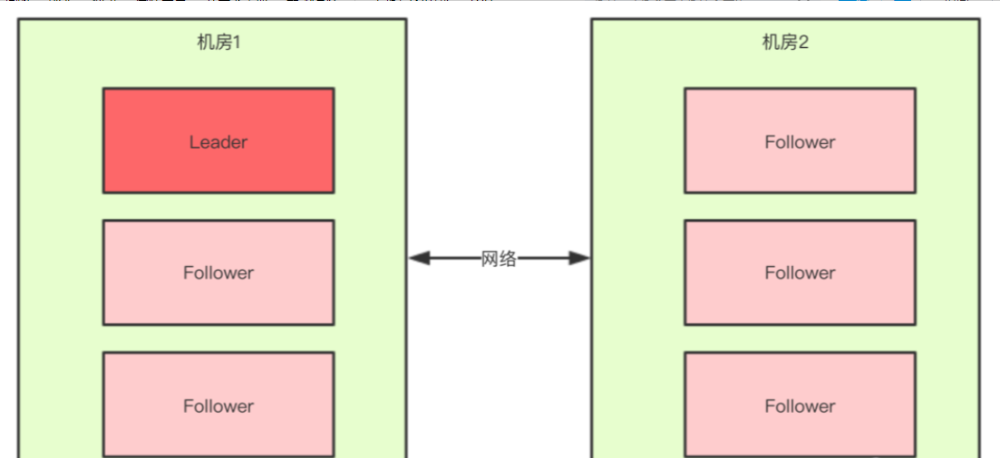
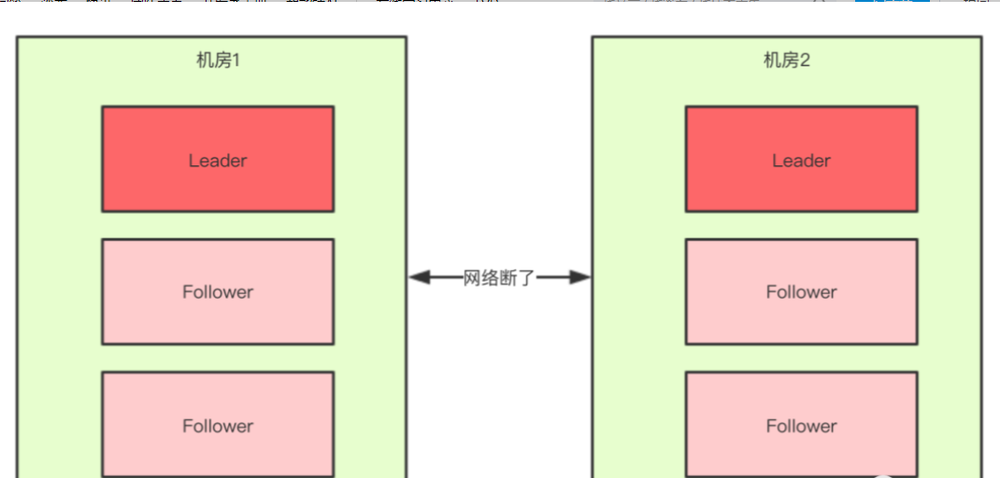
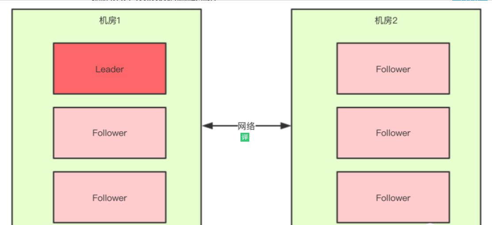
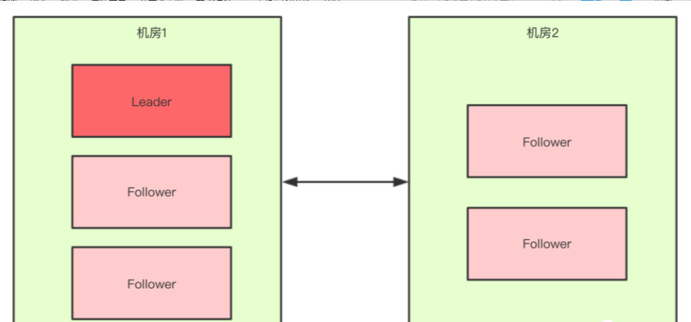

## 什么是脑裂

脑裂(split-brain)就是“大脑分裂”，也就是本来一个“大脑”被拆分了两个或多个“大脑”，我们都知道，如果一个人有多个大脑，并且相互独立的话，那么会导致人体“手舞足蹈”，“不听使唤”。

脑裂通常会出现在集群环境中，比如ElasticSearch、Zookeeper集群，而这些集群环境有一个统一的特点，就是它们有一个大脑，比如ElasticSearch集群中有Master节点，Zookeeper集群中有Leader节点。

本篇文章着重来给大家讲一下Zookeeper中的脑裂问题，以及是如果解决脑裂问题的。

<!--more-->


## 集群脑裂场景

------

对于一个集群，想要提高这个集群的可用性，通常会采用多机房部署，比如现在有一个由6台zkServer所组成的一个集群，部署在了两个机房：



正常情况下，此集群只会有一个Leader，那么如果机房之间的网络断了之后，两个机房内的zkServer还是可以相互通信的，如果**不考虑过半机制**，那么就会出现每个机房内部都将选出一个Leader。

这就相当于原本一个集群，被分成了两个集群，出现了两个“大脑”，这就是脑裂。

对于这种情况，我们也可以看出来，原本应该是统一的一个集群对外提供服务的，现在变成了两个集群同时对外提供服务，如果过了一会，断了的网络突然联通了，那么此时就会出现问题了，两个集群刚刚都对外提供服务了，数据该怎么合并，数据冲突怎么解决等等问题。

刚刚在说明脑裂场景时，有一个前提条件就是没有考虑过半机制，所以实际上Zookeeper集群中是不会出现脑裂问题的，而不会出现的原因就跟过半机制有关。


## 过半机制

在领导者选举的过程中，如果某台zkServer获得了超过半数的选票，则此zkServer就可以成为Leader了。

过半机制的源码实现其实非常简单：

```java
public class QuorumMaj implements QuorumVerifier {
    private static final Logger LOG = LoggerFactory.getLogger(QuorumMaj.class);
    
    int half;
    
    // n表示集群中zkServer的个数（准确的说是参与者的个数，参与者不包括观察者节点）
    public QuorumMaj(int n){
        this.half = n/2;
    }

    // 验证是否符合过半机制
    public boolean containsQuorum(Set<Long> set){
        // half是在构造方法里赋值的
        // set.size()表示某台zkServer获得的票数
        return (set.size() > half);
    }
    
}
```

大家仔细看一下上面方法中的注释，核心代码就是下面两行：

```html
this.half = n/2;return (set.size() > half);
```

举个简单的例子：如果现在集群中有5台zkServer，那么half=5/2=2，那么也就是说，领导者选举的过程中至少要有三台zkServer投了同一个zkServer，才会符合过半机制，才能选出来一个Leader。

那么有一个问题我们想一下，**选举的过程中为什么一定要有一个过半机制验证？**因为这样不需要等待所有zkServer都投了同一个zkServer就可以选举出来一个Leader了，这样比较快，所以叫快速领导者选举算法呗。

那么再来想一个问题，**过半机制中为什么是大于，而不是大于等于呢？**

这就是更脑裂问题有关系了，比如回到上文出现脑裂问题的场景：

当机房中间的网络断掉之后，机房1内的三台服务器会进行领导者选举，但是此时过半机制的条件是set.size() > 3，也就是说至少要4台zkServer才能选出来一个Leader，所以对于机房1来说它不能选出一个Leader，同样机房2也不能选出一个Leader，这种情况下整个集群当机房间的网络断掉后，整个集群将没有Leader。没有Leader对外就不能提供服务。

而如果过半机制的条件是set.size() >= 3，那么机房1和机房2都会选出一个Leader，这样就出现了脑裂。所以我们就知道了，为什么过半机制中是**大于**，而不是**大于等于**。就是为了防止脑裂。

如果假设我们现在只有5台机器，也部署在两个机房：

此时过半机制的条件是set.size() > 2，也就是至少要3台服务器才能选出一个Leader，此时机房件的网络断开了，对于机房1来说是没有影响的，Leader依然还是Leader，对于机房2来说是选不出来Leader的，此时整个集群中只有一个Leader。

所以，我们可以总结得出，有了过半机制，对于一个Zookeeper集群，要么没有Leader，要没只有1个Leader，这样就避免了脑裂问题。

## 奇偶节点数探讨

命题：A,B两个机房5个节点和6个节点zookeeper节点比较。

5个节点：A机房3个，B机房2个。如果网络出现中断，根据过半机制原则, 大于2个节点就可以选举出来leader。那么结果就是A机房3个节点大于2，就可以正常选举出来Leader。B节点不大于2，不能选举出Leader。这时集群还是可以正常对外提供服务，只是节点少两个而已。当网络恢复后，B机房节点再加入到集群，集群恢复。

6个节点：A机房3个，B机房3个。如果网络出现中断，根据过半机制原则, 大于3个节点才可以选举出来leader。那么结果就是A机房3个节点不大于3，B节点也不大于3，两个机房都不能选举出Leader。而没有Leader集群就不能对外提供服务，造成整个集群不可用。违背了高可用的初衷。并且还多用一台服务器，还有搭建和维护成本。而且和5个节点冗余是一样的。

可能有同学会说那A机房4个，B节点2个不就可以了。是的，这样是可以，但是偶数是存在3，3分布的这种情况。


## 总结

综上所述，为了保证zookeeper集群高可用，防止脑裂。建议用奇数个zk节点，当然是大于2的奇数。奇数个zk节点有两个好处：1，奇数个节点可用节省一个节点的资源（服务器和部署及维护成本）。2，如为偶数个节点，因为过半机制的设定，有可能出现没有leader，造成整个集群不可以。

