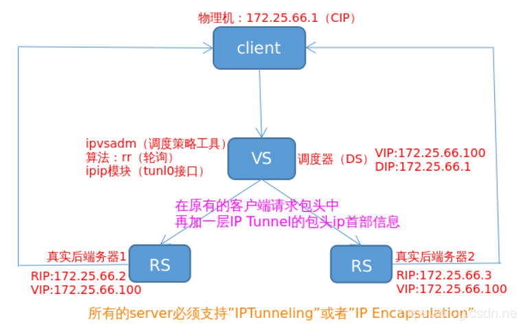
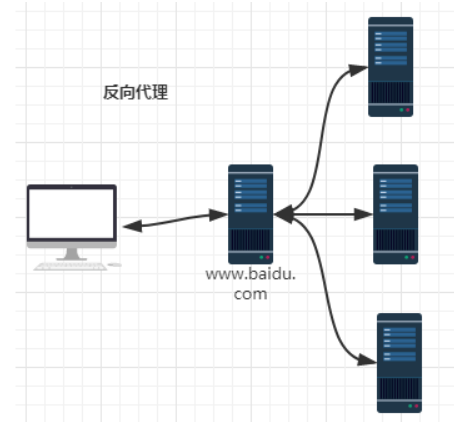

本文对三大主流负载均衡器LVS、Nginx、HAproxy进行对比和详解，以及适合的场景，技术选型等等

<!--more-->

## LVS

### 简介

```
LVS的是Linux Virtual Server的简写，翻译为Linux虚拟服务器，即一个虚拟的服务器集群系统，
是由我国章文嵩博士在1998年5月所研究成立，也是中国国内最早出现的自由软件项目之一。
LVS由2部分程序组成，包括 ipvs 和 ipvsadm

1. ipvs(ip virtual server)：一段代码工作在内核空间，叫ipvs，是真正生效实现调度的代码。
2. ipvsadm：另外一段是工作在用户空间，叫ipvsadm，负责为ipvs内核框架编写规则，定义谁是集群服务，而谁是后端真实的服务器(Real Server)
```

**LVS相关的几种IP**:

```
VIP :（virtual IP）   LVS服务器上接收外网数据报文的网卡IP地址
DIP: （director IP）  LVS服务器上发送数据报文到real server的网卡IP地址
RIP :（real server）  真实服务器上的IP，即提供服务的服务器IP(常简称为RS)
CIP :（client IP ）   客户端的IP
```

**工作模式**：

```
LVS常用的工作模式有DR模式、TUN模式、以及NAT模式
```

### DR模式

```
直接路由: Director Route
```

#### **工作原理**


```
每个RS（Real Server）上都有两个IP：VIP和RIP，但是VIP是隐藏的，即不能提供解析等功能，
只是用来做请求回复的源IP的，Director（VS）上只需要一个网卡，在该网卡上配置两个IP：VIP和DIP，
在VS接收到客户端的请求后，VS根据负载算法选择一台RS的网卡mac作为客户端请求包中的目标mac，
通过arp转交给后端RS处理，后端RS再通过自己的路由网关回复给客户端client。
```

#### **特点**

```
1.各DIP（VS）必须与 RIP（RS） 在同一局域网内(即具有相同的广播域)，且两个有相同的目标地址（vip）；
2.RS的RIP可以使用私有地址，也可以使用公网地址，以方便配置；不支持支持端口映射；
3.RS可以使用必须为uninx操作系统（OS）；且RS需要配置vip但不做响应；
4.Director（VS）仅负责处理入站请求，响应报文由RS( Real server) 直接发往客户端；
5.Real server（RS）不能将网关指向DIP（DS），而直接使用前端网关响应请求报文；
```

#### **优缺点**

**优点**：

```
负载均衡器VS只负责将请求包分发给物理服务器RS，而物理服务器RS将应答包直接发给用户。所以，负载均衡器VS能处理很巨大的请求量。
这种方式，一台负载均衡能为超过100台的物理服务器服务，负载均衡器不再是系统的瓶颈。
使用LVS/DR方式，如果你的负载均VS拥有100M的全双工网卡的话，就能使得整个Virtual Server能达到1G的吞吐量，甚至更高；
```

**缺点**：

```
这种方式需要所有的DIR和RIP都在同一广播域；不支持异地容灾。
```

**总结**：

```
LVS/DR是三种模式中性能最高的一种模式，比LVS-NAT模式下负载的RS serve更多，通常在100台左右，对网络环境要求更高，也是日常应用的最多的一种工作模式。
```

### TUN模式

```
隧道模式: tunnel
```

#### 工作原理



```
它的连接调度和管理与LVS/NAT中的一样，利用ip隧道技术的原理，即在原有的客户端请求包头中再加一层IP Tunnel的包头ip首部信息，
不改变原来整个请求包信息，只是新增了一层ip首部信息，再利用路由原理将请求发给RS server，不过要求的是所有的server必须支持”IPTunneling”或者”IP Encapsulation”协议。
```

#### 特点

```
1.RIP、VIP、DIP全是公网地址
2.RS的网关不会也不可能指向DIP
3.所有的请求报文经由Director Server，但响应报文必须不能进过Director Server
4.不支持端口映射,
5.RS的系统必须支持隧道
```

#### 优缺点

**优点**：

```
1.不需要调度应答报文，负载能力强；
2.服务器和调度器可以不在同一个VLAN中；
3.支持广域负载均衡；
```

**缺点**：

```
1.所有的服务器必须支持“IP Tunneling”协议，需安装内核模块，安装复杂；
2.建立IP隧道的开销大；
3.服务器需要联通外网，风险较大；
4.不支持端口映射；
```

### NAT模式

```
NAT（Network address translation）即网络地址转换，作为一种过渡解决手段，可以用来减少对全球合法IP地址的需求。
简单的说，NAT就是在内部专用网络中使用内部地址，而当内部节点要与外界网络发生联系时，就在边缘路由器或者防火墙处，
将内部地址转换成全局地址，从而使得在外部公共网（Internet）上使用一个和数个合法IP地址正常传输数据。
其中，这里的外网和内网是相对来讲的，下面假设能够访问互联网的网络为外网。
```

#### 工作原理


```
当数据包到达VS时，VS做目标地址转换（DNAT），将目标IP改为RS的IP。RS接收到数据包以后，仿佛是客户端直接发给它的一样。
RS处理完，返回响应时，源IP是RIP，目标IP是客户端的IP。这时RS的包通过网关（VS）中转，VS会做源地址转换（SNAT），
将包的源地址改为VIP，这样，这个包对客户端看起来就仿佛是VS直接返回给它的
```

#### 特点

```
1.RS应该使用私有地址，RS的网关必须指向DIP
2.DIP和RIP必须在同一个网段内
3.请求和响应报文都需要经过DS，高负载场景中，DS易成为性能瓶颈
4.支持端口映射
5.RS可以使用任意操作系统
6.缺陷：对Director Server压力会比较大，请求和响应都需经过director server
```

#### 优缺点

**优点**：

```
集群中的物理服务器可以使用任何支持TCP/IP操作系统，物理服务器可以分配Internet的保留私有地址，只有负载均衡器需要一个合法的IP地址。
```

**缺点**：

```
扩展性有限；当服务器节点（普通PC服务器）数据增长到20个或更多时,负载均衡器将成为整个系统的瓶颈，因为所有的请求包和应答包都需要经过负载均衡器再生。
```

**总结**：

```
LVS无论NAT及DR模式，均要求VS和RS在同一个网段内，NAT需要把VS当作各个RS的默认网关，
DR模式采用修改mac地址直接从数据链路层转发、要求必须在同一个物理网段内
```


## Nginx

### 简介

```
Nginx是一款轻量级的Web服务器/反向代理服务器及电子邮件（IMAP/POP3）代理服务器，在BSD-like 协议下发行。其特点是占有内存少，并发能力强。
国内使用nginx网站用户有：百度、京东、新浪、网易、腾讯、淘宝等。
```

### 工作原理

```
Nginx由内核和模块组成。Nginx本身做的工作实际很少，当它接到一个HTTP请求时，它仅仅是通过查找配置文件将此次请求映射到一个location block，
而此location中所配置的各个指令则会启动不同的模块去完成工作，因此模块可以看做Nginx真正的劳动工作者。
通常一个location中的指令会涉及一个handler模块和多个filter模块（当然，多个location可以复用同一个模块）。
handler模块负责处理请求，完成响应内容的生成，而filter模块对响应内容进行处理。用户根据自己的需要开发的模块都属于第三方模块。正是有了这么多模块的支撑，Nginx的功能才会如此强大。
```


Nginx的模块从结构上分为：

```
核心模块：HTTP模块、EVENT模块和MAIL模块
基础模块：HTTP Access模块、HTTP FastCGI模块、HTTP Proxy模块和HTTP Rewrite模块，
第三方模块：HTTP Upstream Request Hash模块、Notice模块和HTTP Access Key模块。
```


Nginx的模块从功能上分为：

```
Core    ： 核心模块；构建nginx基础服务、管理其他模块。
Handlers： 处理器模块；此类模块直接处理请求，并进行输出内容和修改headers信息等操作。Handlers处理器模块一般只能有一个。
Filters ： 过滤器模块；此类模块主要对其他处理器模块输出的内容进行修改操作，最后由Nginx输出。
Proxies ： 代理类模块；此类模块是Nginx的HTTP Upstream之类的模块，这些模块主要与后端一些服务比如FastCGI等进行交互，实现服务代理和负载均衡等功能。
```

```
Nginx的核心模块：主要负责建立nginx服务模型、管理网络层和应用层协议、以及启动针对特定应用的一系列候选模块。
其他模块负责分配给web服务器的实际工作：
    (1) 当Nginx发送文件或者转发请求到其他服务器，由Handlers(处理模块)或Proxies（代理类模块）提供服务；
    (2) 当需要Nginx把输出压缩或者在服务端加一些东西，由Filters(过滤模块)提供服务。
```


Nginx模块处理流程：

```
1.客户端发送HTTP请求
2.Nginx基于配置文件中的位置选择一个合适的处理模块
3.负载均衡模块选择一台后端服务器 (如果有)
4.处理模块进行处理并把输出缓冲放到第一个过滤模块上
5.第一个过滤模块处理后输出给第二个过滤模块 
6.然后第二个过滤模块又到第三个 
7.依此类推，最后把响应发给客户端。
```


Nginx请求处理流程：

```
Nginx在启动时会以daemon形式在后台运行，采用多进程+异步非阻塞IO事件模型来处理各种连接请求。
多进程模型包括一个master进程，多个worker进程，一般worker进程个数是根据服务器CPU核数来决定的。
master进程负责管理Nginx本身和其他worker进程。
```

```
1.操作系统提供的机制（例如 epoll, kqueue 等）产生相关的事件。
2.接收和处理这些事件，如是接收到数据，则产生更高层的 request 对象。
3.处理 request 的 header 和 body。
4.产生响应，并发送回客户端。
5.完成 request 的处理。
6.重新初始化定时器及其他事件。
```

Nginx进程模型

```
Nginx默认采用多进程工作方式，Nginx启动后，会运行一个master进程和多个worker进程。
master充当整个进程组与用户的交互接口，同时对进程进行监护，管理worker进程来实现重启服务、平滑升级、更换日志文件、配置文件实时生效等功能。
worker用来处理基本的网络事件，worker之间是平等的，他们共同竞争来处理来自客户端的请求。
```


### 功能

```
Nginx能做： 正向代理  反向代理  负载均衡  HTTP服务器(包含动静分离)
```

#### 正向代理

```
正向代理（Forward Proxy）：通常都被简称为代理，就是在用户无法正常访问外部资源，
比方说受到GFW的影响无法访问twitter的时候，我们可以通过代理的方式，让用户绕过防火墙，
从而连接到目标网络或者服务。
```

```
正向代理的工作原理就像一个跳板，比如：我访问不了google.com，但是我能访问一个代理服务器A，A能访问google.com，
于是我先连上代理服务器A，告诉他我需要google.com的内容，A就去取回来，然后返回给我。从网站的角度，
只在代理服务器来取内容的时候有一次记录，有时候并不知道是用户的请求，也隐藏了用户的资料，这取决于代理告不告诉网站。
```

```
正向代理是一个位于客户端和原始服务器之间的服务器。为了从原始服务器取得内容，客户端向代理发送一个请求并指定目标(原始服务器)，
然后代理向原始服务器转交请求并将获得的内容返回给客户端。
```


#### 反向代理

```
反向代理（Reverse Proxy）：是指以代理服务器来接受internet上的连接请求，然后将请求转发给内部网络上的服务器，
并将从服务器上得到的结果返回给internet上请求连接的客户端，此时代理服务器对外就表现为一个服务器。
```

```
举个例子，比如我想访问 http://www.test.com/readme，但www.test.com上并不存在readme页面，于是他是偷偷从另外一台服务器上取回来，
然后作为自己的内容返回用户，但用户并不知情。这里所提到的 www.test.com 这个域名对应的服务器就设置了反向代理功能。
```

```
反向代理服务器对于客户端而言它就像是原始服务器，并且客户端不需要进行任何特别的设置。客户端向反向代理的命名空间中的内容发送普通请求，
接着反向代理服务器将判断向何处(原始服务器)转交请求，并将获得的内容返回给客户端，就像这些内容原本就是它自己的一样。
```



**总结**

```
正向代理：针对客户端而言，代理服务器代理客户端，转发请求，并将获得的内容返回给客户端。
反向代理：针对客户端而言，代理服务器就像是原始服务器,代理集群的web节点服务器返回结果。
```

#### 负载均衡

```
负载均衡也是Nginx常用的一个功能，负载均衡其意思就是分摊到多个操作单元上进行执行，例如Web服务器、FTP服务器、企业关键应用服务器和其它关键任务服务器等，从而共同完成工作任务。
简单而言就是当有2台或以上服务器时，根据规则随机的将请求分发到指定的服务器上处理，负载均衡配置一般都需要同时配置反向代理，通过反向代理跳转到负载均衡。
Nginx目前支持自带3种负载均衡策略，还有2种常用的第三方策略。
```

1.**轮询（rr）**

```
按照轮询（默认）方式进行负载，每个请求按时间顺序逐一分配到不同的后端服务器，如果后端服务器down掉，能自动剔除。
虽然这种方式简便、成本低廉。但缺点是：可靠性低和负载分配不均衡。
```

2.**权重(weight)**

```
指定轮询几率，weight和访问比率成正比，用于后端服务器性能不均的情况。
```

```
upstream westos{
     server 172.25.66.2:80  weight=9;
     server 172.25.66.3:80  weight=1;
}
```

3.**ip哈希（ip_hash）**

```
上面的2种方式都有一个问题，那就是下一个请求来的时候请求可能分发到另外一个服务器，当我们的程序不是无状态的时候（采用了session保存数据），
这时候就有一个很大的很问题了，比如把登录信息保存到了session中，那么跳转到另外一台服务器的时候就需要重新登录了，
所以很多时候我们需要一个客户只访问一个服务器，那么就需要用ip_hash了，ip_hash的每个请求按访问ip的hash结果分配，
这样每个访客固定访问一个后端服务器，可以解决session的问题。
```

```
ip_hash： 来自同一个IP的请求会分发到相同的后端服务器
```

```
upstream westos{
	 ip_hash;
     server 172.25.66.2:80;
     server 172.25.66.3:80;
}
```


第三方策略：

1.**fair**

```
按后端服务器的响应时间来分配请求，响应时间短的优先分配。
```

```
upstream backend{
	 fair;
     server 172.25.66.2:80;
     server 172.25.66.3:80;
}
```

2.**url_hash**

```
按访问url的hash结果来分配请求，使每个url定向到同一个后端服务器，后端服务器为缓存时比较有效。 
在upstream中加入hash语句，server语句中不能写入weight等其他的参数，hash_method是使用的hash算法。
```

```
upstream backend{
	 hash $request_uri; 
     hash_method crc32; 
     server 172.25.66.2:80;
     server 172.25.66.3:80;
}
```


(4).**HTTP服务器**

```
Nginx本身也是一个静态资源的服务器，当只有静态资源的时候，就可以使用Nginx来做服务器，同时现在也很流行动静分离，
就可以通过Nginx来实现，动静分离是让动态网站里的动态网页根据一定规则把不变的资源和经常变的资源区分开来，动静资源做好了拆分以后，
我们就可以根据静态资源的特点将其做缓存操作，这就是网站静态化处理的核心思路。 
```

### 优点

(1).支持高并发

```
官方测试Nginx能够支撑5万并发连接，实际生产环境中可以支撑2~4万并发连接数。
原因主要是Nginx使用了最新的epoll（Linux2.6内核）和kqueue（freeBSD）网路I/O模型，
而Apache使用的是传统的Select模型，其比较稳定的Prefork模式为多进程模式，需要经常派生子进程，所以消耗的CPU等服务器资源，要比Nginx高很多。
```


(2).内存消耗少

```
Nginx+PHP（FastCGI）服务器，在3万并发连接下，开启10个Nginx进程消耗150MB内存，15MB*10=150MB，开启的64个PHP-CGI进程消耗1280内存，20MB*64=1280MB，加上系统自身消耗的内存，总共消耗不到2GB的内存。
如果服务器的内存比较小，完全可以只开启25个PHP-CGI进程，这样PHP-CGI消耗的总内存数才500MB。
```


(3).成本低廉

```
购买F5BIG-IP、NetScaler等硬件负载均衡交换机，需要十多万到几十万人民币，而Nginx为开源软件，采用的是2-clause BSD-like协议，可以免费试用，并且可用于商业用途。
BSD开源协议是一个给使用者很大自由的协议，协议指出可以自由使用、修改源代码、也可以将修改后的代码作为开源或专用软件再发布。
```


(4).配置简单

```
网络和程序一样通俗易懂，即使，非专用系统管理员也能看懂。
```


(5).支持Rewrite重写

```
Rewrite:重定向；能够根据域名、URL的不同，将http请求分到不同的后端服务器群组。
```


(6).内置健康检查

```
如果NginxProxy后端的某台Web服务器宕机了，不会影响前端的访问。
```


(7).节省带宽

```
支持GZIP压缩，可以添加浏览器本地缓存的Header头。
```


(8).支持热部署

```
Nginx支持热部署，它的自动特别容易，并且，几乎可以7天*24小时不间断的运行，
即使运行数个月也不需要重新启动，还能够在不间断服务的情况下，对软件版本进行升级。
```


## HAproxy

### 简介

```
HAProxy是一个使用C语言编写的自由及开放源代码软件，它提供高可用性、负载均衡，以及基于TCP(第四层)和HTTP（第七层）的应用程序代理。
HAProxy特别适用于那些负载特大的web站点，这些站点通常又需要会话保持或七层处理。HAProxy运行在当前的硬件上，
完全可以支持数以万计的并发连接。并且它的运行模式使得它可以很简单安全的整合进您当前的架构中， 同时可以保护你的web服务器不被暴露到网络上。
```

### 原理

```
HAProxy实现了一种事件驱动, 单一进程模型，此模型支持非常大的并发连接数。多进程或多线程模型受内存限制 、系统调度器限制以及无处不在的锁限制，很少能处理数千并发连接。
事件驱动模型因为在有更好的资源和时间管理的用户空间(User-Space) 实现所有这些任务，所以没有这些问题。
此模型的弊端是，在多核系统上，这些程序通常扩展性较差。这就是为什么他们必须进行优化以使每个CPU时间片(Cycle)做更多的工作
```

HAProxy的负载均衡算法：

```
1. roundrobin：简单的轮询
2. static-rr：权重轮询
3. leastconn：最少连接者优先
4. source：根据请求源IP,这个跟Nginx的ip_hash机制类似
5. ri：根据请求的URI
6. rl_param：表示根据请求的URI参数‘balance url_param’requires an URL parameter name;
7. hdr(name)：根据HTTP请求头来锁定每一次HTTP请求
8. rdp-cookie(name)：根据cookie来锁定并哈希每一次TCP请求
```

### 优点

```
1.免费开源，稳定性也是非常好。单HAproxy也跑得不错，稳定性可以与硬件级的F5相媲美。
2.根据官方文档，HAproxy可以跑满10Gbps，这个数值作为软件级负载均衡器是相当惊人的。
3.HAproxy支持连接拒绝:因为维护一个连接的打开的开销是很低的，有时我们很需要限制攻击蠕虫（attack bots），也就是说限制它们的连接打开从而限制它们的危害。这个已经为一个陷于小型DDoS攻击的网站开发了而且已经拯救了很多站点，这个优点也是其它负载均衡器没有的。
4.HAproxy支持全透明代理（已具备硬件防火墙的典型特点）:可以用客户端IP地址或者任何其他地址来连接后端服务器。这个特性仅在Linux 2.4/2.6内核打了tcp proxy补丁后才可以使用。这个特性也使得为某特殊服务器处理部分流量同时又不修改服务器的地址成为可能。
5.HAproxy现多于线上的Mysql集群环境，我们常用于它作为MySQL（读）负载均衡。
6.自带强大的监控服务器状态的页面，实际环境中我们结合Nagios进行邮件或短信报警。
7.HAproxy支持虚拟主机，许多朋友说它不支持虚拟主机是错误的，通过测试我们知道，HAProxy是支持虚拟主机的。
```

## 总结

比较LVS、Nginx、HAproxy优缺点

```
三大主流负载均衡器： LVS  Nginx  HAproxy
```


### LVS

**优点**：

```
1.抗负载能力强,工作在网络4层之上,仅作分发之用，没有流量的产生，这个特点也决定了它在负载均衡软件里的性能最强的，对内存和cpu资源消耗比较低。
2.配置性比较低，这是一个缺点也是一个优点，因为没有可太多配置的东西，所以并不需要太多接触，大大减少了人为出错的几率。
3.工作稳定，因为其本身抗负载能力很强，自身有完整的双机热备方案，如LVS+Keepalived，不过我们在项目实施中用得最多的还是LVS/DR+Keepalived。
4.无流量，LVS只分发请求，而流量并不从它本身出去，这点保证了均衡器IO的性能不会收到大流量的影响。
5.应用范围比较广，因为LVS工作在4层，所以它几乎可以对所有应用做负载均衡，包括http、数据库、在线聊天室等等。
```

**缺点**：

```
1.软件本身不支持正则表达式处理，不能做动静分离；而现在许多网站在这方面都有较强的需求，这个是Nginx/HAProxy+Keepalived的优势所在。
2.如果是网站应用比较庞大的话，LVS/DR+Keepalived实施起来就比较复杂了，特别后面有Windows Server的机器的话，如果实施及配置还有维护过程就比较复杂了，相对而言，Nginx/HAProxy+Keepalived就简单多了。
```

### Nginx

**优点**：

```
1.工作在网络的7层之上，可以针对http应用做一些分流的策略，比如针对域名、目录结构。它的正则规则比HAProxy更为强大和灵活，这也是它目前广泛流行的主要原因之一，Nginx单凭这点可利用的场合就远多于LVS了。
2.对网络稳定性的依赖非常小，理论上能ping通就就能进行负载功能。
3.安装和配置比较简单，测试起来比较方便，它基本能把错误用日志打印出来。LVS的配置、测试就要花比较长的时间了，LVS对网络依赖比较大。
3.抗高并发且稳定，在硬件不差的情况下一般能支撑几万次的并发量，负载度比LVS相对小些。
4.可以通过端口检测到服务器内部的故障，比如根据服务器处理网页返回的状态码、超时等等，并且会把返回错误的请求重新提交到另一个节点。
5.不仅仅是一款优秀的负载均衡器/反向代理软件，它同时也是功能强大的Web应用服务器。LNMP也是近几年非常流行的web架构，在高流量的环境中稳定性也很好。
6.作为Web反向加速缓存越来越成熟了，速度比传统的Squid服务器更快，可以考虑用其作为反向代理加速器。
7.可作为中层反向代理使用，这一层面Nginx基本上无对手，唯一可以对比Nginx的就只有lighttpd了，不过lighttpd目前还没有做到Nginx完全的功能，配置也不那么清晰易读，社区资料也远远没Nginx活跃。
8.可作为静态网页和图片服务器，这方面的性能也无对手。
9.Nginx社区非常活跃，第三方模块也很多。
```

**缺点**：

```
1.Nginx仅能支持http、https和Email协议，适用范围小。
2.对后端服务器的健康检查，只支持通过端口来检测，不支持通过url来检测。不支持Session的直接保持，但能通过ip_hash来解决。
```

### HAproxy

**优点**：

```
1.支持两种代理模式：TCP（四层）和HTTP（七层），支持虚拟主机；
2.支持Session的保持，Cookie的引导；同时支持通过获取指定的url来检测后端服务器的状态。能够补充Nginx的一些缺点。
3.HAProxy跟LVS类似，本身就只是一款负载均衡软件；单纯从效率上来讲HAProxy会比Nginx有更出色的负载均衡速度，在并发处理上也是优于Nginx的。
4.HAProxy可以对Mysql进行负载均衡，对后端的DB节点进行检测和负载均衡。
5.HAProxy负载均衡策略非常多，比如：动态加权轮循(Dynamic Round Robin)，加权源地址哈希(Weighted Source Hash)，加权URL哈希和加权参数哈希(Weighted Parameter Hash)
6.免费开源，稳定性也是非常好，可以与LVS相媲美；
7.自带强大的监控服务器状态的页面，实际环境中我们结合Nagios进行邮件或短信报警；
```

**缺点**：

```
1. 不支持POP/SMTP协议 SPDY协议；
2. 不能做Web服务器，即不支持HTTP cache功能；
3. 重载配置的功能需要重启进程，虽然也是soft restart，但没有Nginx的reaload更为平滑和友好；
4. 多进程模式支持不够好；
```

### 适用场景

```
1.网站建设初期，可以选用Nigix/HAproxy作为反向代理负载均衡（或者流量不大都可以不选用负载均衡），因为其配置简单，性能也能满足一般的业务场景。
  如果考虑到负载均衡器是有单点问题，可以采用Nginx/HAproxy+Keepalived来避免。
2.网站并发达到一定程度之后，为了提高稳定性和转发效率，可以使用LVS、毕竟LVS比Nginx/HAproxy要更稳定，转发效率也更高。不过维护LVS对维护人员的要求也会更高，投入成本也更大。
```


