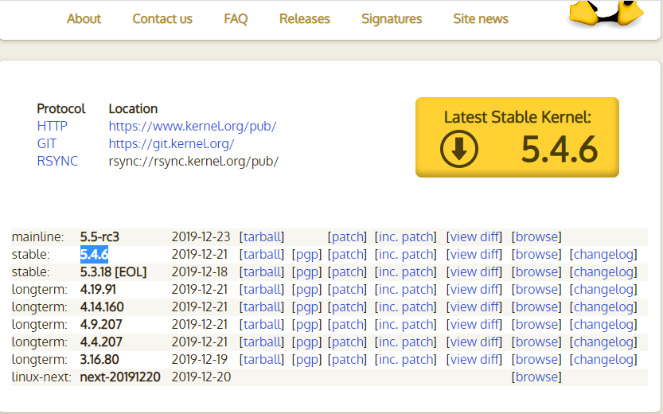
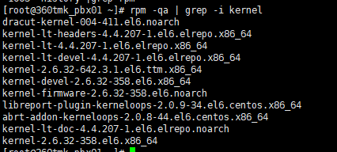

# 背景

Linux实质上上特指内核的，不过我们现在通常所说的是Linux是各个公司在内核的基础上进行优化和封装了很多组件，并加入了软件包管理工具等发行版，如：ubuntu，redhat,  centos等等。linux内核一直有在维护并随着技术和硬件的不断更新也加入了很多功能，所以如果要研究新的技术，用到新内核的功能，可能旧的内核不能满足需求。这时候就需要升级内核，但升级内核属于高危操作，早期还会总是出问题，后来如CentOS或RHEL类的Linux发行版需要升级Linux内核的话可以使用[ELRepo](http://elrepo.org/)第三方源来很方便进行升级。但是也可能受限于系统本身的低版本会造成升级失败，所以就详细描述了内核的升级过程。


<!--more-->

# ELRepo源

[ELRepo](https://www.elrepo.org/) 仓库，该软件源包含文件系统驱动以及网络摄像头驱动程序等等（支持显卡、网卡、声音设备甚至[新内核](https://linux.cn/article-8310-1.html)），虽然 ELRepo 是第三方仓库，但它有一个活跃社区和良好技术支持，并且CentOS官网wiki也已将它列为是可靠的（[参见此处](https://wiki.centos.org/AdditionalResources/Repositories)）。所以可以放心使用。

**内核版本简写说明**

**kernel-lt**（lt=long-term）长期有效

**kernel-ml**（ml=mainline）主流版本


# 查看当前内核版本

```bash
uname -r
```

目前Linux内核发布的最新稳定版可以从 https://www.kernel.org 进行查看。



# 升级内核

## 先更新nss

```
yum update nss
```


## 自动从源中安装

#### 首先安装ELRepo源

```bash
#centos6
rpm --import https://www.elrepo.org/RPM-GPG-KEY-elrepo.org
rpm -Uvh https://www.elrepo.org/elrepo-release-6-9.el6.elrepo.noarch.rpm

#centos7
rpm --import https://www.elrepo.org/RPM-GPG-KEY-elrepo.org
rpm -Uvh https://www.elrepo.org/elrepo-release-7.0-4.el7.elrepo.noarch.rpm

#centos8
rpm --import https://www.elrepo.org/RPM-GPG-KEY-elrepo.org
rpm -Uvh https://www.elrepo.org/elrepo-release-8.0-2.el8.elrepo.noarch.rpm
```

#### **启用ELRepo源仓库**

```bash
yum --disablerepo="\*" --enablerepo="elrepo-kernel" list available
```

#### **安装新内核**

```bash
yum -y --enablerepo=elrepo-kernel install kernel-lt kernel-lt-devel  kernel-lt-doc  kernel-lt-headers
```

如果顺利不报错的话新内核就说明已经安装完成。


## 手动下载安装

#### 内核报错

如安装内核有报错：No package kernel-lt available. 如下图


新内核下载地址：https://elrepo.org/linux/kernel/el7/x86_64/RPMS/

#### 下载安装内核

```bash
wget https://elrepo.org/linux/kernel/el6/x86_64/RPMS/kernel-lt-4.4.207-1.el6.elrepo.x86_64.rpm
rpm -ivh kernel-lt-4.4.207-1.el6.elrepo.x86_64.rpm
```


#### 更新kernel-lt-headers

```
wget https://elrepo.org/linux/kernel/el6/x86_64/RPMS/kernel-lt-headers-4.4.207-1.el6.elrepo.x86_64.rpm
rpm -ivh kernel-lt-headers-4.4.207-1.el6.elrepo.x86_64.rpm
```

 安装kernel-lt-headers时有冲突报错


**排除报错**

```bash
#移除
yum remove kernel-headers
#再重新安装
rpm -ivh kernel-lt-headers-4.4.207-1.el6.elrepo.x86_64.rpm
```


#### 更新kernel-lt-devel

```
wget https://elrepo.org/linux/kernel/el6/x86_64/RPMS/kernel-lt-devel-4.4.207-1.el6.elrepo.x86_64.rpm
rpm -ivh kernel-lt-devel-4.4.207-1.el6.elrepo.x86_64.rpm
```

#### 更新kernel-lt-doc

```
wget https://elrepo.org/linux/kernel/el6/x86_64/RPMS/kernel-lt-doc-4.4.207-1.el6.elrepo.noarch.rpm
rpm -ivh kernel-lt-doc-4.4.207-1.el6.elrepo.noarch.rpm
```


# 修改grub配置

这里因为系统差异原因，对centos7以上版本和centos6版本差异处理。

#### centos7以上

###### 查看当前grub中内核版本列表

```bash
#centos7以上版本
awk -F\' '$1=="menuentry " {print i++ " : " $2}' /etc/grub2.cfg
```

Centos7及以上版本会返回信息,可能如下：


信息列表中：**0** 即为安装的新内核


###### 修改设置并生成新的grub配置文件

```bash
grub2-set-default 0
grub2-mkconfig -o /boot/grub2/grub.cfg
```


#### Centos6

###### 查看安装的内核版本

```bash
rpm -qa | grep -i kernel
```



###### 编辑配置

更改/etc/grub.conf文件中default的值,设定为**0**如下图：


# 重新启动

```
reboot
```


# 验证

查看内核版本

```
uname -r
```


