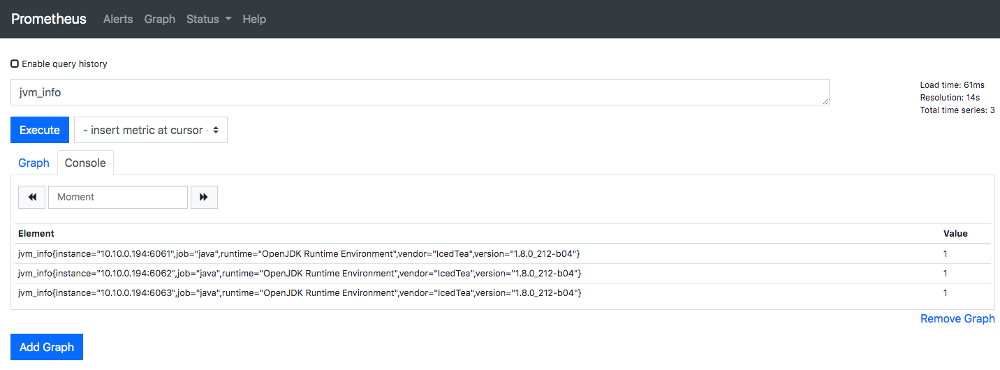
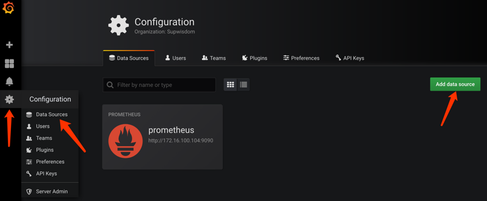
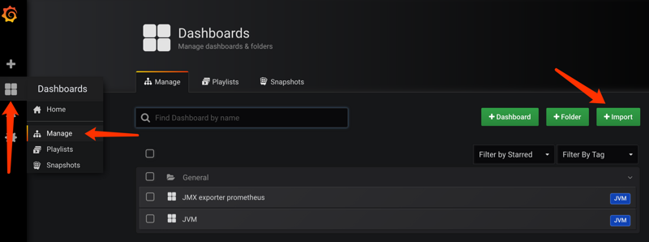
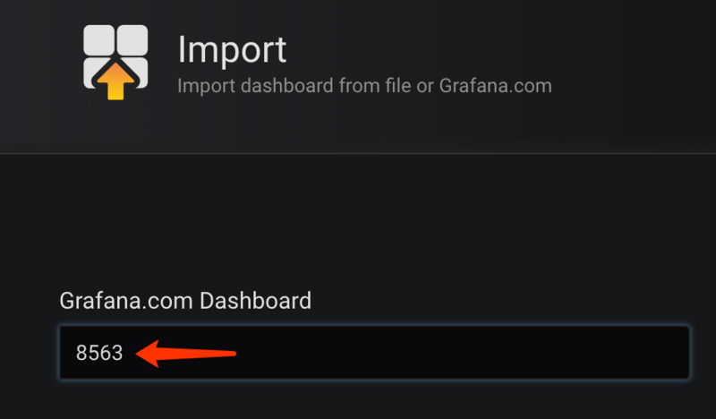
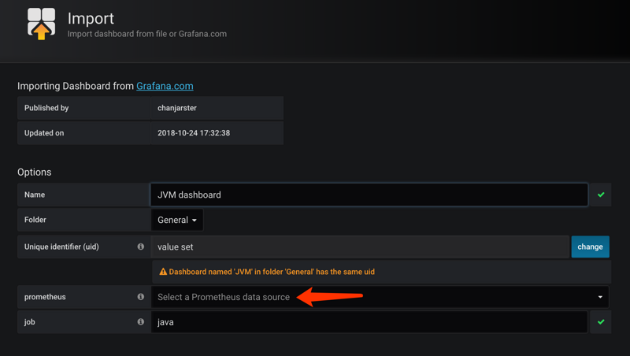
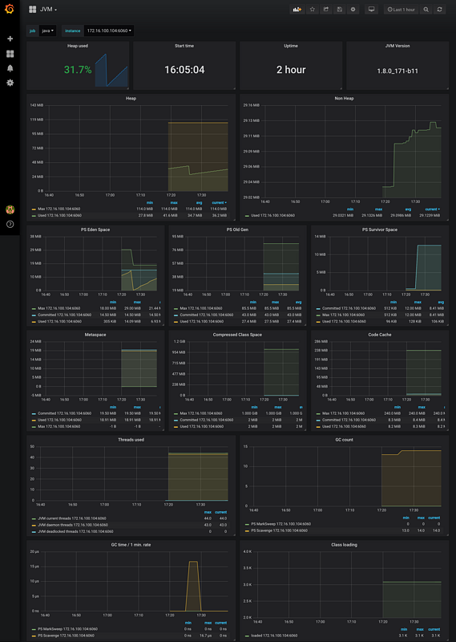

## 摘要

工具：

- Docker，本文大量使用了Docker来启动各个应用。
- [Prometheus](https://prometheus.io/)，负责抓取/存储指标信息，并提供查询功能。
- [Grafana](https://grafana.com/)，负责数据可视化。
- [JMX exporter](https://github.com/prometheus/jmx_exporter)，提供JMX中和JVM相关的metrics。
- Tomcat，用来模拟一个Java应用。

步骤：

1. 利用[JMX exporter](https://github.com/prometheus/jmx_exporter)，在Java进程内启动一个小型的Http server
2. 配置[Prometheus](https://prometheus.io/)抓取那个Http server提供的metrics。
3. 配置[Grafana](https://grafana.com/)连接[Prometheus](https://prometheus.io/)，配置Dashboard。

<!--more-->

## 启动Java测试实例

1) 新建一个目录，名字叫做`prom-jvm-demo`。

2) [下载JMX exporter](https://repo1.maven.org/maven2/io/prometheus/jmx/jmx_prometheus_javaagent/0.3.1/jmx_prometheus_javaagent-0.3.1.jar)到这个目录

3) 新建一个文件`simple-config.yml`内容如下：

```yaml
---
lowercaseOutputLabelNames: true
lowercaseOutputName: true
whitelistObjectNames: ["java.lang:type=OperatingSystem"]
rules:
 - pattern: 'java.lang<type=OperatingSystem><>((?!process_cpu_time)\w+):'
   name: os_$1
   type: GAUGE
   attrNameSnakeCase: true
```

4) 运行以下命令启动3个Tomcat，记得把`<path-to-prom-jvm-demo>`替换成正确的路径：

```shell
docker run -d \
  --name tomcat-1 \
  -v <path-to-prom-jvm-demo>:/jmx-exporter \
  -e CATALINA_OPTS="-Xms64m -Xmx128m -javaagent:/jmx-exporter/jmx_prometheus_javaagent-0.3.1.jar=6060:/jmx-exporter/simple-config.yml" \
  -p 6060:6060 \
  -p 8080:8080 \
  tomcat:8.5-alpine

docker run -d \
  --name tomcat-2 \
  -v <path-to-prom-jvm-demo>:/jmx-exporter \
  -e CATALINA_OPTS="-Xms64m -Xmx128m -javaagent:/jmx-exporter/jmx_prometheus_javaagent-0.3.1.jar=6060:/jmx-exporter/simple-config.yml" \
  -p 6061:6060 \
  -p 8081:8080 \
  tomcat:8.5-alpine

docker run -d \
  --name tomcat-3 \
  -v <path-to-prom-jvm-demo>:/jmx-exporter \
  -e CATALINA_OPTS="-Xms64m -Xmx128m -javaagent:/jmx-exporter/jmx_prometheus_javaagent-0.3.1.jar=6060:/jmx-exporter/simple-config.yml" \
  -p 6062:6060 \
  -p 8082:8080 \
  tomcat:8.5-alpine
```

5) 访问`http://localhost:8080|8081|8082`看看Tomcat是否启动成功。

6) 访问对应的`http://localhost:6060|6061|6062`看看JMX exporter提供的metrics。

备注：这里提供的`simple-config.yml`仅仅提供了JVM的信息，更复杂的配置请参考[JMX exporter文档](https://github.com/prometheus/jmx_exporter)。

## 启动Prometheus

1) 在之前新建目录`prom-jvm-demo`，新建一个文件`prom-jmx.yml`，内容如下：

```yaml
scrape_configs:
  - job_name: 'java'
    scrape_interval: 30s
    static_configs:
    - targets:
      - '<host-ip>:6060'
      - '<host-ip>:6061'
      - '<host-ip>:6062'
```

2) 启动Prometheus：

```shell
docker run -d \
  --name=prometheus \
  -p 9090:9090 \
  -v <path-to-prom-jvm-demo>:/prometheus-config \
  prom/prometheus --config.file=/prometheus-config/prom-jmx.yml
```

3) 访问[http://localhost:9090](http://localhost:9090/)看看Prometheus是否启动成功，在输入框里输入`jvm_info`然后执行，应该可以看到如下图的结果：



如果没有看到三个instance，那么等一会儿再试。

## 启动Grafana

1) 启动Grafana：

```shell
docker run -d --name=grafana -p 3000:3000 grafana/grafana
```

2) 访问[http://localhost:3000](http://localhost:3000/)，使用`admin/admin`登录。

3) 添加Prometheus数据源，如下图所示到添加数据源页面：



4) 配置数据源信息：

- Name：随便取
- Type：Prometheus
- URL：`http://<host-ip>:9090`
- 其余不要设置，点击`Save & Test`，应该会返回成功结果

5) 导入Dashboard。我们不需要重头自己做Dashboard，用现成的就行，按下图所示进入导入页面



6) 使用我制作的[JVM Dashboard](https://grafana.com/dashboards/8563)，页面右侧出现的ID号是`8563`，记住这个号，填在如下图所示的位置：



7) 然后鼠标点击别处稍等一下，出现下图，选择一下数据源就可以了



8) 最后打开刚刚导入的Dashboard，如下图：



