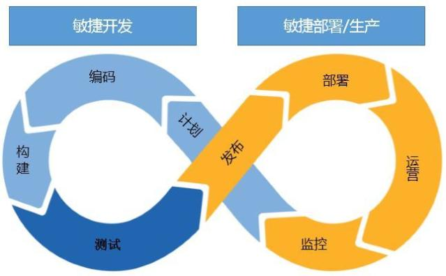

以前和一个项目经理沟通时，提到能否提前半天将变更申请提交过来，而这位项目经理很不理解的看着我问：“你们运维不就是在生产环境部署个程序嘛，这么简单的工作还需要提前半天？而且你们不懂程序，也评审不出什么吧？”。运维这么多年来，听到对运维工作抱有这种认识和看法的人很多。它侧面反映了企业中其他团队团队对运维的认识往往局限于一些简单操作性的工作。例如：应用服务故障时重启、应用配置变更、增删改查数据或者所有软硬件使用问题等等。运维真的是这样吗？

<!--more-->

**如何理解运维呢？**

百度百科对运维的定义是：企业 IT 部门采用相关的方法、手段、技术、制度、流程和文档等，对IT 软硬运行环境(软件环境、网络环境等)、IT 业务系统和 IT 运维人员进行的综合的管理。从定义中看，运维岗位是一个综合了技术和管理能力复合型岗位，并且需要掌握大量的方法论与技术栈，是这么一个角色。

运维就运维技术与资源可以狭义定义为“监、管、控”三点。技术与资源主要是支撑运维/运营的质量、效率和成本的平衡。以下简单摘录了运维的一些能力要求：

- **运维规范的落地**：以ITIL、ISO20000、ITSS.1等方法论，结合外部监管及内部规范的落地；
- **监管机构的要求落地**：理解、快速响应、落地监管机构的管理要求；
- **基本保障**：配置、监控、应用发布、资源扩容、事件、问题等；
- **基础能力**：网络、服务器、操作系统、数据库、中间件、JVM、应用等基本使用与调优；
- **业务服务能力**：SLA，服务台、业务咨询、维护、经验库、等支持能力；
- **可用性管理能力**：巡检、业务系统连续性、可用性，基础架构及应用系统的高可用、备件冗余资源；
- **风险、安全管理能力**：操作、审计、监管风险，漏洞、攻击管控；
- **故障管理能力**：事件、问题管理水平与能力；
- **持续交付能力**：应用变更、基础资源、办公服务交付能力；
- **主动优化能力**：架构优化、性能响应效率、客户体验等
- **应急演练**：架构高可用、突发事件、业务故障的架构、方案、文档、人员熟练程度等
- **业务支撑**：数据维护、数据提取、参数维护等；
- **运行分析能力**：容量、性能、可用性分析等；
- **运营能力**：促进业务痛点的发现与解决、客户及业务业务体验等；
- **成本控制**：更好的评估人力、硬件、带宽、软件，节省成本；
- **运维开发**：运维自动化工具的建设，运维开发能力的培养；
- **其它**

不同企业需要运维的能力会有不同的扩展，同时上述能力要求的每一点展开来说都是一个复杂的技术栈。例如：`基础能力`中的linux操作系统内核优化，就让运维人员对技术能力的深度有了严格要求。要不你搞不定的。

说道这里肯定会有人说：上述技术栈的能力要求通常是存在于个别公司中，这种公司运维团队仍处在传统式运维阶段，并且自动化程度不高。的确理论上所有运维操作性、执行命令的工作都可以整合为经验，并通过自动化工具落地实现。现在大部分互联网企业对外都鼓吹说公司自动化运维工作覆盖面很高，己经开始迈向智能化，做到了AIOps，甚至提出了NoOps的解决方案等等。对于这些互联网公司的自动化对日常运维工作真实覆盖面暂时无法考证，但以我个人经验来看，至少金融企业的自动化覆盖面还有很长的路要走，并且肯定还会很大一部份工作很难自动化。毕竟工作类型太多，在有限的投入上只能集中精力去做投入产出比更高的运维自动化工作。下图以一个运维工具思维导图来简单列示一些常规的运维操作，可以看出其实很难有一套能解决所有运维操作的工具或平台。

并且随着业务要求越来越高、规模越来越大、监管要求越来越严，纵使外部如何宣称自动化或智能化对运维人员经验、技术和管理能力替代，企业内的运维还需要认清实际情况，并结合企业整体战略定位，强调运维团队在运维管理与技术能力方面的广度和深度，再有侧重、分先后的逐步实现自动化。在未来相当长一段时间，企业的运维岗位仍是一个复杂、综合性比较强的工作岗。

## 运维之痛

近年来互联网的飞速普及，运维技术也快速发展，各行业运维水平也得到了较大提升，同时运维圈技术分享也越来越开放，从国外google的SRE理念，到国内腾讯的蓝鲸、织云等平台，以及借助于各种运维专题的公众号和运维大会等等，有大量的互联网人、企业的运维团队进行分享。就对我的影响来说，萧田国的《运维 2.0：危机前的自我拯救》，将我头脑中零碎理解整合成一个概念，再接下来运维人员开始有了一些反思与自嘲，如下截图：

### **团队之痛**

前面讲到，在企业内部其它团队对运维的认识通常只是简单操作，出故障时才会想到，才回去找的团队。随着信息技术的发展与业务的发展，运维团队的痛点越来越明显，企业内对运维团队的不满声音也越来越多，反思一下原因，可分为外部客观原因和内部因素。

#### 外部原因

当前在大数据的背景下，所有互联网企业的运维都面临着业务规模不断扩大，业务竞争越来越激烈，监管要求越来越严格，数据中心条件也越来越高，大量新技术、开源架构、平台或系统的引入取代了传统稳定系统架构的等等因素影响。

- **运维团队的角色**：大部分运维团队都是一个技术支持部门，企业对运维团队的重视程度通常不如业务开发团队，更不用说是前端业务部门。这就造成了运维部门的规模和人员储备不大。像google在《google sre运维解密》一书中提到，由于google的数据中心规模急剧扩大，系统越来越复杂，而运维人员规模又跟不上，所以他们的运维团队采用组建sre的运维开发团队来实现自救。
- **业务对运维服务质量的要求**：互联网的发展，让现在越来越多的业务从线下走到了线上。 为了赢得更多用户的青睐和提高用户体验。一方面业务要求更多和体验更佳的业务性能；另一方面业务对应用发布的交付速度有了更高的要求。前者会产生更复杂的系统架构设计，后者需要更高效的应用发布迭代支持。但两者都会对系统响应效率和稳定性带来影响。
- **外部监管要求：**长期以来，为了防范金融风险，监管机构对金融企业保持强监管的方式，十九大后，监管对金融企业的信息技术的稳定性和规范性进一步加强。在强监管情况下，信息系统的稳定性有了进一步保证，但也给运维团队带来更高的要求，客观上也加大了工作量，并由于规范流程而带来的工作效率的下降。
- **业务并发要求：**用户量的激增和营销活动不断推出，需要系统具备更高的并发处理能力，架构不断引入大量分布式、开源架构来替代传统相对成熟稳定的架构来满足业务需要，这些变化都给运维的能力带来挑战。
- **数据中心规模增大：**数据中心的多中心建设，虚拟化上云，去中心化等等，分布式架构的引入也使得应用系统规模成倍的增加。

#### 内部因素

网上有一个调查数据，在整个运维成本的分配中，软硬件和网络设备的维护成本占 30%，维护服务成本占30%，而内部运维的人力成本则占了40%。这里的人力成本包括人员招聘、培训和流失等成本，如果将维护服务成本也纳入到人力成本上，则人力这一块的成本将上升为70%，影响这个人力成本的因素主要有：

- **运维能力模型：**ITIL、ISO20000、ITSS.1是运维领域中比较成体系化的方法论（目前更为火爆的devops更倾向于是一种思路），其中只有ITSS.1提出了运维能力模型的概念，但在量化运维人员具体能力的实际操作上比较难落地。简单的说你很难判断一个运维人员如何做才是做得优，如何是中，如何差，而这些评价通常比较主观，这也客观影响了运维人员不断增加技能、优化工作效率的动力。
- **运维规范化：**团队扩大到一定规模，以口口相传的传授，结合个体责任心、工作习惯为主的工作方式很容易出现操作风险，且无法进行量化绩效管理，管理规范无法落地。
- **运维精细化程度：**运维团队通常是从纵向职能型的方式形成，这种方式能培养全能型、经验丰富的专家式人才，这些专家式人才利用经验能快速解决职责下的常规问题，且效率比较高，适合小型的团队。随着团队的不断壮大，面对的问题越来越复杂，技术要求越来越多，一方面人的精力有限，很多人不能满足这种专家式人才的要求；另一方面也会产生很多重复性的工作；同时对于人员流失带来的影响比较大。这时就需要将纵向工作精细化，再辅助横向人员对工作进行持续的优化。
- **运维目标：**运维的目标往往以被动式的目标为主，被动处理故障、被动解决问题、被动提供应用交付、被动节省成本等，这种被动式的运维目标导致计划性工作无法开展，缺乏持续不断的自我提高优化机制，主动提高效率、质量，降低成本，并由运维向主动运营目标去转变。
- **自动化能力：**IT软硬件体量庞大，且增长迅速，手工操作的机器任务太多；运维数据越来越多；故障定位越来越难，人工经验依赖高；监控手段不够及时、全面；应用发布、资源交付效率低下；没有主动的容量、性能分析、体验分析能力……这些都是常见的一些痛点。

### 个体之痛

​       作为运维人员同样面临不少痛点：工作时间、工作性质、工作压力、学习压力、职业发展等等，下面简单罗列：

- **7\*24小时制的工作时间**：运维人员的节假日是不完整的，通常节假日需要运维值班保障或在家通过VPN远程操作、甚至和家人团聚时还需要远程指导进行应急排障；运维人员工作性质不同其他人，为了不影响业务，应用的发布、基础设施的变更、演练等工作都会放到晚上，对客的业务系统还可能要安排到深夜凌晨。这种随时可能发生，随时处理的工作状态是其它人员所不具备的痛点。
- **高度压力的工作**：“如履薄冰”这个词很好的形容了运维的工作状态。因为任何一个生产操作都可能对业务带来影响，所以运维的操作必须十分细心谨慎。同时在运维故障处理时，需要面对来自业务、客户、开发、领导的各层压力，细心冷静的排除故障，是一个考研心理素质的高压工作。
- **被动的工作**：常有人形容运维就是一个“消防员”，常常被动救火，这个形容很贴切。在缺乏一些主动分析、优化、预测性的工作的背景下，运维团队的大部份工作常以被动为主，是负责应急救火、打扫战场、负责收尾的那群默默的人。
- **对工作的认识**：运维人通常会认为运维就是一个背锅侠的角色。像开发程序问题、硬件问题、系统软件问题、业务需求问题等等都需要运维去解决处理，而这些问题对业务可用性的影响也要运维来承担，这也是运维的跗骨之痛，很影响个人心情和工作积极性。
- **职业压力**：运维工作一方面主要要和机器或系统软件打交道，相对于开发、项目管理等IT岗位来说，转型机会的面比较窄；同时，运维岗位中重复操作性的工作占比较多，如缺乏引导容易让运维人员产生麻木的状态，失去持续改善的动力和积极性；另外运维需要掌握的技能和管理理念很多，这对于运维人员的学习能力也有很高要求。

 

## 自救

### **SRE**

SRE这个名词最早是从《google sre 运维解密》一书中获得，全称是Site Reliability Engineering，翻译过来就是：站点可靠性工程师。google对SRE的职责描述是：确保站点的可用性。

为了达到这个目的，一方面他需要对站点涉及的系统、组件熟悉，也要关注生产运行时的状态，为此，他需要自研并维护很多工具和系统支撑系统的运行，比如自动化发布系统，监控系统，日志系统，服务器资源分配和编排等等。SRE是一个综合素质很高的全能手，能力进行分解主要有三块：

- **熟悉系统架构与运行状态**：SRE需要懂服务器基础架构、操作系统、网络、中间件容器、常用编程语言、全局的架构意识、非常强的问题分析能力、极高的抗压能力（以便沉着高效地排障），他们还需要懂性能调优理论。为了保证系统架构的高可用，SRE甚至会有意识的破坏自己的系统，以提高系统可用性。
- **熟悉运维涉及的管理方法**：SRE需根据企业自身发展需要，清楚运维涉及的各项工作的流程方法论，比如故障处理、应用发布、可用性管理等等，SRE十分重视运维流程的持续改善，比如对故障的追根溯源，怀疑一切的方式持续改进。
- **运维开发+产品经理**：SRE在运行保障过程中的手段更加自动化，更高效，这种高效来源于自动化工具、监控工具的支撑，且他们还需要是这些工具的主要开发者，他们要不断优化和调整，使整个工具使用起来更加得心应手。为此SRE有一个一半一半理念，就是50%用于日常保障，50%用于项目性的工作，这个项目性的工作主要体现在运维开发与运维产品经理的角色。

### 运维开发

运维开发主要体现在运维工具层面，不同的团队有不同的理解，通常有三类：

- **完全自建：**运维开发团队利用开源技术结合自身需要进行二次开发。这种方式在互联网企业比较流行，具体的成效大小和收效与这个运维开发团队的整体规划或资源投入有关；
- **外购开发资源或工具产品**：运维开发团队主要是结合企业痛点承担产品经理的角色。调研、外购、使用、维护，这种方式常出现在传统的企业，尤其适用于投入运维开发人员较少的企业，这种方式是投入收效快，但是对外部资源依赖比较大，不利于后续持续优化和改善；
- **外购与自建相结合：**运维开发团队在整个工具体系下，针对部份组件选择性的引入一些成熟的工具体系，同时要求这类成熟的工具需要开放一定的接口或源码支持，对于一些与公司个性强的环节采用自研的方式。这种方式目前逐渐被运一些传统企业，比如金融企业所接受。

总的来说，不管选用上面哪一种方式，运维开发团队都应该有一个整体、统一的一体化工具建设规划，并在建设过程中始终保持对运维工具体系的掌控能力，并在工具体系的上层为其它运维人员提供简易的、可创造性的“开发能力”，比如所见即所得的工具可视化、可定制的运维报表、拖拉拽方式的流程及脚本组件的拼装等运维开发方式。

### **DevOps**

**DevOps概述**

DevOps一词的来自于Development和Operations的组合，突出软件开发人员和运维人员的沟通合作，通过自动化流程来使得软件构建、测试、发布更加快捷、频繁和可靠，他是一种方法论，包含一套基本原则和实践，工具是为有效落实这套方法论提供支持。

在软件全生命周期管理过程中，包括开发，构建，测试，发布，运营，在这个全生命周期管理过程中出现了开发团队与运维团队的部门墙，这是因为开发团队关注需求的实现，希望尽快实现变更；而运维团队更关注于系统运行的稳定，而变更往往是生产应用不稳定的原因。DEVOPS方法论的出现主要是为了解决这个协作问题，目的是让软件交付更加高效，质量更高，生产端更加敏捷，生产运行过程中的问题能更加高效的反馈到开发，形成一个全生命周期的闭环。随着业务对运维交付能力的时效性要求越来越高，运维团队面临“吃力不讨好”的问题：

**吃力**：花费大量时间在应用部署的操作性工作中。这部份部署变更包括新功能的上线以及修复功能BUG两方法。

**不讨好**：操作性的工作越多，带来的操作风险就越大。有个统计，如果手工运行5条命令的情况下，成功部署的概率就已跌至86%；如需手工运行55条命令，成功部署的概率将跌至22%；如需手工运行100条命令，成功部署的概率将趋近于0（仅为2%）。

DevOps这一理念鼓励开发者和运维人员之间所进行的**沟通**、**协作**、**集成**和**自动化**，借此有助于改善双方在交付软件过程中的速度和质量。侧重于通过标准化开发环境和自动化交付流程改善交付工作的可预测性、效率、安全性，以及可维护性。

### **实践中的DevOps**

可以从工具链、团队文化、自动化、敏捷看板等角度讲DevOps，如下图：

**从DevOps的落地效率来看**：需要将DevOps进行聚焦，聚焦到交付能力上，这方面，行业里比较标准化的评估是去年底由中国信息通信研究院，联合一些互联网企业、运维社区，以及一些金融、传统企业联合进行编制的DevOps标准（券商行业中华泰参加了编制）。从这个能力模型公布出来的一些介绍看，标准对DevOps范围比较克制主要以交付能力来分解敏捷开发、持续交付、技术运营、应用架构、团队架构，这和最早的DevOps能力环比较吻合：

**从运维的交付场景看**：主要是资源交付与应用交付，其中资源交付以IAAS、PAAS云的建设为主，通过云管平台的工具链将基础设施、网络、硬件、虚拟化、容器、运行中间件等系统软硬件交付能力自动化，并通过CMDB整合DevOps能力环之上的应用场景，实现资源的快速交付。资源交付能力主要在于IAAS、PAAS层的云平台标准化、自动化、平台扩展性等方面的建设程度。应用的快速交付比资源交付更为复杂，应用交付涉及全链路的整合，链路上的节点越多落地的难度越大，因为它不仅涉及技术，还涉及理念的认同与聚焦。应用交付能力要实现，最简单的技术栈工具需要CMDB、应用发布工具、应用版本库、监控工具，上述工具对内要与云平台对接，对外要提供接口给开发、测试工具。当然如开发、测试也能和运维使用同一套发布工具、应用版本库则效果更好，不过，实际实施过程中团队之间还是会有不少冲突，比如开发关注源代码版本管理，测试、运维关注运行版本的管理，需各个团队共同付出共建技术链。

### **运营**

关于运维圈里运营的概念，以转型口号喊得比较多，我对运维当中的运营有业务运营与技术运营两个维度的理解。业务运营是通过功能优化或工具开发等方式解决业务工作痛点，或通过运行分析发现影响业务开展的因素，并推动相关的优化，最终提升业务能力。技术运营则主要从技术角度去降低IT成本，提升IT服务质量与效率。具体的实施内容可以考虑如下：

从上述概括可以看出，当前运维里面的运营，与运维数据密切相关，需要基于运维大数据平台来提升运营质量。

为了进一步说明运营，这里举两个例子：

#### 理论

优锘科技CEO的陈傲寒在2016年写过一篇文章《IT：从运维到运营》，虽然己过去1年多，仍是我读过最好的一篇。全文从企业、运维团队角度出发分析什么是运维、什么是运营，再将运营分解到不同角色上的理解与落地的方向，全文均是干货，值得通读，这里只列出一个思维导图。

#### 实战

腾讯QQ逐渐被微信团队替代过程中，QQ技术运维团队是如何通过各种方式去为企业带来效益，比如他们通过运维分析，得到如何更加合理的使用带宽、资源，大大减少了公司在基础设施方面的投入。在企业中，也同样有很多空间可以去尝试，比如分析业务痛点，为业务提供快速的策略性的工具来替代重复操作性的业务操作；通过运维数据分析，发现客户体验方面的痛点，推动业务功能的优化等等。

### AIOPS

AIOps这个词最早是在2016年由Gartner提出。AIOps是Algorithmic IT Operations的缩写，是基于算法的IT运维，即通过使用统计分析和机器学习的方法处理从各IT设备、业务应用、运维工具收集的数据，从而加强增强运维自动化能力，以便更快、更有效、更全面的实现自动化效果。以下是Gartner提出AIOps的一张图：

Gartner通过使用图1中的图解释了AIOps平台的工作原理。AIOps有两个主要组件：大数据和机器学习。它需要从孤立的IT数据中移除，以便将大量数据平台内的观察数据（例如监控系统和作业日志中发现的数据）与参与数据（通常在故障单，事件和事件记录中找到）相结合。AI然后针对组合的IT数据实施全面的分析和机器学习（ML）策略。期望的结果是持续的见解，通过自动化产生持续的改进和修复。AI可以被认为是核心IT功能的持续集成和部署（CI / CD）。

- **广泛和多样化的IT数据源**：如日志类的设备日志、系统日志，应用日志、运维操作日志；指标类的监控性能指标、事件。
- **具备针对海量数据处理与分析的运算平台**：能够从现有的IT数据生成新的数据和元数据、计算和分析还消除噪音，识别模式或趋势，隔离可能的原因，揭示潜在问题，并实现其他IT特定目标。
- **算法**，充分利用IT领域的专业知识，更适当，高效的处理数据。
- **机器学习**，从根据算法分析的输出和引入系统的新数据自动更改或创建新的算法。
- **可视化**，以易于消费的方式向IT行动提供洞察和建议，以促进理解和行动。
- **自动化**，其使用分析和机器学习产生的结果自动创建和应用响应或改进已识别的问题。

关于分层的思路，Gartner这样理解：

### **AIOps与自动化的关系**

AIOps很火，所以对AIOps和自动化做了一些对比。暂以一句话作个区别：AIOps是基于对运维数据（日志类、指标类数据等）的机器学习，进一步解决自动化成本高或无法解决的问题，属于**运维自动化的优化，**细化一下区别有：

- **概念**：

狭义的自动化则提运维“监、管、控”的工具。AIOps是将AI技术应用到运维领域，需要有学习、类人交互、主动决策的特征。

- **实现思路**：

自动化往往以过程为导向，AIOps则以目标为导向，通过对数据进行学习，得到如何实现目标。

- **门槛高度**：

自动化手段有丰富的落地解决方案，适合作为替代标准化的运维操作性工作，即“面”的问题。AIOps目前仍处起步阶段，不是适合替代现有的自动化，而是应该用于解决自动化不能解决或解决成本很高的问题，即“点”的问题。

- **如何整合**：

AIOps并非是要取代现有的自动化运维体系，而是赋予现有体系智能。AIOps就要“学习，了解”自动化工具 ，并且更好的“使用”这些工具，这个过程就是深度集成，它的核心是对这些工具API的自主认知和自主使用。

虽然行业内的智能运维理念十分火热，但实际落地成效上还主要处于研究阶段。从**运维工具**技术解决方案的角度看，对于智能的解读也有差别，如果将智能的特点解读为具备”模拟人，具备自学习，能够从数据中获取知识，进而进行预测/决策“来判断是否智能，**智能是自动化的一个辅助手段，自动化才是终态**。建立在这个认识下，我们首先需要通过自动化手段解决痛点，提高工作效率，控制风险；利用运维数字化的建设为运维智能化提供数据、数据计算的能力；在自动化、数字化水平得到一定程度后，再通过人工智能的技术去解决自动化手段解决起来费力或无法解决的局部问题，让自动化具备智能的水平。

## 体系

### **运维的可持续改进**

在管理领域，戴明推出的PDCA循环可以解释运维体系需要具备的可持续改进的能力条件。PDCA循环为四个阶段，即计划（plan）、执行（do）、检查（check）、调整（Action），即在实际工作开展过程中，把各项工作按照作出计划、计划实施、检查实施效果，然后将成功的纳入标准，并不断循环改进的过程。将这个思路引入到企业的运维体系中则是针对企业业务发展的需求，制定运维体系的整体发展目标，通过不断改进的措施提高运维工作效率、控制风险，以达到理高效、更优化的资源配置，进而推动业务的发展。要做到运维体系的可持续改进，需要做到以业务导向，整体部局；团队、流程、工具三位一体；不断审视优化。

**P：以业务导向、整体部局**

运维的最根本作用是保障IT数据的连续性，这里的IT数据包括业务，以及反映业务的数据，或者换句话可以表达为：网络不断、系统不瘫、数据不丢。随着业务对IT系统依赖程度越来越高，运维又会承担更高的期望，也就是运维向运营的转化，这就需要从业务角度去不断完善运维，以促进业务为大目标。有了这个目标，那我们的运维体系的构建就需要与企业业务的发展保持同步，要让运维体系具备可持续改进的能力。

另外，可持续改进的过程不应该是大拐弯的方式进行改进，而应该不断的小调整，这就需要确保首先要建立一个整体、全局的运维体系，对运维各项工作做一个整体的规划，把眼光看得更远，往往可以更好的把控当前。

**D：团队、流程、工具的三位一体**

可持续改进的运维体系需要让运维的团队、流程、工具三位一体的作用，比方说：提高工作效率，需要团队的专业化分工、流程的标准化、工具的自动化配合作用；推动业务的发展，既需精细化运维分析、业务服务、运营等维度的工作资源投入，也需要有工具的建设来减少操作性的工作来释放人力，需要工具提供更高效的数据来源。

这里说的团队主要是从运维人力资源的分工、团队建设、工作目标导向、运维KPI等；流程是指以成熟的运维方法论为主体，结合企业和外部监管的规章制度、企业业务发展需要，而落地的标准化工作方法；工具既包括狭义运维的“监、管、控”，也包括运营体系所需要数字化、智能化的工具平台。

**C+A : 不断审视优化**

在实际工作过程中，审视检查的过程很容易被忽略，但实际上最大的收获可能就来自于这个总结、归纳的过程中，这也是可持续改进的运维体系的关键所在。比方说，运维团队可以考虑在必要环节增加横向的优化团队；运维流程也需要定期对流程的落地进行分析，并对规章制度进行查漏补缺、删减不合理的流程规范、调整无法执行的规范要求；工具的建设要不断的分析工具的使用覆盖率，如何提高覆盖率，分析是否提高了运维的效率，还是带来了反作用等分析，并不断调整优化工具的建设。

### 转型思路

在提出可持续的运维体系前，我们先归纳一下运维团队常见的运维痛点，以提出运维转型的思路，再看看如何构建一个可持续改进的运维体系来支撑运维转型。前面的运维之痛中提到了 “救火”、“背锅”、“低价值”、”重复操作“等标签，我们归纳下己有特点再看转型：

#### 特点

**被动救火式**：以被动保障业务系统运行，日常计划性工作容易被打断、搁置；

**问题驱动式**：以系统可用性、可靠性、业务请求等问题驱动运维工作；

**操作运维**：重复性、操作类点主要工作量的运维模式；

**经验式运维**：由人工经验驱动的运维模式，尤其是一些经验丰富的老员工的离职在短期内会对运维质量带来一定的冲击。

#### **转型**

**从被动救火式向主动精细化转型**：专业化分工、主动分析，主动优化，驱动开发，促进DEVOPS的落地；

**从问题驱动向价值驱动转型**：以企业业务发展目标为主线，业务体验、服务满意度、促进业务更好发展；

**从操作运维向运维开发转型**：通过为运维人员提供运维开发平台，降低运维开发门槛，快速落地一些紧迫的运维工具，降低操作性、重复性的运维工作；

**从依靠经验向智能化驱动运维转型**：结合数据分析、知识库、机器学习技术促进运维智能化。

### **构建运维体系**

上面提到运维体系以业务导向，整体部局，团队、流程、工具三位一体，不断审视优化的建设思路，也提出了”主动精细化“、”价值驱动“、”运维开发“、”智能化运维“的转型目标，我们再将这些思路分解到团队、流程、工具的建设中，并归纳为：三大建设，十个文化的实践方法：

- **团队建设：专业化、精细化、运营化**

我们将运维实施主体运维团队理解为团队，理想情况下，优秀的团队应该具备有合适的工作、合适的时间、合适的人、合适的行为四个要素组成。即团队要结合企业实际发展方向，制定符合企业、运维团队、个人发展的工作内容，并选择具备合适的知识、技能、认知、能力的人去完成工作，去实际个人的自我价值。

前面也提到，目前的运维织是一个被动保障业务系统运行，日常计划性工作容易被打断、搁置的工作，这种工作状态下的运维团队往往工作效率不高、容易出现操作风险。为了让运维团队具备可持续改进的能力，需要提高运维团队的工作效率，我们需要将运维工作专业化，整合通用性、操作性的工作，提高工作效率，在释放运维人员工作量后，引导运维人员有计划、可量化的去做更多分析类、优化类、业务运营的主动性工作。

- **流程建设：标准化、可视化、可量化**

大部份运维团队会以内部企业积累的规章制度、外部监管机构的监管要求为基础，依照ITIL、ISO20000、ITSS.1、DevOps的方法论中的一个或多个组合的方式开展运维工作。这些规章制度、监管要求、方法论的整合、落地、持续改进的过程即为流程建设的过程。

流程建设首先需要标准化流程，要先梳理好己有的流程制度，约定工作的流转方式，再通过可视化将流程整合在日常工作中，最后通过流程落地数据的分析与工具建设，持续改善提高流程落地的效率，控制操作风险。

- **工具建设：自动化、数字化、智能化、服务化**

工具的建设也以可持续改进的思路构建，以整合存量资源、引入成熟或开源技术为主，建立一体化的运维工具体系，通过体系化的思路实现运维工具（“监、管、控”）的互联互通，有序建设，实现自动化运维，全面控制风险、提高工作效率、释放人力；通过建立运维数据分析平台，实现数字化运营，提供运维数据集中与治理、主动分析的能力；在数字化运营的基础上通过运维数据挖掘、学习，优化运维或运营场景，向智能化发展；服务化则是以IT服务的方式将运维能力向处输出。