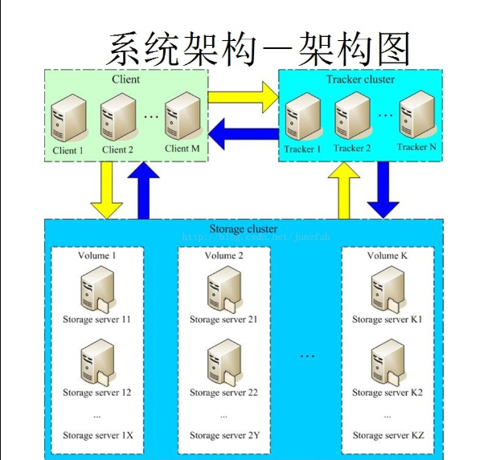
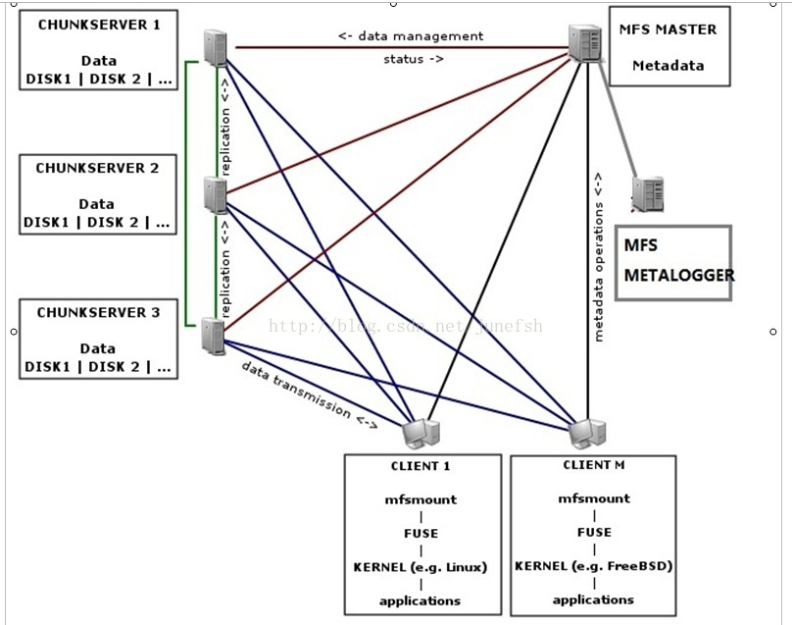
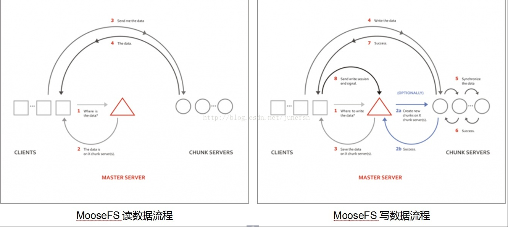
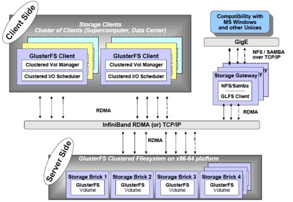

## 目的

本文通过对比当前主流的几种分布式存储方案（Ceph,TFS,FastDFS,MogileFS,MooseFS,GlusterFS等），让你知道他们的优缺点，便于你根据使用场景选择合适的方案。


## 系统整体对比

| 对比说明/文件系统 | TFS                  | FastDFS                | MogileFS | MooseFS              | GlusterFS                               | Ceph                     |
| ----------------- | -------------------- | ---------------------- | -------- | -------------------- | --------------------------------------- | ------------------------ |
| 开发语言          | C++                  | C                      | Perl     | C                    | C                                       | C++                      |
| 开源协议          | GPL V2               | GPL V3                 | GPL      | GPL V3               | GPL V3                                  | LGPL                     |
| 数据存储方式      | 块                   | 文件/Trunk             | 文件     | 块                   | 文件/块                                 | 对象/文件/块             |
| 集群节点通信协议  | 私有协议（TCP）      | 私有协议（TCP）        | HTTP     | 私有协议（TCP）      | 私有协议（TCP）/ RDAM(远程直接访问内存) | 私有协议（TCP）          |
| 专用元数据存储点  | 占用NS               | 无                     | 占用DB   | 占用MFS              | 无                                      | 占用MDS                  |
| 在线扩容          | 支持                 | 支持                   | 支持     | 支持                 | 支持                                    | 支持                     |
| 冗余备份          | 支持                 | 支持                   | -        | 支持                 | 支持                                    | 支持                     |
| 单点故障          | 存在                 | 不存在                 | 存在     | 存在                 | 不存在                                  | 存在                     |
| 跨集群同步        | 支持                 | 部分支持               | -        | -                    | 支持                                    | 不适用                   |
| 易用性            | 安装复杂，官方文档少 | 安装简单，社区相对活跃 | -        | 安装简单，官方文档多 | 安装简单，官方文档专业化                | 安装简单，官方文档专业化 |
| 适用场景          | 跨集群的小文件       | 单集群的中小文件       | -        | 单集群的大中文件     | 跨集群云存储                            | 单集群的大中小文件       |

开源协议说明

```
GPL:不允许修改后和衍生的代码做为闭源的商业软件发布和销售，修改后该软件产品必须也采用GPL协议；
GPL V2：修改文本的整体就必须按照GPL流通，不仅该修改文本的源码必须向社 会公开，而且对于这种修改文本的流通不准许附加修改者自己作出的限制;
GPL V3：要求用户公布修改的源代码，还要求公布相关硬件;LGPL：更宽松的GPL
```

<!--more-->

## TFS

TFS（Taobao File System）是由淘宝开发的一个分布式文件系统，其内部经过特殊的优化处理，适用于海量的小文件存储，目前已经对外开源；

TFS采用自有的文件系统格式存储，因此需要专用的API接口去访问，目前官方提供的客户端版本有：C++/JAVA/PHP。


 

- 特性

```
1）在TFS文件系统中，NameServer负责管理文件元数据，通过HA机制实现主备热切换，由于所有元数据都是在内存中，其处理效率非常高效，系统架构也非常简单，管理也很方便；
2）TFS的DataServer作为分部署数据存储节点，同时也具备负载均衡和冗余备份的功能，由于采用自有的文件系统，对小文件会采取合并策略，减少数据碎片，从而提升IO性能；
3）TFS将元数据信息（BlockID、FileID）直接映射至文件名中，这一设计大大降低了存储元数据的内存空间；
```

- 优点

```
1）针对小文件量身定做，随机IO性能比较高；
2）支持在线扩容机制，增强系统的可扩展性；
3）实现了软RAID，增强系统的并发处理能力及数据容错恢复能力；
4）支持主备热倒换，提升系统的可用性；
5）支持主从集群部署，其中从集群主要提供读/备功能；
```

- 缺点

```
1）TFS只对小文件做优化，不适合大文件的存储；
2）不支持POSIX通用接口访问，通用性较低；
3）不支持自定义目录结构，及文件权限控制；
4）通过API下载，存在单点的性能瓶颈；
5）官方文档非常少，学习成本高；
```

- 应用场景

```
1）多集群部署的应用
2）存储后基本不做改动
3）海量小型文件
根据目前官方提供的材料，对单个集群节点，存储节点在1000台以内可以良好工作，如存储节点扩大可能会出现NameServer的性能瓶颈，目前淘宝线上部署容量已达到1800TB规模（2009年数据）
```

- 安装及使用

- [安装指导](http://blog.csdn.net/junefsh/article/details/43987811)
- [TFS_配置使用](http://blog.csdn.net/junefsh/article/details/43987829)

 

 **源代码路径**：http://code.taobao.org/p/tfs/src/

 

 **参考**

 **http://rdc.taobao.com/blog/cs/?p=128**

 **http://elf8848.iteye.com/blog/1724423**

 **http://baike.baidu.com/view/1030880.htm**

 **http://blog.yunnotes.net/index.php/install_document_for_tfs/**

 

 

## **FastDFS**



FastDFS是国人开发的一款分布式文件系统，目前社区比较活跃。如上图所示系统中存在三种节点：Client、Tracker、Storage，在底层存储上通过逻辑的分组概念，使得通过在同组内配置多个Storage，从而实现软RAID10,提升并发IO的性能、简单负载均衡及数据的冗余备份；同时通过线性的添加新的逻辑存储组，从容实现存储容量的线性扩容。

文件下载上，除了支持通过API方式，目前还提供了apache和nginx的插件支持，同时也可以不使用对应的插件，直接以Web静态资源方式对外提供下载。

目前FastDFS(V4.x)代码量大概6w多行，内部的网络模型使用比较成熟的libevent三方库，具备高并发的处理能力。

- **特性**

```
1）在上述介绍中Tracker服务器是整个系统的核心枢纽，其完成了访问调度（负载均衡），监控管理Storage服务器，由此可见Tracker的作用至关重要，也就增加了系统的单点故障，为此FastDFS支持多个备用的Tracker，虽然实际测试发现备用Tracker运行不是非常完美，但还是能保证系统可用。
2）在文件同步上，只有同组的Storage才做同步，由文件所在的源Storage服务器push至其它Storage服务器，目前同步是采用Binlog方式实现，由于目前底层对同步后的文件不做正确性校验，因此这种同步方式仅适用单个集群点的局部内部网络，如果在公网上使用，肯定会出现损坏文件的情况，需要自行添加文件校验机制。
3）支持主从文件，非常适合存在关联关系的图片，在存储方式上，FastDFS在主从文件ID上做取巧，完成了关联关系的存储。
```

- **优点**

```
1）系统无需支持POSIX(可移植操作系统)，降低了系统的复杂度，处理效率更高
2）支持在线扩容机制，增强系统的可扩展性
3）实现了软RAID，增强系统的并发处理能力及数据容错恢复能力
4）支持主从文件，支持自定义扩展名
5）主备Tracker服务，增强系统的可用性
```

- **缺点**

```
1）不支持断点续传，对大文件将是噩梦（FastDFS不适合大文件存储）
2）不支持POSIX通用接口访问，通用性较低
3）对跨公网的文件同步，存在较大延迟，需要应用做相应的容错策略
4）同步机制不支持文件正确性校验，降低了系统的可用性
5）通过API下载，存在单点的性能瓶颈
```

- **应用场景**

```
1）单集群部署的应用
2）存储后基本不做改动
3）小中型文件根据
目前官方提供的材料，现有的使用FastDFS系统存储容量已经达到900T，物理机器已经达到100台（50个组）
```


 [安装指导_FastDFS](http://blog.csdn.net/junefsh/article/details/43987863)

 **源码路径：**https://github.com/happyfish100/fastdfs

- **参考**

 https://code.google.com/p/fastdfs/ 

 http://bbs.chinaunix.net/forum-240-1.html

 http://portal.ucweb.local/docz/spec/platform/datastore/fastdfs

 

## **MooseFS**

MooseFS是一个高可用的故障容错分布式文件系统，它支持通过FUSE方式将文件挂载操作，同时其提供的web管理界面非常方便查看当前的文件存储状态。

- **特性**

```
1）从下图中我们可以看到MooseFS文件系统由四部分组成：Managing Server 、Data Server 、Metadata Backup Server 及Client
2）其中所有的元数据都是由Managing Server管理，为了提高整个系统的可用性，Metadata Backup Server记录文件元数据操作日志，用于数据的及时恢复
3）Data Server可以分布式部署，存储的数据是以块的方式分布至各存储节点的，因此提升了系统的整体性能，同时Data Server提供了冗余备份的能力，提升系统的可靠性
4）Client通过FUSE方式挂载，提供了类似POSIX的访问方式，从而降低了Client端的开发难度，增强系统的通用性
```



- 元数据服务器（master）:负责各个数据存储服务器的管理，文件读写调度，文件空间回收以及恢复
- 元数据日志服务器（metalogger）:负责备份master服务器的变化日志文件，以便于在master server出问题的时候接替其进行工作
- 数据存储服务器（chunkserver）:数据实际存储的地方，由多个物理服务器组成，负责连接管理服务器，听从管理服务器调度，提供存储空间，并为客户提供数据传输；多节点拷贝;在数据存储目录，看不见实际的数据



- **优点**

```
1）部署安装非常简单，管理方便
2）支持在线扩容机制，增强系统的可扩展性
3）实现了软RAID，增强系统的 并发处理能力及数据容错恢复能力
4）数据恢复比较容易，增强系统的可用性5）有回收站功能，方便业务定制
```

- **缺点**

```
1）存在单点性能瓶颈及单点故障
2）MFS Master节点很消耗内存
3）对于小于64KB的文件，存储利用率较低
```

- **应用场景**

```
1）单集群部署的应用
2）中、大型文件
```

- 参考

 http://portal.ucweb.local/docz/spec/platform/datastore/moosefsh 

 http://www.moosefs.org/ 

 http://sourceforge.net/projects/moosefs/?source=directory

 

 

## **GlusterFS**

GlusterFS是Red Hat旗下的一款开源分布式文件系统，它具备高扩展、高可用及高性能等特性，由于其无元数据服务器的设计，使其真正实现了线性的扩展能力，使存储总容量可 轻松达到PB级别，支持数千客户端并发访问；对跨集群，其强大的Geo-Replication可以实现集群间数据镜像，而且是支持链式复制，这非常适用 于垮集群的应用场景

- **特性**

```
1）目前GlusterFS支持FUSE方式挂载，可以通过标准的NFS/SMB/CIFS协议像访问本体文件一样访问文件系统，同时其也支持HTTP/FTP/GlusterFS访问，同时最新版本支持接入Amazon的AWS系统
2）GlusterFS系统通过基于SSH的命令行管理界面，可以远程添加、删除存储节点，也可以监控当前存储节点的使用状态
3）GlusterFS支持集群节点中存储虚拟卷的扩容动态扩容；同时在分布式冗余模式下，具备自愈管理功能，在Geo冗余模式下，文件支持断点续传、异步传输及增量传送等特点
```



- **优点**

```
1）系统支持POSIX(可移植操作系统)，支持FUSE挂载通过多种协议访问，通用性比较高
2）支持在线扩容机制，增强系统的可扩展性
3）实现了软RAID，增强系统的 并发处理能力及数据容错恢复能力
4）强大的命令行管理，降低学习、部署成本
5）支持整个集群镜像拷贝，方便根据业务压力，增加集群节点
6）官方资料文档专业化，该文件系统由Red Hat企业级做维护，版本质量有保障
```

- **缺点**

```
1）通用性越强，其跨越的层次就越多，影响其IO处理效率
2）频繁读写下，会产生垃圾文件，占用磁盘空间
```

- **应用场景**

```
1）多集群部署的应用
2）中大型文件根据目前官方提供的材料，现有的使用GlusterFS系统存储容量可轻松达到PB
```

- **术语：**

```
brick：分配到卷上的文件系统块；
client：挂载卷，并对外提供服务；
server：实际文件存储的地方；
subvolume：被转换过的文件系统块；
volume：最终转换后的文件系统卷。
```

- **参考**

  http://www.gluster.org/

  http://www.gluster.org/wp-content/uploads/2012/05/Gluster_File_System-3.3.0-Administration_Guide-en-US.pdf

  http://blog.csdn.net/liuben/article/details/6284551

 

## **Ceph**

Ceph是一个可以按对象/块/文件方式存储的开源分布式文件系统，其设计之初，就将单点故障作为首先要解决的问题，因此该系统具备高可用性、高性能及可 扩展等特点。该文件系统支持目前还处于试验阶段的高性能文件系统BTRFS(B-Tree文件系统)，同时支持按OSD方式存储，因此其性能是很卓越的， 因为该系统处于试商用阶段，需谨慎引入到生产环境

- **特性**

```
1）Ceph底层存储是基于RADOS（可靠的、自动的分布式对象存储），它提供了LIBRADOS/RADOSGW/RBD/CEPH FS方式访问底层的存储系统，如下图所示
2）通过FUSE，Ceph支持类似的POSIX访问方式；Ceph分布式系统中最关键的MDS节点是可以部署多台，无单点故障的问题，且处理性能大大提升
3）Ceph通过使用CRUSH算法动态完成文件inode number到object number的转换，从而避免再存储文件metadata信息，增强系统的灵活性
```

- **优点**

```
1）支持对象存储（OSD）集群，通过CRUSH算法，完成文件动态定位， 处理效率更高
2）支持通过FUSE方式挂载，降低客户端的开发成本，通用性高
3）支持分布式的MDS/MON，无单点故障
4）强大的容错处理和自愈能力5）支持在线扩容和冗余备份，增强系统的可靠性
```

- **缺点**

```
1）目前处于试验阶段，系统稳定性有待考究
```

- **应用场景**

```
1）全网分布式部署的应用
2）对实时性、可靠性要求比较高官方宣传，存储容量可轻松达到PB级别
```

 

 **源码路径：**https://github.com/ceph/ceph

 

- **参考**

  http://ceph.com/

 

## **MogileFS**

- 开发语言：perl

- 开源协议：GPL

- 依赖数据库

- Trackers(控制中心):负责读写数据库，作为代理复制storage间同步的数据

- Database:存储源数据（默认mysql）

- Storage:文件存储

- 除了API，可以通过与nginx集成，对外提供下载服务

   

 **源码路径：**https://github.com/mogilefs