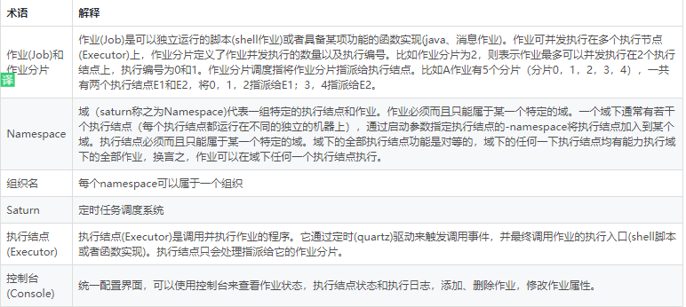

## 简介

Saturn (定时任务调度系统)是唯品会自主研发的分布式的定时任务的调度平台，目标是取代传统的Linux Cron/Spring Batch Job/Quartz的方式，做到全域统一配置，统一监控，任务高可用以及分片。目前该平台己平稳运行1年，承载着唯品会核心系统的全部定时任务的调度，监控，配置，经受住了生产环境的各种考验。 开源版本系唯品会生产使用的saturn核心，去除了唯品会的认证，监控，告警系统等依赖，可独立部署安装使用。

 

<!--more-->

## 系统特性

### 任务负荷，动态均衡


Saturn 给每个任务的每个分片一个负荷值，即权重。比如任务 A 每个分片的权重都是 30，任务 B每个分片的权重都是 10，在进行资源调度的时候，Saturn 可以根据分配给不同机器的总负荷值，来做一个均衡。比如说机器 1 的负荷值是 60，机器 2 的负荷值也是 60，虽然机器 1 只负责了两个任务分片，机器 2 却负责了四个任务分片，通过任务负荷来达到资源均衡的效果。


### 优先列表

资源自动分配时存在一个问题，若任务非常重要如唯品会的双订单任务，或者订单处理的问题非常重要，这时机器应该如何处理？


对此唯品会引入了优先列表概念，开发和运维人员可以给某些任务分配一些优先运行的机器列表，当优先机器任务存在的时候，只会在这些机器运行，只有当这些机器全部不在了，任务才会被迁移到其他的机器上运行，满足订单部门提出的场景化需求。


### 本地模式


有些情况下，任务的分配是不可预知的，比如唯品会在商品售卖前，会全量扫描在售商品图片，这个任务要进行大量的图片处理，这时通常就不会让这个任务跟其他任务共享资源。另外 Saturn 支持容器化，可以在高峰期自动扩展到 150 个节点去执行某个任务，然后在低谷期自动缩回到 20 个节点，这就是 Saturn 本地模式的一种场景。

 

## 探索与演进

唯品会任务调度系统也经过了长期的探索， 2012 年之前采用 Crond 服务，2014 年开始使用Quartz、 Spring Batch 和各团队的个性化方案，但会遇到任务没法监控，任务出问题了不知道和成本高昂等情况，因此唯品会在 2016 年开始实行全部定时任务，并统一到 Saturn 平台。

目前 Saturn 产生的价值是：有 66 个业务应用系统在使用，包括订单、支付、库存、用户、财务等售卖相关的核心系统，每天有 350 个执行节点执行任务，每天执行任务 2000 万多次，相当于网站的全部的流量。这表明 Saturn 并不是一个纸上谈兵的产品，它已经承受住了唯品会大规模使用场景的考验。

 

## 架构设计

### **术语定义**




### 系统逻辑架构


**执行结点**
负责作业的触发（定时），作业执行，结果上报，日志上报，告警上报，监控日志写入等功能。可独立运行在业务服务器，也可与业务代码运行在同一个JVM。 使用java开发，提供jar包和可运行的工程两种方式供业务方使用，是业务作业接入saturn最主要的组件。

**控制台**
负责作业的统一配置，包括作业添加、删除，作业属性配置，作业状态查看，执行日志查看，执行结点监控等功能。 控制台单独部署，提供WEB应用给全域共用，业务接入方根据申请的权限控制对应的业务作业。

**作业分片调度器**
Saturn的”大脑“，其基本功能是将作业分片指派到执行结点。通过调整分配算法和分配策略，可以将作业合理地安排到合适的执行结点，从而实现HA，负载均衡，动态扩容，作业隔离，资源隔离等治理功能。 作业分片调度器为后台程序，单独部署；它是公共资源，所有域共用同一套作业分片调度器。接入作业后，会自动接受作业分片调度器的调度。

 


## 部署

### 控制台console部署

 

### **准备工作**

1,  安装zookeeper(>=3.4.6)jdk(>=1.7)并启动zookeeper

2,  下载console包https://github.com/vipshop/Saturn/releases（建议下载源码包，自行编译，console项目是基于maven+springboot开发，可以直接打成jar包运行）

 

### console部署

1,  准备域配置json文件

域配置json文件用于定义saturn系统中的组织名，namespace，以及ZK的连接串，格式如下：

```json
{

    "nameAndNamespace":"/name/namespace",

   "zkAddressList":"ip:port,ip:port,..."

}
```

把它保存在某个路径，比如/apps/saturn/config/regcenter.json

2,  配置环境变量

```
export   REG_CENTER_JSON_PATH=/apps/saturn/config/regcenter.json
```

3 启动saturn console

```
java -DSATURN_CONSOLE_LOG=/apps –jar  saturn-console-master-SNAPSHOT.jar &
```

 注意，如果是在生产环境启动console，建议增加一些JVM启动参数：

 

```bash
#for jdk1.7:
-Xmx2G -Xms2G -XX:PermSize=256m-XX:MaxPermSize=512m -XX:+UseConcMarkSweepGC -XX:+UseCMSInitiatingOccupancyOnly-XX:CMSInitiatingOccupancyFraction=75 -XX:+ExplicitGCInvokesConcurrent-Xloggc:${HOME}/gc_zk.log -XX:+PrintGCDetails -XX:+PrintGCDateStamps-XX:ErrorFile=${HOME}/hs_err_%p.log -XX:+HeapDumpOnOutOfMemoryError-XX:HeapDumpPath=${HOME}


#for jdk1.8:
-Xmx2G -Xms2G -MetaspaceSize=256m-MaxMetaspaceSize=512m -XX:+UseConcMarkSweepGC-XX:+UseCMSInitiatingOccupancyOnly -XX:CMSInitiatingOccupancyFraction=75-XX:+ExplicitGCInvokesConcurrent -Xloggc:${HOME}/gc_zk.log -XX:+PrintGCDetails-XX:+PrintGCDateStamps -XX:ErrorFile=${HOME}/hs_err_%p.log-XX:+HeapDumpOnOutOfMemoryError -XX:HeapDumpPath=${HOME}
```

### executor部署

### 准备工作

1，安装jdk(>=1.7)

2，下载executor包https://github.com/vipshop/Saturn/releases（建议下载源码包，自行编译）

 

### executor部署

1，配置zookeeper链接地址环境变量

```
export VIP_SATURN_ZK_CONNECTION=zkip:2181
```

2，启动executor

```bash
chmod a+x bin/saturn-executor.sh

bin/saturn-executor.sh start -n saturn-it.vip.com -e executor_001 -env dev

#-n：本executor所属的域名，即namespace
#-e: 本executor的唯一ID
#-env: 运行模式，可取值为dev/product， dev模式下-Xmx为512m，product模式下-Xmx为2G


#exeucutor启动之后，日志默认保存在/apps/logs/saturn/{namespace}/{executorname}-{ip}/目录下； 可以通过启动参数修改日志保存路径，具体参数为：

bin/saturn-executor.sh start -nsaturn-it.vip.com -e executor_001 -Dsaturn.log.dir=/apps/logs/otherdir
```

 

### 部署java作业

saturn executor启动时会扫描 saturn目录的同级目录下的app目录并加载这个目录下（含子目录)所有的jar包定义的类(关于这个原理，请参考Saturn架构文档 )，因此可以把开发好的jar包及其依赖包一起放在 app目录，目录结构如下：


可以通过 -d 参数来重新定义executor寻找作业实现类的路径，比如

```bash
bin/saturn-executor.sh start -n saturn-it.vip.com -e executor_001 -d /apps/jobs
```

以上面的命令启动后，exeucutor会从/apps/jobs中寻找作业实现类。

 

### Saturn java 开发指引

https://github.com/vipshop/Saturn/wiki/saturn%E5%BC%80%E5%8F%91%E6%8C%87%E5%BC%95%E4%B9%8Bjava

 

## 实例

### 环境准备

A   192.168.5.24    虚拟机  zookeeper（路径：/home/qq/zookeeper）

A   192.168.5.24    虚拟机  console

A   192.168.5.24    虚拟机  executor_001

B   172.17.30.35    物理机  executor_002

目录结构：

A  


B


 

### 环境配置

A在/etc/profile文件末尾增加如下配置：

```bash
REG_CENTER_JSON_PATH=/home/qq/saturn/regcenter.json

VIP_SATURN_ZK_CONNECTION=192.168.5.24:2181

export REG_CENTER_JSON_PATH VIP_SATURN_ZK_CONNECTION
```

 

B在/etc/profile文件末尾增加如下配置：

```bash
REG_CENTER_JSON_PATH=/home/qzn/regcenter.json

VIP_SATURN_ZK_CONNECTION=192.168.5.24:2181

export REG_CENTER_JSON_PATHVIP_SATURN_ZK_CONNECTION
```

 

A、 B分别在对应的目录下创建regcenter.json文件，并写入如下内容：

```json
{

   "nameAndNamespace":"/demo/saturn-it.vip.com",

   "zkAddressList":"192.168.5.24:2181"
}
```

 

### 启动console

首先在A机器启动zookeeper注册中心:

```bash
cd /home/qq/zookeeper/bin

./zkServer.sh start &

日志查看：tail -f zookeeper.out
```

 

然后在A机器启动console控制台:

```bash
cd /home/qq/saturn/

java -jarsaturn-console-master-SNAPSHOT.jar &

日志查看：tail -f  SATURN_CONSOLE_LOG_IS_UNDEFINED/saturn.console
```

 启动后可直接在浏览器中访问：http://192.168.5.24:9088/


### 启动executor_001（带有job）

首先将demo打成jar放到对应目录下（executor会自动扫描此目录下的相关job），如图：


然后启动executor_001:

```bash
cd/home/qq/saturn/saturn-executor-master-SNAPSHOT/saturn/

bin/saturn-executor.sh start -n saturn-it.vip.com -e executor_001 -env dev

日志查看: 
tail -f /apps/logs/saturn/saturn-it.vip.com/executor_001-192.168.5.24/saturn-executor-log.log(executor日志)
```

启动后查看控制台，已经有一个executor

 

### 启动executor_002（带有job）

与上一步类似

```bash
cd /home/qzn/saturn-executor-master-SNAPSHOT/saturn/

bin/saturn-executor.sh start -n saturn-it.vip.com -e executor_002 -env dev
```

### 执行job


任务启动后，只有一个executor会运行job


关闭当前运行的executor，任务会在另一个executor运行 bin/saturn-executor.sh stop

 禁用job后，job可以停止运行

 

 

**Job并行执行****

 修改job设置并启用

 

每个executor执行一个分片

当停止一个executor时，job在另一个executor上会一次执行两个分片任务


 

**优先executor执行**

设置优先executor为executor_002，则job只会在002上执行


