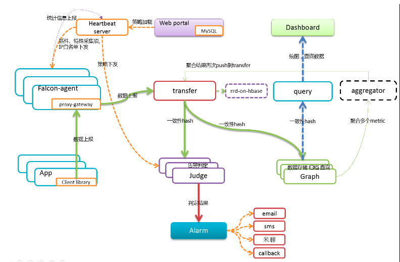
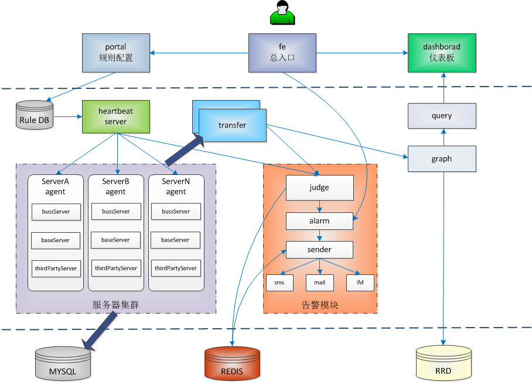
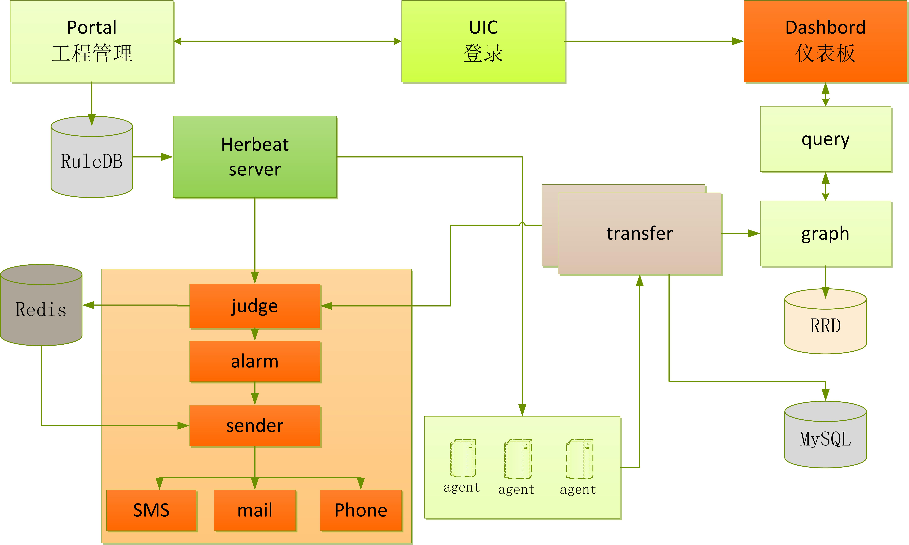
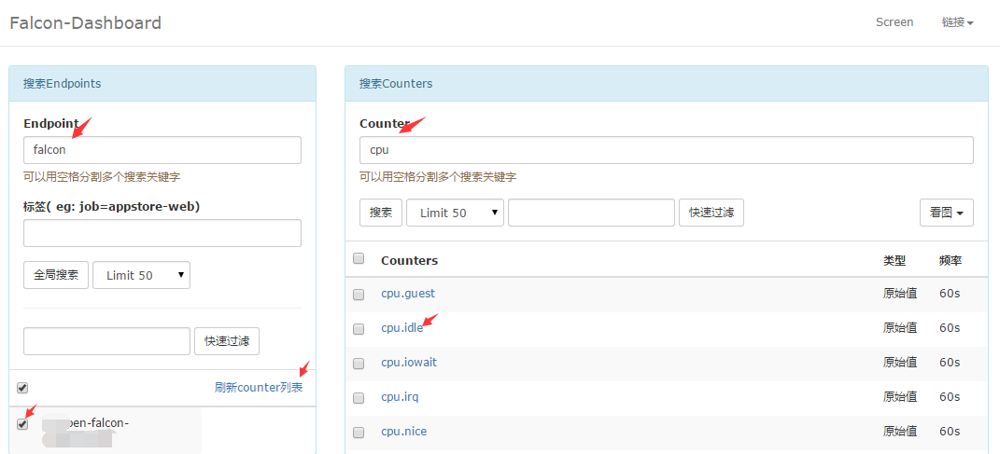
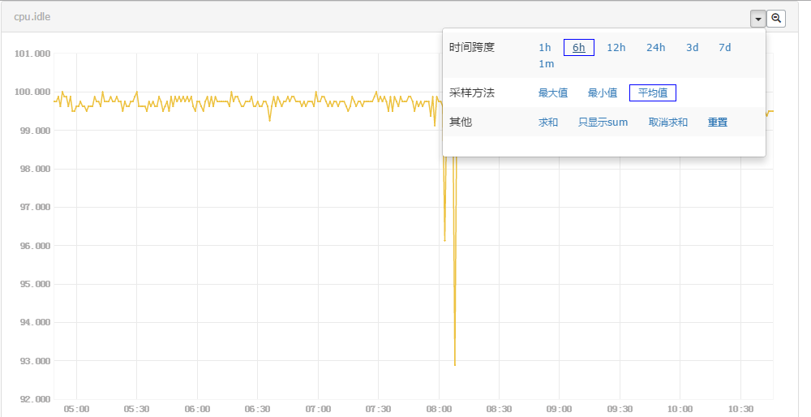
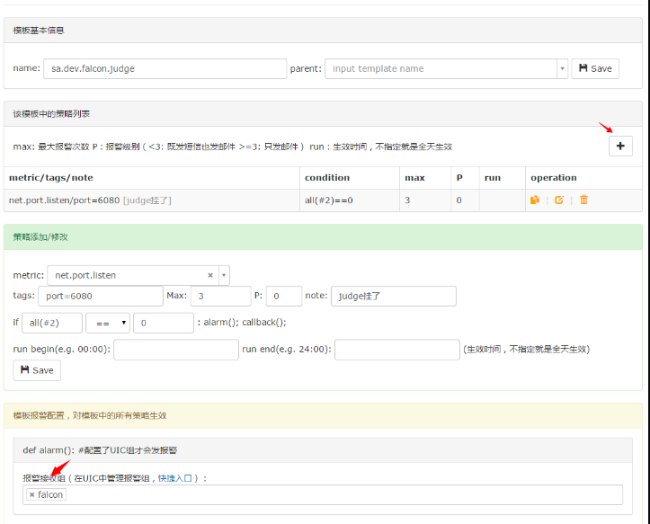
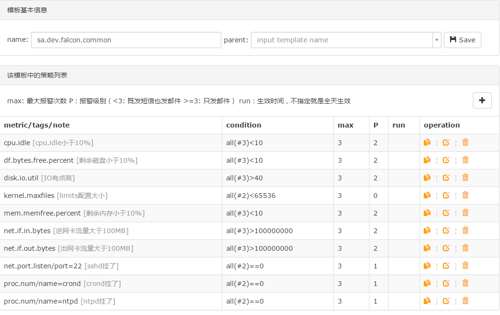
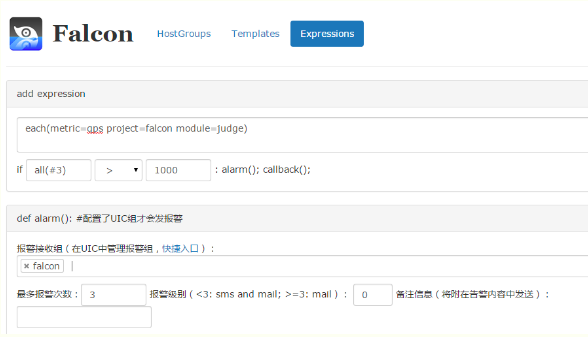

## 官方介绍

监控系统是整个运维环节，乃至整个产品生命周期中最重要的一环，事前及时预警发现故障，事后提供翔实的数据用于追查定位问题。监控系统作为一个成熟的运维产品，业界有很多开源的实现可供选择。当公司刚刚起步，业务规模较小，运维团队也刚刚建立的初期，选择一款开源的监控系统，是一个省时省力，效率最高的方案。之后，随着业务规模的持续快速增长，监控的对象也越来越多，越来越复杂，监控系统的使用对象也从最初少数的几个SRE，扩大为更多的DEVS，SRE。这时候，监控系统的容量和用户的“使用效率”成了最为突出的问题。

​        监控系统业界有很多杰出的开源监控系统。我们在早期，一直在用zabbix，不过随着业务的快速发展，以及互联网公司特有的一些需求，现有的开源的监控系统在性能、扩展性、和用户的使用效率方面，已经无法支撑了。

​        因此，我们在过去的一年里，从互联网公司的一些需求出发，从各位SRE、SA、DEVS的使用经验和反馈出发，结合业界的一些大的互联网公司做监控，用监控的一些思考出发，设计开发了小米的监控系统：Open-Falcon。

<!--more-->

## 特点：

- **数据采集免配置**：agent自发现、支持Plugin、主动推送模式

- **容量水平扩展**：生产环境每秒50万次数据收集、告警、存储、绘图，可持续水平扩展。

- **告警策略自发现**：Web界面、支持策略模板、模板继承和覆盖、多种告警方式、支持回调动作。
- **告警设置人性化**：支持最大告警次数、告警级别设置、告警恢复通知、告警暂停、不同时段不同阈值、支持维护周期，支持告警合并。
- **历史数据高效查询**：秒级返回上百个指标一年的历史数据。
- **Dashboard人性化**：多维度的数据展示，用户自定义Dashboard等功能。
- **架构设计高可用**：整个系统无核心单点，易运维，易部署

## **架构图：**

官网架构图



其中虚线所在的aggregator组件还在设计开发阶段。

网友画的



## 监控指标

每台服务器，都有安装falcon-agent，falcon-agent是一个golang开发的daemon程序，用于自发现的采集单机的各种数据和指标，这些指标包括不限于以下几个方面，共计200多项指标。

- CPU相关
- 磁盘相关
- IO
- Load
- 内存相关
- 网络相关
- 端口存活、进程存活
- ntp offset（插件）
- 某个进程资源消耗（插件）
- netstat、ss 等相关统计项采集
- 机器内核配置参数

只要安装了falcon-agent的机器，就会自动开始采集各项指标，主动上报，不需要用户在server做任何配置（这和zabbix有很大的不同），这样做的好处，就是用户维护方便，覆盖率高。当然这样做也会server端造成较大的压力，不过open-falcon的服务端组件单机性能足够高，同时都可以水平扩展，所以自动多采集足够多的数据，反而是一件好事情，对于SRE和DEV来讲，事后追查问题，不再是难题。

另外，falcon-agent提供了一个proxy-gateway，用户可以方便的通过http接口，push数据到本机的gateway，gateway会帮忙高效率的转发到server端。

falcon-agent，可以在我们的github上找到 : https://github.com/open-falcon/agent

## **数据流程图：**



## 安装准备

### 系统环境：centos7.6

```
#源更新
yum -y update
#安装常用系统工具
yum -y install wget telnet git net-tools deltarpm epel-release
#关闭防火墙
sed -i "s/SELINUX=enforcing/SELINUX=disabled/g" /etc/selinux/config
setenforce 0
systemctl stop firewalld
systemctl disable firewalld
```

### 安装一些系统常用软件

```
yum -y install gcc gcc-c++ autoconf libjpeg libjpeg-devel libpng libpng-devel freetype freetype-devel libxml2 libxml2-devel zlib zlib-devel glibc glibc-devel glib2 glib2-devel bzip2 bzip2-devel zip unzip ncurses ncurses-devel curl curl-devel e2fsprogs e2fsprogs-devel krb5-devel libidn libidn-devel openssl openssh openssl-devel libxslt-devel libevent-devel ntp  libtool-ltdl bison libtool vim-enhanced python wget lsof iptraf strace lrzsz kernel-devel kernel-headers pam-devel Tcl/Tk  cmake  ncurses-devel bison setuptool popt-devel net-snmp screen perl-devel pcre-devel net-snmp screen tcpdump rsync sysstat man iptables sudo idconfig git system-config-network-tui bind-utils update arpscan tmux elinks numactl iftop  bwm-ng
```

### 安装pip

```
wget https://bootstrap.pypa.io/get-pip.py --no-check-certificate

python get-pip.py

#使用国内豆瓣源

mkdir /root/.pip

vi /root/.pip/pip.conf

[global]

index-url = [http://pypi.douban.com/simple](http://pypi.douban.com/simple)
trusted-host = pypi.douban.com
```

### 安装数据库

```
wget http://dev.mysql.com/get/mysql-community-release-el7-5.noarch.rpm
rpm -ivh mysql-community-release-el7-5.noarch.rpm
yum install mysql-community-server
systemctl start mysql
systemctl enable mysqld
```

### 安装redis

```
yum install redis
systemctl start redis
systemctl enable redis
```

### 安装go环境**（若使用编译好的二进制文件，此步骤可忽略）**

```
yum install golang
go version
go version go1.6.3 linux/amd64
```

### 初始化数据库

```
mkdir /opt/openfalcon
cd /opt/openfalcon
git clone https://github.com/open-falcon/scripts.git
#导入表结构
cd scripts
mysql -h localhost -u root --password="" < db_schema/graph-db-schema.sql
mysql -h localhost -u root --password="" < db_schema/dashboard-db-schema.sql
mysql -h localhost -u root --password="" < db_schema/portal-db-schema.sql
mysql -h localhost -u root --password="" < db_schema/links-db-schema.sql
mysql -h localhost -u root --password="" < db_schema/uic-db-schema.sql
```

### 下载编译好的组件

```
mkdir /opt/openfalcon/tmp
cd /opt/openfalcon/tmp

wget https://github.com/open-falcon/of-release/releases/download/v0.1.0/open-falcon-v0.1.0.tar.gz

tar -zxf https://github.com/open-falcon/of-release/releases/download/v0.1.0/open-falcon-v0.1.0.tar.gz

rm -rf https://github.com/open-falcon/of-release/releases/download/v0.1.0/open-falcon-v0.1.0.tar.gz

cd /opt/openfalcon

for x in `find ./tmp/ -name "*.tar.gz"`;do app=`echo $x|cut -d'-' -f2`;mkdir -p $app;tar -zxf $x -C $app; done
```

## 开始安装

### **第一部分：绘图组件安装**

##### **组件列表：**

| **组件名称** | **用途**                                                     | **服务端口**                      | **备注**                                              |
| :----------: | ------------------------------------------------------------ | --------------------------------- | ----------------------------------------------------- |
|    Agent     | 部署在目标机器采集机器监控项                                 | http: 1988                        |                                                       |
|   Transfer   | 数据接收端，转发数据到后端Graph和Judge                       | http: 6060 rpc: 8433 socket: 4444 |                                                       |
|    Graph     | 操作rrd文件存储监控数据                                      | http: 6070 rpc: 6071              | 1.可部署多实例做集群 2.需要连接数据库graph            |
|    Query     | 查询各个Graph数据，提供统一http查询接口                      | http: 9966                        |                                                       |
|  Dashboard   | 查询监控历史趋势图的web端                                    | http: 8081                        | 1.需要python虚拟环境 2.需要连接数据库dashborad、graph |
|     Task     | 负责一些定时任务，索引全量更新、垃圾索引清理、自身组件监控等 | http: 8002                        | 1.需要连接数据库graph                                 |

##### **安装Agent**

agent用于采集机器负载监控指标，比如cpu.idle、load.1min、disk.io.util等等，每隔60秒push给Transfer。agent与Transfer建立了长连接，数据发送速度比较快，agent提供了一个http接口/v1/push用于接收用户手工push的一些数据，然后通过长连接迅速转发给Transfer。

每台机器上，都需要部署agent。修改配置并启动

```
cd/opt/openfalcon/agent/
mv cfg.example.json cfg.json

vim cfg.json
修改 transfer这个配置项的enabled为 true，表示开启向transfer发送数据的功能
修改 transfer这个配置项的addr为：["127.0.0.1:8433"] (改地址为transfer组件的监听地址, 为列表形式，可配置多个transfer实例的地址，用逗号分隔)
#默认情况下（所有组件都在同一台服务器上），保持cfg.json不变即可
#cfg.json中的各配置项，可以参考 https://github.com/open-falcon/agent/blob/master/README.md

#启动
./control start
#查看日志
./control tail
```

##### **安装Transfer**

transfer默认监听在:8433端口上，agent会通过jsonrpc的方式来push数据上来。

```
cd /opt/openfalcon/transfer/
mv cfg.example.json cfg.json
# 默认情况下（所有组件都在同一台服务器上），保持cfg.json不变即可
# cfg.json中的各配置项，可以参考 https://github.com/open-falcon/transfer/blob/master/README.md
# 如有必要，请酌情修改cfg.json

# 启动transfer
./control start
# 校验服务,这里假定服务开启了6060的http监听端口。检验结果为ok表明服务正常启动。
curl -s "http://127.0.0.1:6060/health"
#查看日志
./control tail
```

##### **安装Graph**

graph组件是存储绘图数据、历史数据的组件。transfer会把接收到的数据，转发给graph。

\#创建存储数据目录

mkdir -p /opt/openfalcon/data/6070

```
cd /opt/openfalcon/graph/
mv cfg.example.json cfg.json
# 默认情况下（所有组件都在同一台服务器上），绘图数据我改为了/opt/openfalcon/data/6070，还有就是数据库密码需要加上
# cfg.json中的各配置项，可以参考 https://github.com/open-falcon/graph/blob/master/README.md

# 启动
./control start
# 查看日志
./control tail
# 校验服务,这里假定服务开启了6071的http监听端口。检验结果为ok表明服务正常启动。
curl -s "http://127.0.0.1:6071/health"
```

##### **安装Query**

query组件，绘图数据的查询接口，query组件收到用户的查询请求后，会从后端的多个graph，查询相应的数据，聚合后，再返回给用户。

```
cd/opt/openfalcon/query/
mv cfg.example.json cfg.json
# 默认情况下（所有组件都在同一台服务器上），保持cfg.json不变即可
# cfg.json中的各配置项，可以参考 https://github.com/open-falcon/query/blob/master/README.md

# 启动
./control start
# 查看日志
./control tail
```

##### **安装Dashboard**

dashboard是面向用户的查询界面，在这里，用户可以看到push到graph中的所有数据，并查看其趋势图。

```
#安装依赖和虚拟环境
yum install -y python-virtualenv mysql-devel
cd /opt/openfalcon/dashboard/
virtualenv ./env
./env/bin/pip install -r pip_requirements.txt

#配置
# config的路径为 $WORKSPACE/dashboard/rrd/config.py，里面有数据库相关的配置信息，如有必要，请修改。默认情况下(所有组件都在同一台服务器上)，保持默认配置即可
# 数据库表结构初始化，请参考前面的 环境准备 阶段

#启动
./control start
#浏览器访问
http://IP:8081
#查看日志
./control tail
```

##### **安装Task**

task是监控系统一个必要的辅助模块。定时任务，实现了如下几个功能：

- index更新。包括图表索引的全量更新 和 垃圾索引清理。

- falcon服务组件的自身状态数据采集。定时任务了采集了transfer、graph、task这三个服务的内部状态数据。

- falcon自检控任务。

  ```
  cd /opt/openfalcon/task
  # #修改配置, 配置项含义见下文
  mv cfg.example.json cfg.json
  
  # 默认情况下（所有组件都在同一台服务器上），保持cfg.json不变即可
  # cfg.json中的各配置项，可以参考 https://github.com/open-falcon/query/blob/master/README.md
  
  # 启动服务
  ./control start
  # 校验服务,这里假定服务开启了8002的http监听端口。检验结果为ok表明服务正常启动。
  curl -s "127.0.0.1:8002/health"
  ```

  

### **第二部分：报警组件安装**

##### **组件列表：**

| **组件名称**  |                           **用途**                           |     **服务端口**     |                       **备注**                       |
| :-----------: | :----------------------------------------------------------: | :------------------: | :--------------------------------------------------: |
|    Sender     |        报警发送模块，控制并发度，提供发送的缓冲queue         |      http: 6066      |                                                      |
|   UIC（fe）   |                     用户组管理，单点登录                     |       http: 80       |                1.需要连接数据库：uic                 |
|    Portal     |              配置报警策略，管理机器分组的web端               |      http: 5050      | 1.需要连接数据库：falcon_portal 2.需要python虚拟环境 |
|      HBS      |                 HeartBeat Server，心跳服务器                 | http: 6031rpc: 6030  |           1.需要连接数据库：falcon_portal            |
|     Judge     |                         报警判断模块                         | http: 6081 rpc: 6080 |                    1.可部署多实例                    |
|     Links     |              报警合并依赖的web端，存放报警详情               |      http: 5090      | 1.需要连接数据库：falcon_links 2.需要python虚拟环境  |
|     Alarm     |                        报警事件处理器                        |      http: 9912      |                                                      |
| mail-provider |                       报警邮件http api                       |      http: 4000      |                       小米提供                       |
| sms-provider  |                       报警短信http api                       |      http: 4040      |                       自行编写                       |
|    Nodata     |                    检测监控数据的上报异常                    |      http: 6090      |           1.需要连接数据库：falcon_portal            |
|  Aggregator   | 集群聚合模块——聚合某集群下的所有机器的某个指标的值，提供一种集群视角的监控体验。 |                      |                                                      |

##### 报警准备：mail-provider & sms-provider

监控系统产生报警事件之后需要发送报警邮件或者报警短信，各个公司可能有自己的邮件服务器，有自己的邮件发送方法；有自己的短信通道，有自己的短信发送方法。falcon为了适配各个公司，在接入方案上做了一个规范，需要各公司提供http的短信和邮件发送接口。

短信发送http接口：

```
method: post
params:
  - content: 短信内容
  - tos: 使用逗号分隔的多个手机号
```

falcon将这样调用该接口：

```
url=您公司提供的http短信接口
curl  $url-d"content=xxx&tos=18611112222,18611112223"
```

邮件发送http接口：

```
method: post
params:
  - content: 邮件内容
  - subject: 邮件标题
  - tos: 使用逗号分隔的多个邮件地址
```

falcon将这样调用该接口：

```
url=您公司提供的http邮件接口
curl -X POST $url-d"content=xxx&tos=ulric.qin@gmail.com,user@example.com&subject=xxx"
```

##### **安装使用mail-provider**

这里使用小米提供的mail-provider，我是通过网友编译好的二级制包安装的，也可自行编译。

github地址： https://github.com/open-falcon/mail-provider

```
git clone https://github.com/open-falcon/mail-provider

tar xf mail-provider-master.tar.gz 

rm -rf mail-provider-master.tar.gz 

mv mail-provider-master mail-provider

cd mail-provider/

#修改配置文件cfg.conf
{

    "debug": true,

    "http": {

        "listen": "0.0.0.0:4000",

        "token": ""

    },

    "smtp": {

        "addr": "smtp.exmail.qq.com:25",

        "username": "xxxx@abc.com",

        "password": "12345",

        "from": "xxxx@abc.com"

    }

}
#启动
./control start

#测试邮件接口是否正常，收到邮件证明API 正常。
curl http://127.0.0.1:4000/sender/mail -d "tos=29235373@qq.com&subject=xxxx&content=yyyy"
```

##### 建立sms-provider

这里我自己写了个基于python的http server 作为短信接口http api

vim   http_sms.py

```
#coding=utf-8
‘‘‘
Created on ``2016``-``10``-``17
@author``: chenguomin  qq:``29235373
@explain``: 实现GET方法和POST方法请求
‘‘‘
from`  `BaseHTTPServer ``import` `HTTPServer,BaseHTTPRequestHandler
import` `urllib
import` `urllib2
def` `send_message(tos,txt):
‘‘‘
此函数主要用于调用我公司内部的短信API(get方式)，大伙可自行修改。
比如：需要加用户名密码,MD5，token的自行查看短信平台提供商手册，如何调用短信API。
下面提供一个url供大家参考。
‘‘‘
    ``#url  =  "http://www.sms.com:4000/sendsms?uid=16888&pwd=123456&mobile=%s&msg=%s" % (tos, txt)         
    ``url ``=` `"http://192.168.20.88:8080/SendSms/sendsms?mobile=%s&content=%s"` `%` `(tos, txt)
    ``req ``=` `urllib2.Request(url)
    ``res_data ``=` `urllib2.urlopen(req)
    ``res ``=` `res_data.read()
    ``print` `res
class` `ServerHTTP(BaseHTTPRequestHandler):
    ``def` `do_GET(``self``):
        ``path ``=` `self``.path
        ``print` `path
        ``#拆分url(也可根据拆分的url获取Get提交才数据),可以将不同的path和参数加载不同的html页面，或调用不同的方法返回不同的数据，来实现简单的网站或接口
        ``query ``=` `urllib.splitquery(path)
        ``print` `query
        ``self``.send_response(``200``)
        ``self``.send_header(``"Content-type"``,``"text/html"``)
        ``self``.send_header(``"test"``,``"This is test!"``)
        ``self``.end_headers()
        ``buf ``=` `‘‘‘‘‘<!DOCTYPE HTML>
                ``<html>
                ``<head><title>Get page<``/``title><``/``head>
                ``<body>
                ``<form action``=``"post_page"` `method``=``"post"``>
                  ``mobile: <``input` `type``=``"text"` `name``=``"tos"` `/``><br ``/``>
                  ``content: <``input` `type``=``"text"` `name``=``"content"` `/``><br ``/``>
                  ``<``input` `type``=``"submit"` `value``=``"POST"` `/``>
                ``<``/``form>
                ``<``/``body>
                ``<``/``html>‘‘‘
        ``self``.wfile.write(buf)
    ``def` `do_POST(``self``):
        ``path ``=` `self``.path
        ``print` `path
        ``#获取post提交的数据
        ``datas ``=` `self``.rfile.read(``int``(``self``.headers[‘content``-``length‘]))
        ``datas ``=` `urllib.unquote(datas).decode(``"utf-8"``, ‘ignore‘)
        ``mobile ``=` `datas.split(‘&‘)[``0``].replace(``"tos="``,"``").replace(‘"``‘,‘‘)
        ``content ``=` `datas.split(‘&‘)[``1``].replace(``"content="``,"``").replace(‘"``‘,‘‘)
        ``mm ``=` `mobile.split(‘,‘)
        ``for` `i ``in` `mm:
                ``print` `i
                ``send_message(i,content)
                ``self``.send_response(``200``)
                ``self``.end_headers()
                ``buf ``=` `‘‘‘‘‘<!DOCTYPE HTML>
                ``<html>
                ``<head><title>Post page<``/``title><``/``head>
                ``<body>Tos:``%``s  <br ``/``>Content:``%``s<``/``body>
                ``<``/``html>‘‘‘``%` `(mobile, content)
                ``self``.wfile.write(buf)
def` `start_server(port):
    ``http_server ``=` `HTTPServer((‘‘, ``int``(port)), ServerHTTP)
    ``http_server.serve_forever()
if` `__name__ ``=``=` `"__main__"``:
    ``#端口可自定义，不冲突就可以，这里设置为：4040
    ``start_server(``4040``)
```

```
#运行python http server
nohup python http_sms.py &

#验证：在浏览器访问，提供了简单的页面测试，只有get，post方法。
http://ip:4040/
#也可以在命令行使用curl测试
curl http://192.168.20.99:4040/ -d "tos=1358888888,1868888888&content=testmsg"
#openfalcon的sender是post方式传递数据给http api的，所以我需要获取sender post过来的tos和content参数，再发送到公司内部的sms api。
```

##### 安装alarm

alarm模块是处理报警event的，judge产生的报警event写入redis，alarm从redis读取，这个模块被业务搞得很糟乱，各个公司可以根据自己公司的需求重写

```
cd /opt/openfalcon/alarm/
mv cfg.example.json cfg.json

# vi cfg.json
# 把redis配置成与judge同一个
./control start
```

微信告警版本可到我的github拉取

```
git clone https://github.com/chensambb/open-falcon-alarm-by-weixin/
```

##### 安装sender

调用各个公司提供的mail-provider和sms-provider，按照某个并发度，从redis中读取邮件、短信并发送，alarm生成的报警短信和报警邮件都是直接写入redis即可，sender来发送。

```
cd /opt/openfalcon/sender/
mv cfg.example.json cfg.json

# vi cfg.json
# redis地址需要和后面的alarm、judge使用同一个
# queue维持默认
# worker是最多同时有多少个线程玩命得调用短信、邮件发送接口
# api要给出sms-provider和mail-provider的接口地址

#我们现在调用上面的短信和邮件api
{
	"debug": true,
	"http": {
		"enabled": true,
		"listen": "0.0.0.0:6066"
	},
	"redis": {
		"addr": "127.0.0.1:6379",
		"maxIdle": 5
	},
	"queue": {
		"sms": "/sms",
		"mail": "/mail"
	},
	"worker": {
		"sms": 10,
		"mail": 50
	},
	"api": {
		"sms": "http://127.0.0.1:4040/",
		"mail": "http://127.0.0.1:4000/sender/mail"
	}
}

#启动
./control start
```

##### 安装fe

```
cd /opt/openfalcon/fe
mv cfg.example.json cfg.json
# 请基于cfg.example.json 酌情修改相关配置项

# 启动
./control start
# 查看日志
./control tail
# 停止服务
./control stop
```

##### 安装portal

portal是用于配置报警策略的地方

```
yum install -y python-virtualenv  # run as root

cd/opt/openfalcon/portal/
virtualenv ./env

./env/bin/pip install -r pip_requirements.txt
# vi frame/config.py
# 1. 修改DB配置
# 2. SECRET_KEY设置为一个随机字符串
# 3. UIC_ADDRESS有两个，internal配置为FE模块的内网地址，portal通常是和UIC在一个网段的,内网地址相互访问速度快。external是终端用户通过浏览器访问的UIC地址，很重要！
# 4. 其他配置可以使用默认的

#启动
./control start
#验证
portal默认监听在5050端口，浏览器访问即可
```

##### 安装HBS(heartbeat Server)

心跳服务器，只依赖Portal的DB

```
cd  /opt/openfalcon/hbs/
mv cfg.example.json cfg.json

# vi cfg.json 
#把数据库配置配置为portal的db

#启动
./control start
```

如果先安装的绘图组件又来安装报警组件，那应该已经安装过agent了，hbs启动之后会监听一个http端口，一个rpc端口，agent要和hbs通信，重新去修改agent的配置cfg.json，把heartbeat那项enabled设置为true，并配置上hbs的rpc地址，`./control restart`重启agent，之后agent就可以和hbs心跳了

##### 安装judge

报警判断模块，judge依赖于HBS，所以得先搭建HBS

```
cd /opt/openfalcon/judge/
mv cfg.example.json cfg.json
# vi cfg.json
# remain: 这个配置指定了judge内存中针对某个数据存多少个点，比如host01这个机器的cpu.idle的值在内存中最多存多少个，
# 配置报警的时候比如all(#3)，这个#后面的数字不能超过remain-1
# hbs: 配置为hbs的地址，interval默认是60s，表示每隔60s从hbs拉取一次策略
# alarm: 报警event写入alarm中配置的redis
# minInterval表示连续两个报警之间至少相隔的秒数，维持默认即可

#启动
./control start
```

##### 安装Links

Links是为报警合并功能写的组件。如果你不想使用报警合并功能，这个组件是无需安装的。

Links个Python的项目，无需像Go的项目那样去做编译。不过Go的项目是静态编译的，编译好了之后二进制无依赖，拿到其他机器也可以跑起来，Python的项目就需要安装一些依赖库了。

```
# 我们使用virtualenv来管理Python环境，yum安装需切到root账号
# yum install -y python-virtualenv

cd /opt/openfalcon/links/
virtualenv ./env

./env/bin/pip install -r pip_requirements.txt
#安装完依赖的lib之后就可以用control脚本启动了，log在var目录。不过启动之前要先把配置文件修改成相应配置。另外，监听的端口在gunicorn.conf中配置。
#启动
./control start
```

##### 安装Nodata

nodata用于检测监控数据的上报异常。nodata和实时报警judge模块协同工作，过程为: 配置了nodata的采集项超时未上报数据，nodata生成一条默认的模拟数据；用户配置相应的报警策略，收到mock数据就产生报警。采集项上报异常检测，作为judge模块的一个必要补充，能够使judge的实时报警功能更加可靠、完善。

```
cd /opt/openfalcon/nodata
mv cfg.example.json cfg.json
vim cfg.json

# 启动服务
./control start
# 校验服务,这里假定服务开启了6090的http监听端口。检验结果为ok表明服务正常启动。
curl -s "127.0.0.1:6090/health"
# 停止服务
./control stop
```

##### 安装Aggregator

集群聚合模块。聚合某集群下的所有机器的某个指标的值，提供一种集群视角的监控体验。

```
cd /opt/openfalcon/aggregator
# 修改配置, 配置项含义见下文
mv cfg.example.json cfg.json
vim cfg.json

# 启动服务
./control start
# 校验服务，看端口是否在监听ss -tln
# 检查log
./control tail
# 停止服务
./control stop
```

## 使用方法

参考[官方book](http://book.open-falcon.org/zh/usage/index.html)

##### 查看监控数据

我们说agent只要部署到机器上，并且配置好了heartbeat和transfer就自动采集数据了，我们就可以去dashboard上面搜索监控数据查看了。dashboard是个web项目，浏览器访问之。左侧输入endpoint搜索，endpoint是什么？应该用什么搜索？对于agent采集的数据，endpoint都是机器名，去目标机器上执行`hostname`，看到的输出就是endpoint，拿着hostname去搜索。

搜索到了吧？嗯，选中前面的复选框，点击“查看counter列表”，可以列出隶属于这个endpoint的counter，counter是什么？`counter=${metric}/sorted(${tags})`

假如我们要查看cpu.idle，在counter搜索框中输入cpu并回车。看到cpu.idle了吧，点击，会看到一个新页面，图表中就是这个机器的cpu.idle的近一小时数据了，想看更长时间的？右上角有个小三角，展开菜单，可以选择更长的时间跨度





##### 配置报警策略

上节我们已经了解到如何查看监控数据了，如果数据达到阈值，比如cpu.idle太小的时候，我们应该如何配置告警呢？

falcon的报警接收人不是一个具体的手机号，也不是一个具体的邮箱，因为手机号、邮箱都是容易发生变化的，如果变化了去修改所有相关配置那就太麻烦了。我们把用户的联系信息维护在一个叫UIC(新用户推荐使用Go版本的UIC，即：falcon-fe项目)的系统里，以后如果要修改手机号、邮箱，只要在UIC中修改一次即可。报警接收人也不是单个的人，而是一个组（UIC中称为Team），比如falcon这个系统的任何组件出问题了，都应该发报警给falcon的运维和开发人员，发给falcon这个团队，这样一来，新员工入职只要加入falcon这个Team即可；员工离职，只要从falcon这个Team删掉即可。

浏览器访问UIC，如果启用了LDAP，那就用LDAP账号登陆，如果没有启用，那就注册一个或者找管理员帮忙开通。创建一个Team，名称姑且叫falcon，把自己加进去，待会用来做测试。

##### 创建HostGroup

比如我们要对falcon-judge这个组件做端口监控，那首先创建一个HostGroup，把所有部署了falcon-judge这个模块的机器都塞进去，以后要扩容或下线机器的时候直接从这个HostGroup增删机器即可，报警策略会自动生效、失效。咱们为这个HostGroup取名为：sa.dev.falcon.judge，这个名称有讲究，sa是我们部门，dev是我们组，falcon是项目名，judge是组件名，传达出了很多信息，这样命名比较容易管理，推荐大家这么做。

在往组里加机器的时候如果报错，需要检查portal的数据库中host表，看里边是否有相关机器。那host表中的机器从哪里来呢？agent有个heartbeat(hbs)的配置，agent每分钟会发心跳给hbs，把自己的ip、hostname、agent version等信息告诉hbs，hbs负责写入host表。如果host表中没数据，需要检查这条链路是否通畅。

##### 创建策略模板

portal最上面有个Templates链接，这就是策略模板管理的入口。我们进去之后创建一个模板，名称姑且也叫：sa.dev.falcon.judge，与HostGroup名称相同，在里边配置一个端口监控，通常进程监控有两种手段，一个是进程本身是否存活，一个是端口是否在监听，此处我们使用端口监控。



右上角那个加号按钮是用于增加策略的，一个模板中可以有多个策略，此处我们只添加了一个。下面可以配置报警接收人，此处填写的是falcon，这是之前在UIC中创建的Team。

##### 将HostGroup与模板绑定

一个模板是可以绑定到多个HostGroup的，现在我们重新回到HostGroups页面，找到sa.dev.falcon.judge这个HostGroup，右侧有几个超链接，点击【templates】进入一个新页面，输入模板名称，绑定一下就行了。

##### 补充

上面步骤做完了，也就配置完了。如果judge组件宕机，端口不再监听了，就会报警。不过大家不要为了测试报警效果，直接把judge组件给干掉了，因为judge本身就是负责判断报警的，把它干掉了，那就没法判断了……所以说falcon现在并不完善，没法用来监控本身的组件。为了测试，大家可以修改一下端口监控的策略配置，改成一个没有在监听的端口，这样就触发报警了。

上面的策略只是对falcon-judge做了端口监控，那如果我们要对falcon这个项目的所有机器加一些负载监控，应该如何做呢？

1. 创建一个HostGroup：sa.dev.falcon，把所有falcon的机器都塞进去
2. 创建一个模板：sa.dev.falcon.common，添加一些像cpu.idle,load.1min等策略
3. 将sa.dev.falcon.common绑定到sa.dev.falcon这个HostGroup

附：sa.dev.falcon.common的配置样例



大家可能不知道各个指标分别叫什么，自己push的数据肯定知道自己的metric了，agent push的数据可以参考：https://github.com/open-falcon/agent/tree/master/funcs

##### 如何配置策略表达式

策略表达式，即expression，具体可以参考[HostGroup与Tags设计理念](http://book.open-falcon.org/zh/philosophy/tags-and-hostgroup.html)，这里只是举个例子：



上例中的配置传达出的意思是：falcon-judge这个模块的所有实例，如果qps连续3次大于1000，就报警给falcon这个报警组。

expression无需绑定到HostGroup。