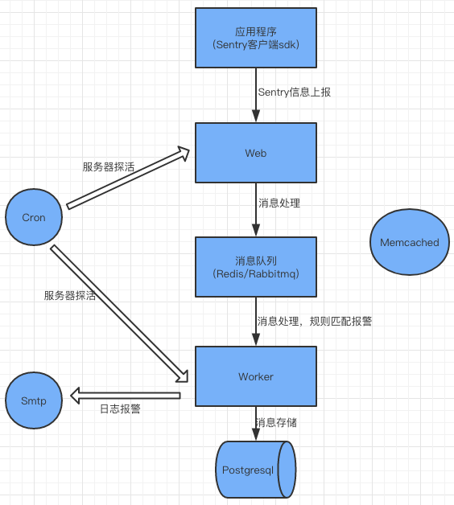
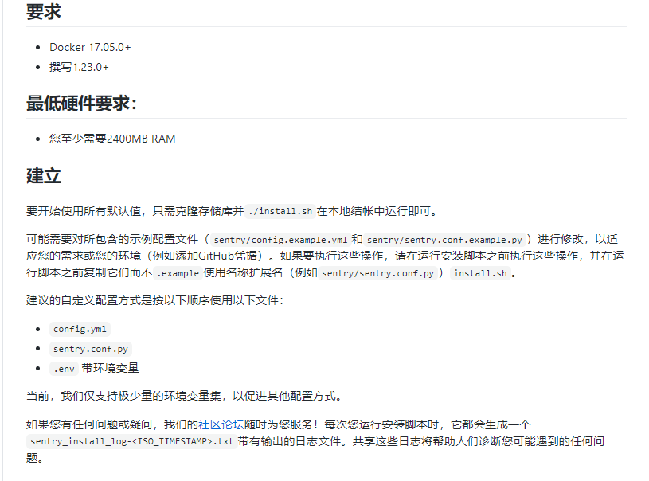
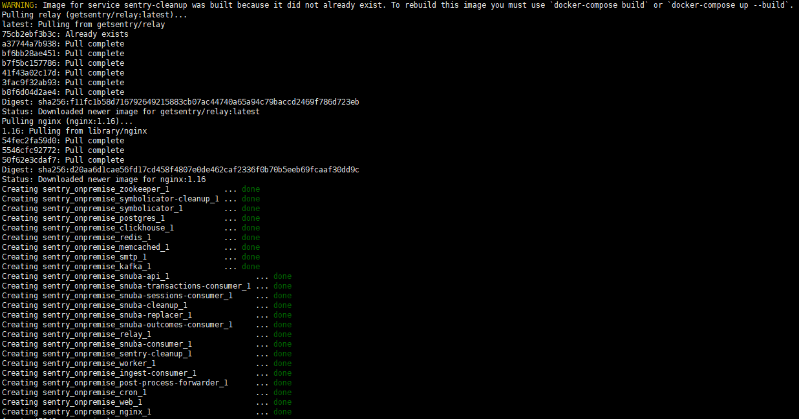
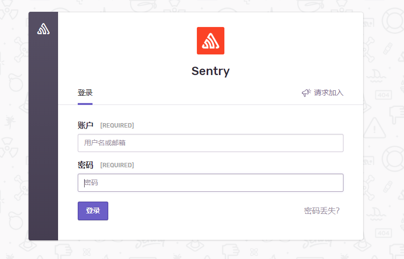
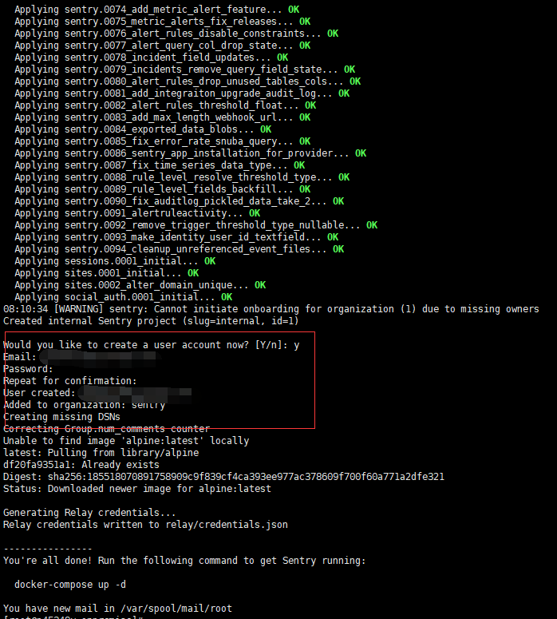
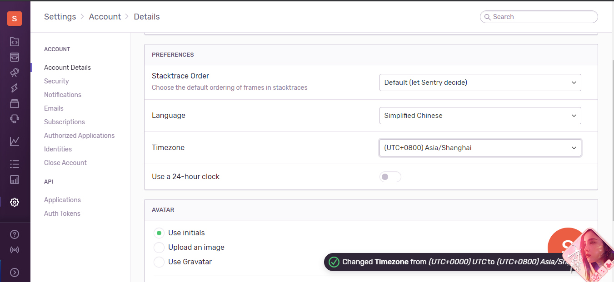
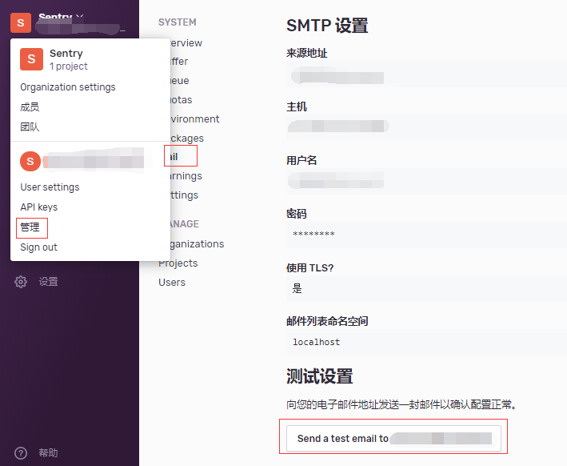

`Sentry` 是一个实时事件的日志聚合平台。它专门监测错误并提取所有有用信息用于分析，不再麻烦地依赖用户反馈来定位问题。它是一款基于 `Django`实现的错误日志收集和聚合的平台，它是 `Python` 实现的，但是其日志监控功能却不局限于`python`，对诸如 `Node.js`, `php`,`ruby`, `C#`,`java` 等语言的项目都可以做到无缝集成，甚至可以用来对`iOS`, `Android` 移动客户端以及 `Web`前端异常进行跟踪。我们可以在程序中捕获异常，并发送到 `Sentry`服务端进行聚合统计、展示和报警。sentry官方推荐docker方式安装，使用到了docker-compose。本文就详细教你如果搭建部署sentry服务。


<!--more-->

## 环境

centos7.x

docker-ce  Version: 19.03.12

docker-compose  version 1.26.2（官方要求最低版本为1.23.0，必须要大于最低要求） 


## 参考文档

[Sentry官网](https://github.com/getsentry/onpremise)


## 架构原理

Sentry到底是如何实现实时日志监控报警的呢？首先，Sentry是一个C/S架构，我们需要在自己应用中集成Sentry的SDK才能在应用发生错误是将错误信息发送给Sentry服务端。根据语言和框架的不同，我们可以选择自动或自定义设置特殊的错误类型报告给Sentry服务端。



而Sentry的服务端分为web、cron、worker这几个部分，应用（客户端）发生错误后将错误信息上报给web，web处理后放入消息队列或Redis内存队列，worker从队列中消费数据进行处理。


## 安装部署

Sentry服务依赖比较多，并且官方也推荐使用docker方式进行安装，需要先部署docker环境

### 更换yum为阿里源

安装完操作系统后，有些版本系统yum源五花八门不统一，在后面的一些安装过程中可能会有异常或报错。那么这里就统一换成阿里源。

```bash
# 备份本地源
mv /etc/yum.repos.d/CentOS-Base.repo /etc/yum.repos.d/CentOS-Base.repo_bak

# 获取阿里源配置文件
wget -O /etc/yum.repos.d/CentOS-Base.repo http://mirrors.aliyun.com/repo/Centos-7.repo

# 更新epel仓库
wget -O /etc/yum.repos.d/epel.repo http://mirrors.aliyun.com/repo/epel-7.repo

# 更新cache
yum makecache

# 更新
yum update
```


### 安装docker

```bash
# 安装docker依赖环境
yum install -y yum-utils device-mapper-persistent-data lvm2

# 添加yum源
yum-config-manager --add-repo https://download.docker.com/linux/centos/docker-ce.repo

# 安装docker-ce
yum install docker-ce

# 启动Docker
systemctl start docker
systemctl enable docker

# 查看docker版本
docker -v
```


### 安装组件依赖

```bash
yum install epel-release -y
yum install  python-pip -y
yum install docker-compose -y
yum install git -y
# 查看版本，版本必须要大于官网最低要求的1.23.0
docker-compose -v
docker-compose version 1.18.0, build 8dd22a9

# 如上图直接安装的版本为1.18.0，小于官网最低限制要求，就需要手动安装
# 官方地址为https://github.com/docker/compose/releases/
# 卸载
yum remove docker-compose -y
# 下载
curl -L "https://github.com/docker/compose/releases/download/1.26.2/docker-compose-$(uname -s)-$(uname -m)" -o /usr/local/bin/docker-compose
# 赋权
chmod +x /usr/local/bin/docker-compose
# 软连
ln -s /usr/local/bin/docker-compose /usr/bin/docker-compose
```


### 下载源码

```bash
git  clone https://github.com/getsentry/onpremise.git
```


### 修改配置

切换到onpremise目录下，可以直接执行./install.sh脚本进行一键安装，不过在安装之前需要修改几个配置项

官方readme教程如图



按照官方教程中生成配置文件，并按照顺序对配置文件进行更改

```bash
cd sentry
cp config.example.yml config.yml
#如没有自定义redis等存储，就不需要生成sentry.conf.py
cp sentry.conf.example.py sentry.conf.py

vim config.yml

# mail.backend: 'smtp'  # Use dummy if you want to disable email entirely
mail.host: 'localhost'
mail.port: 25
mail.username: 'xxxxxxxxxxxxxxxxxx'
mail.password: 'xxxxxxxxxxxxxxxxxx'
mail.use-tls: false
mail.from: 'xxxxxxxxxxxxxxx'

./install.sh

docker-compose build
docker-compose up -d
```



### 访问验证

浏览器访问http://ip:9000，账号/密码为./install.sh步骤输入的账号密码





## 服务使用

### 设置语言和时区

setting -->  Account  --> Details

修改保存后需要登出，重新登录



### 验证邮箱



到邮箱中查看邮件验证即可。

然后创建项目，就可以愉快的使用啦！！！


