## 目的

本文详细介绍基于Docker+Consul+Nginx+Consul-Template的服务负载均衡实现过程。

<!--more-->

## 软件介绍

### Nginx

一个高性能的 `HTTP` 和**反向代理服务器**，用于前端访问流量到后台应用服务器**负载均衡**和**请求转发**。

### Consul-template

`Consul-template` 是 `HashiCorp` 基于 `Consul` 所提供的可扩展的工具，通过监听 `Consul` 中的**数据变化**，动态地修改一些**配置文件**中地**模板**。常用于在 `Nginx`、`HAProxy` 上动态配置健康状态下的客户端反向代理信息。


## 实现原理

- 通过 `Nginx` 自身实现**负载均衡**和**请求转发**；
- 通过 `Consul-template` 的 `config` 功能实时监控 `Consul` 集群节点的**服务**和**数据**的变化；
- 实时的用 `Consul` 节点的信息**替换** `Nginx` 配置文件的**模板**，并**重新加载**配置文件；

> `Consul-template` 和 `nginx` 必须安装在同一台机器上，因为 `Consul-template` 需要动态修改 `nginx` 的配置文件 `nginx.conf`，然后执行 `nginx -s reload` 命令进行路由更新，达到**动态负载均衡**的目的。

### 传统负载均衡

传统的负载均衡，就是 `Client` 支姐访问 `Nginx`，然后被转发到后端某一台 `Web Server`。如果后端有**添加**/**删除** `Web Server`，运维需要手动改下 `nginx.conf` ，然后**重新载入配置**，就可以动态的调整负载均衡。

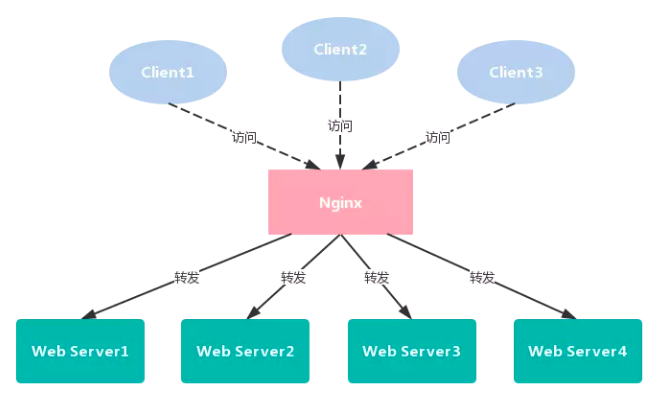

### 2.2. 自动负载均衡

再看看基于服务自动发现和注册的负载均衡，负载均衡的方式没有变，只是多了一些**外围组件**，当然这些组件对 `Client` 是不可见的，`client` 依然只能看到 `Nginx` 入口，访问方式也没变化。

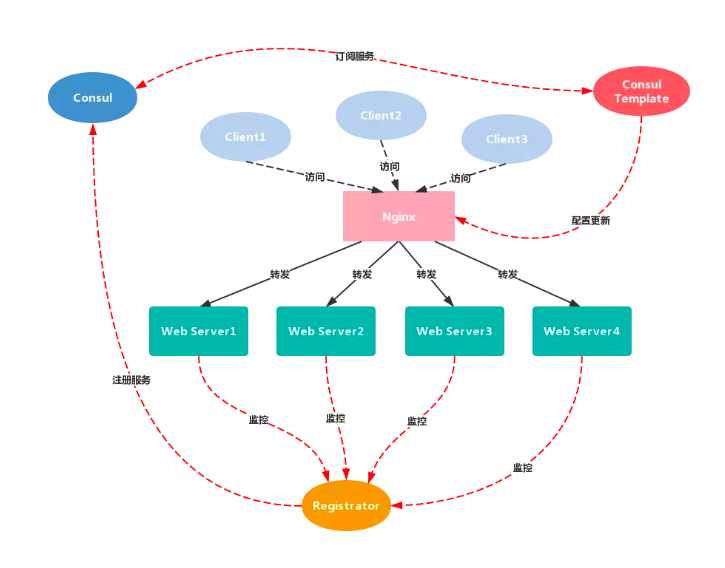

`Nginx` 的动态负载均衡实现流程如下：

1. 以相同的 `Consul` **标签**对 `Web Server` 进行**服务标记**和**分类**，**新增**或者**删除** `Web Server` 服务器节点；
2.  `Registrator` **监控**到 `Web Server` 的状态更新，自动在 `Consul`服务注册中心将它**注册**或者**注销**；
3.  `Consul-template` 订阅了 `Consul` 服务注册中心的**服务消息**，接收到 `Consul` 的消息推送，即 `Web Server` 服务节点**状态**发生改变。
4.  `Consul-template` 自动去修改和**替换** `Nginx` 服务器下的 `nginx`配置文件中的**模板**，并**重新加载**服务达到自动负载均衡的目的。


## 环境准备

### 系统环境

| 软件           | 版本                                         |
| :------------- | :------------------------------------------- |
| 操作系统       | Ubuntu：16.04 x86_64，内核：4.8.0-58-generic |
| docker         | Docker version 1.12.6, build 78d1802         |
| docker-compose | docker-compose version 1.8.0                 |

### 节点规划

| 主机IP        | 组件                                                         |
| :------------ | :----------------------------------------------------------- |
| 192.168.1.181 | Consul Server, Registrator, Nginx, Consul-template           |
| 192.168.1.186 | Consul Server, Registrator, Nginx, Consul-template           |
| 192.168.1.182 | Consul Client, Registrator, Client WebApp1, Server WebApp1, Server WebApp2 |
| 192.168.1.183 | Consul Client, Registrator, Client WebApp2, Server WebApp3, Server WebApp4 |
| 192.168.1.185 | Consul Client, Registrator, Client WebApp3, Server WebApp5, Server WebApp6 |

-  **Client WebApp**：提供基于`Thrift`的`RPC`客户端和基于`Http`协议的`RESTful`客户端，用于访问 `Server` 程序。
-  **Server WebApp**：提供基于`Thrift`的`RPC`服务端和基于`Http`协议的`RESTful`服务端，供 `Client` 程序调用。

这里的3台主机 - `192.168.1.182`、`192.168.1.183` 和 `192.168.1.185`，每台主机部署两个 `Client WebApp` 容器和一个 `Client Server` 容器，用于模拟**服务层**的负载均衡。

### 镜像构建

-  **Consul**：consul:latest
-  **Registrator**：gliderlabs/registrator:latest
-  **Nginx**和**Consul-template**：liberalman/nginx-consul-template:latest
-  **Client WebApp**：test-client:latest
-  **Server WebApp**：test-server:latest

这里先说说 `test-client` 和 `test-server` 的镜像构建：

1. 克隆项目到本地项目环境： https://github.com/ostenant/spring-cloud-starter-thrift 
2. 切换到子模块 `spring-cloud-starter-thrift-examples` 下的 `test` 目录，执行命令 `mvn clean package` 进行程序打包。
3. 分别将 `test-client` 和 `test-server` 项目**根目录**下的 `Dockerfile` 文件和`target`目录下的 `target/*.jar`程序拷贝到 `192.168.1.182` 、`192.168.1.183` 和 `192.168.1.185` 目录下。
4. 进入**客户端** `Dockerfile` 所在目录，对**客户端**程序 `test-client` 进行镜像构建，命令如下：`docker build . -t test-client:latest` 
5. 进入**服务端** `Dockerfile` 所在目录，对**服务端**程序 `test-server` 进行镜像构建，命令如下：`docker build . -t test-server:latest` 

构建完成后查看本地镜像库：

```shell
docker images
```

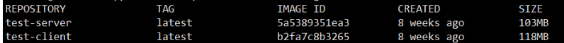

### 部署模型

五台主机，其中 `192.168.1.181` 和 `192.168.1.186` 两台主机的主要作用如下：

1. 作为**负载均衡转发器** (这里只是演示，可以通过 `KeepAlived` 实现 `Nginx` 的`HA`)，将前端访问流量经过**负载算法**一次转发到后台 `Client WebApp` 。
2. 以 `Server`模式启动 `Consul`节点，其中一台作为整个**服务发现与注册集群**的 `leader`， 用于**同步**和**持久化**其余三台 `Client` 模式的 `Consul` 节点的**数据**和**状态信息**。

其余三台主机 - `192.168.1.182`、`192.168.1.183` 和 `192.168.1.185`，充当的角色如下：

1. 每台分别以 `Client` 模式部署 `Consul` 节点，用于**注册**和**发现**本机 `docker` 容器暴露的服务，同时和 `Consul Server` 的  `leader` 节点进行**服务状态同步**。
2. 分别启动一个 `Client WebApp` 容器实例和两个 `Server WebApp` 容器实例，将 `Client WebApp` 的请求根据**服务层**的负载算法**二次转发**到 `Server WebApp` 中的任意一台上完成具体的业务处理。

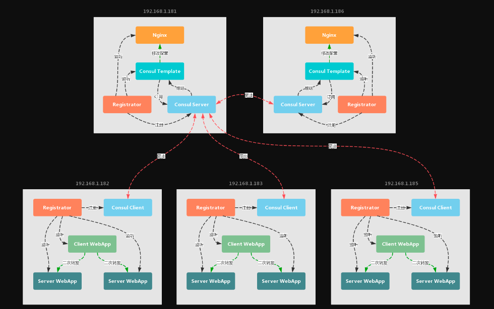

这里有两次服务转发操作：

-  **接入层的转发：**两台 `Nginx` 服务器将客户流量，经由**一次转发**至三个 `Client WebApp` 服务实例中任意一个做处理。
-  **服务层的转发：**三个 `Client WebApp`服务实例其中之一，根据从**服务注册中心**拉取的健康的**服务缓存列表**，将请求**二次转发**至六个 `Server WebApp`服务实例其中之一做处理。

## 开始搭建

### Consul Server主机

(a). 分别编写 `docker-compose.yml`，注意 `Registrator` 需要配置各自的 `IP`地址。

- **主机：192.168.1.181**

docker-compose.yml

```yaml
version: '2'
services:
  load_balancer:
    image: liberalman/nginx-consul-template:latest
    hostname: lb
    links:
      - consul_server_master:consul
    ports:
      - "80:80"

  consul_server_master:
    image: consul:latest
    hostname: consul_server_master
    ports:
      - "8300:8300"
      - "8301:8301"
      - "8302:8302"
      - "8400:8400"
      - "8500:8500"
      - "8600:8600"
    command: consul agent -server -bootstrap-expect 1 -advertise 192.168.1.181 -node consul_server_master -data-dir /tmp/data-dir -client 0.0.0.0 -ui

  registrator:
    image: gliderlabs/registrator:latest
    hostname: registrator
    links:
      - consul_server_master:consul
    volumes:
      - "/var/run/docker.sock:/tmp/docker.sock"
    command:  -ip 192.168.1.181 consul://192.168.1.181:8500
```

- **主机：192.168.1.186**

docker-compose.yml

```yaml
version: '2'
services:
  load_balancer:
    image: liberalman/nginx-consul-template:latest
    hostname: lb
    links:
      - consul_server_slave:consul
    ports:
      - "80:80"

  consul_server_slave:
    image: consul:latest
    hostname: consul_server_slave
    ports:
      - "8300:8300"
      - "8301:8301"
      - "8302:8302"
      - "8400:8400"
      - "8500:8500"
      - "8600:8600"
    command: consul agent -server -join=192.168.1.181 -advertise 192.168.1.186 -node consul_server_slave -data-dir /tmp/data-dir -client 0.0.0.0 -ui

  registrator:
    image: gliderlabs/registrator:latest
    hostname: registrator
    links:
      - consul_server_slave:consul
    volumes:
      - "/var/run/docker.sock:/tmp/docker.sock"
    command:  -ip 192.168.1.186 consul://192.168.1.186:8500
```

(b). 在两台主机上分别通过 `docker-compose` 启动多容器应用，命令如下：

```shell
docker-compose up -d
```

这是在主机 `192.168.1.181` 上运行启动命令时的输出，可以看到 `docker-compose` 启动时会先去检查**目标镜像文件**是否拉取到本地，然后依次**创建**并**启动** `docker-compose.yml` 文件配置的**容器实例**。

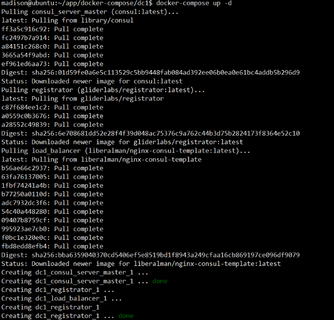

(c). 查看正常启动的容器进程，观察`Consul`、`Registrator` 和 `Nginx`/`Consul-template`的容器都正常启动。

```shell
docker ps
```

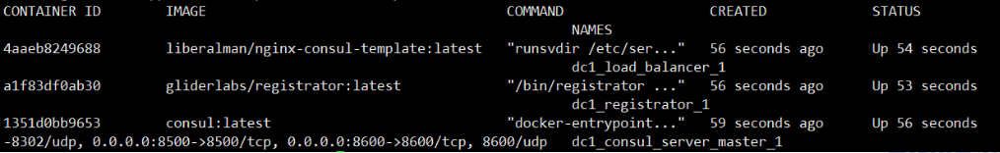

(d). 利用 `docker-compose`，以相同的方式在主机 `192.168.1.186` 上启动所配置的容器服务实例，查看启动状态

```shell
docker   ps
```

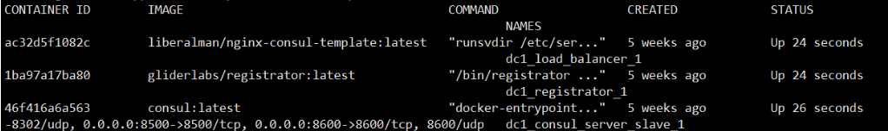

(e). 访问 `http://IP:8500` 查看 `Consul Server` 的**节点信息**和**服务注册列表**。

- 节点信息：

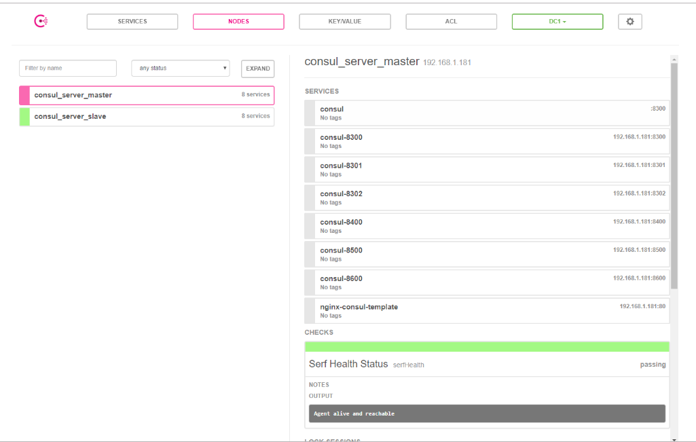

- 服务状态列表：

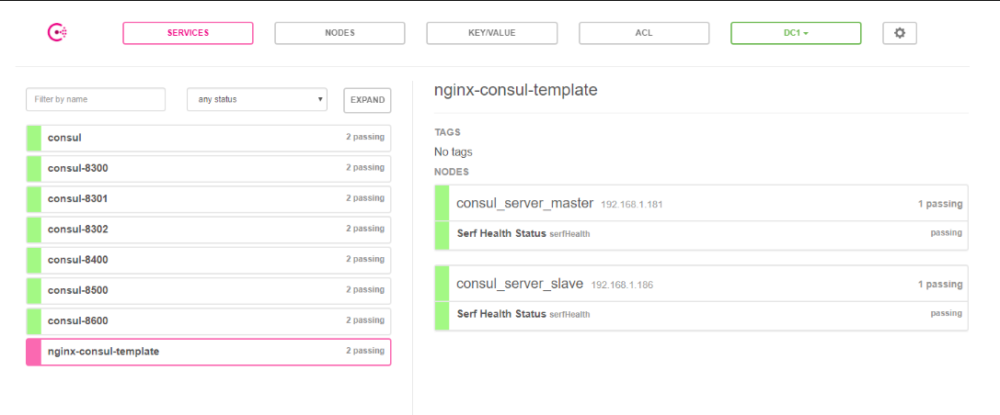

两台 `Consul Server` 主机上的容器服务实例均正常启动！

### Consul Client主机

一般情况下，我们把 `Consul` 作为服务注册与发现中心，会使用它提供的**服务定义** (`Service Definition`) 和**健康检查定义** (`Health Check Definition`) 功能，相关配置说明参考如下：

#### 服务定义

| 环境变量Key    | 环境变量Value | 说明                                                         |
| :------------- | :------------ | :----------------------------------------------------------- |
| SERVICE_ID     | web-001       | 可以为GUID或者可读性更强变量，保证不重复                     |
| SERVICE_NAME   | web           | 如果ID没有设置，Consul会将name作为id，则有可能注册失败       |
| SERVICE_TAGS   | nodejs,web    | 服务的标签，用逗号分隔，开发者可以根据标签来查询一些信息     |
| SERVICE_IP     | 内网IP        | 要使用Consul，可访问的IP                                     |
| SERVICE_PORT   | 50001         | 应用的IP, 如果应用监听了多个端口，理应被视为多个应用         |
| SERVICE_IGNORE | Boolean       | 是否忽略本Container，可以为一些不需要注册的Container添加此属性 |

#### 服健康检查定义

配置原则为: `SERVICE_XXX_*`。如果你的应用监听的是 `5000` 端口，则改为 `SERVICE_5000_CHECK_HTTP`，其它环境变量配置同理。

| 环境变量Key                  | 环境变量Value                    | 说明                             |
| :--------------------------- | :------------------------------- | :------------------------------- |
| --- 以下为HTTP模式           | ---                              | ---                              |
| SERVICE_80_CHECK_HTTP        | /path_to_health_check            | 你的健康状态检查的路径如 /status |
| SERVICE_80_CHECK_INTERVAL    | 15s                              | 15秒检查一次                     |
| SERVICE_80_CHECK_TIMEOUT     | 2s                               | 状态检查超时时间                 |
| --- 以下为HTTPS模式          | ---                              | ---                              |
| SERVICE_443_CHECK_HTTPS      | /path_to_health_check            | 你的健康状态检查的路径如 /status |
| SERVICE_443_CHECK_INTERVAL   | 15s                              | 15秒检查一次                     |
| SERVICE_443_CHECK_TIMEOUT    | 2s                               | 状态检查超时时间                 |
| --- 以下为TCP模式            | ---                              | ---                              |
| SERVICE_443_CHECK_TCP        | /path_to_health_check            | 你的健康状态检查的路径如 /status |
| SERVICE_443_CHECK_INTERVAL   | 15s                              | 15秒检查一次                     |
| SERVICE_443_CHECK_TIMEOUT    | 2s                               | 状态检查超时时间                 |
| --- 使用脚本检查             | ---                              | ---                              |
| SERVICE_CHECK_SCRIPT         | curl --silent --fail example.com | 如官方例子中的check_redis.py     |
| --- 其他                     | ---                              | ---                              |
| SERVICE_CHECK_INITIAL_STATUS | passing                          | Consul默认注册后的服务为failed   |

#### 配置说明

(a). 分别编写 `docker-compose.yml`，同样注意 `Registrator` 需要配置各自的 `IP` 地址。`test-server` 和 `test-client` 的**服务实例**在配置时需要指定相关的**环境变量**。

- **主机：192.168.1.182**

docker-compose.yml

```yml
version: '2'
services:
  consul_client_01:
    image: consul:latest
    ports:
      - "8300:8300"
      - "8301:8301"
      - "8301:8301/udp"
      - "8302:8302"
      - "8302:8302/udp"
      - "8400:8400"
      - "8500:8500"
      - "8600:8600"
    command: consul agent -retry-join 192.168.1.181 -advertise 192.168.1.182 -node consul_client_01 -data-dir /tmp/data-dir -client 0.0.0.0 -ui

  registrator:
    image: gliderlabs/registrator:latest
    volumes:
      - "/var/run/docker.sock:/tmp/docker.sock"
    command:  -ip 192.168.1.182 consul://192.168.1.182:8500

  test_server_1:
    image: test-server:latest
    environment:
      - SERVICE_8080_NAME=test-server-http-service
      - SERVICE_8080_TAGS=test-server-http-service-01
      - SERVICE_8080_CHECK_INTERVAL=10s
      - SERVICE_8080_CHECK_TIMEOUT=2s
      - SERVICE_8080_CHECK_HTTP=/health
      - SERVICE_25000_NAME=test-server-thrift-service
      - SERVICE_25000_TAGS=test-server-thrift-service-01
      - SERVICE_25000_CHECK_INTERVAL=10s
      - SERVICE_25000_CHECK_TIMEOUT=2s
      - SERVICE_25000_CHECK_TCP=/
    ports:
      - "16000:8080"
      - "30000:25000"

  test_server_2:
    image: test-server:latest
    environment:
      - SERVICE_8080_NAME=test-server-http-service
      - SERVICE_8080_TAGS=test-server-http-service-02
      - SERVICE_8080_CHECK_INTERVAL=10s
      - SERVICE_8080_CHECK_TIMEOUT=2s
      - SERVICE_8080_CHECK_HTTP=/health
      - SERVICE_25000_NAME=test-server-thrift-service
      - SERVICE_25000_TAGS=test-server-thrift-service-02
      - SERVICE_25000_CHECK_INTERVAL=10s
      - SERVICE_25000_CHECK_TIMEOUT=2s
      - SERVICE_25000_CHECK_TCP=/
    ports:
      - "18000:8080"
      - "32000:25000"

  test_client_1:
    image: test-client:latest
    environment:
      - SERVICE_8080_NAME=my-web-server
      - SERVICE_8080_TAGS=test-client-http-service-01
      - SERVICE_8080_CHECK_INTERVAL=10s
      - SERVICE_8080_CHECK_TIMEOUT=2s
      - SERVICE_8080_CHECK_HTTP=/features
    ports:
      - "80:8080"
```

- **主机：192.168.1.183**

docker-compose.yml

```yaml
version: '2'
services:
  consul_client_02:
    image: consul:latest
    ports:
      - "8300:8300"
      - "8301:8301"
      - "8301:8301/udp"
      - "8302:8302"
      - "8302:8302/udp"
      - "8400:8400"
      - "8500:8500"
      - "8600:8600"
    command: consul agent -retry-join 192.168.1.181 -advertise 192.168.1.183 -node consul_client_02 -data-dir /tmp/data-dir -client 0.0.0.0 -ui

  registrator:
    image: gliderlabs/registrator:latest
    volumes:
      - "/var/run/docker.sock:/tmp/docker.sock"
    command:  -ip 192.168.1.183 consul://192.168.1.183:8500

  test_server_1:
    image: test-server:latest
    environment:
      - SERVICE_8080_NAME=test-server-http-service
      - SERVICE_8080_TAGS=test-server-http-service-03
      - SERVICE_8080_CHECK_INTERVAL=10s
      - SERVICE_8080_CHECK_TIMEOUT=2s
      - SERVICE_8080_CHECK_HTTP=/health
      - SERVICE_25000_NAME=test-server-thrift-service
      - SERVICE_25000_TAGS=test-server-thrift-service-03
      - SERVICE_25000_CHECK_INTERVAL=10s
      - SERVICE_25000_CHECK_TIMEOUT=2s
      - SERVICE_25000_CHECK_TCP=/
    ports:
      - "16000:8080"
      - "30000:25000"

  test_server_2:
    image: test-server:latest
    environment:
      - SERVICE_8080_NAME=test-server-http-service
      - SERVICE_8080_TAGS=test-server-http-service-04
      - SERVICE_8080_CHECK_INTERVAL=10s
      - SERVICE_8080_CHECK_TIMEOUT=2s
      - SERVICE_8080_CHECK_HTTP=/health
      - SERVICE_25000_NAME=test-server-thrift-service
      - SERVICE_25000_TAGS=test-server-thrift-service-04
      - SERVICE_25000_CHECK_INTERVAL=10s
      - SERVICE_25000_CHECK_TIMEOUT=2s
      - SERVICE_25000_CHECK_TCP=/
    ports:
      - "18000:8080"
      - "32000:25000"

  test_client_1:
    image: test-client:latest
    environment:
      - SERVICE_8080_NAME=my-web-server
      - SERVICE_8080_TAGS=test-client-http-service-02
      - SERVICE_8080_CHECK_INTERVAL=10s
      - SERVICE_8080_CHECK_TIMEOUT=2s
      - SERVICE_8080_CHECK_HTTP=/features
    ports:
      - "80:8080"
```

- **主机：192.168.1.185**

docker-compose.yml

```yaml
version: '2'
services:
  consul_client_03:
    image: consul:latest
    ports:
      - "8300:8300"
      - "8301:8301"
      - "8301:8301/udp"
      - "8302:8302"
      - "8302:8302/udp"
      - "8400:8400"
      - "8500:8500"
      - "8600:8600"
    command: consul agent -retry-join 192.168.1.181 -advertise 192.168.1.185 -node consul_client_03 -data-dir /tmp/data-dir -client 0.0.0.0 -ui

  registrator:
    image: gliderlabs/registrator:latest
    volumes:
      - "/var/run/docker.sock:/tmp/docker.sock"
    command:  -ip 192.168.1.185 consul://192.168.1.185:8500

  test_server_1:
    image: test-server:latest
    environment:
      - SERVICE_8080_NAME=test-server-http-service
      - SERVICE_8080_TAGS=test-server-http-service-05
      - SERVICE_8080_CHECK_INTERVAL=10s
      - SERVICE_8080_CHECK_TIMEOUT=2s
      - SERVICE_8080_CHECK_HTTP=/health
      - SERVICE_25000_NAME=test-server-thrift-service
      - SERVICE_25000_TAGS=test-server-thrift-service-05
      - SERVICE_25000_CHECK_INTERVAL=10s
      - SERVICE_25000_CHECK_TIMEOUT=2s
      - SERVICE_25000_CHECK_TCP=/
    ports:
      - "16000:8080"
      - "30000:25000"

  test_server_2:
    image: test-server:latest
    environment:
      - SERVICE_8080_NAME=test-server-http-service
      - SERVICE_8080_TAGS=test-server-http-service-06
      - SERVICE_8080_CHECK_INTERVAL=10s
      - SERVICE_8080_CHECK_TIMEOUT=2s
      - SERVICE_8080_CHECK_HTTP=/health
      - SERVICE_25000_NAME=test-server-thrift-service
      - SERVICE_25000_TAGS=test-server-thrift-service-06
      - SERVICE_25000_CHECK_INTERVAL=10s
      - SERVICE_25000_CHECK_TIMEOUT=2s
      - SERVICE_25000_CHECK_TCP=/
    ports:
      - "18000:8080"
      - "32000:25000"

  test_client_1:
    image: test-client:latest
    environment:
      - SERVICE_8080_NAME=my-web-server
      - SERVICE_8080_TAGS=test-client-http-service-03
      - SERVICE_8080_CHECK_INTERVAL=10s
      - SERVICE_8080_CHECK_TIMEOUT=2s
      - SERVICE_8080_CHECK_HTTP=/features
    ports:
      - "80:8080"
```

> **注意：**我们使用的第三方镜像 `liberalman/nginx-consul-template`，`Nginx` 会把名称为 `my-web-server`的**服务容器**作为后台转发的**目标服务器**，因此，在 `test-client` 的配置项中，需要指定 `SERVICE_XXX_NAME` 为 `my-web-server`。当然你也可以自己**制作镜像**指定**模板**。

(b). 在三台主机上使用 `docker-compose` 启动多容器应用：

```shell
docker-compose up -d
```

以主机 `192.168.1.182` 为例 (其余两台类似)，控制台日志显示，创建并启动 `docker-compose.yml` 文件配置的5个**容器实例**。

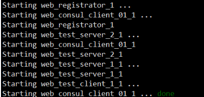

(c). 查看正常启动的容器进程，观察到 `Consul`、一台`test-client` 和 两台`test-server`的容器都正常启动。

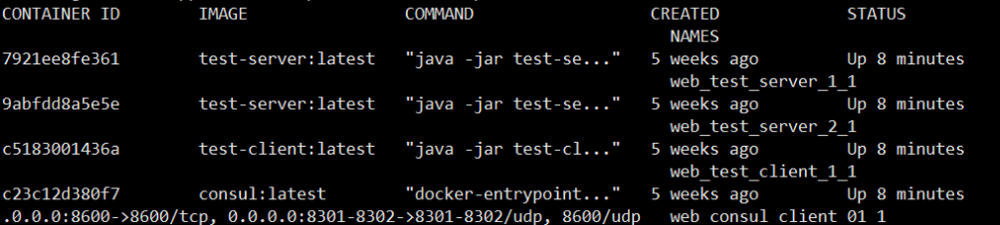

(d). 在 `b` 操作中的控制台输出可以看到：`docker-compose` 并非按照 `docker-compose.yml` 文件中服务配置的**先后顺序**启动。 `registrator` 容器的启动依赖于 `consul` 容器，而此时 `consul` 还并未启动，就出现了 `registrator` 优先启动而**异常退出**的现象。解决方法是再运行一次 `docker-compose up -d` 命令。

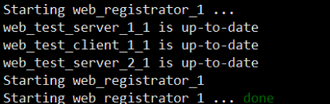

(e). 再次查看容器进程，此时 `Registrator` 容器就已经正常启动了。

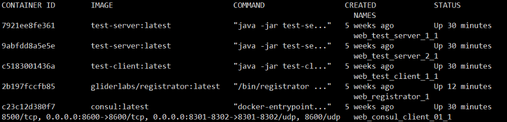

(f). 以相同的方式在其余两台主机上**重复**以上操作，再次访问 `http://IP:8500` 查看 `Consul Server` 的**节点信息**和**服务注册列表**。

-  `Consul` 集群节点信息，包括两台 `Consul Server` 节点和一台 `Consul Client` 节点，节点右侧可以看到所有的**服务注册列表**和相关的**健康检查结果**：

-  `nginx` 服务状态列表，服务名称 `nginx-consul-template`，提供 `http` 服务，共有2个服务实例：

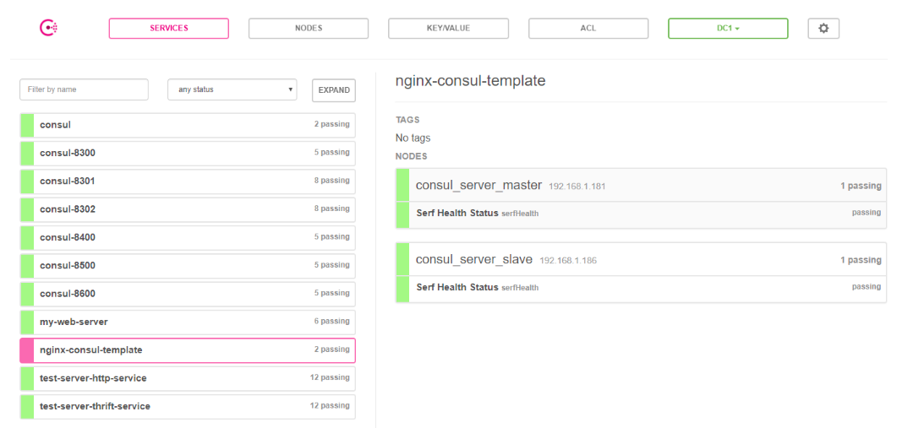

-  `test-client` 服务状态列表，服务名称为 `my-web-server`，提供 `http` 服务，共有3个服务实例：

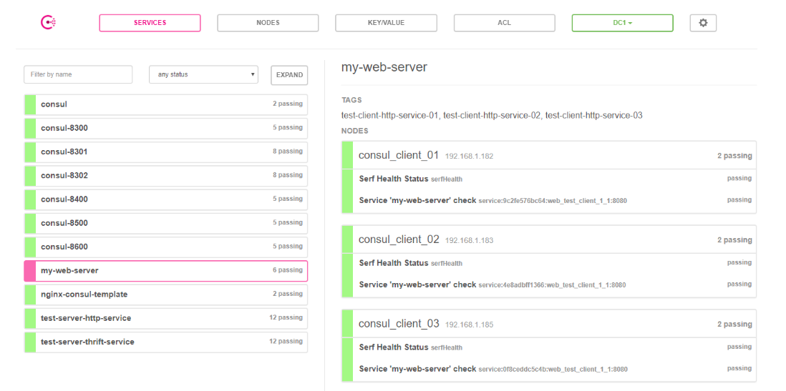

-  `test-server` 服务状态列表，服务名称为 `test-server-http-service` 和 `test-server-thrift-service`，分别对应6个 `http` 服务实例和 6个 `thrift` 服务实例：

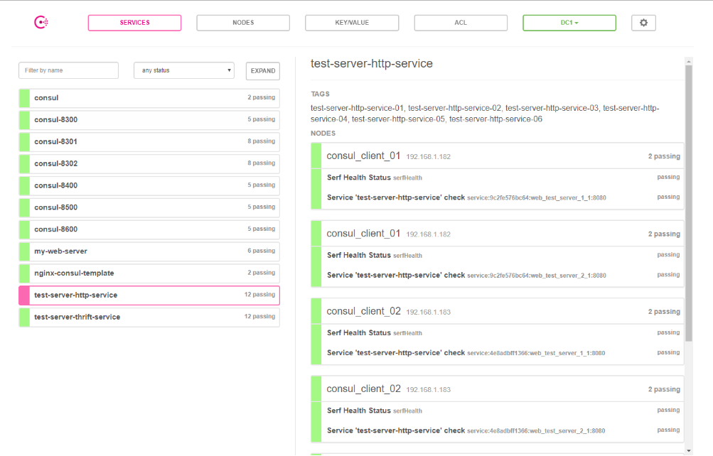

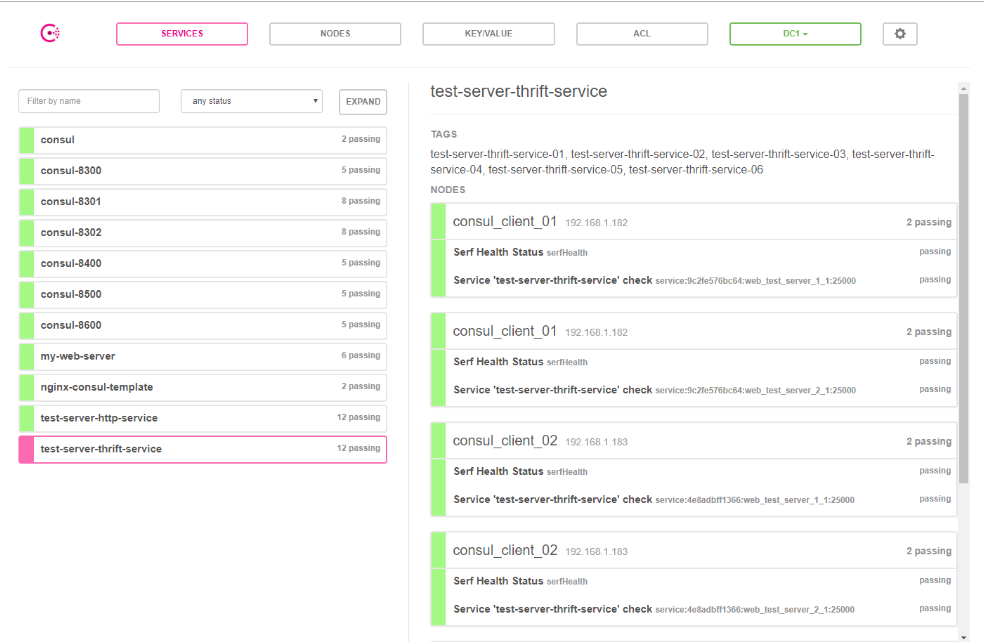

三台  `Consul Client` 主机上的容器服务实例均正常启动，服务注册和发现运行正常！

## 结果验证

### Nginx负载均衡

#### 访问Nginx

`Nginx` 默认访问端口号为`80`，任选一台 `Nginx` 访问，比如： `http://192.168.1.181/swagger-ui.html`。

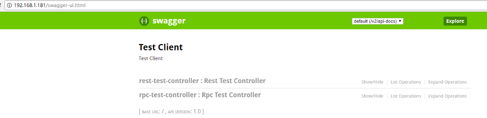

请求转发至 `Test Client` 的 `Swagger`页面，表明 `nginx`配置文件 `nginx.conf` 被 `Consul-template` 成功修改。

#### 进入Nginx容器

运行 `docker ps` 查看 `nginx-consul-template` 的容器 `ID`，比如这里是：`4f2731a7e0cb`。进入 `nginx-consul-template` 容器。

```shell
docker-enter 4f2731a7e0cb
```

查看容器内部的进程列表：

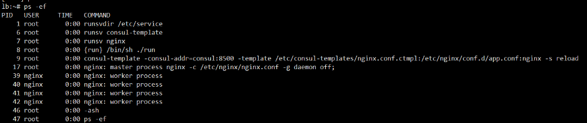

特别留意以下一行进程命令，这里完成了三步重要的操作：

```shell
consul-template -consul-addr=consul:8500 -template /etc/consul-templates/nginx.conf.ctmpl:/etc/nginx/conf.d/app.conf:nginx -s reload
```

1.  `Consul-template` 利用 `Consul` 上的**服务信息**对 `Nginx` 的**配置文件模板** `/etc/consul-templates/nginx.conf.ctmpl` 进行重新**解析**和**渲染**。
2.  **渲染**生成的 `nginx` 配置文件为 `/etc/nginx/conf.d/app.conf`。
3. 进一步运行 `nginx -s reload` 重新加载 `app.conf`，更新**路由转发列表**。

查看 `app.conf` 的配置项，发现三个 `test-client` 节点的 `IP:port` 都加入了**路由转发列表**中。

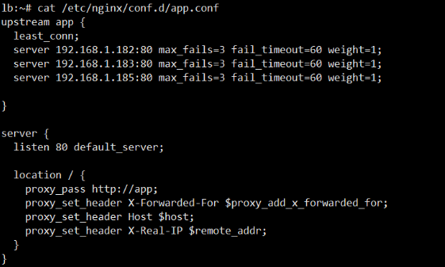

退出并关闭主机 `192.168.1.182` 上的 `test-client` 容器。

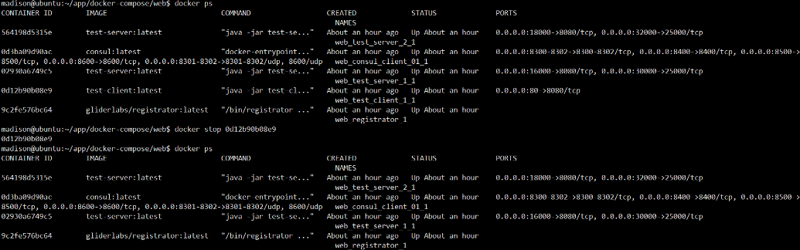

再次查看 `app.conf`，可以发现**路由节点** `192.168.1.182:80` 已经从 `Nginx` 的**路由转发列表**上**剔除**掉了。

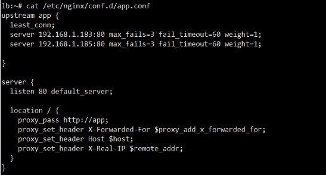

同样的，重新启动 `test-client` 恢复容器，又可以发现 `Nginx` 的**路由转发列表** 再次自动将其添加!

### 服务负载均衡

#### 接口测试

`test-client` 通过 `http` 通信方式请求任意一台 `test-server`，返回响应结果 (请求处理时间 `ms` )。

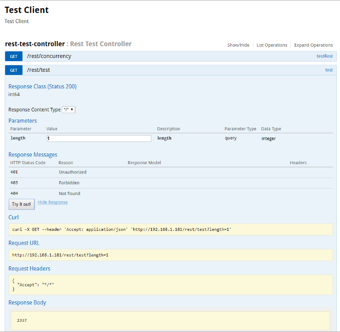

`test-client` 通过 `thrift` 通信方式请求任意一台 `test-server`，返回响应结果 (请求处理时间 `ms` )。

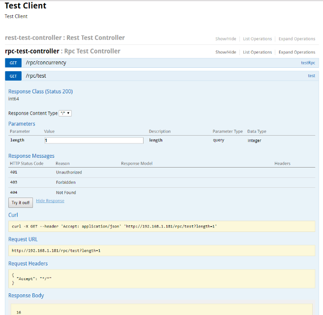

#### 日志分析

**服务的负载均衡**并不是很好观察，这里直接截取了一段 `test-client` 的**服务缓存列表**动态定时刷新时打印的日志：

```shell
2018-02-09 13:15:55.157  INFO 1 --- [erListUpdater-1] t.c.l.ThriftConsulServerListLoadBalancer : Refreshed thrift serverList: [
test-server-thrift-service: [
    ThriftServerNode{node='consul_client_01', serviceId='test-server-thrift-service', tags=[test-server-thrift-service-01], host='192.168.1.182', port=30000, address='192.168.1.182', isHealth=true},
    ThriftServerNode{node='consul_client_01', serviceId='test-server-thrift-service', tags=[test-server-thrift-service-02], host='192.168.1.182', port=32000, address='192.168.1.182', isHealth=true},
    ThriftServerNode{node='consul_client_02', serviceId='test-server-thrift-service', tags=[test-server-thrift-service-03], host='192.168.1.183', port=30000, address='192.168.1.183', isHealth=true},
    ThriftServerNode{node='consul_client_02', serviceId='test-server-thrift-service', tags=[test-server-thrift-service-04], host='192.168.1.183', port=32000, address='192.168.1.183', isHealth=true},
    ThriftServerNode{node='consul_client_03', serviceId='test-server-thrift-service', tags=[test-server-thrift-service-05], host='192.168.1.185', port=30000, address='192.168.1.185', isHealth=true},
    ThriftServerNode{node='consul_client_03', serviceId='test-server-thrift-service', tags=[test-server-thrift-service-06], host='192.168.1.185', port=32000, address='192.168.1.185', isHealth=true}
],
test-server-http-service: [
    ThriftServerNode{node='consul_client_01', serviceId='test-server-http-service', tags=[test-server-http-service-01], host='192.168.1.182', port=16000, address='192.168.1.182', isHealth=true},
    ThriftServerNode{node='consul_client_01', serviceId='test-server-http-service', tags=[test-server-http-service-02], host='192.168.1.182', port=18000, address='192.168.1.182', isHealth=true},
    ThriftServerNode{node='consul_client_02', serviceId='test-server-http-service', tags=[test-server-http-service-03], host='192.168.1.183', port=16000, address='192.168.1.183', isHealth=true},
    ThriftServerNode{node='consul_client_02', serviceId='test-server-http-service', tags=[test-server-http-service-04], host='192.168.1.183', port=18000, address='192.168.1.183', isHealth=true},
    ThriftServerNode{node='consul_client_03', serviceId='test-server-http-service', tags=[test-server-http-service-05], host='192.168.1.185', port=16000, address='192.168.1.185', isHealth=true},
    ThriftServerNode{node='consul_client_03', serviceId='test-server-http-service', tags=[test-server-http-service-06], host='192.168.1.185', port=18000, address='192.168.1.185', isHealth=true}
],
my-web-server: [
    ThriftServerNode{node='consul_client_01', serviceId='my-web-server', tags=[test-client-http-service-01], host='192.168.1.182', port=80, address='192.168.1.182', isHealth=true},
    ThriftServerNode{node='consul_client_02', serviceId='my-web-server', tags=[test-client-http-service-02], host='192.168.1.183', port=80, address='192.168.1.183', isHealth=true},
    ThriftServerNode{node='consul_client_03', serviceId='my-web-server', tags=[test-client-http-service-03], host='192.168.1.185', port=80, address='192.168.1.185', isHealth=true}
]]
```

### 服务实例

-  `test-server-http-service` 所有**健康**的服务实例：

| 服务IP地址    | 服务端口 | 服务标签                    |
| ------------- | -------- | --------------------------- |
| 192.168.1.182 | 16000    | test-server-http-service-01 |
| 192.168.1.182 | 18000    | test-server-http-service-02 |
| 192.168.1.183 | 16000    | test-server-http-service-03 |
| 192.168.1.183 | 18000    | test-server-http-service-04 |
| 192.168.1.185 | 16000    | test-server-http-service-05 |
| 192.168.1.185 | 18000    | test-server-http-service-06 |

-  `test-server-thrift-service` 所有**健康**的服务实例：

| 服务IP地址    | 服务端口 | 服务标签                      |
| ------------- | -------- | ----------------------------- |
| 192.168.1.182 | 30000    | test-server-thrift-service-01 |
| 192.168.1.182 | 32000    | test-server-thrift-service-02 |
| 192.168.1.183 | 30000    | test-server-thrift-service-03 |
| 192.168.1.183 | 32000    | test-server-thrift-service-04 |
| 192.168.1.185 | 30000    | test-server-thrift-service-05 |
| 192.168.1.185 | 32000    | test-server-thrift-service-06 |

-  `my-web-server` 所有**健康**的服务实例：

| 服务IP地址    | 服务端口 | 服务标签                    |
| ------------- | -------- | --------------------------- |
| 192.168.1.182 | 80       | test-client-http-service-01 |
| 192.168.1.183 | 80       | test-client-http-service-02 |
| 192.168.1.185 | 80       | test-client-http-service-03 |

`spring-cloud-starter-thrift` 采用的**轮询**的转发策略，也就是说 `my-web-server` 会按**次序循环往来**地将 `http` 或者 `rpc` 请求分发到各自的 `6` 个**服务实例**完成处理。

------

## 总结

本文提供了一套基于**微服务服务注册与发现体系**和**容器**的**高可用** (`HA`) 解决方案，引入了**接入层**和**服务层**的**自动负载均衡**的实现，详细给出了**实践方案**和**技术手段**