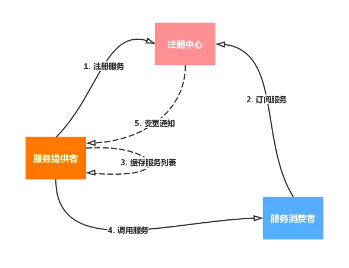
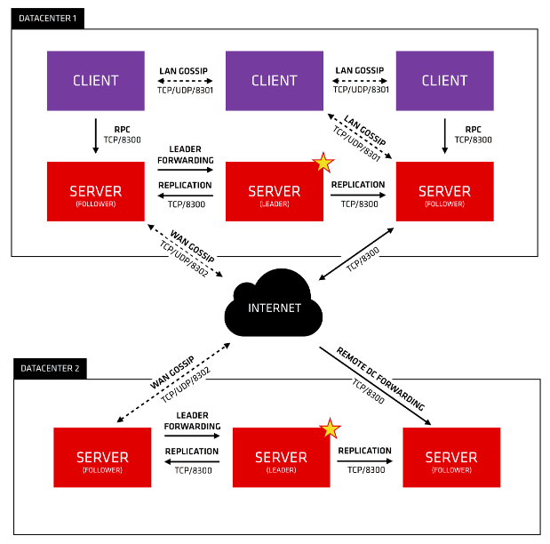
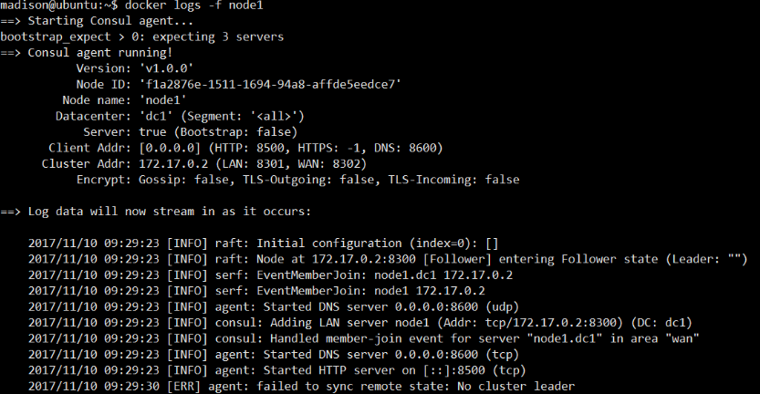
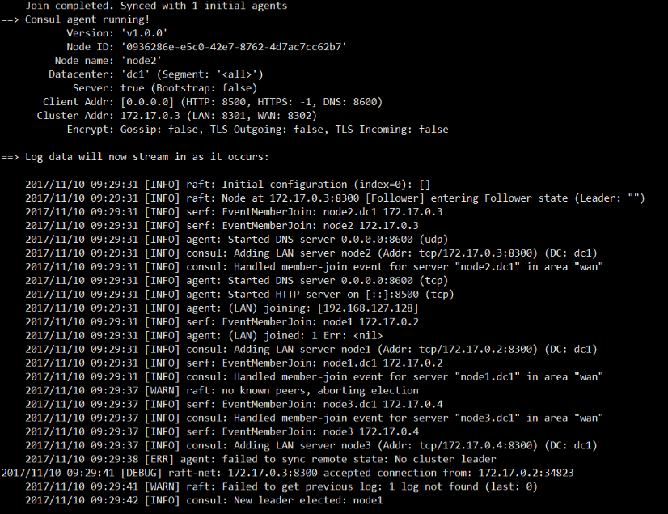
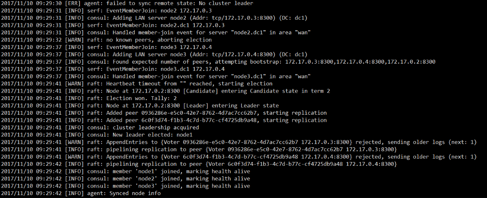
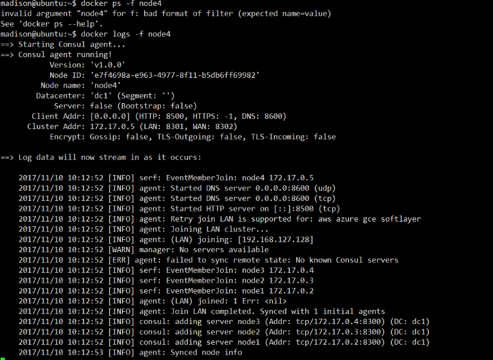
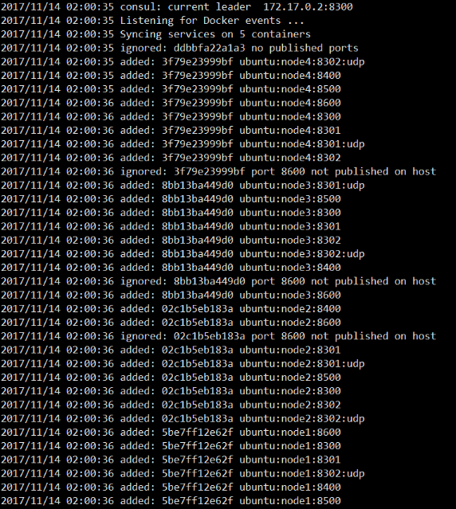
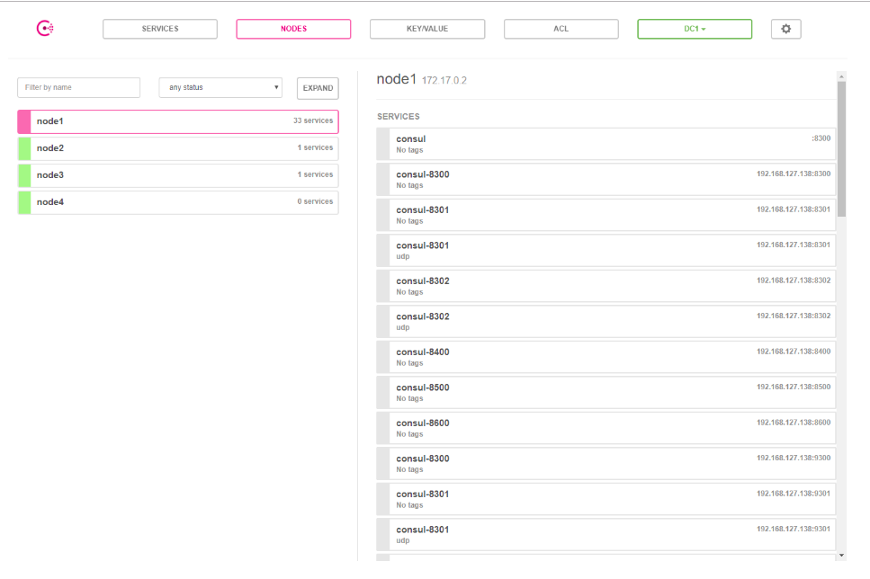

## 前言

微服务架构在互联网应用领域中愈来愈火，引入微服务主要解决了单体应用**多个模块的紧耦合**、**无法扩展**和**运维困难**等问题。微服务架构就是按照**功能粒度**将业务模块进行**垂直拆分**，对单体应用本身进行**服务化**和**组件化**，每个组件单独部署为**小应用**（从`DB`到`UI`）。微服务与微服务之间通过`Service API`进行交互，同时为了支持**水平扩展**、**性能提升**和**服务可用性**，单个服务允许同时部署一个或者多个**服务实例**。在运行时，每个实例通常是一个**云虚拟机**或者`Docker`**容器**。

微服务系统内部多个服务的实例之间如何通信？如何感知到彼此的存在和销毁？生产者服务如何知道消费者服务的地址？如何实现服务与注册中心的解耦？这就需要一个第三方的服务注册中心，提供对生产者服务节点的注册管理和消费者服务节点的发现管理。

<!--more-->

## 服务发现与注册

### 具体流程

-  **服务注册中心：**作为整个架构中的核心，要支持**分布式**、**持久化存储**，**注册信息变动**实时通知消费者。
-  **服务提供者：**服务以 `docker` **容器化**方式部署(实现**服务端口**的**动态生成**)，可以通过 `docker-compose` 的方式来管理。通过 `Registrator` 检测到 `docker` 进程信息以完成服务的**自动注册**。
-  **服务消费者：**要使用**服务提供者**提供的服务，和服务提供者往往是动态相互转位置的。

一个较为完整的服务注册与发现流程如下：



1.  **注册服务：**服务提供者到注册中心**注册**；
2.  **订阅服务：**服务消费者到注册中心**订阅**服务信息，对其进行**监听**；
3.  **缓存服务列表：**本地**缓存**服务列表，减少与注册中心的网络通信；
4.  **调用服务：**先**查找**本地缓存，找不到再去注册中心**拉取**服务地址，然后发送服务请求；
5.  **变更通知：**服务节点**变动**时 (**新增**、**删除**等)，注册中心将通知监听节点，**更新**服务信息。

### 相关组件

一个服务发现系统主要由三部分组成：

1.  **注册器(registrator)：**根据服务运行状态，注册/注销服务。主要要解决的问题是，何时发起注册/注销动作。
2.  **注册表(registry)：**存储服务信息。常见的解决方案有zookeeper、etcd、cousul等。
3.  **发现机制(discovery)：**从注册表读取服务信息，给用户封装访问接口。

### 第三方实现

对于第三方的服务注册与发现的实现，现有的工具主要有以下三种：

1.  **zookeeper：**一个高性能、分布式应用程序协调服务，用于名称服务、分布式锁定、共享资源同步和分布式配置管理。
2.  **Etcd：**一个采用HTTP协议的健/值对存储系统，主要用于共享配置和服务发现，提供的功能相对Zookeeper和Consul相对简单。
3.  **Consul：**一个分布式高可用的服务发现和配置共享的软件，支持服务发现与注册、多数据中心、健康检查和分布式键/值存储。

简单对比：

> 与Zookeeper和etcd不一样，Consul内嵌实现了服务发现系统，不需要构建自己的系统或使用第三方系统，客户只需要注册服务，并通过DNS或HTTP接口执行服务发现。

## Consul和Registrator

### Consul简介

**Consul是什么**

`Consul` 是一种**分布式**的、**高可用**、**支持水平扩展**的的服务注册与发现工具。它大致包括以下特性：

-  **服务发现：** `Consul` 通过 `DNS` 或者 `HTTP` 接口使**服务注册和服务发现**变的很容易。一些外部服务，例如 `saas` 提供的也可以一样注册；
-  **健康检查：**健康检测使 `consul` 可以快速的告警在集群中的操作。和服务发现的集成，可以防止服务转发到故障的服务上面；
-  **键/值存储：**一个用来**存储动态配置**的系统。提供简单的 `HTTP` 接口，可以在任何地方操作；
-  **多数据中心：**支持**多数据中心**以避免**单点故障**，内外网的服务采用不同的端口进行监听。而其部署则需要考虑网络延迟, 分片等情况等。`zookeeper`和`etcd`均不提供多数据中心功能的支持；
-  **一致性算法：**采用 `Raft` 一致性协议算法，比`Paxos`算法好用。 使用 `GOSSIP` 协议管理成员和广播消息, 并且支持 `ACL` 访问控制；
-  **服务管理Dashboard：**提供一个 `Web UI` 的服务注册于**健康状态监控**的管理页面。

**Consul的几个概念**

下图是`Consul`官方文档提供的架构设计图：



图中包含两个`Consul`数据中心，每个数据中心都是一个`consul`的集群。在数据中心1中，可以看出`consul`的集群是由`N`个`SERVER`，加上`M`个`CLIENT`组成的。而不管是`SERVER`还是`CLIENT`，都是`consul`集群的一个节点。所有的服务都可以注册到这些节点上，正是通过这些节点实现服务注册信息的共享。除了这两个，还有一些小细节 一一 简单介绍。

- **CLIENT**

`CLIENT`表示`consul`的`client`模式，就是**客户端模式**。是`consul`节点的一种模式，这种模式下，所有注册到当前节点的服务会被**转发**到`SERVER`节点，本身是**不持久化**这些信息。

- **SERVER**

`SERVER`表示`consul`的`server`模式，表明这个`consul`是个`server`节点。这种模式下，功能和`CLIENT`都一样，唯一不同的是，它会把所有的信息**持久化**的本地。这样遇到故障，信息是可以被保留的。

- **SERVER-LEADER**

中间那个`SERVER`下面有`LEADER`的描述，表明这个`SERVER`节点是它们的老大。和其它`SERVER`不一样的一点是，它需要负责**同步注册信息**给其它的`SERVER`，同时也要负责**各个节点**的**健康监测**。

- **其它信息**

其它信息包括各个节点之间的**通信方式**，还有**一些协议信息**、**算法**。它们是用于保证节点之间的**数据同步**、**实时性要求**等等一系列集群问题的解决。这些有兴趣的自己看看官方文档。

### Registrator简介

**什么是Registrator**
 `Registrator`是一个独立于服务注册表的**自动服务注册/注销组件**，一般以`Docker container`的方式进行部署。`Registrator`会自动侦测它所在的**宿主机**上的所有`Docker`容器状态（启用/销毁），并根据容器状态到对应的**服务注册列表**注册/注销服务。

事实上，`Registrator`通过读取同一台宿主机的其他容器`Container`的**环境变量**进行**服务注册**、**健康检查定义**等操作。

`Registrator`支持**可插拔式**的**服务注册表**配置，目前支持包括`Consul`, `etcd`和`SkyDNS 2`三种注册工具。

## Docker安装Consul集群

### 集群节点规划

我本地的使用的是`Ubuntu16.04`的虚拟机：

| 容器名称 | 容器IP地址 | 映射端口号    | 宿主机IP地址    | 服务运行模式  |
| -------- | ---------- | ------------- | --------------- | ------------- |
| node1    | 172.17.0.2 | 8500 -> 8500  | 192.168.127.128 | Server Master |
| node2    | 172.17.0.3 | 9500 -> 8500  | 192.168.127.128 | Server        |
| node3    | 172.17.0.4 | 10500 -> 8500 | 192.168.127.128 | Server        |
| node4    | 172.17.0.5 | 11500 -> 8500 | 192.168.127.128 | Client        |

### Consul集群安装

`Consul`的配置参数信息说明：

| 参数列表         | 参数的含义和使用场景说明                                     |
| ---------------- | ------------------------------------------------------------ |
| advertise        | 通知展现地址用来改变我们给集群中的其他节点展现的地址，一般情况下-bind地址就是展现地址 |
| bootstrap        | 用来控制一个server是否在bootstrap模式，在一个datacenter中只能有一个server处于bootstrap模式，当一个server处于bootstrap模式时，可以自己选举为raft leader |
| bootstrap-expect | 在一个datacenter中期望提供的server节点数目，当该值提供的时候，consul一直等到达到指定sever数目的时候才会引导整个集群，该标记不能和bootstrap共用 |
| bind             | 该地址用来在集群内部的通讯IP地址，集群内的所有节点到地址都必须是可达的，默认是0.0.0.0 |
| client           | consul绑定在哪个client地址上，这个地址提供HTTP、DNS、RPC等服务，默认是127.0.0.1 |
| config-file      | 明确的指定要加载哪个配置文件                                 |
| config-dir       | 配置文件目录，里面所有以.json结尾的文件都会被加载            |
| data-dir         | 提供一个目录用来存放agent的状态，所有的agent允许都需要该目录，该目录必须是稳定的，系统重启后都继续存在 |
| dc               | 该标记控制agent允许的datacenter的名称，默认是dc1             |
| encrypt          | 指定secret key，使consul在通讯时进行加密，key可以通过consul keygen生成，同一个集群中的节点必须使用相同的key |
| join             | 加入一个已经启动的agent的ip地址，可以多次指定多个agent的地址。如果consul不能加入任何指定的地址中，则agent会启动失败，默认agent启动时不会加入任何节点 |
| retry-interval   | 两次join之间的时间间隔，默认是30s                            |
| retry-max        | 尝试重复join的次数，默认是0，也就是无限次尝试                |
| log-level        | consul agent启动后显示的日志信息级别。默认是info，可选：trace、debug、info、warn、err |
| node             | 节点在集群中的名称，在一个集群中必须是唯一的，默认是该节点的主机名 |
| protocol         | consul使用的协议版本                                         |
| rejoin           | 使consul忽略先前的离开，在再次启动后仍旧尝试加入集群中       |
| server           | 定义agent运行在server模式，每个集群至少有一个server，建议每个集群的server不要超过5个 |
| syslog           | 开启系统日志功能，只在linux/osx上生效                        |
| pid-file         | 提供一个路径来存放pid文件，可以使用该文件进行SIGINT/SIGHUP(关闭/更新)agent |


### 拉取consul官方镜像

```shell
docker pull consul:latest
```

### 启动Server节点

运行`consul`镜像，启动`Server Master`节点`node1`：

**node1**:

```shell
docker run -d --name=node1 --restart=always \
             -e 'CONSUL_LOCAL_CONFIG={"skip_leave_on_interrupt": true}' \
             -p 8300:8300 \
             -p 8301:8301 \
             -p 8301:8301/udp \
             -p 8302:8302/udp \
             -p 8302:8302 \
             -p 8400:8400 \
             -p 8500:8500 \
             -p 8600:8600 \
             -h node1 \
             consul agent -server -bind=172.17.0.2 -bootstrap-expect=3 -node=node1 \
             -data-dir=/tmp/data-dir -client 0.0.0.0 -ui
```

查看`node1`的日志，追踪运行情况：



现在集群中还没有选举`leader`节点，继续启动其余两台`Server`节点`node2`和`node3`：

**node2**:

```shell
docker run -d --name=node2 --restart=always \
             -e 'CONSUL_LOCAL_CONFIG={"skip_leave_on_interrupt": true}' \
             -p 9300:8300  \
             -p 9301:8301 \
             -p 9301:8301/udp \
             -p 9302:8302/udp \
             -p 9302:8302 \
             -p 9400:8400 \
             -p 9500:8500 \
             -p 9600:8600 \
             -h node2 \
             consul agent -server -bind=172.17.0.3 \
             -join=192.168.127.128 -node-id=$(uuidgen | awk '{print tolower($0)}') \
             -node=node2 \
             -data-dir=/tmp/data-dir -client 0.0.0.0 -ui
```

查看`node2`节点的进程启动日志：



**node3**:

```shell
docker run -d --name=node3 --restart=always \
             -e 'CONSUL_LOCAL_CONFIG={"skip_leave_on_interrupt": true}' \
             -p 10300:8300  \
             -p 10301:8301 \
             -p 10301:8301/udp \
             -p 10302:8302/udp \
             -p 10302:8302 \
             -p 10400:8400 \
             -p 10500:8500 \
             -p 10600:8600 \
             -h node2 \
             consul agent -server -bind=172.17.0.4 \
             -join=192.168.127.128 -node-id=$(uuidgen | awk '{print tolower($0)}') \
             -node=node3 \
             -data-dir=/tmp/data-dir -client 0.0.0.0 -ui
```

查看`node3`节点的进程启动日志：


当3个`Server`节点都启动并正常运行时，观察`node2`和`node3`的进程日志，可以发现`node1`被选举为`leader`节点，也就是这个**数据中心**的`Server Master`。

再次查看`node1`节点的进程启动日志：



观察日志发现，`node2`和`node3`都成功join到了`node1`所在的数据中心`dc1`。当集群中有3台`Consul Server`启动时，`node1`被选举为`dc1`中的主节点。然后，`node1`会通过心跳检查的方式，不断地对`node2`和`node3`进行健康检查。

### 启动Client节点

**node4**:

```shell
docker run -d --name=node4  --restart=always \
            -e 'CONSUL_LOCAL_CONFIG={"leave_on_terminate": true}' \
            -p 11300:8300 \
            -p 11301:8301 \
            -p 11301:8301/udp \
            -p 11302:8302/udp \
            -p 11302:8302 \
            -p 11400:8400 \
            -p 11500:8500 \
            -p 11600:8600 \
            -h node4 \
            consul agent -bind=172.17.0.5 -retry-join=192.168.127.128  \
            -node-id=$(uuidgen | awk '{print tolower($0)}') \
            -node=node4 -client 0.0.0.0 -ui
```

查看`node4`节点的进程启动日志:



可以发现：`node4`是以`Client`模式启动运行的。启动后完成后，把`dc1`数据中心中的以`Server`模式启动的节点`node1`、`node2`和`node3`都添加到**本地缓存列表**中。当客户端向`node4`发起服务发现的请求后，`node4`会通过`RPC`将请求转发给`Server`节点中的其中一台做处理。

### 查看集群状态

```shell
docker exec -t node1 consul members
```

`dc1`数据中心中的4个节点`node1`, `node2`, `node3`和`node4`分别成功启动，`Status`表示他们的状态，都为`alive`。`node1`, `node2`, `node3`以`Server`模式启动，而`node4`以`Client`模式启动。


## Docker安装Registrator

### 拉取Registrator的镜像

```shell
docker pull gliderlabs/registrator:latest
```

### 启动Registrator节点

```shell
docker run -d --name=registrator \
             -v /var/run/docker.sock:/tmp/docker.sock \
             --net=host \
             gliderlabs/registrator -ip="192.168.127.128" consul://192.168.127.128:8500
```

> --net指定为host表明使用主机模式。
>  -ip用于指定宿主机的IP地址，用于健康检查的通信地址。
>  consul://192.168.127.128:8500: 使用Consul作为服务注册表，指定具体的Consul通信地址进行服务注册和注销（注意：8500是Consul对外暴露的HTTP通信端口）。

查看`Registrator`的容器进程启动日志：



`Registrator`在启动过程完成了以下几步操作：

1. 查看Consul数据中心的leader节点，作为服务注册表；
2. 同步当前宿主机的启用容器，以及所有的服务端口；
3. 分别将各个容器发布的服务地址/端口注册到Consul的服务注册列表。

### 查看Consul的注册状态

`Consul`提供了一个`Web UI`来可视化**服务注册列表**、**通信节点**、**数据中心**和**键/值存储**等，直接访问宿主机的`8500`端口。

**服务注册列表**：



`NODES`节点下挂载着`dc1`数据中心中的所有的`Consul`节点，包括`Consul Server`和`Client`。

**通信节点列表**：


启动`Registrator`以后，宿主机中的所有容器把服务都注册到`Consul`的`SERVICES`上，测试完成！

------

## 总结

**单数据中心**的`Consul`集群的搭建就完成了！！！后续章节我会介绍如何使用`Registrator`进行服务注册的**标签化**。然后通过`docker`部署**多实例**的`Web`容器来实现基于`HTTP`的`RESTful Service`和基于`TCP`的`RPC Service`的**服务注册**和**健康检查定义**，并演示如何以**标签**标识一个服务的多个实例。