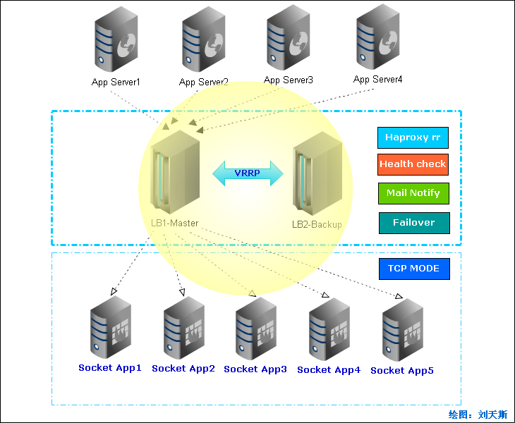
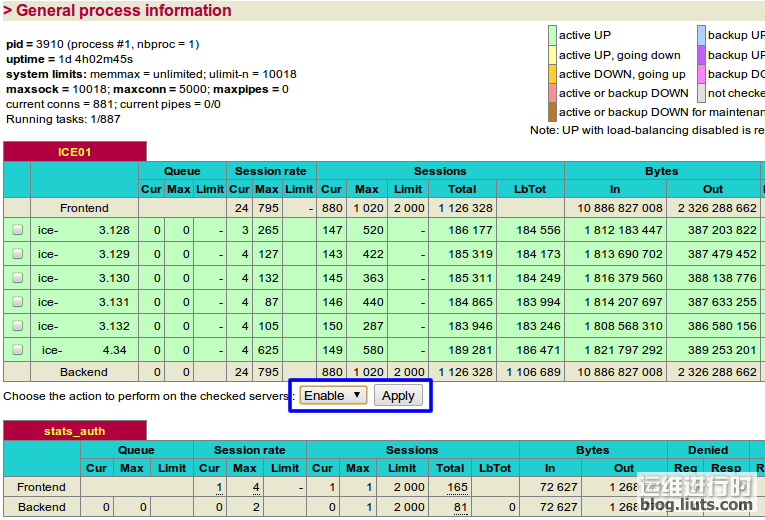

## 前言

​        Haproxy是稳定、高性能、高可用性的负载均衡解决方案，支持HTTP及TCP代理后端服务器池，因支持强大灵活的7层acl规则，广泛作为HTTP反向代理。本文则详细介绍如何利用它的四层交换与Keepalived实现一个负载均衡器，适用于Socket、ICE、Mail、Mysql、私有通讯等任意TCP服务。系统架构图如下：




<!--more-->


## 环境

OS:    Centos6.x(64X)
MASTER:   192.168.0.20
BACKUP:   192.168.0.21
VIP:  192.168.0.100
Serivce Port: 11231


## 安装配置

### **添加非本机IP邦定支持**

#vim  /etc/sysctl.conf

```bash
net.ipv4.ip_nonlocal_bind=1

#sysctl –p
```

### 配置平台日志支持

\#vim  /etc/syslog.conf  添加

```
local3.*        /var/log/haproxy.log
local0.*        /var/log/haproxy.log
```

#vim /etc/sysconfig/syslog

修改：

```
SYSLOGD_OPTIONS="-r -m 0"
```

\#/etc/init.d/syslog restart

### 关闭SELINUX

vim /etc/sysconfig/selinux
修改

```bash
SELINUX=disabled
```

\#setenforce 0

### 配置iptables

添加VRRP通讯支持

```
iptables -A INPUT -d 224.0.0.18 -j ACCEPT
```

### Keepalived的安装、配置

```bash
#mkdir -p /home/install/keepalivedha
#cd /home/install/keepalivedha
#wget http://www.keepalived.org/software/keepalived-1.2.2.tar.gz
#tar zxvf keepalived-1.2.2.tar.gz
#cd keepalived-1.2.2
#./configure
#make && make install
#cp /usr/local/etc/rc.d/init.d/keepalived /etc/rc.d/init.d/
#cp /usr/local/etc/sysconfig/keepalived /etc/sysconfig/
#mkdir /etc/keepalived
#cp /usr/local/etc/keepalived/keepalived.conf /etc/keepalived/
#cp /usr/local/sbin/keepalived /usr/sbin/
```

\#vim  /etc/keepalived/keepalived.conf

```conf
! Configuration File for keepalived 

global_defs {  
   notification_email {  
         liutiansi@gmail.com  
   }  
   notification_email_from liutiansi@gmail.com  
   smtp_connect_timeout 3  
   smtp_server 127.0.0.1  
   router_id LVS_DEVEL  
}  
vrrp_script chk_haproxy {  
    script "killall -0 haproxy"  
    interval 2  
    weight 2  
}  
vrrp_instance VI_1 {  
    interface eth1  
    state MASTER # 从为BACKUP  
    priority 101 # 从为100  
    virtual_router_id 50 #路由ID，可通过#tcpdump vrrp查看。  
    garp_master_delay 1 #主从切换时间，单位为秒。  
  
    authentication {  
        auth_type PASS  
        auth_pass KJj23576hYgu23IP  
    }  
    track_interface {  
       eth0  
       eth1  
    }  
    virtual_ipaddress {  
        192.168.0.100  
    }  
    track_script {  
        chk_haproxy  
    }  
  
    #状态通知  
    notify_master "/etc/keepalived/Mailnotify.py master"  
    notify_backup "/etc/keepalived/Mailnotify.py backup"  
    notify_fault "/etc/keepalived/Mailnotify.py fault"  
}  
```

### Haproxy的安装与配置

```
#cd /home/install/keepalivedha
#wget http://haproxy.1wt.eu/download/1.4/src/haproxy-1.4.11.tar.gz
#tar -zxvf haproxy-1.4.11.tar.gz
#cd haproxy-1.4.11
#make install
#mkdir -p /usr/local/haproxy/etc
#mkdir -p /usr/local/haproxy/sbin
#cp examples/haproxy.cfg /usr/local/haproxy/etc
#ln -s /usr/local/sbin/haproxy /usr/local/haproxy/sbin/haproxy
```

\#vim  /usr/local/haproxy/etc/haproxy.cfg

```
# this config needs haproxy-1.1.28 or haproxy-1.2.1
global  
#        log 127.0.0.1   local0  
        log 127.0.0.1   local1 notice  
        maxconn 5000  
        uid 99  
        gid 99  
        daemon  
        pidfile /usr/local/haproxy/haproxy.pid  
  
  
defaults  
        log     global  
        mode    http  
        #option httplog  
        option  dontlognull  
        retries 3  
        option redispatch  
        maxconn 2000  
        contimeout      5000  
        clitimeout      50000  
        srvtimeout      50000  
  
listen  ICE01   192.168.0.100:11231  
        mode tcp #配置TCP模式  
        maxconn 2000  
        balance roundrobin  
        server  ice-192.168.0.128 192.168.0.128:11231 check inter 5000 fall 1 rise 2  
        server  ice-192.168.0.129 192.168.0.129:11231 check inter 5000 fall 1 rise 2  
        server  ice-192.168.0.130 192.168.0.130:11231 check inter 5000 fall 1 rise 2  
        server  ice-192.168.0.131 192.168.0.131:11231 check inter 5000 fall 1 rise 2  
        server  ice-192.168.0.132 192.168.0.132:11231 check inter 5000 fall 1 rise 2  
        server  ice-192.168.0.34 192.168.0.34:11231 check inter 5000 fall 1 rise 2  
        srvtimeout      20000  
  
listen stats_auth 192.168.0.20:80  
# listen stats_auth 192.168.0.21:80 # backup config  
        stats enable  
        stats uri  /admin-status #管理地址  
        stats auth  admin:123456 #管理帐号:管理密码  
        stats admin if TRUE  
```


### 邮件通知程序(python实现)

\#vim  /etc/keepalived/Mailnotify.py

```python
#!/usr/local/bin/python  
#coding: utf-8  
from email.MIMEMultipart import MIMEMultipart  
from email.MIMEText import MIMEText  
from email.MIMEImage import MIMEImage  
from email.header import Header  
import sys  
import smtplib  
  
#---------------------------------------------------------------  
# Name:        Mailnotify.py  
# Purpose:     Mail notify to SA  
# Author:      Liutiansi  
# Email:       liutiansi@gamil.com  
# Created:     2011/03/09  
# Copyright:   (c) 2011  
#--------------------------------------------------------------  
strFrom = 'admin@domain.com'  
strTo = 'liutiansi@gmail.com'  
smtp_server='smtp.domain.com'  
smtp_pass='123456'  
  
if sys.argv[1]!="master" and sys.argv[1]!="backup"  and sys.argv[1]!="fault":  
    sys.exit()  
else:  
    notify_type=sys.argv[1]  
  
  
mail_title='[紧急]负载均衡器邮件通知'  
mail_body_plain=notify_type+'被激活，请做好应急处理。'  
mail_body_html='<b><font color=red>'+notify_type+'被激活，请做好应急处理。</font></b>'  
  
msgRoot = MIMEMultipart('related')  
msgRoot['Subject'] =Header(mail_title,'utf-8')  
msgRoot['From'] = strFrom  
msgRoot['To'] = strTo  
  
msgAlternative = MIMEMultipart('alternative')  
msgRoot.attach(msgAlternative)  
  
msgText = MIMEText(mail_body_plain, 'plain', 'utf-8')  
msgAlternative.attach(msgText)  
  
  
msgText = MIMEText(mail_body_html, 'html','utf-8')  
msgAlternative.attach(msgText)  
  
  
smtp = smtplib.SMTP()  
smtp.connect(smtp_server)  
smtp.login(smtp_user,smtp_pass)  
smtp.sendmail(strFrom, strTo, msgRoot.as_string())  
smtp.quit()  
```

注：修改成系统python实际路径“#!/usr/local/bin/python”(第一行)

```
#chmod +x /etc/keepalived/Mailnotify.py
#/usr/local/haproxy/sbin/haproxy -f /usr/local/haproxy/etc/haproxy.cfg
#service keepalived start
```

### 查看VRRP通讯记录

```
#tcpdump vrrp

tcpdump: verbose output suppressed, use -v or -vv for full protocol decode
listening on eth0, link-type EN10MB (Ethernet), capture size 96 bytes
15:49:05.270017  IP 192.168.0.20 > VRRP.MCAST.NET: VRRPv2, Advertisement, vrid 50,  prio 100, authtype simple, intvl 1s, length 20
```

## Haproxy界面

访问http://192.168.0.20/admin-status，输入帐号admin密码123456进入管理监控平台。



haproxy-1.4.9以后版本最大的亮点是添加了手工启用/禁用功能，对升级变更应用时非常有用。

## 邮件通知

