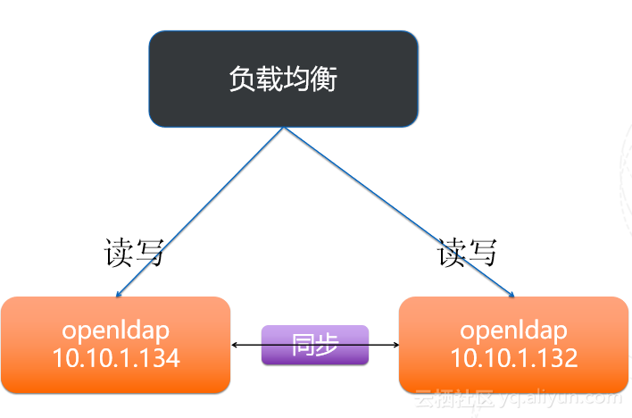
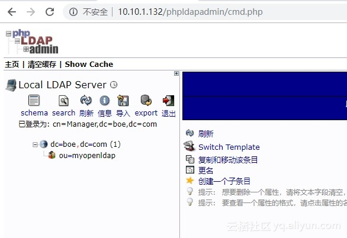
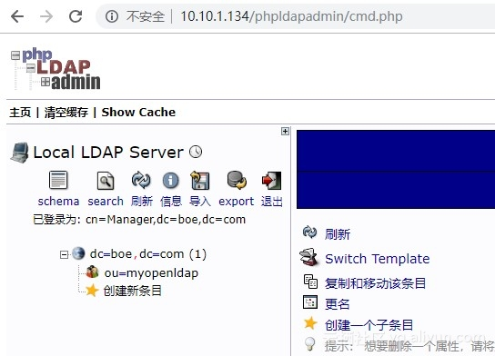
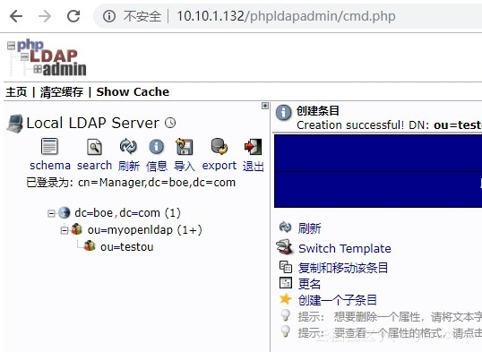
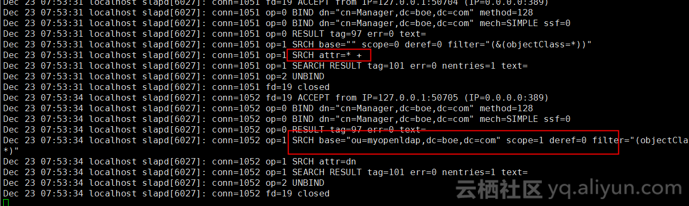

## 背景

LDAP是一款轻量级目录访问协议（Lightweight Directory Access Protocol，简称LDAP），属于开源集中账号管理架构的实现，且支持众多系统版本，被广大互联网公司所采用。目录服务是一种特殊的数据库系统，对于数据的读取、浏览、搜索有很好的效果。同时做为用户中心，数据库的高可用显得尤为重要。在客户生产环境中使用的是客户的负载均衡设备，基于思杰的硬件负载均衡设备，后端配置的是OpenLDAP_MirrorMode,相当于Mysql的双主模式，后面某一台服务器出现问题，负载均衡会将后端的服务器剔除，另一台仍能提供服务，如下图所示


<!--more-->

## 实验环境：

操作系统: centos 7.2
服务器A：10.10.1.134
服务器B：10.10.1.132


## 环境准备

- 下载软件： 

  ```shell
  mkdir /home/admin/openldap && cd /home/admin/openldap
  
  wget ftp://ftp.openldap.org/pub/OpenLDAP/openldap- release/openldap-2.4.23.tgz
  wget http://download.oracle.com/berkeley-db/db-4.6.21.tar.gz
  ```

- 关闭selinux 

  ```shell
  sed -i '/SELINUX/s/enforcing/disabled/' /etc/selinux/config && sestatus
  ```

- 防火墙关闭 

  ```shell
  /bin/systemctl disable firewalld.service && /bin/systemctl stop firewalld.service
  ```

- 配置yum源为阿里云yum源

  ```shell
  #从阿里云镜像网站下载yum源配置文件到yum目录中
  wget -O /etc/yum.repos.d/CentOS-Base.repo http://mirrors.aliyun.com/repo/Centos-7.repo 
   #修改版本号为redhat7
  sed -i 's/$releasever/7/g' /etc/yum.repos.d/CentOS-Base.repo
  #清空yum缓存
  yum clean all
  #生成列表
  yum list 
  ```

- 安装openldap环境所需要的依赖包。

  ```shell
  yum -y install libtool-ltdl libtool-ltdl-devel gcc openssl openssl-devel cyrus-sasl-lib.x86_64 cyrus-sasl-devel.x86_64 cyrus-sasl-plain.x86_64 cyrus-sasl-md5.x86_64 cyrus-sasl-ldap.x86_64
  ```

  

## 安装openldap和Berkeley DB

### 1. 写在安装之前：

编译安装openldap需要数据库的支持，openldap的数据库支持
Berkeley DB,Oracle,Mysql,MariaDB,GDBM等数据库。默认openldap采用Berkeley DB，并且openldap对数据库有一定的要求，openldap 2.4的软件为例，需要Berkeley DB 4.4版本以上,所以在编译安装openldap源码包时需要先下载安装Berkeley DB

### 2. 编译安装Berkeley DB

```shell
tar -xf db-4.6.21.tar.gz -C /usr/local/src
cd /usr/local/src/db-4.6.21/build_unix/ && mkdir /usr/local/BDB
../dist/configure --prefix=/usr/local/BDB
make && make install
echo "/usr/local/BDB/lib/" > /etc/ld.so.conf.d/bdb.conf
ldconfig -v
ln -sv /usr/local/BDB/include /usr/include/BDB
```

### 3. 编译安装openldap

```bash
tar -xf openldap-2.4.23.tgz -C /usr/local/src/
cd /usr/local/src/openldap-2.4.23/
./configure --prefix=/usr/local/openldap --enable-syslog --enable-modules --enable-debug --with-tls CPPFLAGS=-I/usr/local/BDB/include/ LDFLAGS=-L/usr/local/BDB/lib/ --enable-ldap --enable-relay --enable-accesslog --enable-auditlog --enable-syncprov --with-cyrus-sasl --enable-spasswd
make depend
make && make install
echo "/usr/local/openldap/lib/" > /etc/ld.so.conf.d/ldap.conf
ldconfig -v
ln -sv /usr/local/openldap/include/ /usr/include/ldap
ln -s /usr/local/openldap/bin/* /usr/local/bin/
ln -s /usr/local/openldap/sbin/* /usr/local/sbin/
```


## 配置openldap

### 1. 配置openldap的方法有两种：

- 通过修改配置文件实现配置
- 通过配置数据库的形式完成配置（slapd.d下的数据库配置文件）,属于动态配置不需要重启slapd进程,
  此配置文件在cn=config目录下的LDIF的配置文件 。此文件不建议手动修改，用ldap命令生成。

### 2. 配置rootdn密码(optional)

```bash
/usr/local/openldap/bin/slappasswd  #此密码记住，后面配置openldap会用到。
```

### 3. 创建用户ldap

```bash
useradd ldap
```

### 4. 创建数据目录以及日志文件

```bash
mkdir /data/openldap/{data,log,var} -p
cd /data/openldap/var/
mkdir run
```

### 5. 修改权限：

```bash
cp /usr/local/openldap/etc/openldap/DB_CONFIG.example /data/openldap/data/DB_CONFIG
chown -R ldap:ldap /data/openldap/data
chmod 700 -R /data/openldap/data
```


### 6. 修改openldap配置文件

```bash
#编辑配置文件vim slapd.conf

include /usr/local/openldap/etc/openldap/schema/core.schema
include /usr/local/openldap/etc/openldap/schema/collective.schema
include /usr/local/openldap/etc/openldap/schema/corba.schema
include /usr/local/openldap/etc/openldap/schema/cosine.schema
include /usr/local/openldap/etc/openldap/schema/duaconf.schema
include /usr/local/openldap/etc/openldap/schema/dyngroup.schema
include /usr/local/openldap/etc/openldap/schema/inetorgperson.schema
include /usr/local/openldap/etc/openldap/schema/java.schema
include /usr/local/openldap/etc/openldap/schema/misc.schema
include /usr/local/openldap/etc/openldap/schema/nis.schema
include /usr/local/openldap/etc/openldap/schema/openldap.schema
include /usr/local/openldap/etc/openldap/schema/ppolicy.schema
pidfile /data/openldap/var/run/slapd.pid
argsfile /data/openldap/var/run/slapd.args
loglevel 256
logfile /data/openldap/log/slapd.log
moduleload syncprov.la # 需要数据同步需要开启此模块
database bdb
directory /data/openldap/data
suffix "dc=boe,dc=com"
rootdn "cn=Manager,dc=boe,dc=com"
rootpw {SSHA}eJtr5umAo23PqTKATU/X6D8swJ9yIlSx #用slappasswd命令生成的密码
index objectclass,entryCSN,entryUUID eq
overlay syncprov
syncprov-checkpoint 100 10
syncprov-sessionlog 100
serverID 2
syncrepl rid=123
provider=ldap://对端服务器ip
bindmethod=simple
binddn="cn=Manager,dc=boe,dc=com"
credentials=密码(管理员密码，这里是Manager的密码)
searchbase="dc=boe,dc=com"
schemachecking=off
type=refreshAndPersist
retry="60 +"
mirrormode on


#两个服务器的配置文件有两个地方不一致
1）serverID不一致 
2）provider=ldap://对端的ip
```


### 7.开启日志功能

- 通过修改配置文件开启日志功能

```bash
/etc/rsyslog.d/slapd.conf
local4.* /data/openldap/log/openldap.log

#重启rsyslog和slapd
service rsyslog restart
```

- 通过修改数据库配置文件开启

```bash
/root/loglevel.ldif << EOF
dn: cn=config
changetype: modify
replace: olcLogLevel
olcLogLevel: stats
EOF

#导入
ldapadd -x -D "cn=Manager,dc=boe,dc=com" -f ./loglevel.ldif -w secret
```


## 配置phpldpadmin工具

### 1. 安装和配置LDAP管理工具PHPldapadmin

```bash
yum -y install httpd php php-ldap php-gd php-mbstring php-pear php-bcmath php-xml
yum -y install epel-release
yum --enablerepo=epel -y install phpldapadmin
```


### 2. 修改配置文件

```bash
vim /etc/phpldapadmin/config.php +398
#397行取消注释，398行添加注释
$servers->setValue('login','attr','dn');

vim /etc/httpd/密码 d/phpldapadmin.conf
Apache 2.4

Require all granted （修改此处)
Order Deny,Allow
Deny from all
Allow from 127.0.0.1
Allow from ::1
```


### 3. 设置开机自启并启动Apache

```bash
systemctl enable httpd
systemctl start httpd 
#启动openldap
#/usr/local/openldap/libexec/slapd

访问用http://ip/phpldapadmin访问如图
```



在10.10.1.132上创建了一个OU名为testou,会发现10.10.1.132会自动同步到本地，如图:


两服务器日志如下：

以上结果得知，在镜像模式下，当其中一台服务器增加操作OU时，另一台也会同步增加，两台服务器均可进行读写操作，任何一台信息发生变化，都会以推的方式进行通知。

