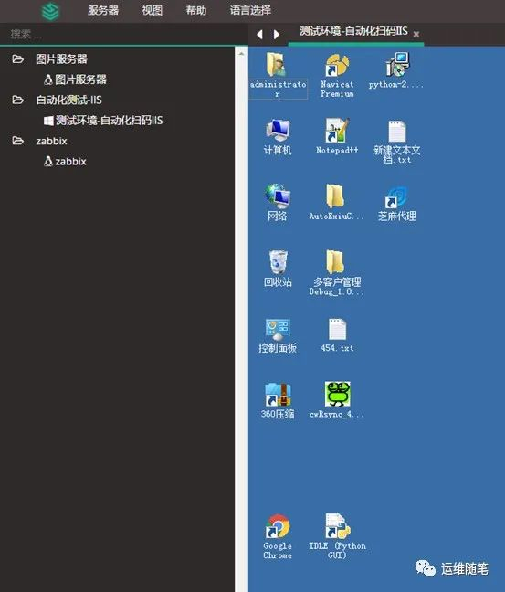
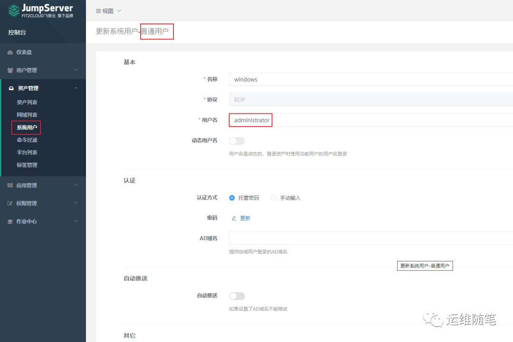
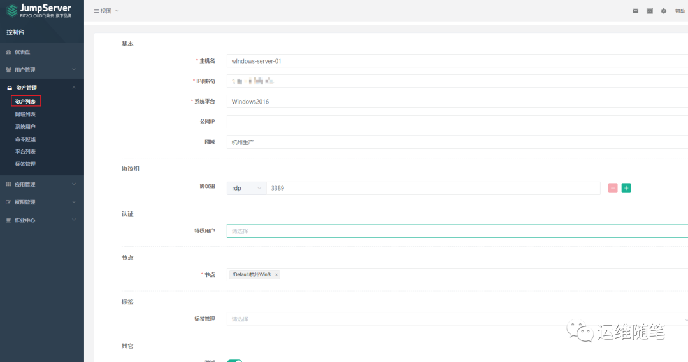
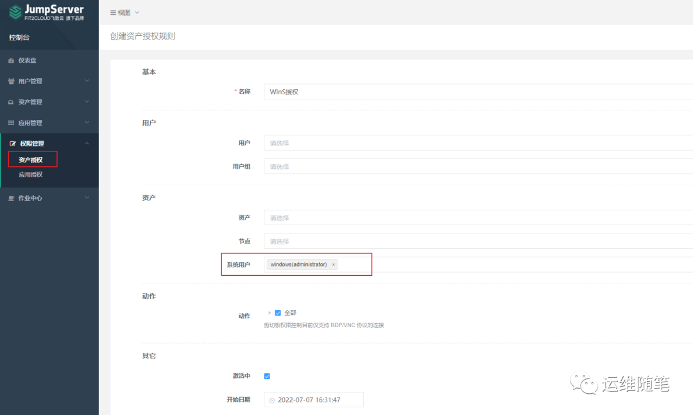
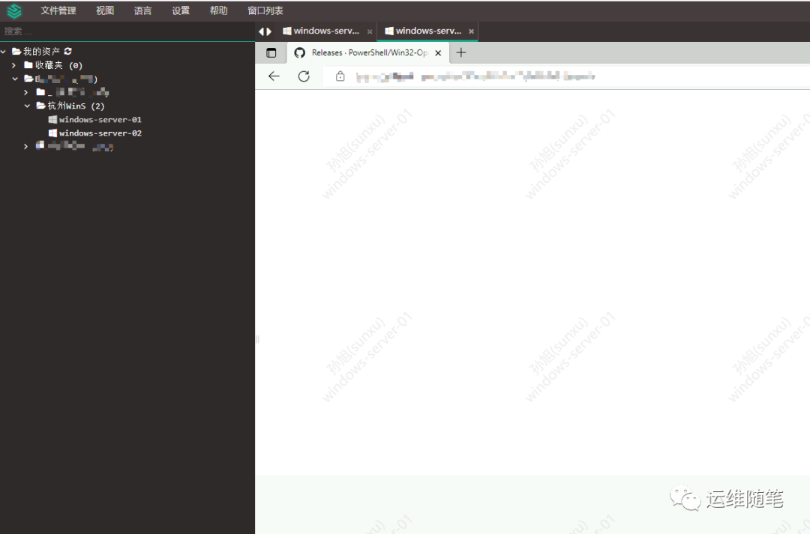

我们在运维架构建设中，资产管理是核心环节。所有环节都需要围绕这个核心来做，包括但不限于资产监控，资产授权，资产规划和部署应用，资源费用核算，资产盘点，资产回收等等。

而jumpserver作为一款安全级别在5A的开源堡垒机，受到了所有互联网大厂的青睐和日常使用。我们这些运维、开发或架构的技术型日常工作都是在类unix环境，通常是linux环境，和服务器打交道，用命令或编写脚本来高效的维护和操作处理。所以默认堡垒机对linux的支持是必须的也是常规的，堡垒机对linux资产管理参考官网文档，这里就不再赘述了。但有时我们的业务需要在windows  server上来操作，但官方文档也没有详细说明。本文重点介绍堡垒机jumpserver要如何去管理windows  server。

<!--more-->

### 添加windows  server系统普通用户

添加windows主机那个特权用户要怎么写呢？是不是有这样的困惑，只需普通用户就可以。

**操作步骤**：系统用户-->普通用户-->创建RDP-->填写用户信息提交。

先添加administrator用户，该用户要和登入windows的远程用户账户一致。

### 添加windows  server资产

**操作步骤**：资产列表-->创建-->填写windows  server资产信息提交。

注意，这里有几点要说明下：

1，我使用的是目前最新版（v2.22.1）特权用户没有*号，就是非必填项，所以可以不写，如果使用版本不一样带*号为必填项，可以随便选个，虽然特权用户在windows上没用。

2，平台选windows，协议组选rdp。其他和添加linux一样。

### 资产授权

**操作步骤**：资产授权-->填写授权信息（和linux一致）-->系统用户选择要选择创建windows  server的普通用户（登录windows server时通过该用户远程进行操作）。

### 终端检验查看

到终端列表中，选择该资产，就会用选择的windows  server系统普通用户登录了。

### 总结

堡垒机jumpserver添加windows  server管理不需要纠结特权用户，只需建立普通系统用户即可，但对该普通用户是有要求的，该普通系统用户必须是可以远程登录windows  server的用户。
