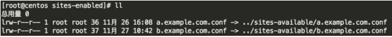
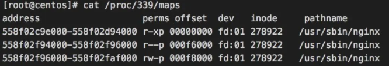
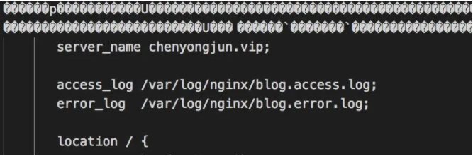

nginx作为现在最好用web服务软件而被广泛使用。我们日常进行配置管理很是方便。但天有不测风云，如果在Nginx配置信息出现问题，在没有备份的情况下，如何利用Nginx进程的虚拟内存恢复配置信息呢，本文就详细真的这个问题进行处理。


<!--more-->

## 问题背景

假设 `/etc/nginx/site-available` 下有 **a.example.com.conf、b.example.com.conf** 两个配置文件，用于对两个域名做代理。

当不小心拷贝了以下数据，粘贴后习惯性的敲了回车键，由于命令中包含了重定向命令 **"->"**，会直接覆盖文件，从而导致数据全部丢失。




下面做个简单测试，创建文件test；

执行命令 `a.example.com.conf -> test`。

由于普通文本中带有 `-> test`，虽然报了命令没找到，但 `-> test` 还是执行了，导致 test 文件数据被清空。


```bash
[root@centos]echo hello > test

[root@centos]# a.example.com.conf -> test
-bash: a.example.com.conf: 未找到命令
```


## 恢复配置

恢复思路是看Nginx进程的内存中有没有存储配置信息，如果有那能不能dump出来。一搜还真有，文章 [Dump Current Nginx Config](https://links.jianshu.com/go?to=https%3A%2F%2Fgist.github.com%2Fwidnyana%2Fe0cb041854b6e0c9e0d823b37994d343) 提供了个小脚本 **dump.sh**，这个脚本需要 [GDB: The GNU Project Debugger](https://links.jianshu.com/go?to=http%3A%2F%2Fwww.gnu.org%2Fsoftware%2Fgdb%2F) 工具的支持。

`yum install gdb` 安装gdb之后，找到Nginx master的进程ID，然后执行下面命令即可。

```bash
# Set pid of nginx master process here
pid=339

# generate gdb commands from the process's memory mappings using awk
cat /proc/$pid/maps | awk '$6 !~ "^/" {split ($1,addrs,"-"); print "dump memory mem_" addrs[1] " 0x" addrs[1] " 0x" addrs[2] ;}END{print "quit"}' > gdb-commands

# use gdb with the -x option to dump these memory regions to mem_* files
gdb -p $pid -x gdb-commands

# look for some (any) nginx.conf text
grep worker_connections mem_*
grep server_name mem_*
```

`/proc/$pid/maps` 文件包含了当前进程内存映射区域和访问权限信息，下面是部分样例数据。




最后 **grep server_name mem_*** 命令输出了包含 **server_name** 的文件。

```bash
[root@centos]# grep server_name mem_*
匹配到二进制文件 mem_558f03f58000
匹配到二进制文件 mem_558f0416f000
```

下载文件之后，用 **Visual Studio Code** (由于是二进制文件，不要用sublime之类的打开，会是乱码)打开，全局检索一下，以我的博客为例，就能看到熟悉的配置信息了。




将配置拷贝出来恢复nginx即可。


## 小结

本文介绍了一种利用Nginx的内存恢复数据的方式，虽然代理层问题不像DB数据问题那样致命，但影响也非常大。因此，除了关注数据安全之外，对于配置类的信息也要做好备份和版本管理。


