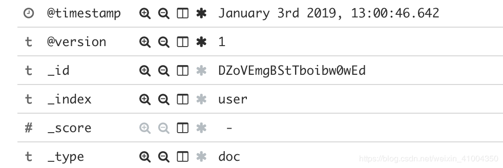
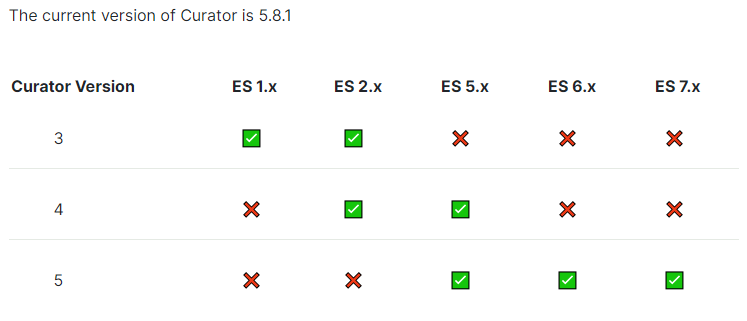

## 背景

elk为常见的日志分析平台，在很多公司都用使用，但是日志数据是一个不断海量增加的东西，如果没有太大的存储来存储这些日志历史数据，就会需要删除时间过长的历史数据，以保证数据量可控。


<!--more-->

## 方法

elk中elasticsearch为搜索引擎，也是数据的储存单元。要想实现只保留固定时间的数据，这里以7天为例，要想每个索引的数据都只保留最近7天的数据，大于7天的则删除，有两种方法：

1.  看你的索引是怎么样的，如果你的索引名称中有时间，比如logstash-2019-01-02 这样，就是每天都会生成一个新的索引，这样的话可以使用官方的Curator 工具

2.  如果你的索引中不带时间，比如，如果是根据应用或者服务名来命名的，那么注意，Curator是无法实现删除索中的某一段数据的！！这里需要特别注意，网上很多说可以实现的，那是因为他们的索引如上面1 所说，是根据时间日期来生成的。但实际上，很多索引都不是这样的，按正常的思维，更容易用服务名或应用名作为索引，以此来区分日志所属应用，方便日志的分析对应指定的应用。这种时候需要使用elasticsearch的api：delete_by_query来进行删除指定数据。这种方法也是通用的，更推荐用这种方法。

## 使用API

删除指定的数据，需要使用到delete_by_query接口，这里需要科普一下，在elk中，每一条日志数据就是一个doc文档，如下：每条数据都会有一个_index,_type,_id 分别就是索引，类型，id。



```
delete_by_query的接口格式如下：
请求方式为：post  
url为： http://elasticsearch-host:9200/{index}/_delete_by_query?conflicts=proceed
需要传参数，通过参数执行选择的数据，传参格式为json。
```

下面以删除所有索引，超过7天的历史数据为例，用python写成的脚本如下，可以直接拿去用

```python

import requests
import json
 
es_host = '127.0.0。1' # Elasticsearch访问地址
 
headers = {
    'Content-Type': 'application/json'
}
# 这里url中，用*匹配所有的索引，也可以写成logstash-* 匹配所有以logstash-开头的索引等等。
url = 'http://{}:9200/*/_delete_by_query?conflicts=proceed'.format(es_host)
 
data = {
    "query": {
        "range": {
            "@timestamp": {    # 这里我根据默认的时间来作为查询的时间字段，也可以是自定义的
                "lt": "now-7d",    # 这里是7天，时间可自定义
                "format": "epoch_millis"
            }
        }
    }
}
 
response = requests.post(url, headers=headers, data=json.dumps(data))
print(response.json())
 
# 删除后，需要执行forcemerge操作，手动释放磁盘空间
url2 ='http://{}:9200/_forcemerge?only_expunge_deletes=true&max_num_segments=1'.format(es_host)
response = requests.post(url2)
 
print(response.json())
```

以上，就是一个完整的删除索引的历史数据的一个脚本，然后只需要将此脚本添加到crontab中，每天定时执行以此就可以实现只保留固定时间的数据了。

## Es Curator

### 简介

curator 是一个官方的，可以管理elasticsearch索引的工具，可以实现创建，删除，段合并等等操作。


### 文档

[官方文档](https://www.elastic.co/guide/en/elasticsearch/client/curator/current/index.html)


### 版本



### 安装

安装非常简单，直接通过pip安装即可。 其他安装方案，详见官方文档：[安装](https://www.elastic.co/guide/en/elasticsearch/client/curator/current/installation.html)

```bash
pip install elasticsearch-curator
```

### 使用

 安装后，便可以在命令行中直接使用，使用--help查看一下使用方法

```bash
curator --help
Usage: curator [OPTIONS] ACTION_FILE
 
  Curator for Elasticsearch indices.
 
  See http://elastic.co/guide/en/elasticsearch/client/curator/current
 
Options:
  --config PATH  Path to configuration file. Default: ~/.curator/curator.yml
  --dry-run      Do not perform any changes.
  --version      Show the version and exit.
  --help         Show this message and exit.
```

看到使用需要定义两个文件，一个配置文件 curator,.yml 和 操作文件 action.yml

配置文件 curator.yml 示例如下： 详细的配置文件配置方法，详见官方文档： [配置文件curator.yml](https://www.elastic.co/guide/en/elasticsearch/client/curator/current/configfile.html)

```bash
client:
  hosts:
    - 127.0.0.1
  port: 9200
  url_prefix:
  use_ssl: False
  certificate:
  client_cert:
  client_key:
  ssl_no_validate: False
  # 下面用户名密码修改为自己es的用户密码
  http_auth: elastic:123456
  timeout:
  master_only: True
 
logging:
  loglevel: INFO
  logfile:
  logformat: default
  blacklist: ['elasticsearch', 'urllib3']
```

然后就是action.yml 文件，定义需要执行的操作，我们这里需要删除索引中时间过长的历史数据，详细的操作文件action.yml配置的字段和用法，详见官方文档： 

[action操作类型定义](https://www.elastic.co/guide/en/elasticsearch/client/curator/current/actions.html)

[filters过滤器定义](https://www.elastic.co/guide/en/elasticsearch/client/curator/current/filters.html)

```bash
actions:
  1:
    action: delete_indices    # 这里执行操作类型为删除索引
    description: "delete index expire date"
    options:
      ignore_empty_list: True
      timeout_override:
      continue_if_exception: False
      disable_action: False
    filters:
    - filtertype: pattern
      kind: prefix    # 这里是指匹配前缀为 “yaobili-” 的索引，还可以支持正则匹配等，详见官方文档
      value: logstash-
    # 这里匹配时间
    - filtertype: age
      source: name    # 这里不单可以根据name来匹配，还可以根据字段等，详见官方文档
      direction: older
    # 这里定义的是days，还有weeks，months等，总时间为unit * unit_count
      unit: days
      unit_count: 7
      timestring: '%Y.%m.%d'    # 这里是跟在logstash-后面的时间的格式
```

ok，定义了两个文件后，则可以直接使用命令行进行执行：指定两个文件的路径即可。

```bash
curator --config curator.yml action.yml 
输出日志：
2020-06-17 13:53:39,840 INFO      Preparing Action ID: 1, "delete_indices"
2020-06-17 13:53:39,840 INFO      Creating client object and testing connection
2020-06-17 13:53:39,842 INFO      Instantiating client object
2020-06-17 13:53:39,843 INFO      Testing client connectivity
2020-06-17 13:53:39,847 INFO      Successfully created Elasticsearch client object with provided settings
2020-06-17 13:53:39,849 INFO      Connecting only to local master node...
2020-06-17 13:53:39,858 INFO      Trying Action ID: 1, "delete_indices": delete index expire date
2020-06-17 13:53:39,991 INFO      Skipping action "delete_indices" due to empty list: <class 'curator.exceptions.NoIndices'>
2020-06-17 13:53:39,992 INFO      Action ID: 1, "delete_indices" completed.
2020-06-17 13:53:39,992 INFO      Job completed.

```

最后，将此命令添加到crontab中即可。