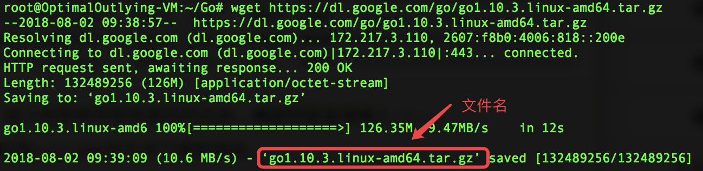

## 目的

通过本文构建Go语言环境，便于以后开发go项目需求。

<!--more-->

## 搭建

### 下载

打开[官网下载地址](https://studygolang.com/dl)选择对应的系统版本, 这里我选择的是最新稳定版：[go1.12.linux-amd64.tar.gz](https://dl.google.com/go/go1.12.linux-amd64.tar.gz)


进入你用来存放安装包的目录,  然后执行命令拉取包

```shell
    wget https://dl.google.com/go/go1.12.linux-amd64.tar.gz
```




### 配置

执行`tar`解压到`/usr/loacl`目录下，得到`go`文件夹

```shell
tar -C /usr/local -zxvf  go1.12.linux-amd64.tar.gz
```

添加`/usr/loacl/go/bin`目录到PATH变量中。添加到`/etc/profile` 或`$HOME/.profile`都可以

```shell
// 习惯用vim，没有的话可以用命令`sudo apt-get install vim`安装一个
vim /etc/profile
// 在最后一行添加
export GOROOT=/usr/local/go #设置为go安装的路径
export GOPATH=$HOME/gocode #默认安装包的路径
export PATH=$PATH:$GOROOT/bin:$GOPATH/bin
// wq保存退出后source一下
source /etc/profile
```

### 验证

```shell
go version
```

如果现实版本号，则Go环境安装成功。是不是很简单呢？


```shell
#获取go环境参数
go env

===============================
GOARCH="amd64"
GOBIN=""
GOEXE=""
GOHOSTARCH="amd64"
GOHOSTOS="linux"
GOOS="linux"
GOPATH="/root/gocode"
GORACE=""
GOROOT="/usr/local/go"
GOTOOLDIR="/usr/local/go/pkg/tool/linux_amd64"
GCCGO="gccgo"
CC="gcc"
GOGCCFLAGS="-fPIC -m64 -pthread -fmessage-length=0 -fdebug-prefix-map=/tmp/go-build057487015=/tmp/go-build -gno-record-gcc-switches"
CXX="g++"
CGO_ENABLED="1"
CGO_CFLAGS="-g -O2"
CGO_CPPFLAGS=""
CGO_CXXFLAGS="-g -O2"
CGO_FFLAGS="-g -O2"
CGO_LDFLAGS="-g -O2"
PKG_CONFIG="pkg-config"
```

可以开始你的go开发之旅，不要犹豫，Good  Luck !