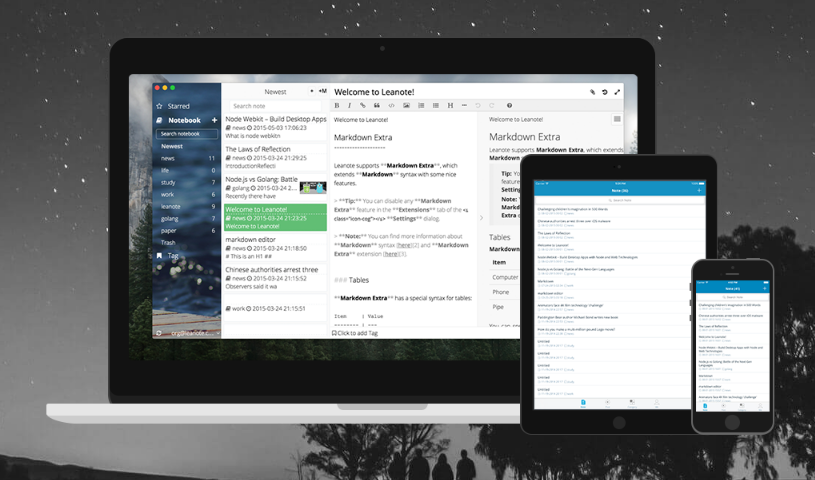
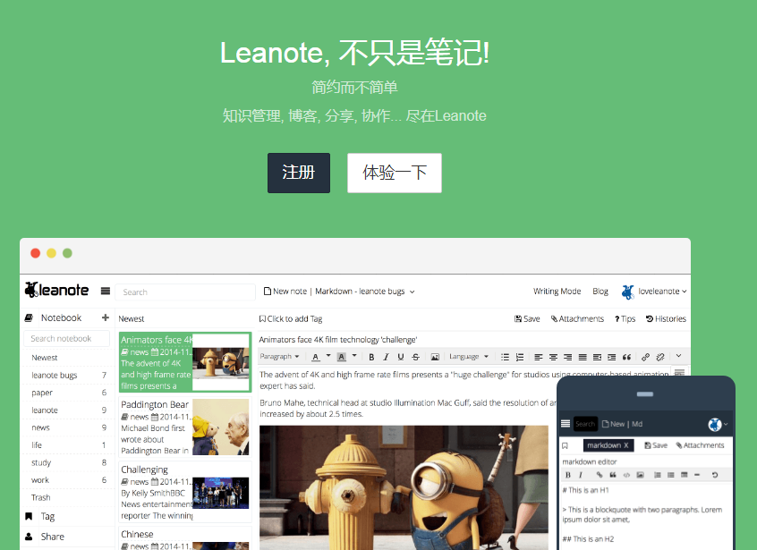
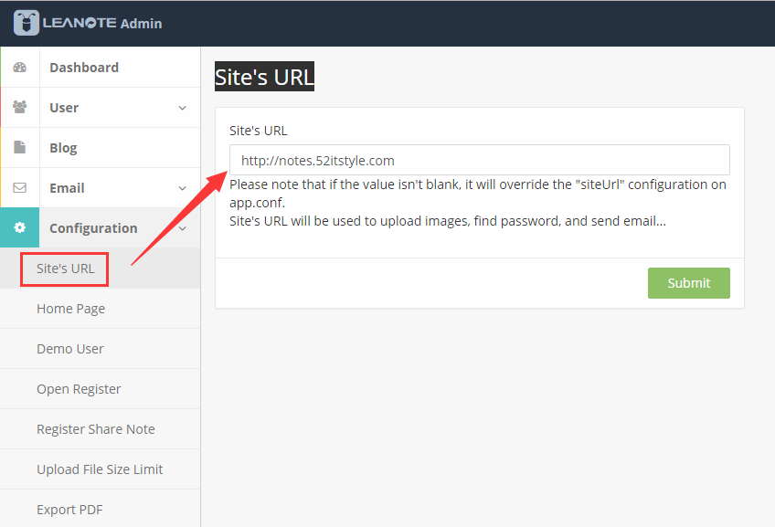
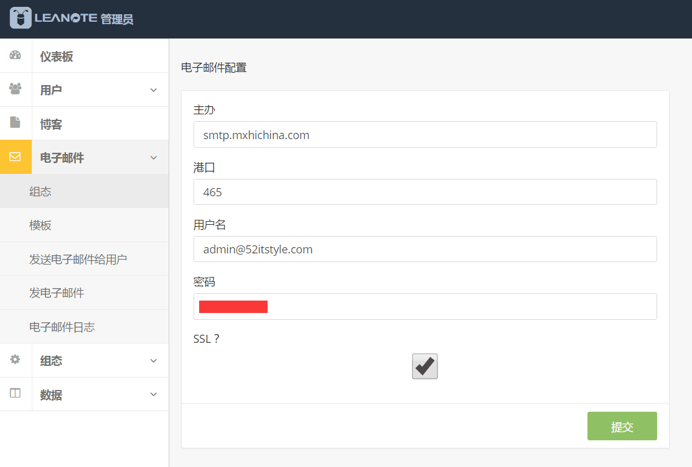
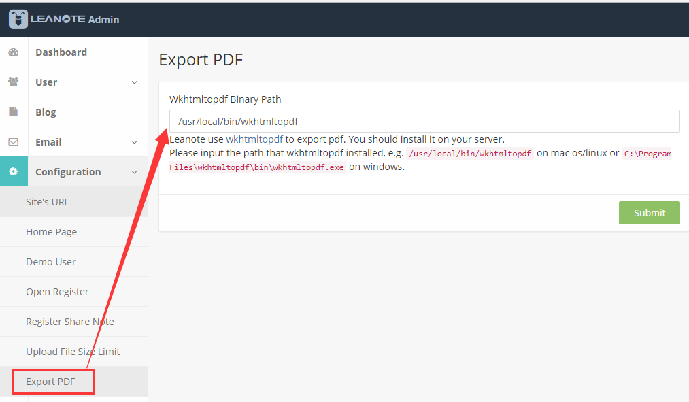
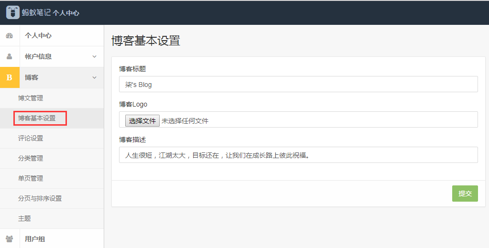
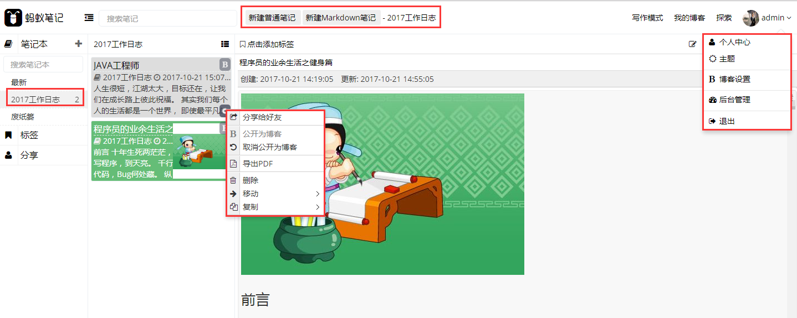

## **前言**

在这个互联网知识呈爆炸增长的时代，作为一个程序员要掌握的知识越来越多，然再好的记性也不如烂笔头，有了笔记我们就是可以时常扒拉扒拉以前的知识，顺便可以整理下自己的知识体系。

如今市面上云笔记产品，说实在真不少，什么有道，印象，为知等等，本人目前使用的是有道，无它，免费而已其他几个倒没怎么接触过，毕竟重复的产品一个就够了。笔记用了有三年多时间了，基本都是写写工作日志，备忘一下工作中遇到的脚本命令，顺便记录下工作中遇到的问题，由于只是记录文字，目前10G的空间仅仅使用了冰山一角。

## 介绍

今天，给大家一起分享的是蚂蚁笔记，一个有极客范的云笔记！官方的介绍也相当牛逼：前所未有的文档体验，近乎完美的平台覆盖，支持团队协同，企业级私有云，蚂蚁笔记 = 笔记 + 博客 + 协作 + 私有云。



其实最主要的是蚂蚁笔记开源了，既然如此，云服务器又那么便宜，我们何不自己搭建一个云笔记服务，无论是自己还是分享给同事都是极好的，最主要的是还可以绑定域名生成博客，笔记AND博客一举两得岂不乐哉。

当然，如果有些小伙伴对信息安全要求较高的，不希望自己的信息记录在别人的服务器上，对开源源码有一定研究，使用起来还是不错的。但是如果单纯是为了省钱就没必要了，即使收费的有道一天也就几毛钱而已，而云服务器费用，自身是否有技术支持也是以后使用的硬伤，下面开始如何安装使用教程。

<!--more-->


## 安装

提前预警，本次安装涉及到阿里云ECS、Centos7、Mongodb，Leanote、Golang、OpenResty、wkhtmltopdf、企业邮箱相关软件的安装配置。

### mongodb

蚂蚁笔记数据库采用的是mongodb，需提前安装。

Yum源一键安装

```shell
yum -y install mongodb-server  mongodb
```

启动

```shell
mongo
```

由于ECS安全组并没有开放mongodb相关端口，仅内网使用，这里就没有配置相关鉴权访问。

### leanote

安装 Leanote 有两种方式：二进制版是编译好的 Leanote， 不用安装开发环境，Leanote 源码安装, 需要安装编译环境 Golang，为了方便期间，这里我们选择二进制版安装。

各版本下载地址：[http://leanote.org/#download](http://leanote.org/#download)

选择Linux下64位最新版本下载

```shell
wget https://superb-sea2.dl.sourceforge.net/project/leanote-bin/2.5/leanote-linux-amd64-v2.5.bin.tar.gz
```

解压

```shell
tar -xvf leanote-linux-amd64-v2.5.bin.tar.gz
```

导入数据库

```shell
cd leanote
mongorestore -h localhost -d leanote --dir mongodb_backup/leanote_install_data/
```

### OpenResty

升级版Nginx，推荐大家使用，此处的目的是绑定域名，转发leanote服务。

Yum安装相关依赖组件

```shell
yum install readline-devel pcre-devel openssl-devel -y
```

下载最新版本：

```shell
wget https://openresty.org/download/openresty-1.11.2.4.tar.gz
```

解压并重命名：

```shell
tar -xvf openresty-1.11.2.4.tar.gz
mv openresty-1.11.2.4 openresty
```

安装配置：

```shell
./configure
```

您可以使用下面的命令来编译安装：

```shell
make && make install
```

如果您的电脑支持多核 make 工作的特性, 您可以这样编译安装:

```shell
make && make install   -j2
```

为了方便启动，建立软连接：

```shell
ln -s /usr/local/openresty/nginx/sbin/nginx /usr/sbin/nginx
```

配置文件

```shell
vi /usr/local/openresty/nginx/conf/nginx.conf
server {
        listen       80;
        server_name  notes.52itstyle.com;
        charset utf-8;
        location / {
            default_type text/html;
            proxy_pass http://127.0.0.1:9000;
        }
}
```

### wkhtmltopdf

wkhtmltopdf主要用于导出PDF版笔记。

各版本下载地址：https://wkhtmltopdf.org/downloads.html

下载

```shell
wget https://github.com/wkhtmltopdf/wkhtmltopdf/releases/download/0.12.4/wkhtmltox-0.12.4_linux-generic-amd64.tar.xz
```

解压

```shell
tar -xvf wkhtmltox-0.12.4_linux-generic-amd64.tar.xz
```

移动文件

```shell
cd wkhtmltopdf/bin
chmod +x wkhtmltopdf
mv wkhtmltopdf /usr/local/bin
```

测试是否安装成功

```shell
cd /usr/local/bin
wkhtmltopdf http://notes.52itstyle.com /home/52itstyle.pdf
```

导出的PDF中文会乱码，我们需要找到windows里C:\Windows\Fonts文件夹中的宋体或者微软雅黑字体，上传到服务器/usr/share/fonts/目录下即可。

## 启动服务

### 启动 Leanote

```shell
cd leanote/bin
chmod +x run.sh
./run.sh &
```

如果最后出现 Listening on :9000 ... 说明启动成功

### 启动 Nginx

```shell
nginx
```

访问服务：[http://notes.52itstyle.com/](http://notes.52itstyle.com/) ，出现以下界面，说明配置成功。



## 使用配置

Leanote默认账号为amdin，密码是abc123。登陆成功后首先进入后台管理，配置Site's URL为自己的域名



同时修改leanote/conf/app.conf相关参数site.url 为http://notes.52itstyle.com， 不然每次重启要重新界面设置。

配置电子邮件发送，用于登录、注册、留言、找回密码、邀请注册等操作



配置wkhtmltopdf执行命令路径



进入个人中心，配置密码以及博客设置



笔记相关界面操作



## APP访问

Leanote的客户端做的也是相当贴心和完善了, 在登录界面最底部点击使用自定义服务器。


