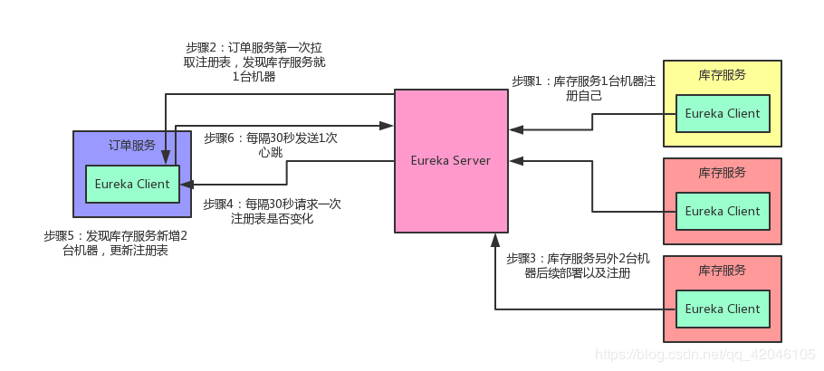
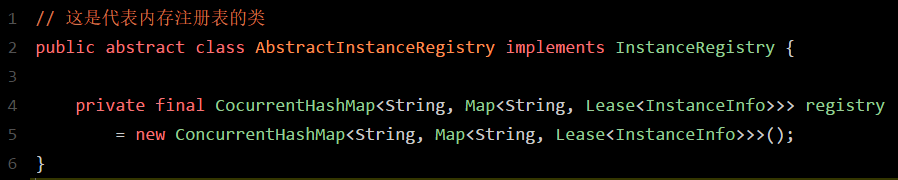
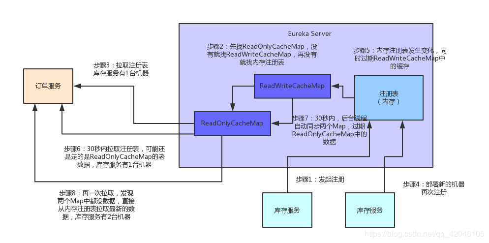

## 问题起源

Spring Cloud微服务架构体系中，Eureka是一个至关重要的组件，它扮演着微服务注册中心的角色，所有的服务注册与服务发现，都是依赖Eureka的。

之前不少初学Spring Cloud的朋友在落地公司的生产环境部署时，经常会有一个疑问：Eureka Server到底要部署几台机器？

我们的系统那么多服务，到底会对Eureka Server产生多大的访问压力？Eureka Server能不能抗住一个大型系统的访问压力？

你现在心里一定很多疑问，别着急，咱们这就去探索一下，Eureka作为微服务注册中心的核心原理。下面这些问题，大伙儿先看看，有个大概的印象。

 

带着这些问题，来看后面的内容，效果更佳。

● Eureka注册中心使用什么样的方式来储存各个服务注册时发送过来的机器地址和端口号？

● 各个服务找Eureka Server拉取注册表的时候，是什么样的频率？

● 各个服务是如何拉取注册表的？

● 对于一个有几百个服务，部署上千台机器的大型分布式系统来说，这套系统会对Eureka Server造成多大的访问压力？

● Eureka Server从技术层面是如何抗住日千万级访问量的？

 <!--more-->

先给大家说一个基本知识点，各个服务内的Eureka Client组件，默认情况下，每隔30秒会发送一个请求到Eureka Server，来拉取最近有变化的服务信息

 

举个例子：

● 库存服务原本部署在1台机器上，现在扩容了，部署到了3台机器，并且均注册到了Eureka Server上。

● 然后订单服务的Eureka Client会每隔30秒去找Eureka Server拉取最近注册表的变化，看看其他服务的地址有没有变化。

 

除此之外，对Eureka Server一个比较常见的请求就是心跳，各个Eureka Client都会每隔30秒发送一次心跳请求到Eureka Server，通知人家说，哥们，我这个服务实例还活着！

如果某个Eureka Client很长时间没有发送心跳给Eureka Server，那么就说明这个服务实例已经挂了。

光看上面的文字，各位童鞋可能没什么印象。老规矩！咱们还是来一张图，一起来直观的感受一下这个过程。

 

过程如图所示：

## Eureka Server设计精妙的注册表存储结构

现在咱们假设你手头有一套大型的分布式系统，这套系统一共有100个服务，每个服务部署在20台机器上，机器是4核8G的标准配置。

这相当于什么呢？也就是说相当于你一共部署了100 * 20 = 2000个服务实例，有2000台机器。

而每台机器上的服务实例内部都有一个Eureka Client组件，这个Eureka Client组件每隔30秒会请求一次Eureka Server来拉取变化的注册表。

此外，每个服务实例上的Eureka Client都会每隔30秒发送一次心跳请求给Eureka Server。

 

那么大家算算，Eureka Server作为一个微服务注册中心，每秒钟要被请求多少次？一天要被请求多少次？

● 很简单，我们就按最标准的算法来算，即每个服务实例每分钟请求2次拉取注册表，每分钟请求2次发送心跳

● 这样的话，一个服务实例每分钟会请求4次，2000个服务实例每分钟请求8000次

● 换算到每秒钟，则是8000 / 60 = 133次左右，我们直接可以大概估算为Eureka Server每秒钟会被请求150次

● 所以，一天的话，应该就是8000 * 60 * 24 = 1152万，也就是每天千万级访问量

 好！经过这么一个测算，大家是否发现这里的奥秘了？

 

● 首先第一点，对于微服务注册中心这种组件，在一开始设计他这个注册表的拉取频率以及心跳发送频率的时候，就已经考虑到了一个大型系统的各个服务请求时的压力，每秒会承载多大的请求量。

● 所以说各个服务实例每隔30秒发起一次请求拉取变化的注册表，以及每隔30秒发送一次心跳给Eureka Server，其实这个时间安排是有他的用意的。

 

按照我们的测算，一个上百个服务，部署几千台机器的大规模系统，按照这样的一个频率请求Eureka Server，日请求量在千万级，每秒的访问量应该是固定在150次左右，即使算上其他的一些额外操作，算到每秒钟请求Eureka Server在200次~300次吧。

所以通过设置一个适中的拉取注册表以及发送心跳的频率，保证大规模系统里对Eureka Server的请求压力不会太大。

 

关键问题来了，Eureka Server是如何保证轻松抗住这每秒数百次请求，每天千万级请求的呢？

 

要搞清楚这个，首先得清楚人家Eureka Server到底是用什么来存储注册表的？三个字，看源码！

 

接下来咱们就一起进入Eureka的源码里一探究竟：

 

● 如上图所示，图中名为registry的CocurrentHashMap，就是注册表的核心结构。看完之后忍不住先赞叹一下，真是精妙的设计！

● 从代码中可以看到，Eureka Server的注册表直接基于纯内存，就是在内存里维护了一个数据结构。

● 各个服务发起注册、服务下线、服务故障，全部会在内存里维护和更新这个注册表。

● 各个服务每隔30秒拉取注册表的时候，其实Eureka Server就是直接提供内存里存储的有变化的注册表数据给他们就可以了。

● 同样，每隔30秒发起心跳的时候，也是在这个纯内存的CocurrentHashMap数据结构里更新心跳时间。

 

一句话概括：维护注册表、拉取注册表、更新心跳时间，全部发生在内存里！这就是Eureka Server非常核心的一个点。

 

搞清楚了这一点，咱们再来分析一下这个叫做registry的东西的数据结构，大家千万别被它复杂的外表唬住了，沉下心来，一层层的分析！

● 首先，这个ConcurrentHashMap的key就是服务名称，比如说“inventory-service”，就是一个服务名称。

● 而value：Map<String, Lease<InstanceInfo>则代表了一个服务的多个服务实例。

● 举个例子：比如说“inventory-service”是可以有3个服务实例的，每个服务实例部署在一台机器上

 

接下来咱们再来看里面这个小Map：

Map<String, Lease<InstanceInfo>

 

● 这个Map的key就是服务实例的id

● value是一个叫做 Lease<InstanceInfo>的东西。这又是什么鬼呢？

■ 首先说下InstanceInfo，其实啊，我们见名知义，这个InstanceInfo就代表了服务实例的具体信息，比如机器的ip地址、hostname以及端口号

■ 而Lease<InstanceInfo>的这个Lease，里面则会维护每个服务最近一次发送心跳的时间

 

## Eureka Server端优秀的多级缓存机制

假设Eureka Server部署在4核8G的普通机器上，那么基于内存来承载各个服务的请求，每秒钟最多可以处理多少请求呢？

 

● 根据之前做过的测试，单台4核8G的机器，处理一些纯内存的操作，哪怕加上一些网络请求的开销，每秒处理几百请求是很轻松的。哪怕是更大规模的机器和请求量，处理起来，也是轻松加愉快。

● 而且Eureka Server为了避免同时读写内存数据结构造成的并发冲突问题，还采用了多级缓存机制来进一步提升服务请求的响应速度。

● 在拉取注册表的时候：

◑ 首先从ReadOnlyCacheMap里查缓存的注册表。

◑ 如果没有，就找ReadWriteCacheMap里缓存的注册表。

◑ 如果还没有，就从内存中获取实际的注册表数据。

● 在注册表发生变更的时候：

◑ 会在内存中更新变更的注册表数据，同时过期掉ReadWriteCacheMap。

◑ 这个过程不会影响ReadOnlyCacheMap提供人家查询注册表。

◑ 在一段时间内，默认是30秒，各个服务拉取注册表数据都会直接读ReadOnlyCacheMap。

◑ 在30秒过后，Eureka Server的后台线程发现ReadWriteCacheMap已经清空了，那么也会清空ReadOnlyCacheMap中的缓存

◑ 下次有服务拉取注册表，又会从内存中获取最新的数据了，同时填充各个缓存。

 

多级缓存机制的优点是什么？

1.这种多级缓存机制的设计，尽可能保证了内存注册表数据不会出现频繁的读写冲突问题。

2.并且进一步保证对Eureka Server的大量请求，都是快速从纯内存走，性能极高。

 

为方便大家更好的理解，同样来一张图，大家跟着图再来回顾一下这整个过程：

 

## 总结

● 通过上面的分析可以看到，Eureka通过设置适当的请求频率（拉取注册表30秒间隔，发送心跳30秒间隔），可以保证一个大规模的系统每秒请求Eureka Server的次数在几百次。

● 同时还通过纯内存的注册表，保证了所有的请求都可以在内存处理，这样确保了极高的性能，普通机器一秒钟处理几百请求都是轻松+愉快的。

● 另外还有多级缓存机制，确保说不会针对内存数据结构发生频繁的读写并发冲突操作，进一步提升性能。

上述就是Spring Cloud架构中，Eureka作为微服务注册中心可以承载大规模系统每天千万级访问量的原理

