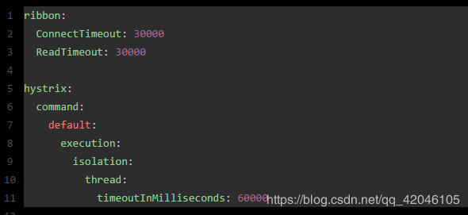

## 背景

相信不少朋友都在自己公司使用Spring Cloud框架来构建微服务架构，毕竟现在这是非常火的一门技术。

如果只是用户量很少的传统IT系统，使用Spring Cloud可能还暴露不出什么问题。

如果是较多用户量，高峰每秒高达上万并发请求的互联网公司的系统，使用Spring Cloud技术就有一些问题需要注意了。

<!--more-->

## 真实案例

#### 场景引入，问题初现

先不空聊原理、理论，来讲一个真实的例子，这是我的一个朋友在创业互联网公司发生过的真实案例。

朋友A的公司做互联网类的创业，组建了一个小型研发团队，上来就用了Spring Cloud技术栈来构建微服务架构的系统。一段时间没日没夜的加班，好不容易核心业务系统给做出来了，平时正常QA测试没发现什么大毛病，感觉性能还不错，一切都很完美。
然后系统就这么上线了，一开始用户规模很小，注册用户量小几十万，日活几千用户。

每天都有新的数据进入数据库的表中，就这么日积月累的，没想到数据规模居然慢慢吞吞增长到了单表几百万。

这个时候呢，看起来也没太大的毛病，就是有用户反映，系统有些操作，会感觉卡顿几秒钟，会刷不出来页面。

**这是为啥呢？**

- 核心原因是单表数据量大了一些，达到了几百万。
- 有个别服务，跑的SQL比较复杂，一大堆的多表关联
- 并且还没有设计好索引，或者是设计了索引，但无奈一些小弟写了上百行的大SQL，SQL实在太复杂了，那么一个SQL跑出来好几秒肯定是正常的。

如果大家对微服务框架有点了解的话，应该知道，比如Feign + Ribbon组成的服务调用框架，是有接口调用超时这一说的，有一些参数可以设置接口调用的超时时间。

如果你调用一个接口，好几秒刷不出来，人家就超时异常返回，用户就刷不出来页面了。

 

#### 扬汤止沸，饮鸩止渴

一般碰到这种事情，一大坨屎一样的SQL摆在那儿，写SQL的人过一个月自己都看不懂了，80%的工程师看着都不愿意去花时间重写和优化。

一是修改的人力成本太高，二是谁敢负担这责任呢？系统跑的好好的，就是慢了点而已，结果你硬是乱改一通，重构，把系统核心业务流程搞挂了怎么办？

所以说，那些兄弟第一反应是：增加超时时间啊！接口慢点可以，但是别超时不响应啊！

让接口执行个几秒把结果返回，用户不就可以刷出来页面了！不用重构系统了啊！轻松+愉快！

如何增加呢？很简单，看下面的参数就知道了：

  

大家如果看过之前的文章，应该知道，Spring Cloud里一般会用hystrix的线程池来执行接口调用的请求。。

所以设置超时一般设置两个地方，feign和ribbon那块的超时，还有hystrix那块的超时。其中后者那块的超时一般必须大于前者。

Spring Cloud玩儿的好的兄弟，可千万别看着这些配置发笑，因为我确实见过不少Spring Cloud玩儿的没那么溜的哥们，真的就这么干了。

好了，日子在继续。。。

优化了参数后，看上去效果不错，用户虽然觉得有的页面慢是慢点，但是起码过几秒能刷出来。

这个时候，日活几千的用户量，压根儿没什么并发可言，高峰期每秒最多一二十并发请求罢了。

大家看看下面这张图，感受一下现场氛围：

#### 问题爆发，洪水猛兽

随着时间的推移，公司业务高速发展……

那位兄弟的公司，在系统打磨成熟，几万用户试点都ok之后，老板立马拿到一轮几千万的融资。

公司上上下下意气风发啊！紧接着就是组建运营团队，地推团队，全国大范围的推广。

总之就是三个字：推！推！推！

这一推不打紧！研发人员在后台系统发现，自己的用户量蹭蹭蹭的增长，注册用户增长了几十倍，突破了千万级别，日活用户也翻了几十倍，在活动之类的高峰期，居然达到了上百万的日活用户量。。。

幸福的烦恼。。。

为什么这么说？因为用户量上来后，悲剧的事情就发生了。

**高峰期每秒的并发请求居然达到了近万的程度**，研发团队的兄弟们哪里敢怠慢！在这个过程中，先是紧张的各种扩容服务，一台变两台，两台变八台。

然后数据库主从架构挂上去，读写分离是必须的，否则单个数据库服务器哪能承载那么大的请求！多搞几个从库，扛一下大量的读请求，这样基本就扛住了。

正准备松口气，更加悲剧的事情就发生了。

在这个过程中，那些兄弟经常会发现高峰期，系统的某个功能页面，突然就整个hang死了，就是没法再响应任何请求！所有用户刷新这个页面全部都是无法响应！

这是为什么呢？

**原因很简单啊**！一个服务A的实例里，专门调用服务B的那个线程池里的线程，总共可能就几十个。每个线程调用服务B都会卡住5秒钟。

那如果每秒钟过来几百个请求这个服务实例呢？一下子那个线程池里的线程就全部hang死了，没法再响应任何请求了。

大家来看看下面这张图，再直观的感受一下这个无助的过程！

 

这个时候咋办？兄弟们只能祭出程序员最古老的法宝，重启机器！

遇到页面刷不出来，只能重启机器，相当于短暂的初始化了一下机器内的资源。

然后接着运行一段时间，又卡死，再次重启！真是令人崩溃啊！用户们的体验是极差的，老板的心情是愤怒的！

画外音：

其实这个问题本身不大，但如果对Spring Cloud没有高并发场景的真实经验，确实可能会跟这帮兄弟一样，搞出些莫名其妙的问题。

比如这个公司，明明应该去优化服务接口性能，结果硬是调大了超时时间。结果导致并发量高了，对那个服务的调用直接hang死，系统的核心页面刷不出来，影响用户体验了，这怪谁呢？

 

#### 追本溯源，治标治本

没法子了，那帮兄弟们只能找人求助。下面就是他们完成系统优化的过程。

**第一步**

关键点，优化图中核心服务B的性能。互联网公司，核心业务逻辑，面向C端用户高并发的请求，不要用上百行的大SQL，多表关联，那样单表几百万行数据量的话，会导致一下执行好几秒。

其实最佳的方式，就是对数据库就执行简单的单表查询和更新，然后复杂的业务逻辑全部放在java系统中来执行，比如一些关联，或者是计算之类的工作。

这一步干完了之后，那个核心服务B的响应速度就已经优化成几十毫秒了，是不是很开心？从几秒变成了几十毫秒！

**第二步**

那个超时的时间，也就是上面那段ribbon和hystrix的超时时间设置。

奉劝各位同学，不要因为系统接口的性能过差而懒惰，搞成几秒甚至几十秒的超时，一般超时定义在1秒以内，是比较通用以及合理的。

为什么这么说？

因为一个接口，理论的最佳响应速度应该在200ms以内，或者慢点的接口就几百毫秒。

如果一个接口响应时间达到1秒+，建议考虑用缓存、索引、NoSQL等各种你能想到的技术手段，优化一下性能。

否则你要是胡乱设置超时时间是几秒，甚至几十秒，万一下游服务偶然出了点问题响应时间长了点呢？那你这个线程池里的线程立马全部卡死！

具体hystrix的线程池以及超时时间的最佳生产实践，请见下一篇文章：《微服务架构如何保障双11狂欢下的99.99%高可用》

这两步解决之后，其实系统表现就正常了，核心服务B响应速度很快速，而且超时时间也在1秒以内，不会出现hystrix线程池频繁卡死的情况了。

**第三步**

事儿还没完，你要真觉得两步就搞定了，那还是经验不足。

如果你要是超时时间设置成了1秒，如果就是因为偶然发生的网络抖动，导致接口某次调用就是在1.5秒呢？这个是经常发生的，因为网络的问题，接口调用偶然超时。

所以此时配合着超时时间，一般都会设置一个合理的重试，如下所示：

 

设置这段重试之后，Spring Cloud中的Feign + Ribbon的组合，在进行服务调用的时候，如果发现某台机器超时请求失败，会自动重试这台机器，如果还是不行会换另外一台机器重试。

这样由于偶尔的网络请求造成的超时，不也可以通过自动重试避免了？

**第四步**

其实事儿还没完，如果把重试参数配置了，结果你居然就放手了，那还是没对人家负责任啊！

你的系统架构中，只要涉及到了重试，那么必须上接口的幂等性保障机制。

否则的话，试想一下，你要是对一个接口重试了好几次，结果人家重复插入了多条数据，该怎么办呢？

其实幂等性保证本身并不复杂，根据业务来，常见的方案：

可以在数据库里建一个唯一索引，插入数据的时候如果唯一索引冲突了就不会插入重复数据
或者是通过redis里放一个唯一id值，然后每次要插入数据，都通过redis判断一下，那个值如果已经存在了，那么就不要插入重复数据了。
类似这样的方案还有一些。总之，要保证一个接口被多次调用的时候，不能插入重复的数据。

 

## 总结全文

有图有真相！老规矩，最后给大家上一张图，最终优化后的系统表现大概是长下面这样子的。

 
