## 背景

某天我像往常一样逛知乎，突然就看到了一篇文章，文章内容是“马克扎克伯格自己打造的智能家庭 AI — Javals”，我相信看过这篇文章或者知道这个报道的人肯定不少。我当时也没觉得我自己也能打造一个 AI 系统，因为小扎的一套完全从改装硬件电路到中央服务器都是自己实现，我没那么大本事，但我当时正好沉迷于效率软件　IFTTT、Workflow、Alfred，其中我发现 IFTTT 里面有很多 Applets 和硬件有关，这勾起了我的好奇心，我虽做不到小扎那样的工程，但能不能利用市面上现有的产品，打造一个类似的智能家居系统？

首先我觉得，一个真正智能的家庭系统一定是时刻待命的，而不是当我需要的时候还得掏手机，然后按下一个按键或者把手机拿到嘴边进行语音控制。所以我一开始就明确了让 Amazon echo 作为前端，它是一个时刻待命的只需要你叫一声 Alexa 就能唤醒的设备，而且可以覆盖一个50平米的家庭，真正做到了时刻在你身边。

然后就是解决问题的常规套路：Google 搜索关键字 Hack,Amazon echo，经过一番信息筛选，我发现了一个普遍被大家提及的名词 — HomeAssistant。

HomeAssistant 是国外一个成熟的，开源的智能家居平台，这个平台的目的是把所有能通过 Wifi 控制的电器全部接入进来统一管理，这样你可以在手机、电脑上随时随地了解家里的情况并做出控制。

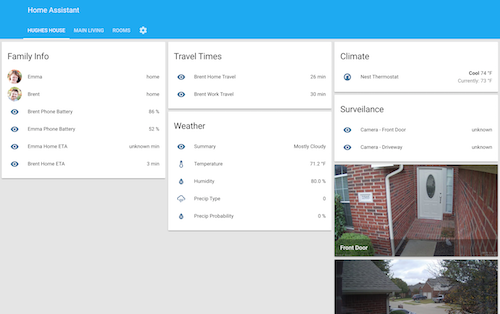

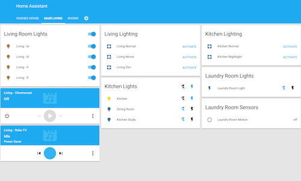

而好消息是， echo 也已经被黑客黑客攻克并且集成到了这里面，原理其实是把 HomeAssistant 上已经接入的设备伪装成 echo 能够识别的 Hue Bridge, 从而达到让 echo 控制普通电器的目的。

<!--more-->

## HomeAssistant

介绍了那么多，我们让 HomeAssistant 先 run 起来吧。

我们完全可以在自己的电脑上运行　HomeAssistant 这个服务，但是考虑到这个这个服务需要像路由器一样24小时运行，对于这样的需求最理想的方案是把服务分出去到一个单独的硬件上运行，就像路由器一样，因此，体积小巧却五脏俱全的树莓派理所当然成了首选。

说到树莓派，它其实就是一台完整的计算机。连上显示器它就是一台电脑，通过 ssh 就是一台服务器，通过 smb 就是一台 NAS。下面我简单介绍一下当你买到一台树莓派之后你通常应该做什么。

### **安装系统**

推荐购买集成 WIFI 模块的树莓派 3B+。然后你需要一张被格式化成 `FAT` 格式且大于等于8G的 SD 卡。

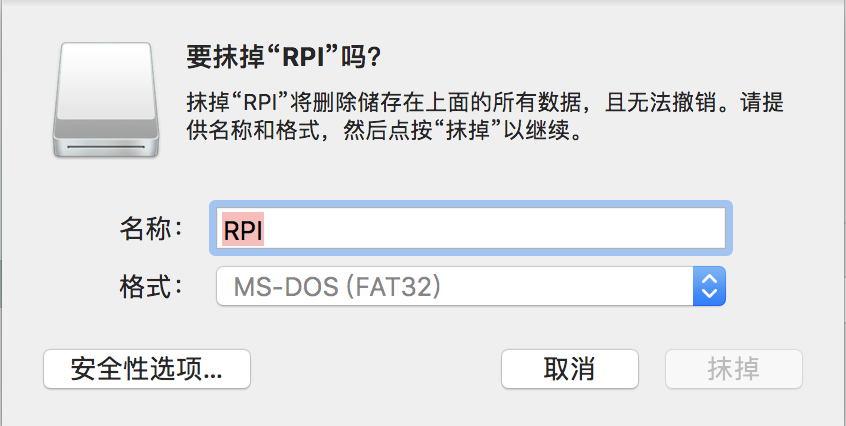

HomeAssistant 真是个成熟的社区，他们甚至直接提供了内置 HomeAssistant 服务的 Raspbian 系统 —— [Hassbian](https://home-assistant.io/docs/hassbian/installation/) 。点击下载最新版本固件。

然后使用 [Etcher](https://etcher.io/) 把下载好的系统刷入 SD 卡。

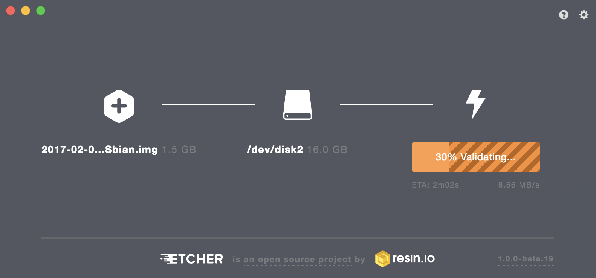

### **ssh 连接树莓派**

将 SD 卡插入树莓派，通电。如果你是第一次使用树莓派或者你换了张新卡，首先需要先将树莓派连上网线，然后前往路由器的 DHCP 找到树莓派的 IP 地址。

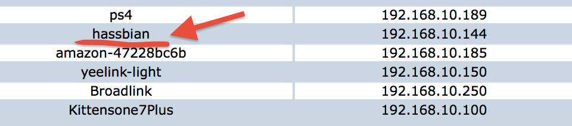

由于是动态分配的 IP，每隔一定时间 IP 就会自动分配不利于后续的使用，所以你需要给树莓派分配一个静态地址，比如我下面给树莓派分配了 `192.168.10.222`。重新连接网线既可更新。

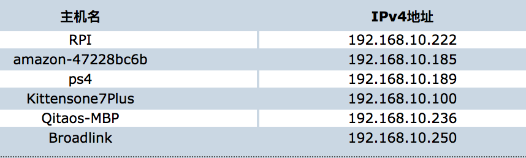

然后你就可以用 ssh 连接你的树莓派了。下一步我们要让树莓派自动连接 WIFI，这样就可以彻底告别网线了。打开终端或者 [iTerm](http://www.iterm2.com/version3.html)，输入

```shell
ssh pi@192.168.10.222
```

Hassbian 默认用户名 `pi` ,默认密码 `raspberry`。成功连上：

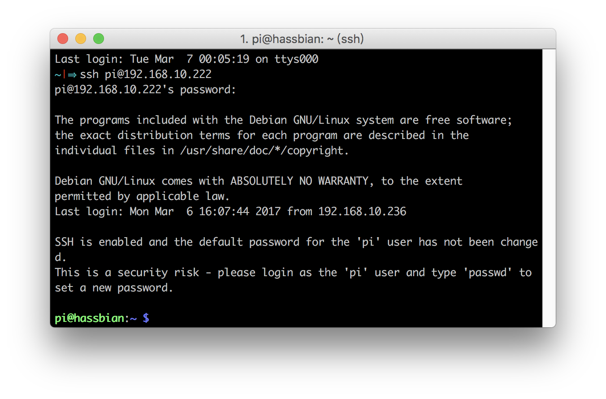连上之后通过 `passwd` 命令修改默认密码。

### **自动连接 WIFI**

下面我们要让树莓派每次启动都可以自己连上 WIFI，就像我们平时使用的数码产品一样。回到命令行，输入：

　

```shell
sudo iwlist wlan0 scan
```

`

以上命令可以找到所有可用网络，每一个 cell 表示一个可用网络。

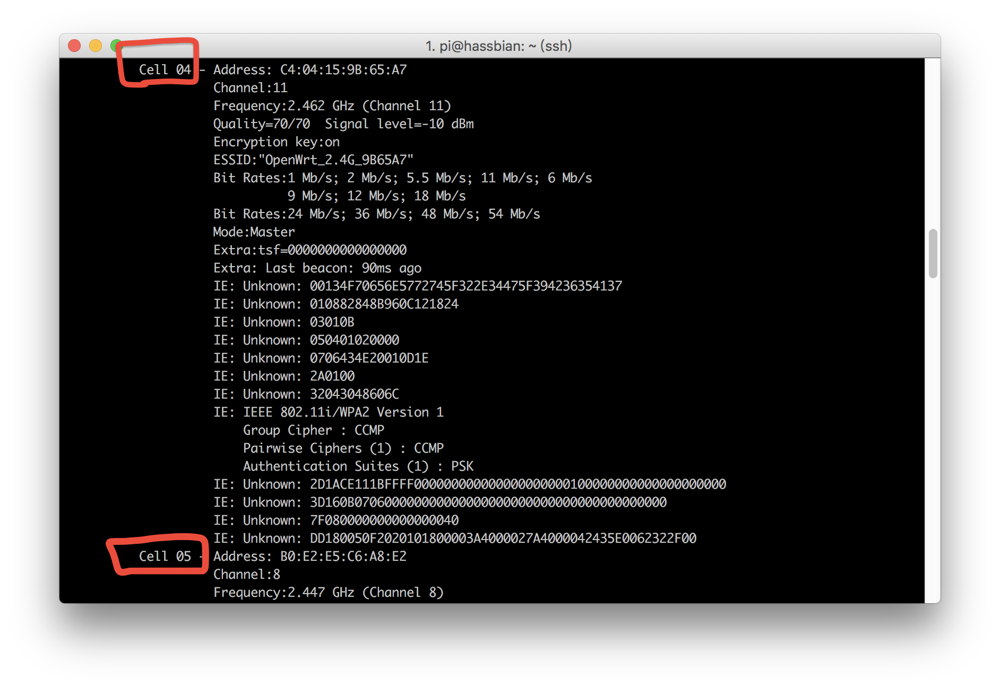通过 `ESSID:` 找到你要连接网络，记下名称，用 nano 工具配置 wifi 信息：

　　`sudo nano /etc/wpa_supplicant/wpa_supplicant.conf`

在最下方填上 WIFI 信息：

```bash
network={  
    ssid="XXXX"  
    psk="XXXX"  
}  
```

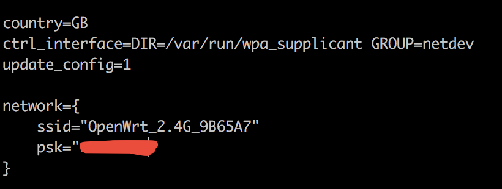

`control+o` `回车` `control+x`保存并退出编辑器。

重启树莓派

`sudo reboot`

至此，你可以拔掉你的网线了，你的树莓派已经可以自动连上WIFI。

### **域名解析＋ssh 免密码登录**

其实树莓派就是一台服务器，如果你自己买过服务器或者搭过网站的话一定会做的两件事就是 `域名解析` 和 `ssh 免密码登录`，前者可以让你用一个好记的域名而不是每次都输入一串 IP 地址并可以在外网访问到树莓派，后者为了每次 ssh 不用重复输密码。

首先你要知道自己的路由器的公网 IP，你可以分别前往路由器管理界面查看自己 WAN 口分配的 IP 和 [ip.cn](http://ip.cn/) 查到的公网 IP 是否一致，一致的话说明你用的就是公网 IP，这个 IP 可以直接用来做解析，不一致的话你就需要动态域名解析了，你需要在树莓派上跑个脚本隔一段时间把公网 IP 更新到域名解析的地方。由于我是公网 IP，我就不演示动态域名解析的例子了，你可以在网上找到很多文章。[[1\]](https://zhuanlan.zhihu.com/p/21501138) [[2\]](https://migege.com/post/python-dnspod-for-raspberry-pi)

如果你已经有域名了，就可以去域名服务商 DNS 管理界面添加一条 A 记录，指向你的公网 IP。一般过半个小时域名就可以生效。如果你没有自己的域名，也有很多免费的域名提供商，比如 [duckdns](http://www.kittenyang.com/homeassistant_practice_01/duckdns)。域名配置好了，你还需要做最后一步，端口转发。

你从外网 ssh 访问路由器公网 IP 的 22 端口，如果不做端口转发，那么这个请求就无人认领而导致 time out，所以前往路由器管理界面，我刷的是 OpenWrt 的固件，在防火墙-端口转发里设置，这个功能绝大多数路由器都有，只不过名字不同而已，你仔细找找。

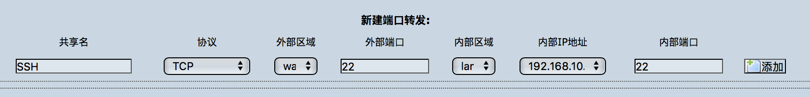

域名也解析好了，端口也转发好了，那么你就可以愉快地在世界任何一个地方通过 `ssh pi@sub.domain.com` 连接你的树莓派了。

ssh 免密登录也很简单，就是把 Mac 本地的公钥传到树莓派上。首先查看本地 Mac 上的公钥

`ls ~/.ssh`

如果存在 `id_rsa.pub` 或 `id_dsa.pub` ,直接

`cat ~/.ssh/id_rsa.pub | ssh pi@192.168.x.x 'cat >> .ssh/authorized_keys'`　

把公钥传到树莓派上就可以了。如果之前没有生成过秘钥对，那就生成一对：

`ssh-keygen -t rsa -C <YourName>@pi`

然后重复上面的　cat >>　命令即可。

### **通过 SFTP 浏览系统文件**

涉及到浏览文件的操作，我推荐使用 FTP 的软件，原因就是直观，我使用的是 [Transmit](https://www.panic.com/transmit/)，你也可以使用其他免费的 FTP 软件。

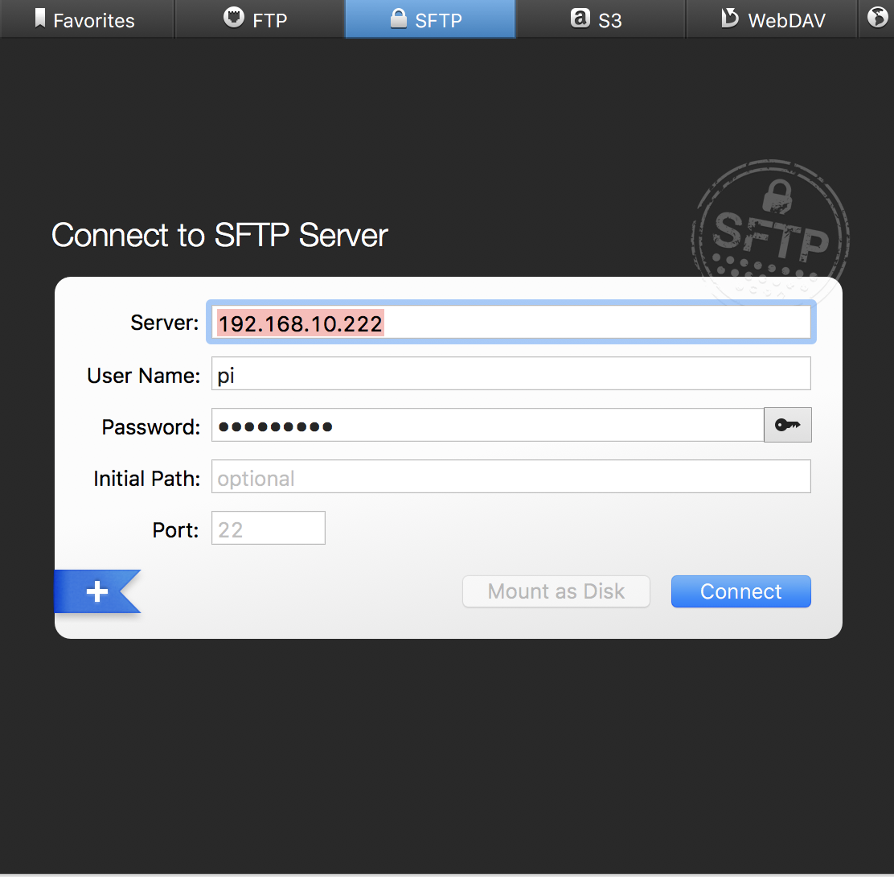

你会发现 Hassbian 已经内置了 HomeAssistant 服务，相关文件都在 `/home/homeassistant/.homeassistant` 里，如果你看不到 .homeassistant 文件夹，需要手动开启显示隐藏文件。

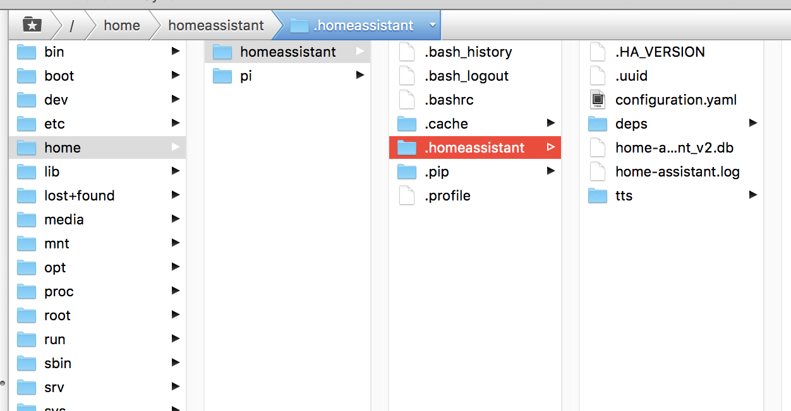

如果还是没看到 .homeassistant，再等等，一般 Hassbian 需要 5-10 分钟下载 HomeAssistant 的相关服务，如果你不走运可能下到了假的 Hassbian,你可以手动更新 HomeAssistant。

```bash
$ sudo systemctl stop home-assistant@homeassistant.service
$ sudo su -s /bin/bash homeassistant
$ source /srv/homeassistant/bin/activate
$ pip3 install --upgrade homeassistant
$ exit
$ sudo systemctl start home-assistant@homeassistant.service
```

如果出现了 `.homeassistant` 隐藏文件夹，那么你可以在浏览器输入 `192.168.x.x:8123`(192.168.x.x 是你树莓派的 IP)，你应该能看到 HomeAssistant 的控制界面了。这里有一条默认的规定是 HomeAssistant 默认是开在 8123 端口上的。

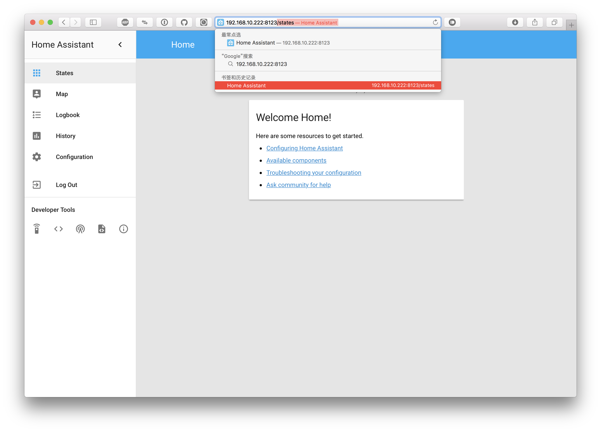

TA-DA! 这说明你的 HomeAssistant 服务已经开启。

和上面一样，如果你想在外网访问这个页面，只需要在路由器的端口转发设置页面再设置一条外网 8123 转树莓派 8123 的转发规则即可，这样你就可以在世界任何一个角落通过 `sub.domain.com:8123` 访问树莓派上的 HomeAssistant 服务了。

接下来的文章我将详细介绍 HomeAssistant 的使用。