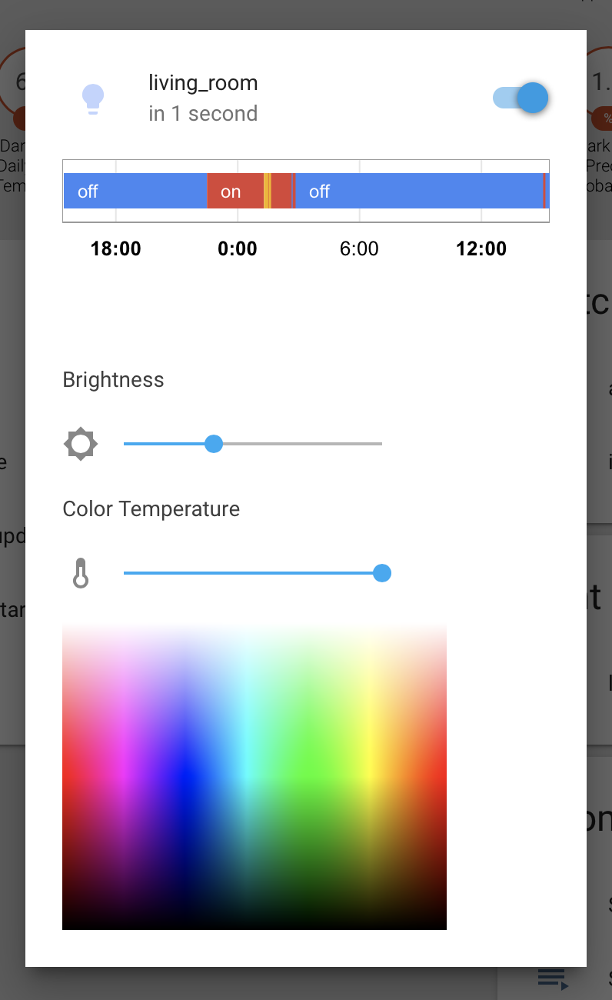
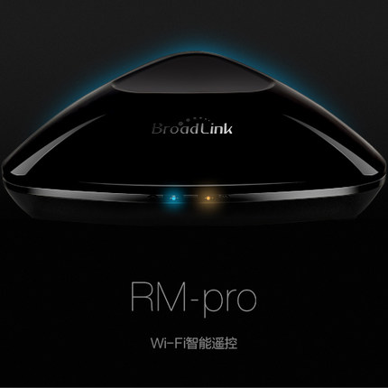
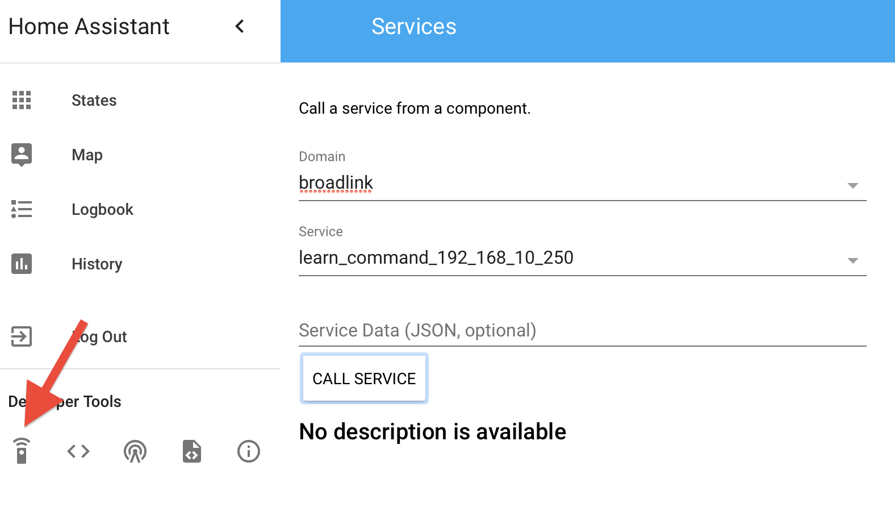
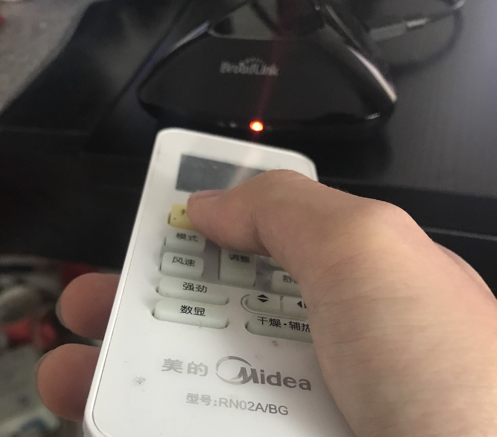
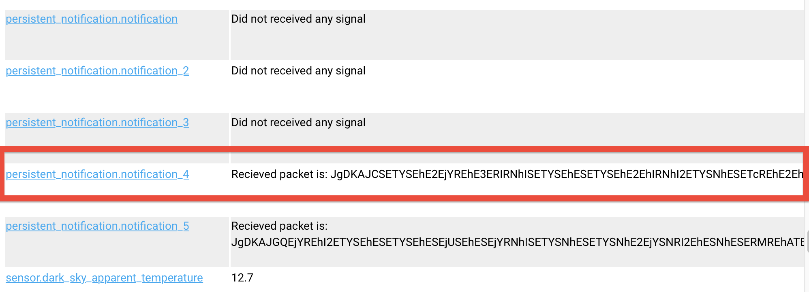
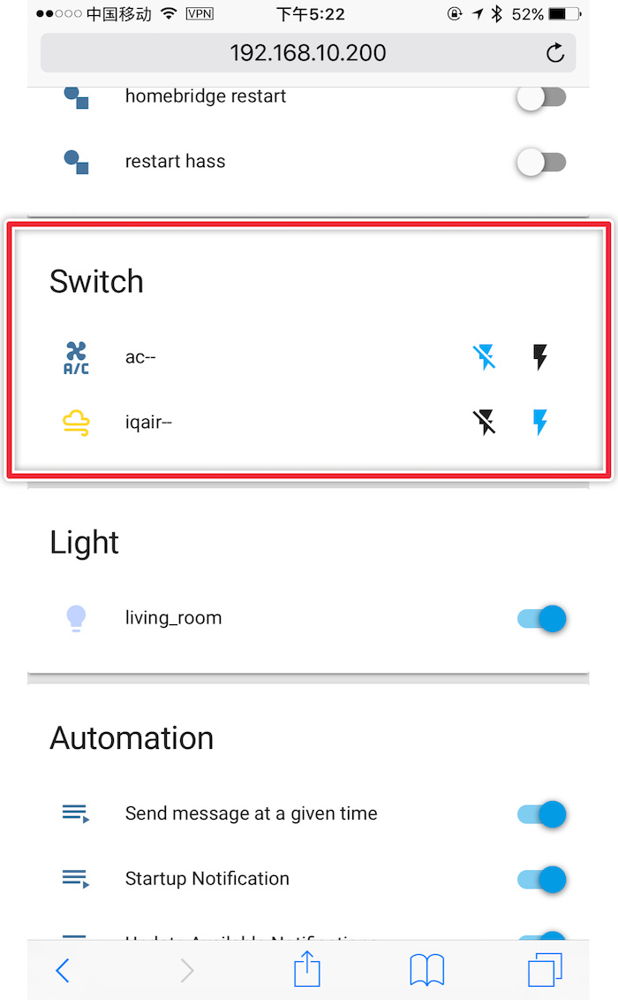
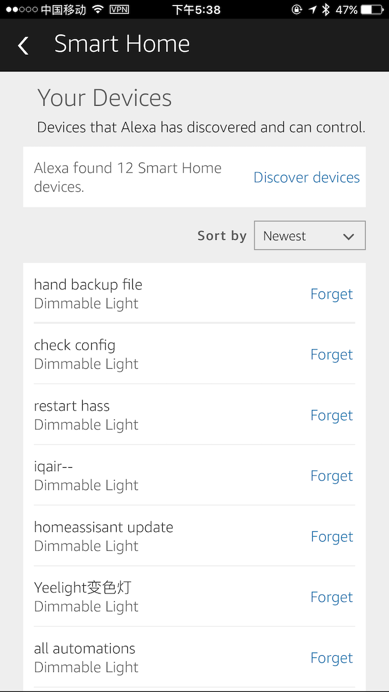

## 目的

终于到了这一临门一脚了。前面了解了这么多基础知识，这一篇，我们终于可以完成这最后一步了 ———— 接入硬件。

<!--more-->

## 接入

**理论上市面上所有能接入 Wifi 用手机控制的电器都能用 HomeAssistant 控制。**

比如我的硬件列表有：[Yeelight](http://www.mi.com/yeelight/), [小米多功能网关](http://www.mi.com/yeelight/), [米家智能插座](http://item.mi.com/1164900030.html?cfrom=search), [sonoff开关](https://world.taobao.com/item/527345142232.htm?spm=a312a.7700825.1997196601.47.m4JsUn)，还有 [ESP8266](https://world.taobao.com/item/40328222213.htm?spm=a312a.7700825.1997196601.58.m4JsUn) 模拟 [Wemo Switch](http://www.belkin.com/us/p/P-F7C027/)，最后还有一个神器 [BroadLink](https://world.tmall.com/item/40206907136.htm?spm=a312a.7700714.0.0.AKe8xQ)。

###  **Yeelight** 接入。

文档在[这里](https://home-assistant.io/components/light.yeelight/)，配置很简单

```yaml
light:  
  - platform: yeelight
    devices:
      192.168.1.25:
        name: Living Room
        transition: 1000
        use_music_mode: True (defaults to False)
        save_on_change: False (defaults to True)
      192.168.1.13:
        name: Front Door
```

`light` 系统关键字，指定这是一个控制灯的服务。然后指定你的灯是什么品牌，在 `platform` 处声明，注意 `platform` 前面的横杠 `-`，这在 YAML 语法里面表示数，也就是说你有其他品牌的灯就在下方写 `- platform: other_brand_light` 就可以了。回到 yeelight 的配置，`devices` 下面填上灯的 IP 地址，可以登录路由器管理页面查到，如果你有多个 yeelight，就写多个 IP，然后用 `name` 区分。配置好之后，重启 HA。你就能在管理页面看到 Light 这个板块了。


点击你灯的名字处，就会弹出操作板，然后你就可以随意控制了。



其他的 Wifi 设备也都是一个套路。

###  **BroadLink** 的使用



BroadLink 本质上是一个红外/频射发射器，他本来是通过学习红外码和频射信号，然后把手机作为一个超级遥控器控制其他电器使用的。但 HomeAssistant 已经集成了 BroadLink ，这让语音控制那些只能用红外/频射遥控的家电成为了可能。最常见的就是空调了。

相关文档在[这里](https://home-assistant.io/components/switch.broadlink/)

```yaml
switch:  
    platform: broadlink
    host: 192.168.10.250
    mac: '34:ea:34:e3:95:da'
    friendly_name: "Kitten‘s Broadlink"
    switches:
      iqair:
        friendly_name: "iqair--"
        command_on: 'JgBQAAABKpMUEhMSExITEhMSExITEhMSEzYVNRQ3EzcUNRU2FDYUNhQSEzYUEhMSExITEhMSExITNhQSEzcTNhU2FDYTNxQ2FAAFIgABKUgVAA0FAAAAAAAAAAA='
        command_off: 'JgBYAAABKpMTEhQRFBISEhQRFBISEhQSEzYUNxM2FDYUNhQ2FDcTNxQRFBEUEhISFBEUEhISFBITNhQ2FDYUNhQ2FDYUNhQ3EwAFIgABKUkUAAxdAAEqSBUADQU='
      ac:
        friendly_name: "ac--"
        command_on: 'JgDKAJKQETYSExA2EjcQExESETcREhETEDYSEhETEDcRNxESETcQNhITEDcRNhE2EjYRNhI2ERMRNhETERIRExATERIRExA3ERIRExATETcQNxESERMQExE3EDcRNhETERIRNxE2EayQkRE2EhMQNxE2ERMREhE2EhIREhE3ERIRExA2EzURExE3EDYSEhE2EjYRNhI3EDYSNhETETYRExESERIRExESERIRNxESERMQExE2ETYSEhETEBMRNhE2EjcQExESETYSNRIADQUAAAAAAAAAAAAAAAAAAA=='
        command_off: 'JgDKAJGRETYSExA2EjcQExESETYSEhESETYSEhETEDYSNxATETYRExE2ETYSNhE2EhIRNhI2ETcREhETEBMREhE2ERMREhE3ETYRNxESERMQExESERMQExESERMQNxE2ETcRNxA3EauRkRE2EhIRNhI2ERMREhE3EBMREhE2EhIRExA2EjYRExE2ERMRNhE2EjYRNhISETcRNhE3ERIRExATERIRNhETERIRNhI2ETYSEhETEBMREhETEBMREhETEDcRNxA3ETYRNhIADQUAAAAAAAAAAAAAAAAAAA=='
```

BroadLink 集成到了 Switch 下的一个 platform，也就是 HA 把你的家电作为了一个开关处理，这也意味我们只能控制家电的开、关状态，虽然不能像遥控器上进行更多操作，比如空调设定温度，电视选频道，但开和关绝对是最大的需求了。配置中 `host` 和 `mac` 都可以在路由器的管理页面找到，重点我们看 `switches` 字段的配置。

switches 下面就是你所有的设备。每个设备都有 **friendly_name**，**commandon***，**command*****off** 三个属性。friendly_name 就是你给你的设备取的名字，command*on 和 command*off 就是开和关对应的红外码或者频射码，这两个码如何获得呢？

我们来到 HA 控制页面,选择 Developer Tools 下的 Service 选项，在 Call a service from a component 的 Domain 下面选择 **broadlink**, Service 选择 **learncommand19216810_250**，然后点击**CALL SERVICE**。



不出意外，你的 Broadlink 亮起了橙色的灯，标记正处于学习状态，下一步你要做的就是拿起遥控器，比如我现在要学习空调开的红外码，我就对准 Broadlink 按下空调遥控板上“开”的按钮。



当橙色灯熄灭了，就表示学习成功了。然后前往 Developer Tools 下的 States，在这里你会发现 **Recieved packet is:** 后面跟着一长串字母和数字，那就是你刚才按下按钮的红外码了。



复制这一串红外码到配置文件中的 **command_on** 或者 **command_off**，如果你按的是 开，就把开的红外码复制到 **command_on**，其他我就不说了。

重启 HA ，你就能在控制页面看到了。HA 的控制页面不仅仅可以桌面上看，手机上也可以哦。



Broadlink 真是个好东西，它的意义在于让一些老家电可以毫不费力地摇身一变成智能设备，进而实现语音控制。

说到语音控制，上面已经接入了这么多家电，都是用 HomeAssistant 的控制页面进行控制，说好的 Amazon Echo 语音控制呢？别急，我们这就开始配置 Amazon Echo 服务。

Alexa / Amazon Echo 的文档在[这里](https://home-assistant.io/components/alexa/), 但是这个文档是介绍如何在 Echo 上自己创建一个能让 HA 识别 Skill，对我们没有作用，我们需要的仅仅是让 Echo 开关设备就行了，所以你应该看[Emulated Hue Bridge](https://home-assistant.io/components/emulated_hue/) 这个服务。

顾名思义，Emulated Hue Bridge 就是把你的电器模拟成 [Hue Bridge](http://www2.meethue.com/en-us/productdetail/philips-hue-bridge)，而 Hue Bridge 是 Amazon Echo 官方支持的设备。所以就能实现 Echo 控制你的家电了，看到这个原理，是不是醍醐灌顶，真是巧妙啊。

Hue Bridge 的最简单只要配置两个参数就能运行了。

```yaml
emulated_hue:  
  type: alexa
  host_ip: 192.168.10.200
```

重启 HA，通过 Amazon Echo 的官方 App ———— Alexa 就能扫描到所有设备了。



由于 Emulated Hue Bridge 默认是把所有开关都模拟了，所以你的 Echo 能识别出一些不是硬件的服务，比如 check config, restart hass.... 这些都是我设置的其他服务，由于也是开关，所以都被 Emulated Hue Bridge 给模拟了。解决办法就是 homeassistant 这个服务下的 customize 里通过 **emulated_hue: false** 手动进行忽略。

```yaml
homeassistant:  
  customize:
    light.bedroom_light:
      emulated_hue: false
      emulated_hue_name: "back office light"
```

如果 Alexa 的 Your Devices 里面出现你的家电，也就意味着你已经可以用语音控制你的家电了。只是，你得说英文。